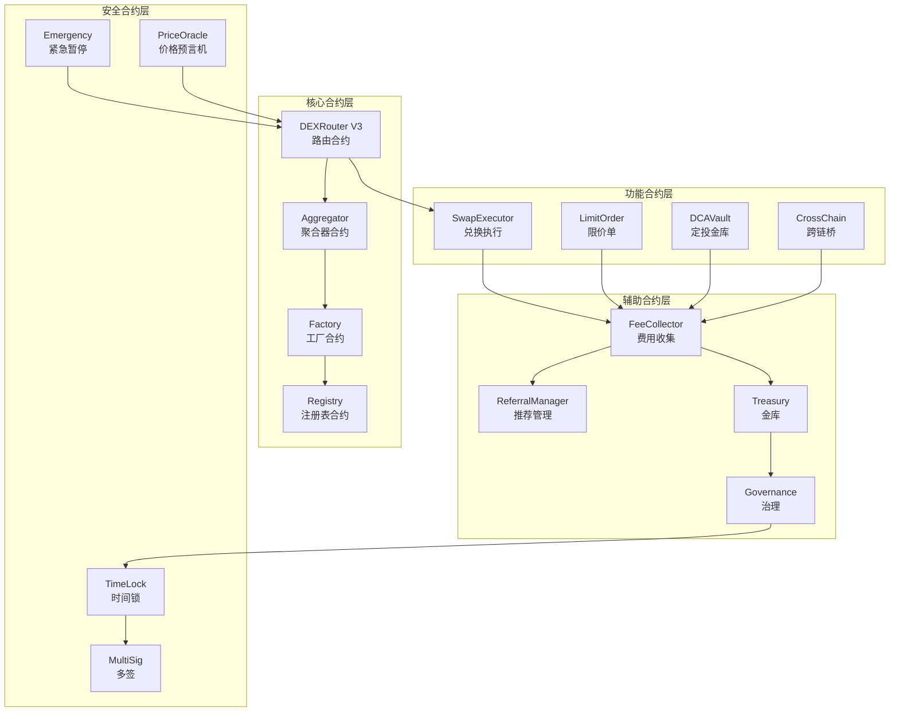
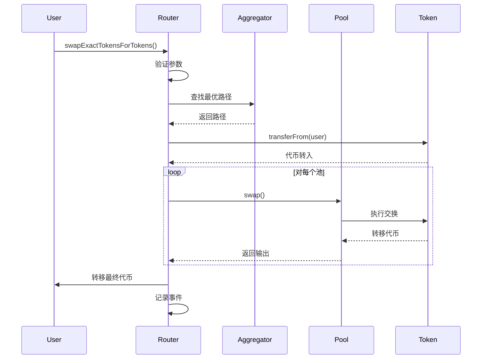
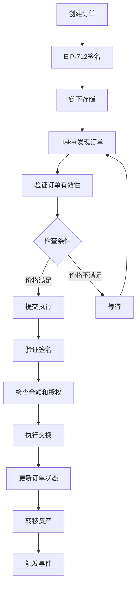
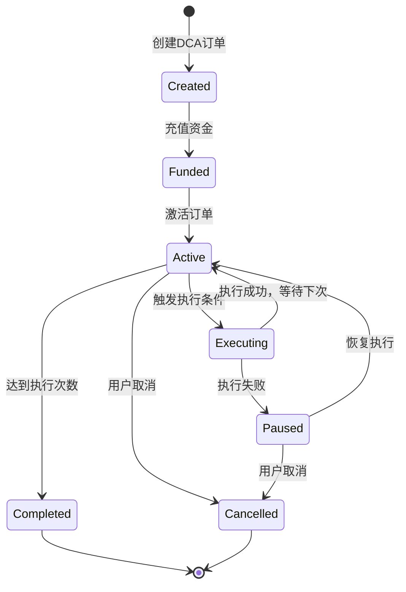
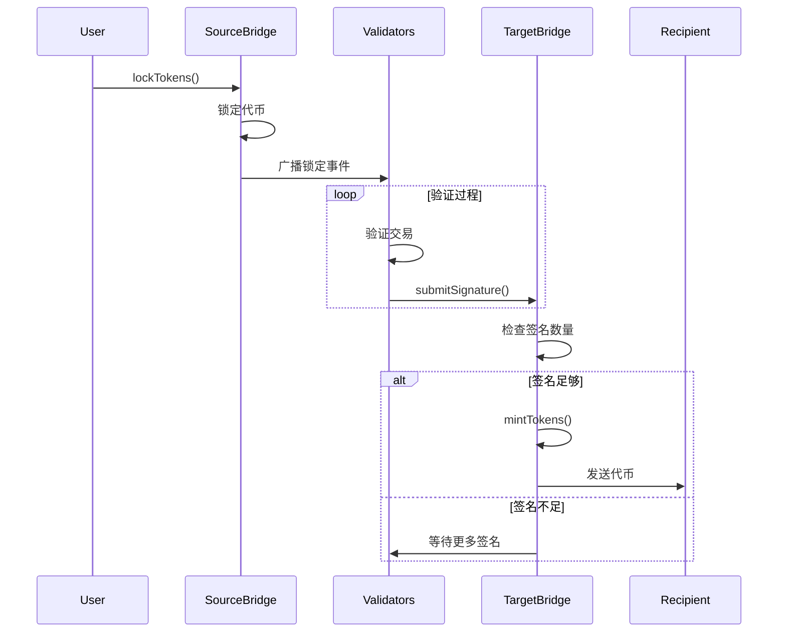
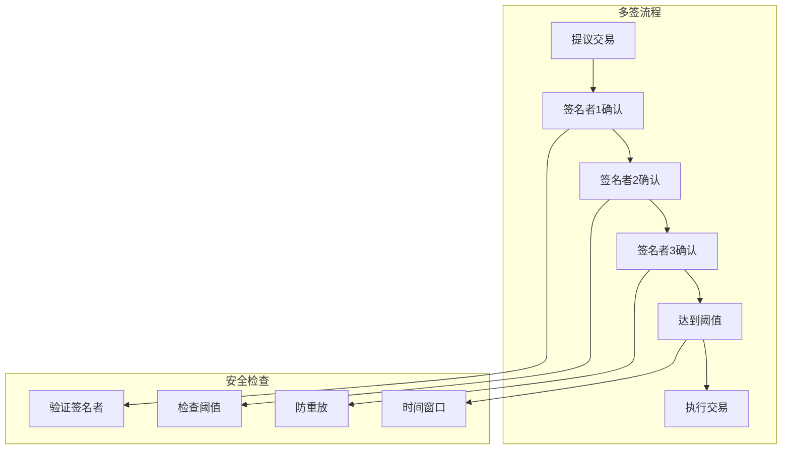
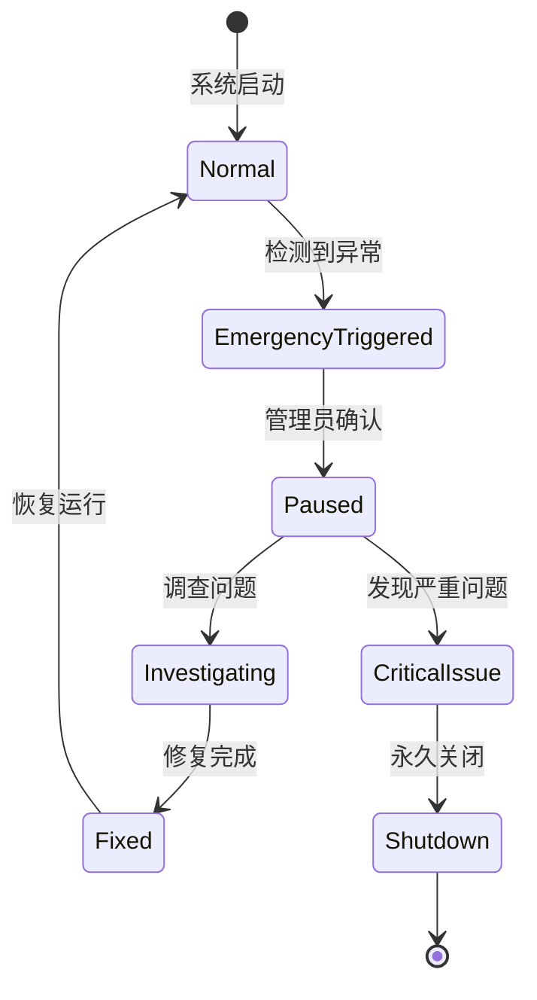
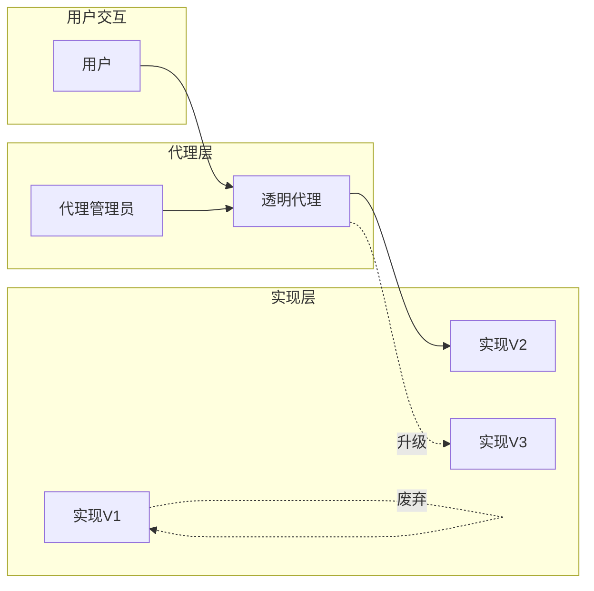
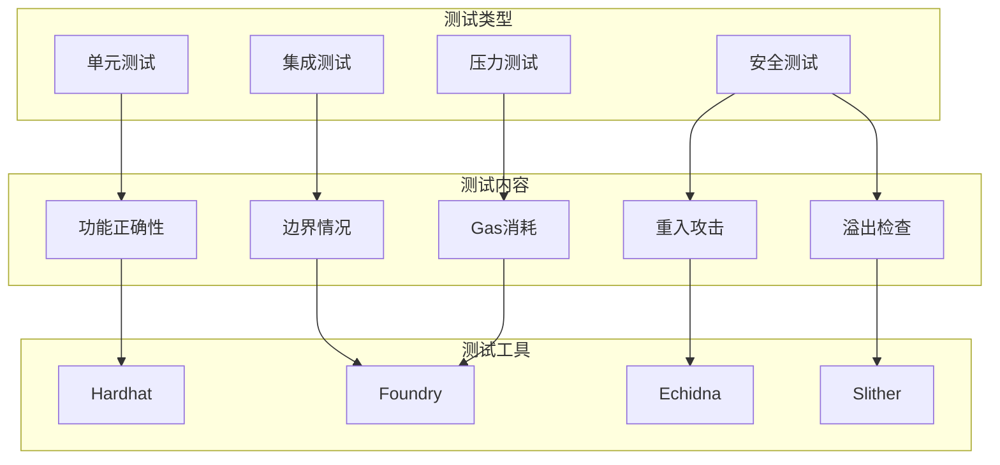
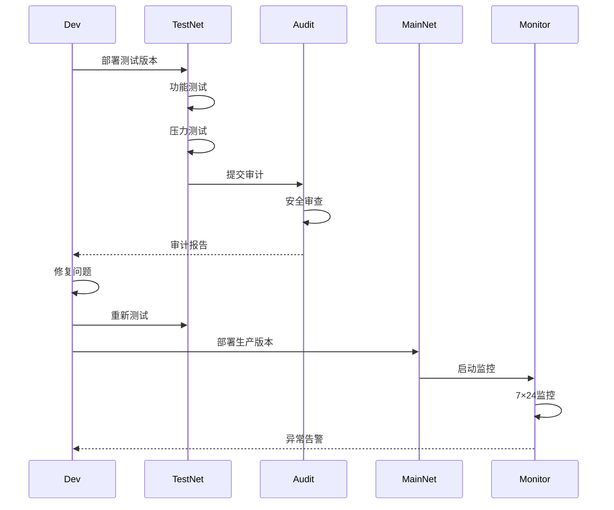

# 智能合约详细架构设计

## 概述

本文档详细设计DEX系统的智能合约架构，包括核心交易合约、限价单合约、DCA合约、跨链桥合约等关键组件的实现原理、安全机制和优化策略。

## 合约架构总览

### 整体架构图



## 核心合约设计

### 1. DEX Router V3合约

```solidity
// 路由器合约 - 核心入口点
contract DEXRouterV3 {

    // 状态变量
    address public immutable factory;
    address public immutable WETH;
    mapping(address => bool) public trustedCallers;

    // 核心功能结构
    struct SwapDescription {
        address srcToken;
        address dstToken;
        address payable srcReceiver;
        address payable dstReceiver;
        uint256 amount;
        uint256 minReturnAmount;
        uint256 flags;
        bytes permit;
    }

    // 多路径交换结构
    struct SwapPath {
        address[] pools;
        address[] tokens;
        uint256[] fees;
        bytes routeCode;
    }
}
```

#### 工作原理流程



#### 核心功能实现

```solidity
// 精确输入交换
function swapExactTokensForTokens(
    uint256 amountIn,
    uint256 amountOutMin,
    address[] calldata path,
    address to,
    uint256 deadline
) external ensure(deadline) returns (uint256[] memory amounts) {
    // 1. 计算输出数量
    amounts = getAmountsOut(amountIn, path);
    require(amounts[amounts.length - 1] >= amountOutMin, 'INSUFFICIENT_OUTPUT');

    // 2. 转入初始代币
    TransferHelper.safeTransferFrom(
        path[0], msg.sender, pairFor(path[0], path[1]), amounts[0]
    );

    // 3. 执行交换链
    _swap(amounts, path, to);

    // 4. 触发事件
    emit SwapExecuted(msg.sender, path, amounts);
}

// 内部交换逻辑
function _swap(uint[] memory amounts, address[] memory path, address to) internal {
    for (uint i; i < path.length - 1; i++) {
        (address input, address output) = (path[i], path[i + 1]);
        (uint reserveIn, uint reserveOut) = getReserves(input, output);
        uint amountOut = amounts[i + 1];

        // 计算实际交换
        (uint amount0Out, uint amount1Out) = input < output ?
            (uint(0), amountOut) : (amountOut, uint(0));

        // 确定接收地址
        address toAddress = i < path.length - 2 ?
            pairFor(output, path[i + 2]) : to;

        // 执行交换
        IPair(pairFor(input, output)).swap(
            amount0Out, amount1Out, toAddress, new bytes(0)
        );
    }
}
```

### 2. 限价单合约

```solidity
contract LimitOrderProtocol {

    // 订单结构
    struct Order {
        uint256 salt;           // 唯一标识
        address makerAsset;     // Maker代币
        address takerAsset;     // Taker代币
        address maker;          // Maker地址
        address receiver;       // 接收地址
        address allowedSender;  // 允许的发送者
        uint256 makingAmount;   // Maker数量
        uint256 takingAmount;   // Taker数量
        uint256 offsets;        // 偏移量打包
        bytes interactions;     // 交互数据
    }

    // 订单状态
    mapping(bytes32 => uint256) public remaining;  // 剩余数量
    mapping(address => uint256) public nonces;     // 防重放
}
```

#### 订单执行流程



#### 核心功能实现

```solidity
// 填充订单
function fillOrder(
    Order calldata order,
    bytes calldata signature,
    bytes calldata interaction,
    uint256 makingAmount,
    uint256 takingAmount,
    uint256 skipPermitAndThresholdAmount
) external payable returns(uint256, uint256, bytes32) {
    // 1. 计算订单哈希
    bytes32 orderHash = hashOrder(order);

    // 2. 验证签名
    require(validateSignature(orderHash, signature, order.maker), "Bad signature");

    // 3. 检查订单状态
    uint256 remainingMakingAmount = remaining[orderHash];
    require(remainingMakingAmount > 0, "Order filled");

    // 4. 计算实际数量
    uint256 actualMakingAmount = min(makingAmount, remainingMakingAmount);
    uint256 actualTakingAmount = (actualMakingAmount * order.takingAmount) / order.makingAmount;

    // 5. 更新状态
    remaining[orderHash] = remainingMakingAmount - actualMakingAmount;

    // 6. 执行转账
    IERC20(order.takerAsset).transferFrom(msg.sender, order.receiver, actualTakingAmount);
    IERC20(order.makerAsset).transferFrom(order.maker, msg.sender, actualMakingAmount);

    // 7. 触发事件
    emit OrderFilled(orderHash, actualMakingAmount, actualTakingAmount);

    return (actualMakingAmount, actualTakingAmount, orderHash);
}

// RFQ(Request for Quote)订单
function fillOrderRFQ(
    OrderRFQ calldata order,
    bytes calldata signature,
    uint256 flagsAndAmount
) external returns(uint256, uint256, bytes32) {
    // RFQ专用快速路径，优化gas消耗
    return fillOrderRFQCompact(order, signature, flagsAndAmount);
}
```

### 3. DCA合约

```solidity
contract DCAVault {

    struct DCAOrder {
        address owner;           // 拥有者
        address tokenIn;         // 输入代币
        address tokenOut;        // 输出代币
        uint256 amountPerTrade;  // 每次交易金额
        uint256 interval;        // 执行间隔
        uint256 numberOfTrades;  // 总交易次数
        uint256 executedTrades;  // 已执行次数
        uint256 lastExecuted;    // 上次执行时间
        bool active;            // 是否激活
    }

    mapping(uint256 => DCAOrder) public orders;
    mapping(address => uint256[]) public userOrders;
    uint256 public nextOrderId;
}
```

#### DCA执行机制



#### 核心功能实现

```solidity
// 创建DCA订单
function createDCAOrder(
    address tokenIn,
    address tokenOut,
    uint256 amountPerTrade,
    uint256 interval,
    uint256 numberOfTrades
) external returns (uint256 orderId) {
    orderId = nextOrderId++;

    orders[orderId] = DCAOrder({
        owner: msg.sender,
        tokenIn: tokenIn,
        tokenOut: tokenOut,
        amountPerTrade: amountPerTrade,
        interval: interval,
        numberOfTrades: numberOfTrades,
        executedTrades: 0,
        lastExecuted: 0,
        active: true
    });

    userOrders[msg.sender].push(orderId);

    // 转入总资金
    uint256 totalAmount = amountPerTrade * numberOfTrades;
    IERC20(tokenIn).transferFrom(msg.sender, address(this), totalAmount);

    emit DCAOrderCreated(orderId, msg.sender, tokenIn, tokenOut);
}

// 执行DCA订单
function executeDCAOrder(uint256 orderId) external {
    DCAOrder storage order = orders[orderId];

    // 验证执行条件
    require(order.active, "Order not active");
    require(block.timestamp >= order.lastExecuted + order.interval, "Too early");
    require(order.executedTrades < order.numberOfTrades, "Order completed");

    // 执行交易
    uint256 amountOut = _executeSwap(
        order.tokenIn,
        order.tokenOut,
        order.amountPerTrade
    );

    // 更新状态
    order.executedTrades++;
    order.lastExecuted = block.timestamp;

    if (order.executedTrades >= order.numberOfTrades) {
        order.active = false;
        emit DCAOrderCompleted(orderId);
    }

    // 发送输出代币给用户
    IERC20(order.tokenOut).transfer(order.owner, amountOut);

    emit DCAOrderExecuted(orderId, order.amountPerTrade, amountOut);
}
```

### 4. 跨链桥合约

```solidity
contract CrossChainBridge {

    struct BridgeRequest {
        address token;
        uint256 amount;
        uint256 targetChain;
        address recipient;
        uint256 nonce;
        bytes32 txHash;
    }

    mapping(bytes32 => bool) public processedRequests;
    mapping(address => mapping(uint256 => uint256)) public chainBalances;

    address[] public validators;
    mapping(bytes32 => uint256) public confirmations;
    uint256 public requiredConfirmations;
}
```

#### 跨链流程



#### 核心功能实现

```solidity
// 源链锁定
function lockTokens(
    address token,
    uint256 amount,
    uint256 targetChain,
    address recipient
) external payable {
    require(amount > 0, "Invalid amount");

    // 生成唯一请求ID
    uint256 nonce = getNonce(msg.sender);
    bytes32 requestId = keccak256(
        abi.encodePacked(token, amount, targetChain, recipient, nonce)
    );

    // 锁定代币
    IERC20(token).transferFrom(msg.sender, address(this), amount);
    chainBalances[token][targetChain] += amount;

    // 记录请求
    emit TokensLocked(requestId, token, amount, targetChain, recipient);
}

// 目标链释放
function releaseTokens(
    bytes32 requestId,
    address token,
    uint256 amount,
    address recipient,
    bytes[] calldata signatures
) external {
    require(!processedRequests[requestId], "Already processed");
    require(signatures.length >= requiredConfirmations, "Not enough signatures");

    // 验证签名
    bytes32 messageHash = getMessageHash(requestId, token, amount, recipient);
    uint256 validSignatures = 0;

    for (uint i = 0; i < signatures.length; i++) {
        address signer = recoverSigner(messageHash, signatures[i]);
        if (isValidator(signer)) {
            validSignatures++;
        }
    }

    require(validSignatures >= requiredConfirmations, "Invalid signatures");

    // 标记已处理
    processedRequests[requestId] = true;

    // 释放代币
    IERC20(token).transfer(recipient, amount);

    emit TokensReleased(requestId, token, amount, recipient);
}
```

## 安全机制设计

### 1. 多签钱包合约



### 2. 时间锁机制

```solidity
contract TimeLock {
    uint256 public constant MINIMUM_DELAY = 2 days;
    uint256 public constant MAXIMUM_DELAY = 30 days;

    mapping(bytes32 => uint256) public timestamps;

    function schedule(
        address target,
        uint256 value,
        bytes calldata data,
        uint256 delay
    ) external onlyOwner {
        require(delay >= MINIMUM_DELAY && delay <= MAXIMUM_DELAY, "Invalid delay");

        bytes32 txHash = keccak256(abi.encode(target, value, data));
        timestamps[txHash] = block.timestamp + delay;

        emit TransactionScheduled(txHash, target, value, data, timestamps[txHash]);
    }

    function execute(
        address target,
        uint256 value,
        bytes calldata data
    ) external onlyOwner {
        bytes32 txHash = keccak256(abi.encode(target, value, data));
        require(timestamps[txHash] > 0, "Not scheduled");
        require(block.timestamp >= timestamps[txHash], "Too early");

        timestamps[txHash] = 0;

        (bool success,) = target.call{value: value}(data);
        require(success, "Execution failed");

        emit TransactionExecuted(txHash);
    }
}
```

### 3. 紧急暂停机制



## Gas优化策略

### 1. 存储优化

```solidity
// 优化前 - 使用多个存储槽
struct OrderBad {
    address maker;      // 槽1
    address taker;      // 槽2
    uint256 amount;     // 槽3
    uint256 price;      // 槽4
    bool active;        // 槽5
}

// 优化后 - 紧密打包
struct OrderGood {
    address maker;      // 槽1 (20字节)
    uint96 amount;      // 槽1 (12字节)
    address taker;      // 槽2 (20字节)
    uint96 price;       // 槽2 (12字节)
    bool active;        // 槽3 (1字节)
    uint248 metadata;   // 槽3 (31字节)
}
```

### 2. 批量操作

```solidity
// 批量交换优化
function batchSwap(
    SwapDescription[] calldata swaps
) external returns (uint256[] memory results) {
    results = new uint256[](swaps.length);

    for (uint i = 0; i < swaps.length;) {
        results[i] = _performSwap(swaps[i]);
        unchecked { ++i; }  // 使用unchecked节省gas
    }
}
```

## 升级机制

### 代理模式架构



## 事件和监控

```solidity
// 核心事件定义
event SwapExecuted(
    address indexed sender,
    address indexed tokenIn,
    address indexed tokenOut,
    uint256 amountIn,
    uint256 amountOut,
    address[] path
);

event OrderCreated(
    bytes32 indexed orderHash,
    address indexed maker,
    address makerAsset,
    address takerAsset,
    uint256 makingAmount,
    uint256 takingAmount
);

event EmergencyPause(
    address indexed caller,
    uint256 timestamp,
    string reason
);
```

## 测试策略



## 部署流程



## 关键指标

```yaml
性能指标:
  - Gas优化: < 150k gas/swap
  - 批量效率: 30% gas节省
  - 存储优化: 50% 槽位减少

安全指标:
  - 审计覆盖: 100%
  - 测试覆盖: > 95%
  - 漏洞响应: < 24小时

可靠性指标:
  - 合约正常运行: 99.99%
  - 升级成功率: 100%
  - 事故恢复时间: < 1小时
```