# 智能合约详细架构设计

## 概述

本文档详细设计DEX聚合器系统的智能合约架构。采用**混合执行模式**：简单交易直接调用目标DEX，复杂聚合交易和高级功能通过自有合约实现。包括聚合路由合约、限价单合约、DCA合约、跨链桥合约等关键组件的实现原理、安全机制和优化策略。

## 为什么需要自有合约？

### 功能对比分析

| 功能类型 | 无自有合约 | 有自有合约 | 原因说明 |
|---------|-----------|-----------|----------|
| **单DEX简单兑换** | ✅ 可实现 | ✅ 可实现 | 直接调用即可，无需中介 |
| **多DEX聚合路由** | ❌ 需多次交易 | ✅ 一次交易 | 需要原子性操作 |
| **分割路由(Split)** | ❌ 手动执行 | ✅ 自动执行 | 需要精确分配和汇总 |
| **限价单** | ❌ 无法实现 | ✅ 链下签名+链上执行 | 需要订单管理和匹配机制 |
| **DCA定投** | ❌ 无法实现 | ✅ 自动执行 | 需要时间锁和自动触发 |
| **跨链交易** | ❌ 无法实现 | ✅ 锁定-铸造机制 | 需要跨链验证和资产映射 |
| **MEV保护** | ⚠️ 有限保护 | ✅ 完整保护 | 需要隐私交易和commit-reveal |
| **平台手续费** | ❌ 无法收取 | ✅ 可以收取 | 需要中间层处理 |

### 具体案例说明

#### 案例1：多DEX聚合必须使用自有合约

```solidity
// ❌ 没有自有合约：用户需要执行6次交易
// 1. Approve USDT to Uniswap
// 2. Swap 30% on Uniswap
// 3. Approve USDT to Curve
// 4. Swap 40% on Curve
// 5. Approve USDT to Balancer
// 6. Swap 30% on Balancer
// 问题：费用高、体验差、可能部分失败

// ✅ 有自有合约：一次交易完成
contract OpenOceanRouter {
    function multiDEXSwap(SwapData data) external {
        // 一次approve给Router
        IERC20(token).transferFrom(user, this, totalAmount);

        // Router内部分配到各DEX
        _swapOnUniswap(amount * 30 / 100);
        _swapOnCurve(amount * 40 / 100);
        _swapOnBalancer(amount * 30 / 100);

        // 汇总输出给用户
        IERC20(outputToken).transfer(user, totalOutput);
    }
}
```

#### 案例2：限价单必须使用自有合约

```solidity
// 限价单需要链下签名 + 链上验证执行
contract LimitOrderProtocol {
    // 用户链下签名订单，不消耗Gas
    // Maker(做市商)链上执行订单，支付Gas

    function fillOrder(Order order, bytes signature) external {
        // 1. 验证签名（确保订单真实）
        require(verifySignature(order, signature));

        // 2. 检查价格条件
        require(getCurrentPrice() >= order.limitPrice);

        // 3. 执行交换
        transferFrom(order.maker, taker, order.fromAmount);
        transferFrom(taker, order.maker, order.toAmount);
    }
}
// 没有合约无法实现这种异步匹配机制
```

## 执行模式决策

### 混合模式架构

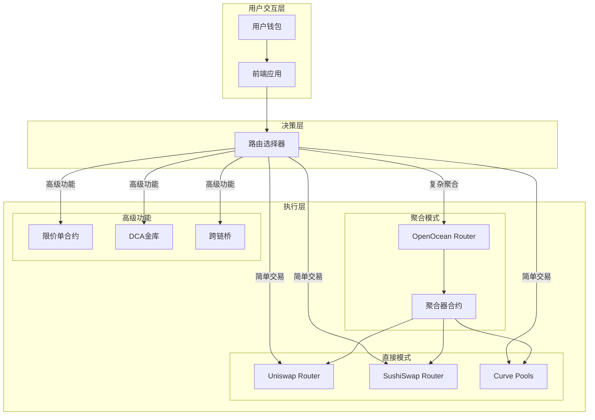
```mermaid
graph TB
    subgraph "用户交互层"
        USER[用户钱包]
        FRONT[前端应用]
    end

    subgraph "决策层"
        ROUTER_SELECTOR[路由选择器]
    end

    subgraph "执行层"
        subgraph "直接模式"
            DIRECT_UNI[Uniswap Router]
            DIRECT_SUSHI[SushiSwap Router]
            DIRECT_CURVE[Curve Pools]
        end

        subgraph "聚合模式"
            OUR_ROUTER[OpenOcean Router]
            OUR_AGGREGATOR[聚合器合约]
        end

        subgraph "高级功能"
            LIMIT_ORDER[限价单合约]
            DCA_VAULT[DCA金库]
            CROSS_CHAIN[跨链桥]
        end
    end

    USER --> FRONT
    FRONT --> ROUTER_SELECTOR

    ROUTER_SELECTOR -->|简单交易| DIRECT_UNI
    ROUTER_SELECTOR -->|简单交易| DIRECT_SUSHI
    ROUTER_SELECTOR -->|简单交易| DIRECT_CURVE

    ROUTER_SELECTOR -->|复杂聚合| OUR_ROUTER
    OUR_ROUTER --> OUR_AGGREGATOR
    OUR_AGGREGATOR --> DIRECT_UNI
    OUR_AGGREGATOR --> DIRECT_SUSHI
    OUR_AGGREGATOR --> DIRECT_CURVE

    ROUTER_SELECTOR -->|高级功能| LIMIT_ORDER
    ROUTER_SELECTOR -->|高级功能| DCA_VAULT
    ROUTER_SELECTOR -->|高级功能| CROSS_CHAIN
```

### 执行模式选择逻辑

```javascript
// 前端路由选择器
function selectExecutionMode(swapRequest) {
    // 1. 简单单DEX交易 - 直接调用
    if (swapRequest.routes.length === 1 &&
        swapRequest.splits.length === 1 &&
        !swapRequest.needsMEVProtection) {
        return {
            mode: 'DIRECT',
            target: swapRequest.routes[0].dex,
            contract: getDEXContract(swapRequest.routes[0].dex)
        };
    }

    // 2. 复杂聚合交易 - 使用自有合约
    if (swapRequest.routes.length > 1 ||
        swapRequest.splits.length > 1 ||
        swapRequest.needsMEVProtection) {
        return {
            mode: 'AGGREGATED',
            target: 'OpenOceanRouter',
            contract: getOurRouterContract()
        };
    }

    // 3. 高级功能 - 必须使用自有合约
    if (swapRequest.type in ['LIMIT_ORDER', 'DCA', 'CROSS_CHAIN']) {
        return {
            mode: 'ADVANCED',
            target: swapRequest.type,
            contract: getAdvancedContract(swapRequest.type)
        };
    }
}
```

## 合约架构总览

### 整体架构图

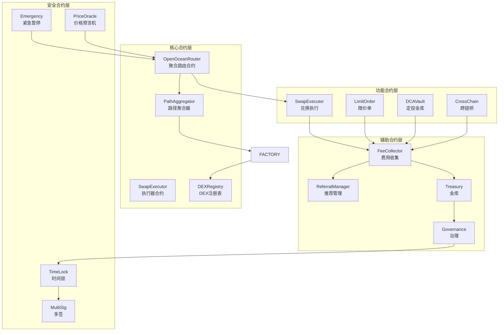
```mermaid
graph TB
    subgraph "核心合约层"
        ROUTER[OpenOceanRouter<br/>聚合路由合约]
        AGGREGATOR[PathAggregator<br/>路径聚合器]
        EXECUTOR[SwapExecutor<br/>执行器合约]
        REGISTRY[DEXRegistry<br/>DEX注册表]
    end

    subgraph "功能合约层"
        SWAP[SwapExecutor<br/>兑换执行]
        LIMIT[LimitOrder<br/>限价单]
        DCA[DCAVault<br/>定投金库]
        BRIDGE[CrossChain<br/>跨链桥]
    end

    subgraph "辅助合约层"
        FEE[FeeCollector<br/>费用收集]
        REFERRAL[ReferralManager<br/>推荐管理]
        TREASURY[Treasury<br/>金库]
        GOVERNANCE[Governance<br/>治理]
    end

    subgraph "安全合约层"
        TIMELOCK[TimeLock<br/>时间锁]
        MULTISIG[MultiSig<br/>多签]
        PAUSE[Emergency<br/>紧急暂停]
        ORACLE[PriceOracle<br/>价格预言机]
    end

    ROUTER --> AGGREGATOR
    ROUTER --> SWAP
    AGGREGATOR --> FACTORY
    FACTORY --> REGISTRY

    SWAP --> FEE
    LIMIT --> FEE
    DCA --> FEE
    BRIDGE --> FEE

    FEE --> TREASURY
    FEE --> REFERRAL
    TREASURY --> GOVERNANCE

    GOVERNANCE --> TIMELOCK
    TIMELOCK --> MULTISIG
    PAUSE --> ROUTER
    ORACLE --> ROUTER
```

## 核心合约设计

### 1. OpenOcean聚合路由合约

```solidity
// 聚合路由合约 - 处理复杂的多DEX交易
contract OpenOceanRouter {

    // 状态变量
    address public immutable factory;
    address public immutable WETH;
    mapping(address => bool) public trustedCallers;

    // 核心功能结构
    struct SwapDescription {
        address srcToken;
        address dstToken;
        address payable srcReceiver;
        address payable dstReceiver;
        uint256 amount;
        uint256 minReturnAmount;
        uint256 flags;
        bytes permit;
    }

    // 多路径交换结构
    struct SwapPath {
        address[] pools;
        address[] tokens;
        uint256[] fees;
        bytes routeCode;
    }

    // 执行模式
    enum ExecutionMode {
        DIRECT,      // 直接调用目标DEX
        AGGREGATED,  // 通过聚合器执行
        ADVANCED     // 高级功能(限价单等)
    }

    // 路由配置
    struct RouteConfig {
        ExecutionMode mode;
        address targetContract;
        uint256 splits;        // 分割数量
        bool needsMEVProtection;
    }
}
```

#### 工作原理流程

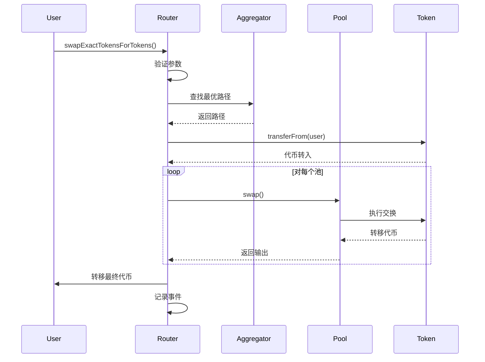
```mermaid
sequenceDiagram
    participant User
    participant Router
    participant Aggregator
    participant Pool
    participant Token

    User->>Router: swapExactTokensForTokens()
    Router->>Router: 验证参数
    Router->>Aggregator: 查找最优路径
    Aggregator-->>Router: 返回路径

    Router->>Token: transferFrom(user)
    Token-->>Router: 代币转入

    loop 对每个池
        Router->>Pool: swap()
        Pool->>Token: 执行交换
        Token-->>Pool: 转移代币
        Pool-->>Router: 返回输出
    end

    Router->>User: 转移最终代币
    Router->>Router: 记录事件
```

#### 核心功能实现

```solidity
// 聚合交换 - 支持多DEX和分割路由
function aggregatedSwap(
    SwapDescription memory desc,
    RouteConfig memory config,
    Route[] memory routes
) external payable returns (uint256 returnAmount) {
    // 1. 判断执行模式
    if (config.mode == ExecutionMode.DIRECT) {
        // 直接模式不应该调用此合约
        revert("Use direct DEX call instead");
    }

    // 2. 转入代币
    IERC20(desc.srcToken).safeTransferFrom(
        msg.sender, address(this), desc.amount
    );

    // 3. 执行聚合交换
    uint256 totalOutput = 0;
    uint256 remaining = desc.amount;

    for (uint i = 0; i < routes.length; i++) {
        Route memory route = routes[i];
        uint256 routeAmount = remaining * route.percentage / 10000;

        if (route.dexType == DEXType.UNISWAP_V3) {
            totalOutput += _swapOnUniswapV3(route, routeAmount);
        } else if (route.dexType == DEXType.CURVE) {
            totalOutput += _swapOnCurve(route, routeAmount);
        } else if (route.dexType == DEXType.BALANCER) {
            totalOutput += _swapOnBalancer(route, routeAmount);
        }
        // 支持更多DEX...
    }

    // 4. 检查滑点
    require(totalOutput >= desc.minReturnAmount, "Slippage check failed");

    // 5. 转出代币
    IERC20(desc.dstToken).safeTransfer(desc.dstReceiver, totalOutput);

    // 6. 收取平台费用（如果有）
    if (feeRate > 0) {
        uint256 fee = totalOutput * feeRate / 10000;
        IERC20(desc.dstToken).safeTransfer(feeCollector, fee);
        totalOutput -= fee;
    }

    emit AggregatedSwapExecuted(
        msg.sender, desc.srcToken, desc.dstToken,
        desc.amount, totalOutput, routes.length
    );

    return totalOutput;
}

// 精确输入交换（保留兼容性）
function swapExactTokensForTokens(
    uint256 amountIn,
    uint256 amountOutMin,
    address[] calldata path,
    address to,
    uint256 deadline
) external ensure(deadline) returns (uint256[] memory amounts) {
    // 1. 计算输出数量
    amounts = getAmountsOut(amountIn, path);
    require(amounts[amounts.length - 1] >= amountOutMin, 'INSUFFICIENT_OUTPUT');

    // 2. 转入初始代币
    TransferHelper.safeTransferFrom(
        path[0], msg.sender, pairFor(path[0], path[1]), amounts[0]
    );

    // 3. 执行交换链
    _swap(amounts, path, to);

    // 4. 触发事件
    emit SwapExecuted(msg.sender, path, amounts);
}

// 内部交换逻辑
function _swap(uint[] memory amounts, address[] memory path, address to) internal {
    for (uint i; i < path.length - 1; i++) {
        (address input, address output) = (path[i], path[i + 1]);
        (uint reserveIn, uint reserveOut) = getReserves(input, output);
        uint amountOut = amounts[i + 1];

        // 计算实际交换
        (uint amount0Out, uint amount1Out) = input < output ?
            (uint(0), amountOut) : (amountOut, uint(0));

        // 确定接收地址
        address toAddress = i < path.length - 2 ?
            pairFor(output, path[i + 2]) : to;

        // 执行交换
        IPair(pairFor(input, output)).swap(
            amount0Out, amount1Out, toAddress, new bytes(0)
        );
    }
}
```

### 2. 内部DEX调用实现

```solidity
// 内部实现对各个DEX的调用
contract DEXAdapter {

    // Uniswap V3调用
    function _swapOnUniswapV3(
        address tokenIn,
        address tokenOut,
        uint256 amountIn,
        uint24 fee
    ) internal returns (uint256 amountOut) {
        // 授权给Uniswap Router
        IERC20(tokenIn).approve(UNISWAP_V3_ROUTER, amountIn);

        // 构建swap参数
        ISwapRouter.ExactInputSingleParams memory params = ISwapRouter.ExactInputSingleParams({
            tokenIn: tokenIn,
            tokenOut: tokenOut,
            fee: fee,
            recipient: address(this),
            deadline: block.timestamp,
            amountIn: amountIn,
            amountOutMinimum: 0,
            sqrtPriceLimitX96: 0
        });

        // 执行swap
        amountOut = ISwapRouter(UNISWAP_V3_ROUTER).exactInputSingle(params);
    }

    // Curve调用
    function _swapOnCurve(
        address pool,
        int128 i,
        int128 j,
        uint256 amountIn
    ) internal returns (uint256 amountOut) {
        // Curve使用不同的接口
        IERC20(tokens[uint128(i)]).approve(pool, amountIn);

        uint256 balanceBefore = IERC20(tokens[uint128(j)]).balanceOf(address(this));
        ICurvePool(pool).exchange(i, j, amountIn, 0);
        amountOut = IERC20(tokens[uint128(j)]).balanceOf(address(this)) - balanceBefore;
    }

    // Balancer调用
    function _swapOnBalancer(
        IBalancerVault.SingleSwap memory singleSwap,
        IBalancerVault.FundManagement memory funds,
        uint256 limit
    ) internal returns (uint256 amountOut) {
        return IBalancerVault(BALANCER_VAULT).swap(
            singleSwap,
            funds,
            limit,
            block.timestamp
        );
    }
}
```

### 3. 限价单合约

```solidity
contract LimitOrderProtocol {

    // 订单结构
    struct Order {
        uint256 salt;           // 唯一标识
        address makerAsset;     // Maker代币
        address takerAsset;     // Taker代币
        address maker;          // Maker地址
        address receiver;       // 接收地址
        address allowedSender;  // 允许的发送者
        uint256 makingAmount;   // Maker数量
        uint256 takingAmount;   // Taker数量
        uint256 offsets;        // 偏移量打包
        bytes interactions;     // 交互数据
    }

    // 订单状态
    mapping(bytes32 => uint256) public remaining;  // 剩余数量
    mapping(address => uint256) public nonces;     // 防重放
}
```

#### 订单执行流程

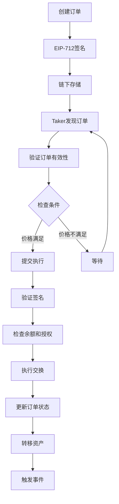
```mermaid
flowchart TD
    A[创建订单] --> B[EIP-712签名]
    B --> C[链下存储]

    C --> D[Taker发现订单]
    D --> E[验证订单有效性]

    E --> F{检查条件}
    F -->|价格满足| G[提交执行]
    F -->|价格不满足| H[等待]

    G --> I[验证签名]
    I --> J[检查余额和授权]
    J --> K[执行交换]

    K --> L[更新订单状态]
    L --> M[转移资产]
    M --> N[触发事件]

    H --> D
```

#### 核心功能实现

```solidity
// 填充订单
function fillOrder(
    Order calldata order,
    bytes calldata signature,
    bytes calldata interaction,
    uint256 makingAmount,
    uint256 takingAmount,
    uint256 skipPermitAndThresholdAmount
) external payable returns(uint256, uint256, bytes32) {
    // 1. 计算订单哈希
    bytes32 orderHash = hashOrder(order);

    // 2. 验证签名
    require(validateSignature(orderHash, signature, order.maker), "Bad signature");

    // 3. 检查订单状态
    uint256 remainingMakingAmount = remaining[orderHash];
    require(remainingMakingAmount > 0, "Order filled");

    // 4. 计算实际数量
    uint256 actualMakingAmount = min(makingAmount, remainingMakingAmount);
    uint256 actualTakingAmount = (actualMakingAmount * order.takingAmount) / order.makingAmount;

    // 5. 更新状态
    remaining[orderHash] = remainingMakingAmount - actualMakingAmount;

    // 6. 执行转账
    IERC20(order.takerAsset).transferFrom(msg.sender, order.receiver, actualTakingAmount);
    IERC20(order.makerAsset).transferFrom(order.maker, msg.sender, actualMakingAmount);

    // 7. 触发事件
    emit OrderFilled(orderHash, actualMakingAmount, actualTakingAmount);

    return (actualMakingAmount, actualTakingAmount, orderHash);
}

// RFQ(Request for Quote)订单
function fillOrderRFQ(
    OrderRFQ calldata order,
    bytes calldata signature,
    uint256 flagsAndAmount
) external returns(uint256, uint256, bytes32) {
    // RFQ专用快速路径，优化gas消耗
    return fillOrderRFQCompact(order, signature, flagsAndAmount);
}
```

### 3. DCA合约

```solidity
contract DCAVault {

    struct DCAOrder {
        address owner;           // 拥有者
        address tokenIn;         // 输入代币
        address tokenOut;        // 输出代币
        uint256 amountPerTrade;  // 每次交易金额
        uint256 interval;        // 执行间隔
        uint256 numberOfTrades;  // 总交易次数
        uint256 executedTrades;  // 已执行次数
        uint256 lastExecuted;    // 上次执行时间
        bool active;            // 是否激活
    }

    mapping(uint256 => DCAOrder) public orders;
    mapping(address => uint256[]) public userOrders;
    uint256 public nextOrderId;
}
```

#### DCA执行机制

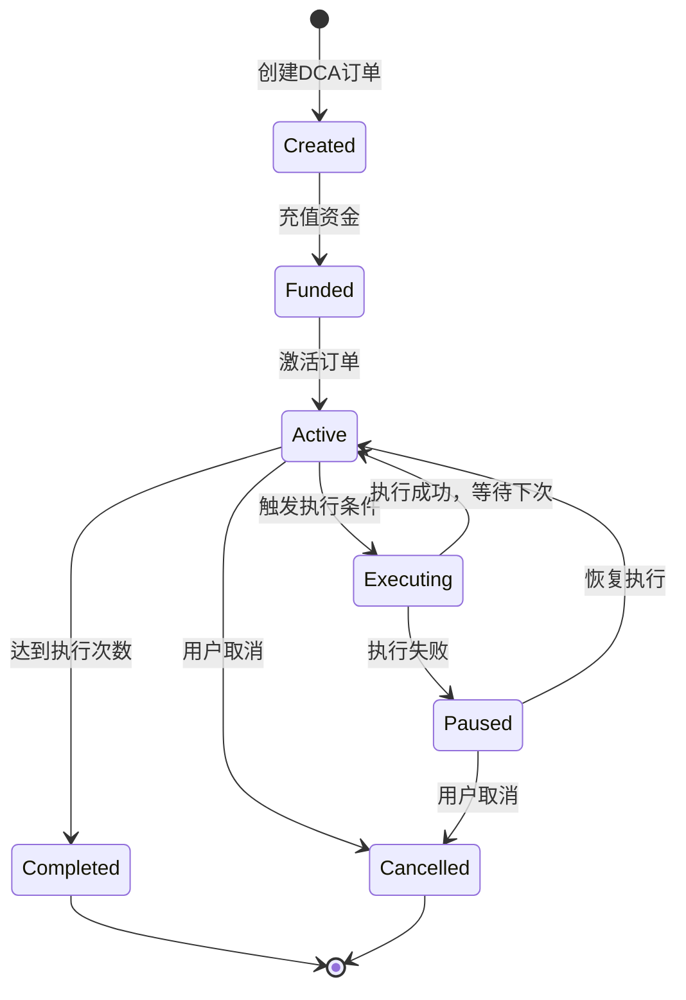
```mermaid
stateDiagram-v2
    [*] --> Created: 创建DCA订单
    Created --> Funded: 充值资金
    Funded --> Active: 激活订单

    Active --> Executing: 触发执行条件
    Executing --> Active: 执行成功，等待下次
    Executing --> Paused: 执行失败

    Active --> Completed: 达到执行次数
    Active --> Cancelled: 用户取消

    Paused --> Active: 恢复执行
    Paused --> Cancelled: 用户取消

    Completed --> [*]
    Cancelled --> [*]
```

#### 核心功能实现

```solidity
// 创建DCA订单
function createDCAOrder(
    address tokenIn,
    address tokenOut,
    uint256 amountPerTrade,
    uint256 interval,
    uint256 numberOfTrades
) external returns (uint256 orderId) {
    orderId = nextOrderId++;

    orders[orderId] = DCAOrder({
        owner: msg.sender,
        tokenIn: tokenIn,
        tokenOut: tokenOut,
        amountPerTrade: amountPerTrade,
        interval: interval,
        numberOfTrades: numberOfTrades,
        executedTrades: 0,
        lastExecuted: 0,
        active: true
    });

    userOrders[msg.sender].push(orderId);

    // 转入总资金
    uint256 totalAmount = amountPerTrade * numberOfTrades;
    IERC20(tokenIn).transferFrom(msg.sender, address(this), totalAmount);

    emit DCAOrderCreated(orderId, msg.sender, tokenIn, tokenOut);
}

// 执行DCA订单
function executeDCAOrder(uint256 orderId) external {
    DCAOrder storage order = orders[orderId];

    // 验证执行条件
    require(order.active, "Order not active");
    require(block.timestamp >= order.lastExecuted + order.interval, "Too early");
    require(order.executedTrades < order.numberOfTrades, "Order completed");

    // 执行交易
    uint256 amountOut = _executeSwap(
        order.tokenIn,
        order.tokenOut,
        order.amountPerTrade
    );

    // 更新状态
    order.executedTrades++;
    order.lastExecuted = block.timestamp;

    if (order.executedTrades >= order.numberOfTrades) {
        order.active = false;
        emit DCAOrderCompleted(orderId);
    }

    // 发送输出代币给用户
    IERC20(order.tokenOut).transfer(order.owner, amountOut);

    emit DCAOrderExecuted(orderId, order.amountPerTrade, amountOut);
}
```

### 4. 跨链桥合约

```solidity
contract CrossChainBridge {

    struct BridgeRequest {
        address token;
        uint256 amount;
        uint256 targetChain;
        address recipient;
        uint256 nonce;
        bytes32 txHash;
    }

    mapping(bytes32 => bool) public processedRequests;
    mapping(address => mapping(uint256 => uint256)) public chainBalances;

    address[] public validators;
    mapping(bytes32 => uint256) public confirmations;
    uint256 public requiredConfirmations;
}
```

#### 跨链流程

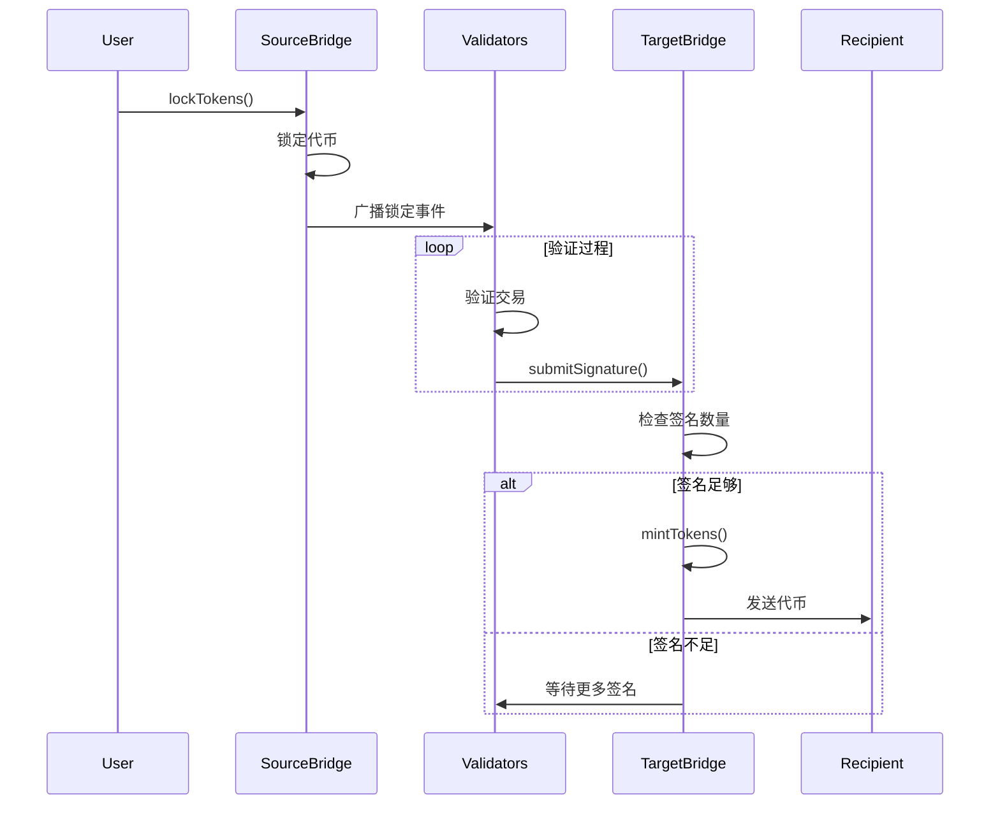
```mermaid
sequenceDiagram
    participant User
    participant SourceBridge
    participant Validators
    participant TargetBridge
    participant Recipient

    User->>SourceBridge: lockTokens()
    SourceBridge->>SourceBridge: 锁定代币
    SourceBridge->>Validators: 广播锁定事件

    loop 验证过程
        Validators->>Validators: 验证交易
        Validators->>TargetBridge: submitSignature()
    end

    TargetBridge->>TargetBridge: 检查签名数量

    alt 签名足够
        TargetBridge->>TargetBridge: mintTokens()
        TargetBridge->>Recipient: 发送代币
    else 签名不足
        TargetBridge->>Validators: 等待更多签名
    end
```

#### 核心功能实现

```solidity
// 源链锁定
function lockTokens(
    address token,
    uint256 amount,
    uint256 targetChain,
    address recipient
) external payable {
    require(amount > 0, "Invalid amount");

    // 生成唯一请求ID
    uint256 nonce = getNonce(msg.sender);
    bytes32 requestId = keccak256(
        abi.encodePacked(token, amount, targetChain, recipient, nonce)
    );

    // 锁定代币
    IERC20(token).transferFrom(msg.sender, address(this), amount);
    chainBalances[token][targetChain] += amount;

    // 记录请求
    emit TokensLocked(requestId, token, amount, targetChain, recipient);
}

// 目标链释放
function releaseTokens(
    bytes32 requestId,
    address token,
    uint256 amount,
    address recipient,
    bytes[] calldata signatures
) external {
    require(!processedRequests[requestId], "Already processed");
    require(signatures.length >= requiredConfirmations, "Not enough signatures");

    // 验证签名
    bytes32 messageHash = getMessageHash(requestId, token, amount, recipient);
    uint256 validSignatures = 0;

    for (uint i = 0; i < signatures.length; i++) {
        address signer = recoverSigner(messageHash, signatures[i]);
        if (isValidator(signer)) {
            validSignatures++;
        }
    }

    require(validSignatures >= requiredConfirmations, "Invalid signatures");

    // 标记已处理
    processedRequests[requestId] = true;

    // 释放代币
    IERC20(token).transfer(recipient, amount);

    emit TokensReleased(requestId, token, amount, recipient);
}
```

## 与后端服务的交互

### 服务与合约的职责划分

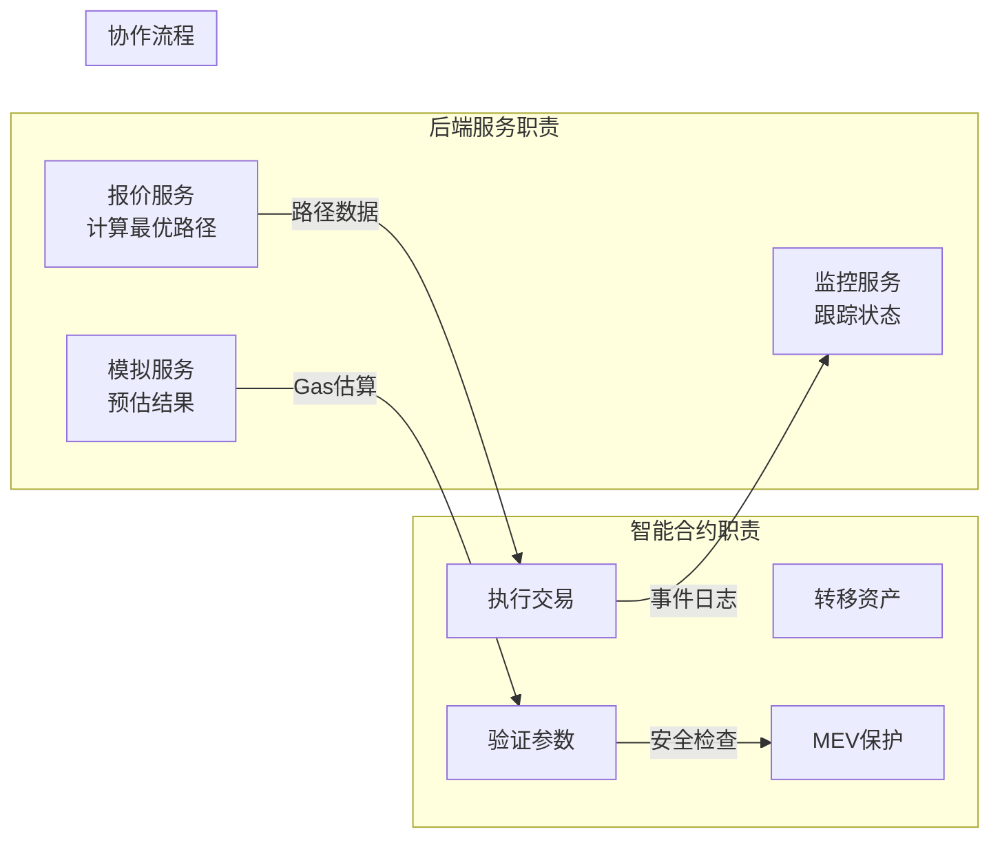
```mermaid
graph LR
    subgraph "后端服务职责"
        QUOTE[报价服务<br/>计算最优路径]
        SIMULATE[模拟服务<br/>预估结果]
        MONITOR[监控服务<br/>跟踪状态]
    end

    subgraph "智能合约职责"
        EXECUTE[执行交易]
        VALIDATE[验证参数]
        TRANSFER[转移资产]
        PROTECT[MEV保护]
    end

    subgraph "协作流程"
        QUOTE -->|路径数据| EXECUTE
        SIMULATE -->|Gas估算| VALIDATE
        EXECUTE -->|事件日志| MONITOR
        VALIDATE -->|安全检查| PROTECT
    end
```

### 数据流转示例

```javascript
// 1. 后端计算路径
const optimalRoute = await quoteService.findBestRoute({
    from: 'USDT',
    to: 'ETH',
    amount: '10000'
});

// 2. 前端决策执行模式
const executionMode = determineExecutionMode(optimalRoute);

if (executionMode === 'DIRECT') {
    // 3a. 直接调用Uniswap
    const tx = await uniswapRouter.swap({
        path: optimalRoute.path,
        amountIn: optimalRoute.amountIn,
        amountOutMin: optimalRoute.amountOutMin
    });
} else if (executionMode === 'AGGREGATED') {
    // 3b. 调用OpenOcean聚合器
    const tx = await openOceanRouter.aggregatedSwap({
        description: swapDesc,
        config: routeConfig,
        routes: optimalRoute.routes
    });
}

// 4. 监控服务跟踪交易
await monitorService.trackTransaction(tx.hash);
```

## 安全机制设计

### 1. 多签钱包合约

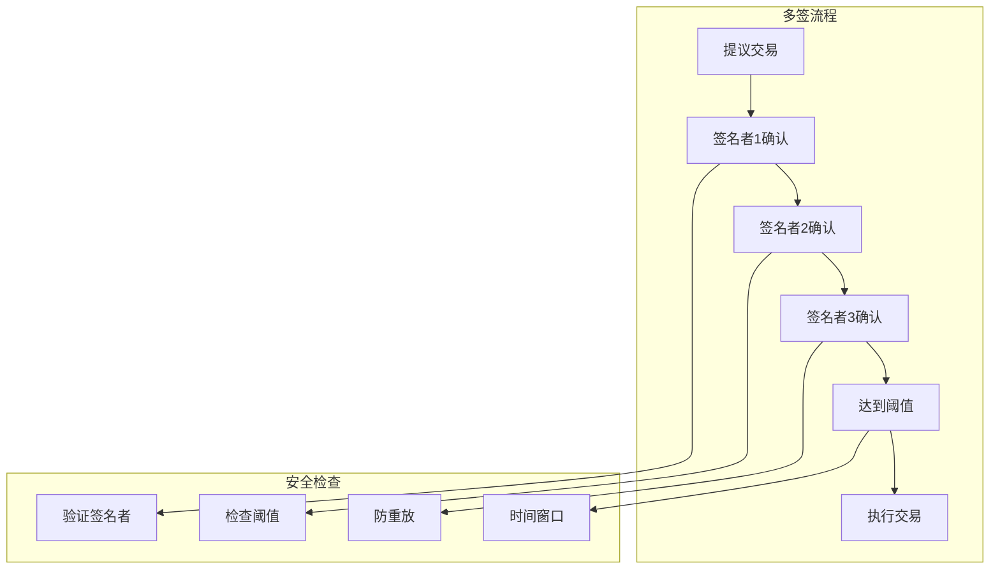
```mermaid
graph TB
    subgraph "多签流程"
        PROPOSE[提议交易]
        SIGN1[签名者1确认]
        SIGN2[签名者2确认]
        SIGN3[签名者3确认]
        THRESHOLD[达到阈值]
        EXECUTE[执行交易]
    end

    PROPOSE --> SIGN1
    SIGN1 --> SIGN2
    SIGN2 --> SIGN3
    SIGN3 --> THRESHOLD
    THRESHOLD --> EXECUTE

    subgraph "安全检查"
        CHECK1[验证签名者]
        CHECK2[检查阈值]
        CHECK3[防重放]
        CHECK4[时间窗口]
    end

    SIGN1 --> CHECK1
    SIGN2 --> CHECK2
    SIGN3 --> CHECK3
    THRESHOLD --> CHECK4
```

### 2. 时间锁机制

```solidity
contract TimeLock {
    uint256 public constant MINIMUM_DELAY = 2 days;
    uint256 public constant MAXIMUM_DELAY = 30 days;

    mapping(bytes32 => uint256) public timestamps;

    function schedule(
        address target,
        uint256 value,
        bytes calldata data,
        uint256 delay
    ) external onlyOwner {
        require(delay >= MINIMUM_DELAY && delay <= MAXIMUM_DELAY, "Invalid delay");

        bytes32 txHash = keccak256(abi.encode(target, value, data));
        timestamps[txHash] = block.timestamp + delay;

        emit TransactionScheduled(txHash, target, value, data, timestamps[txHash]);
    }

    function execute(
        address target,
        uint256 value,
        bytes calldata data
    ) external onlyOwner {
        bytes32 txHash = keccak256(abi.encode(target, value, data));
        require(timestamps[txHash] > 0, "Not scheduled");
        require(block.timestamp >= timestamps[txHash], "Too early");

        timestamps[txHash] = 0;

        (bool success,) = target.call{value: value}(data);
        require(success, "Execution failed");

        emit TransactionExecuted(txHash);
    }
}
```

### 3. 紧急暂停机制

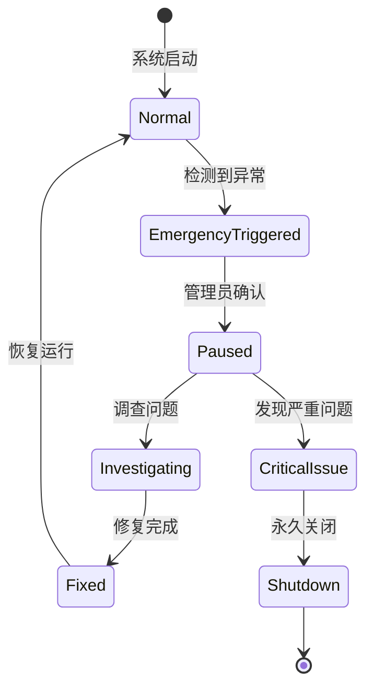
```mermaid
stateDiagram-v2
    [*] --> Normal: 系统启动

    Normal --> EmergencyTriggered: 检测到异常
    EmergencyTriggered --> Paused: 管理员确认

    Paused --> Investigating: 调查问题
    Investigating --> Fixed: 修复完成
    Fixed --> Normal: 恢复运行

    Paused --> CriticalIssue: 发现严重问题
    CriticalIssue --> Shutdown: 永久关闭

    Shutdown --> [*]
```

## Gas优化策略

### 1. 存储优化

```solidity
// 优化前 - 使用多个存储槽
struct OrderBad {
    address maker;      // 槽1
    address taker;      // 槽2
    uint256 amount;     // 槽3
    uint256 price;      // 槽4
    bool active;        // 槽5
}

// 优化后 - 紧密打包
struct OrderGood {
    address maker;      // 槽1 (20字节)
    uint96 amount;      // 槽1 (12字节)
    address taker;      // 槽2 (20字节)
    uint96 price;       // 槽2 (12字节)
    bool active;        // 槽3 (1字节)
    uint248 metadata;   // 槽3 (31字节)
}
```

### 2. 批量操作

```solidity
// 批量交换优化
function batchSwap(
    SwapDescription[] calldata swaps
) external returns (uint256[] memory results) {
    results = new uint256[](swaps.length);

    for (uint i = 0; i < swaps.length;) {
        results[i] = _performSwap(swaps[i]);
        unchecked { ++i; }  // 使用unchecked节省gas
    }
}
```

## 升级机制

### 代理模式架构

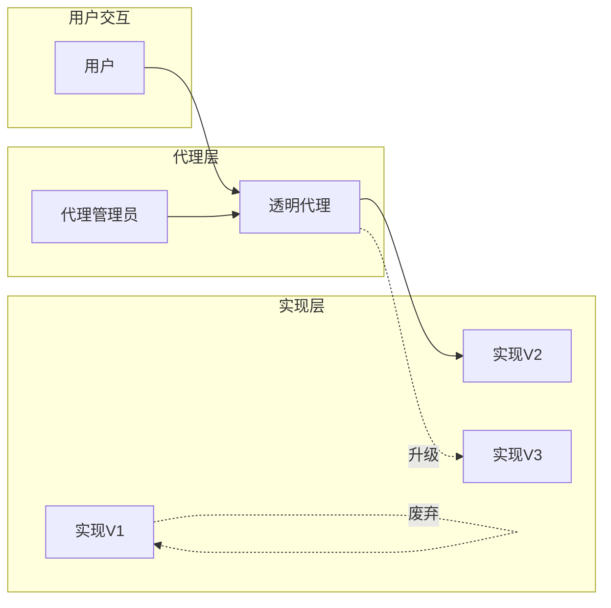
```mermaid
graph LR
    subgraph "用户交互"
        USER[用户]
    end

    subgraph "代理层"
        PROXY[透明代理]
        ADMIN[代理管理员]
    end

    subgraph "实现层"
        IMPL_V1[实现V1]
        IMPL_V2[实现V2]
        IMPL_V3[实现V3]
    end

    USER --> PROXY
    PROXY --> IMPL_V2
    ADMIN --> PROXY
    PROXY -.->|升级| IMPL_V3

    IMPL_V1 -.->|废弃| IMPL_V1
```

## 事件和监控

```solidity
// 核心事件定义
event SwapExecuted(
    address indexed sender,
    address indexed tokenIn,
    address indexed tokenOut,
    uint256 amountIn,
    uint256 amountOut,
    address[] path
);

event OrderCreated(
    bytes32 indexed orderHash,
    address indexed maker,
    address makerAsset,
    address takerAsset,
    uint256 makingAmount,
    uint256 takingAmount
);

event EmergencyPause(
    address indexed caller,
    uint256 timestamp,
    string reason
);
```

## 测试策略

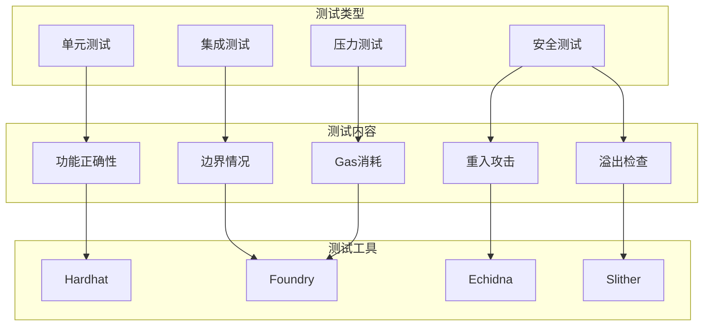
```mermaid
graph TB
    subgraph "测试类型"
        UNIT[单元测试]
        INTEGRATION[集成测试]
        STRESS[压力测试]
        SECURITY[安全测试]
    end

    subgraph "测试内容"
        FUNCTION[功能正确性]
        EDGE[边界情况]
        GAS[Gas消耗]
        REENTRANCY[重入攻击]
        OVERFLOW[溢出检查]
    end

    subgraph "测试工具"
        HARDHAT[Hardhat]
        FOUNDRY[Foundry]
        ECHIDNA[Echidna]
        SLITHER[Slither]
    end

    UNIT --> FUNCTION
    INTEGRATION --> EDGE
    STRESS --> GAS
    SECURITY --> REENTRANCY
    SECURITY --> OVERFLOW

    FUNCTION --> HARDHAT
    EDGE --> FOUNDRY
    GAS --> FOUNDRY
    REENTRANCY --> ECHIDNA
    OVERFLOW --> SLITHER
```

## 部署流程

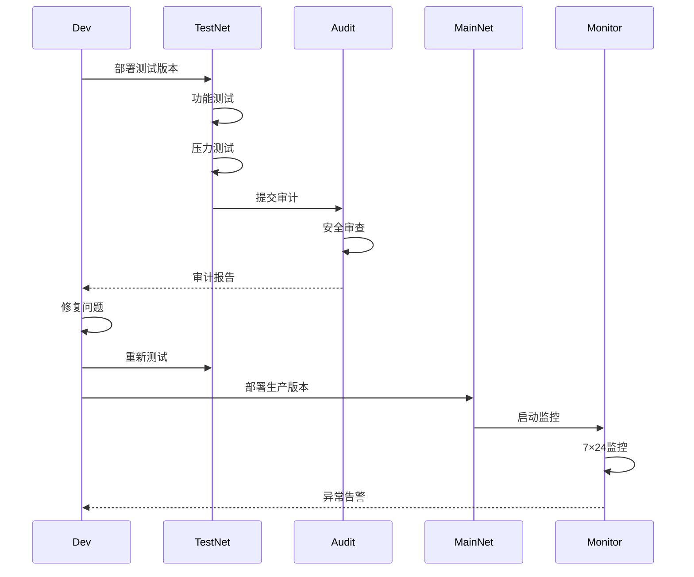
```mermaid
sequenceDiagram
    participant Dev
    participant TestNet
    participant Audit
    participant MainNet
    participant Monitor

    Dev->>TestNet: 部署测试版本
    TestNet->>TestNet: 功能测试
    TestNet->>TestNet: 压力测试

    TestNet->>Audit: 提交审计
    Audit->>Audit: 安全审查
    Audit-->>Dev: 审计报告

    Dev->>Dev: 修复问题
    Dev->>TestNet: 重新测试

    Dev->>MainNet: 部署生产版本
    MainNet->>Monitor: 启动监控
    Monitor->>Monitor: 7×24监控

    Monitor-->>Dev: 异常告警
```

## 关键指标

```yaml
性能指标:
  - Gas优化: < 150k gas/swap
  - 批量效率: 30% gas节省
  - 存储优化: 50% 槽位减少

安全指标:
  - 审计覆盖: 100%
  - 测试覆盖: > 95%
  - 漏洞响应: < 24小时

可靠性指标:
  - 合约正常运行: 99.99%
  - 升级成功率: 100%
  - 事故恢复时间: < 1小时
```

## 架构设计总结

### 混合执行模式的优势

1. **灵活性**：根据交易复杂度智能选择执行路径
2. **效率**：简单交易直接执行，复杂交易统一聚合
3. **功能性**：支持限价单、DCA等高级功能
4. **经济性**：优化Gas消耗，减少用户成本

### 关键设计决策

| 决策点 | 选择 | 原因 |
|--------|------|------|
| **执行模式** | 混合模式 | 平衡简单性和功能性 |
| **合约架构** | 模块化设计 | 易于维护和升级 |
| **DEX集成** | 适配器模式 | 支持多种DEX协议 |
| **安全机制** | 多层防护 | 时间锁+多签+紧急暂停 |
| **升级策略** | 透明代理 | 保持地址不变，逻辑可升级 |

### 与传统DEX的区别

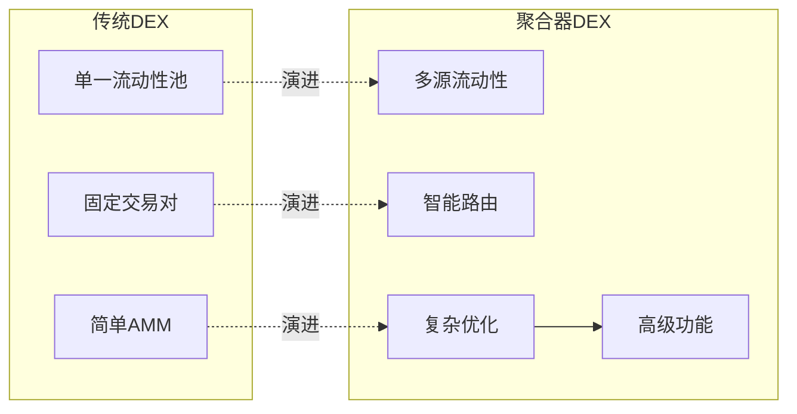
```mermaid
graph LR
    subgraph "传统DEX"
        TD1[单一流动性池]
        TD2[固定交易对]
        TD3[简单AMM]
    end

    subgraph "聚合器DEX"
        AD1[多源流动性]
        AD2[智能路由]
        AD3[复杂优化]
        AD4[高级功能]
    end

    TD1 -.->|演进| AD1
    TD2 -.->|演进| AD2
    TD3 -.->|演进| AD3
    AD3 --> AD4
```

### 实施建议

1. **分阶段部署**
   - Phase 1：核心聚合功能
   - Phase 2：限价单系统
   - Phase 3：DCA和跨链功能

2. **风险控制**
   - 初期设置交易限额
   - 逐步开放支持的DEX
   - 建立紧急响应机制

3. **性能优化**
   - 缓存常用路径
   - 批量处理交易
   - 动态Gas价格调整

这种混合架构设计既保留了去中心化的特性，又提供了中心化服务的便利性，是DEX聚合器的最佳实践。