# 生产级多链DEX架构设计

## 执行摘要

本文档提供了下一代去中心化交易所（DEX）系统的全面架构设计，支持多链操作、高级交易功能和竞争性创新。架构强调可扩展性、可扩展性和性能，同时保持去中心化原则。

## 核心功能

### 交易功能
- **即时兑换**：最佳价格路由的市价订单
- **限价订单**：无Gas限价订单执行
- **DCA（定投）**：自动化定期交易
- **跨链桥**：无缝多链兑换
- **批量操作**：多代币扫荡式兑换
- **MEV保护**：抗抢跑机制

### 系统功能
- **多链支持**：40+条链（EVM和非EVM）
- **流动性聚合**：1000+流动性来源
- **智能订单路由**：AI驱动的路由优化
- **实时分析**：市场数据和价格源
- **治理**：DAO集成
- **推荐系统**：多层级佣金结构

## 系统架构

### 高层架构

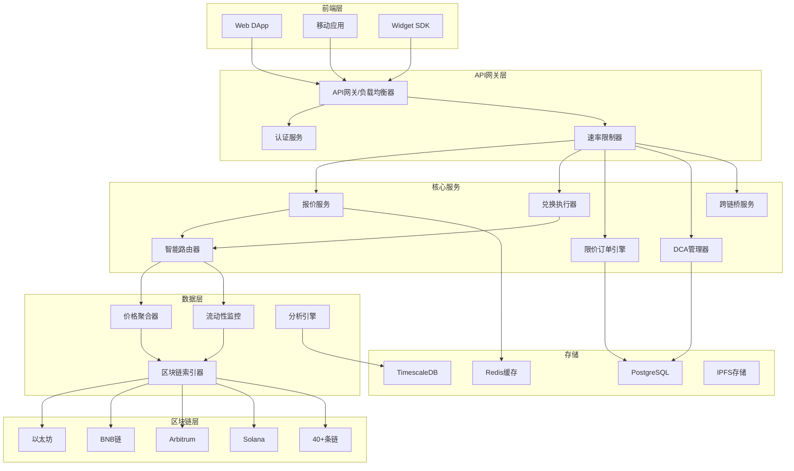

## 微服务架构

### 核心服务分解

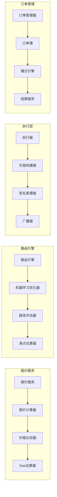

## 数据流架构

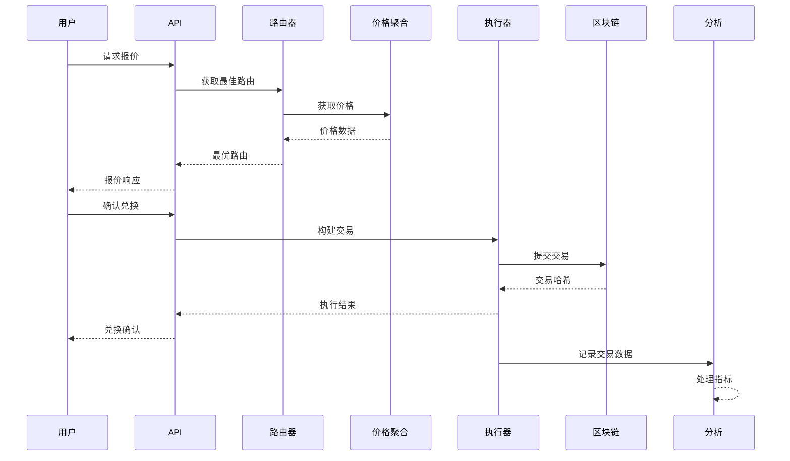

## 多链架构

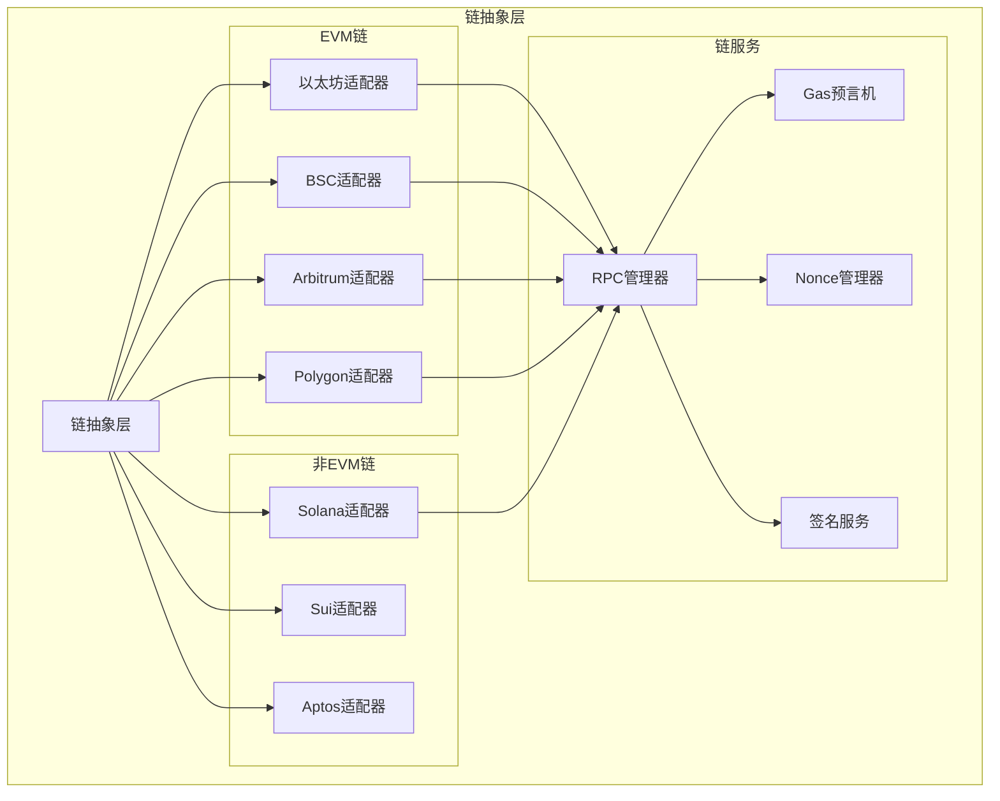

## 智能合约架构

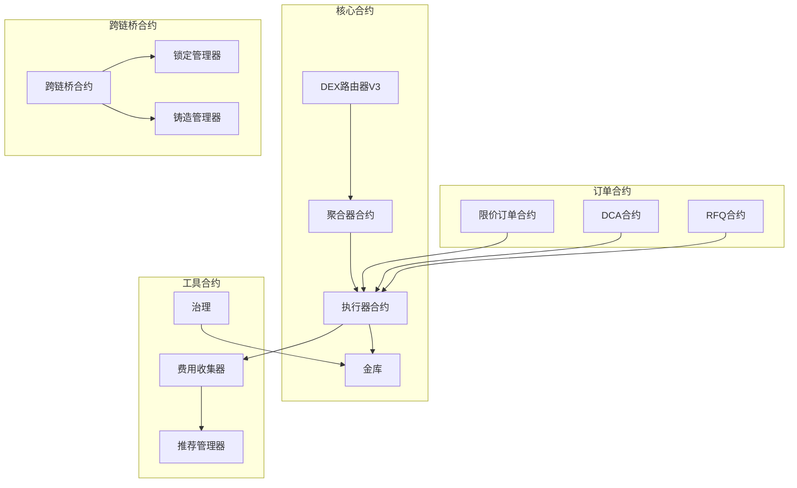

## 数据库架构设计

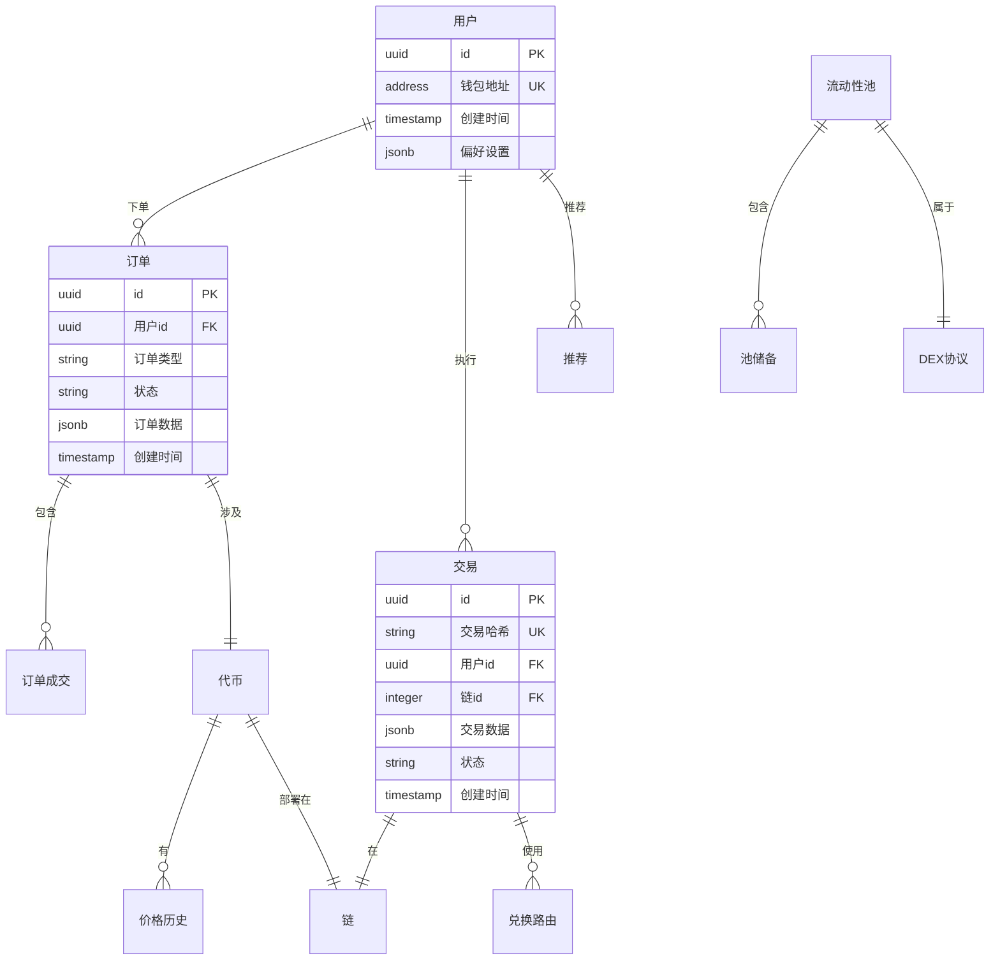

## API设计

### 核心API端点

```yaml
# 兑换API
GET  /api/v4/{chain}/quote          # 获取报价
POST /api/v4/{chain}/swap           # 执行兑换
GET  /api/v4/{chain}/swap/{txHash}  # 查询兑换状态

# 订单API
POST /api/v4/{chain}/limit-order    # 创建限价订单
GET  /api/v4/{chain}/limit-order/{orderId}  # 查询订单
DELETE /api/v4/{chain}/limit-order/{orderId} # 取消订单

# DCA API
POST /api/v4/{chain}/dca            # 创建定投计划
GET  /api/v4/{chain}/dca/{dcaId}    # 查询定投状态
PUT  /api/v4/{chain}/dca/{dcaId}    # 更新定投计划

# 跨链桥API
POST /api/v4/bridge/quote           # 跨链报价
POST /api/v4/bridge/swap            # 执行跨链
GET  /api/v4/bridge/{txHash}        # 查询跨链状态

# 分析API
GET  /api/v4/{chain}/tokens         # 代币列表
GET  /api/v4/{chain}/tokens/{address}/price  # 代币价格
GET  /api/v4/{chain}/pools          # 流动性池列表
GET  /api/v4/{chain}/volume/24h     # 24小时交易量

# WebSocket API
WS  /ws/prices                      # 价格推送
WS  /ws/orders                      # 订单推送
WS  /ws/trades                      # 交易推送
```

## 竞争优势与创新

### 1. AI驱动的智能路由

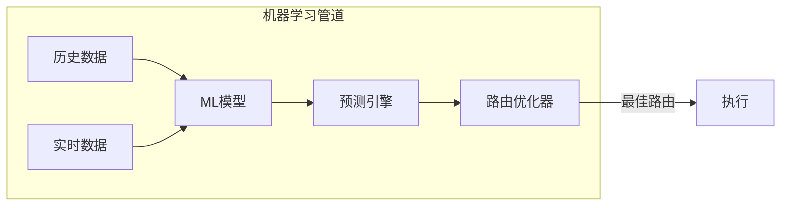

**关键特性：**
- 基于历史交易数据训练的机器学习模型
- 实时滑点预测
- 基于Gas价格和流动性的动态路由优化
- 支持最多5个中间代币的多跳路径寻找

### 2. 基于意图的交易系统

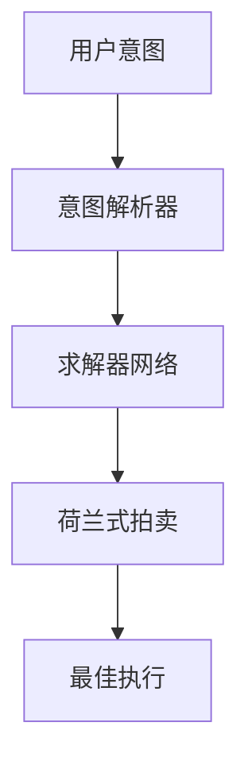

**优势：**
- 用户只需指定期望结果，无需关心执行路径
- 竞争性求解器市场
- 通过私有内存池实现MEV保护
- 通过求解器竞争获得更好价格

### 3. 跨链流动性聚合

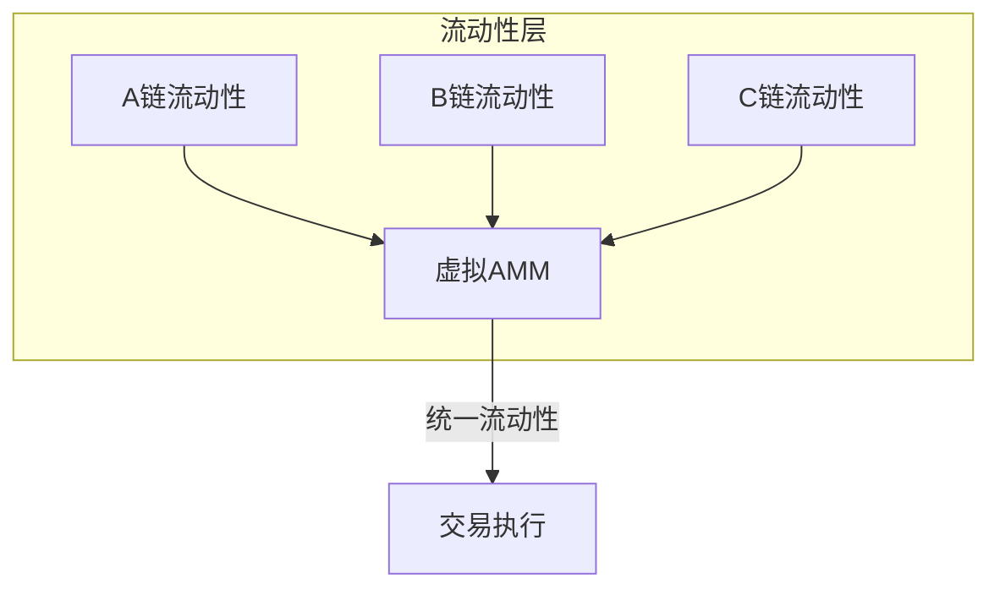

**创新点：**
- 跨链虚拟流动性池
- 原子跨链兑换
- 统一订单簿
- 资本效率优化

### 4. 零知识证明集成

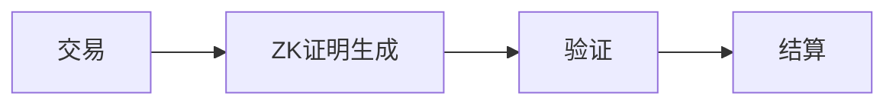

**应用场景：**
- 隐私交易
- 无需暴露数据的合规证明
- 批量交易证明以优化Gas
- 抢跑保护

### 5. 去中心化求解器网络

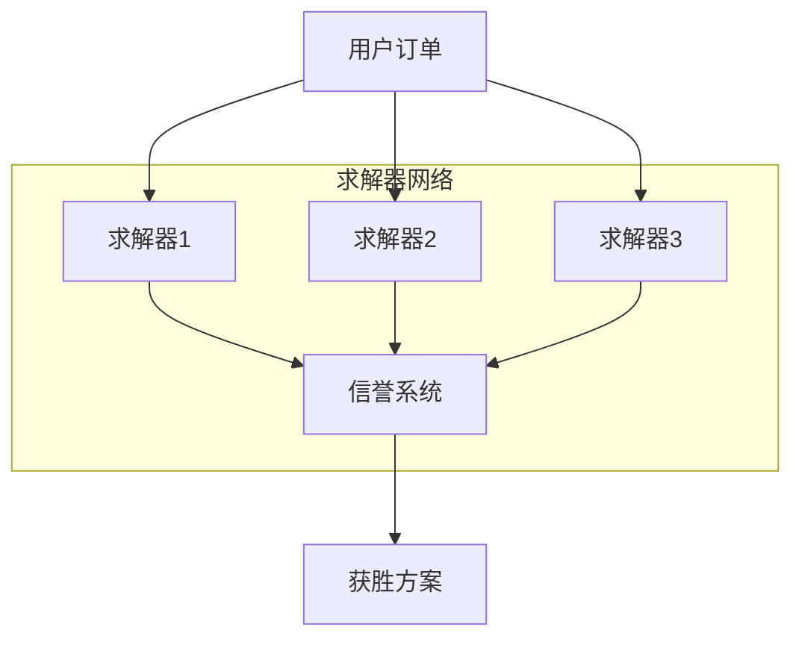

## 基础设施要求

### 技术栈

**后端：**
- 语言：Rust（核心服务）、Go（API层）、Python（机器学习/分析）
- 框架：Actix-web（Rust）、Gin（Go）、FastAPI（Python）
- 消息队列：Apache Kafka
- 缓存：Redis集群
- 数据库：PostgreSQL（主库）、TimescaleDB（时序数据）、MongoDB（灵活数据）

**区块链：**
- Web3库：ethers.rs、web3.py、anchor（Solana）
- 智能合约：Solidity、Move、Rust（Solana）
- 索引：The Graph协议、自定义索引器

**基础设施：**
- Kubernetes容器编排
- AWS/GCP云基础设施
- CloudFlare CDN和DDoS防护
- Prometheus + Grafana监控

### 性能目标

- **延迟**：报价生成 < 100ms
- **吞吐量**：10,000+ 请求/秒
- **可用性**：99.99% 正常运行时间
- **链支持**：40+条链，集成时间 < 1周
- **订单执行**：< 2秒确认

## 安全架构

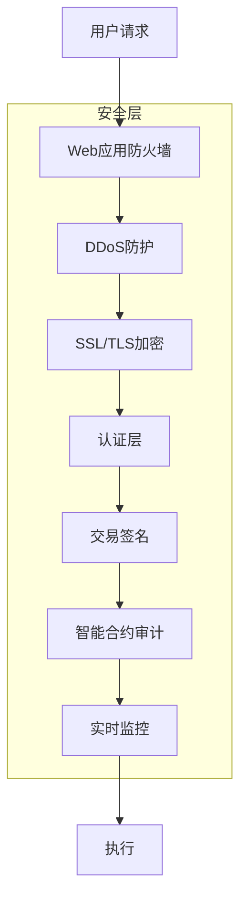

### 安全措施

1. **智能合约安全**
   - 多签钱包
   - 关键操作时间锁
   - 顶级机构定期审计
   - 漏洞赏金计划

2. **API安全**
   - IP/钱包速率限制
   - API密钥认证
   - 请求签名
   - 加密通信

3. **基础设施安全**
   - 多区域部署
   - 自动故障转移
   - 定期安全审计
   - 事件响应团队

## 可扩展性策略

### 水平扩展

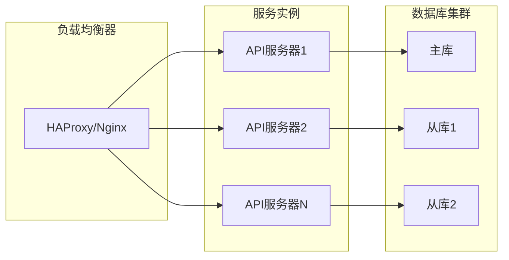

### 缓存策略

- **L1缓存**：热数据内存缓存（Redis）
- **L2缓存**：共享数据分布式缓存（Redis集群）
- **L3缓存**：静态内容CDN（CloudFlare）
- **智能缓存**：基于机器学习的缓存失效策略

## 监控和可观察性

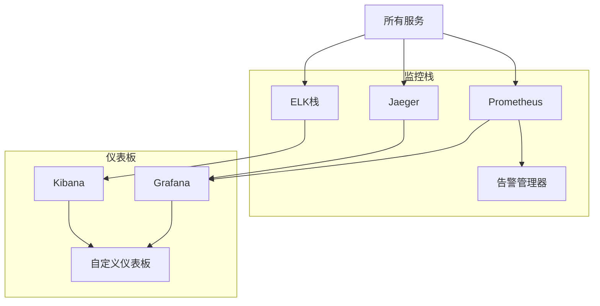

### 关键指标

- **业务指标**：TVL、交易量、活跃用户、费用收入
- **技术指标**：延迟、错误率、TPS、Gas使用
- **安全指标**：认证失败尝试、异常检测
- **链指标**：区块确认时间、Gas价格

## 路线图

### 第一阶段：基础（1-3个月）
- 核心兑换功能
- 支持10条主要EVM链
- 基础路由算法
- Web界面

### 第二阶段：高级功能（4-6个月）
- 限价订单
- DCA实现
- 跨链桥
- 移动应用

### 第三阶段：创新（7-9个月）
- AI驱动路由
- 基于意图的交易
- 求解器网络测试版
- ZK证明集成

### 第四阶段：扩展（10-12个月）
- 40+条链支持
- 机构功能
- 高级分析
- 治理启动

## 结论

这个架构为下一代DEX平台提供了强大、可扩展和创新的基础。关键差异化因素包括：

1. **AI驱动优化**：通过机器学习实现卓越执行
2. **多链原生**：无缝跨链操作
3. **基于意图的交易**：用户友好、MEV保护的交易
4. **去中心化创新**：求解器网络持续改进
5. **企业级基础设施**：为机构采用而构建

模块化设计确保易于维护、快速功能开发，以及随着平台增长的无缝扩展。