# Production-Grade Multi-Chain DEX Architecture Design

## Executive Summary

This document presents a comprehensive architecture for a next-generation decentralized exchange (DEX) system that supports multi-chain operations, advanced trading features, and competitive innovations. The architecture emphasizes scalability, extensibility, and performance while maintaining decentralization principles.

## Core Features

### Trading Features
- **Instant Swap**: Market orders with best price routing
- **Limit Orders**: Gasless limit order execution
- **DCA (Dollar-Cost Averaging)**: Automated recurring trades
- **Cross-Chain Bridge**: Seamless multi-chain swaps
- **Batch Operations**: Sweep swap for multiple tokens
- **MEV Protection**: Anti-frontrunning mechanisms

### System Features
- **Multi-Chain Support**: 40+ chains (EVM & non-EVM)
- **Liquidity Aggregation**: 1000+ liquidity sources
- **Smart Order Routing**: AI-powered route optimization
- **Real-time Analytics**: Market data and price feeds
- **Governance**: DAO integration
- **Referral System**: Multi-tier commission structure

## System Architecture

### High-Level Architecture

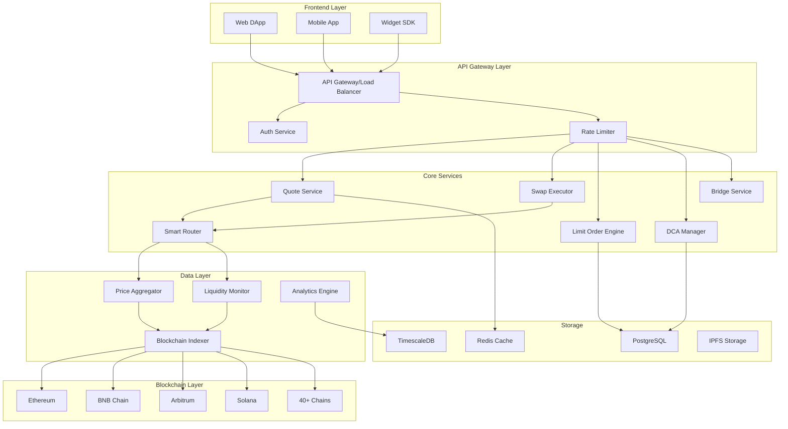

## Microservices Architecture

### Core Services Breakdown

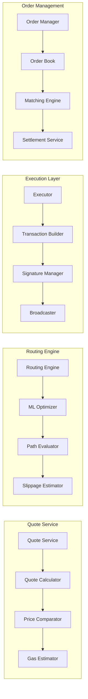

## Data Flow Architecture

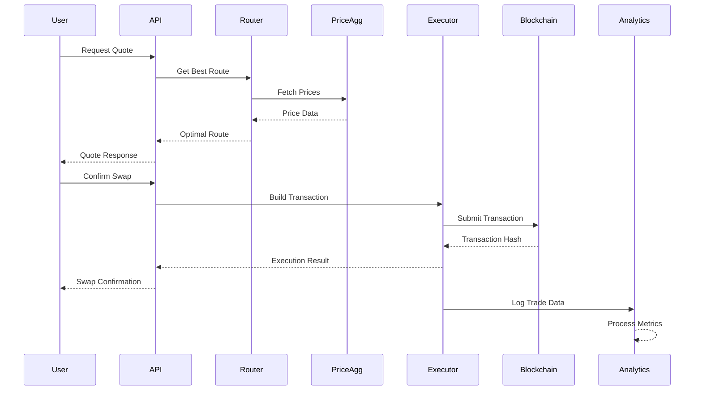

## Multi-Chain Architecture

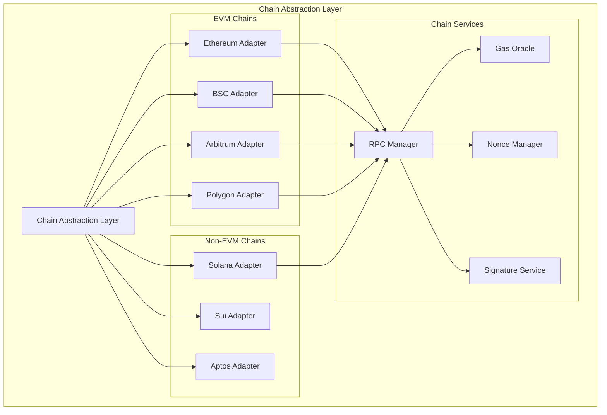

## Smart Contract Architecture

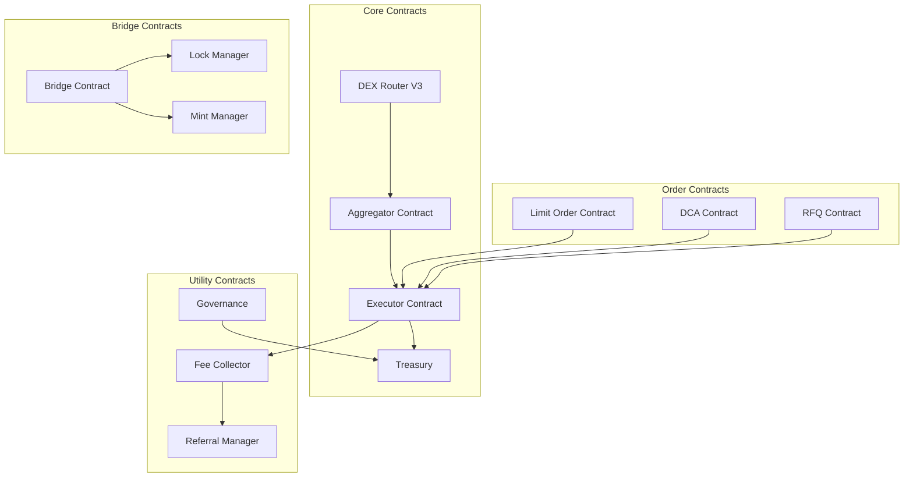

## Database Schema Design

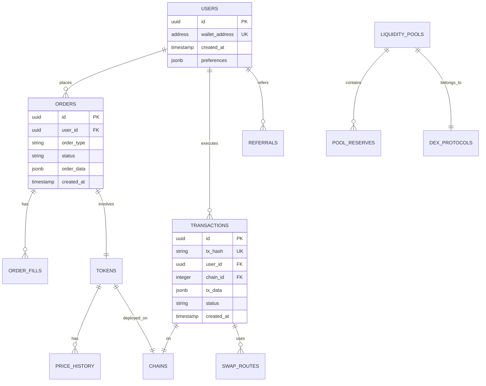

## API Design

### Core API Endpoints

```yaml
# Swap APIs
GET  /api/v4/{chain}/quote
POST /api/v4/{chain}/swap
GET  /api/v4/{chain}/swap/{txHash}

# Order APIs
POST /api/v4/{chain}/limit-order
GET  /api/v4/{chain}/limit-order/{orderId}
DELETE /api/v4/{chain}/limit-order/{orderId}

# DCA APIs
POST /api/v4/{chain}/dca
GET  /api/v4/{chain}/dca/{dcaId}
PUT  /api/v4/{chain}/dca/{dcaId}

# Bridge APIs
POST /api/v4/bridge/quote
POST /api/v4/bridge/swap
GET  /api/v4/bridge/{txHash}

# Analytics APIs
GET  /api/v4/{chain}/tokens
GET  /api/v4/{chain}/tokens/{address}/price
GET  /api/v4/{chain}/pools
GET  /api/v4/{chain}/volume/24h

# WebSocket APIs
WS  /ws/prices
WS  /ws/orders
WS  /ws/trades
```

## Competitive Advantages & Innovations

### 1. AI-Powered Smart Routing

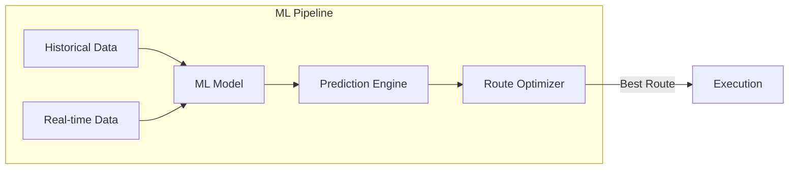

**Key Features:**
- Machine learning models trained on historical trade data
- Real-time slippage prediction
- Dynamic route optimization based on gas prices and liquidity
- Multi-hop path finding with up to 5 intermediate tokens

### 2. Intent-Based Trading System

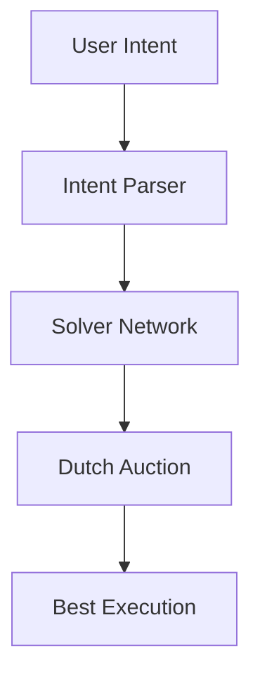

**Benefits:**
- Users specify desired outcome, not execution path
- Competitive solver marketplace
- MEV protection through private mempool
- Better prices through solver competition

### 3. Cross-Chain Liquidity Aggregation

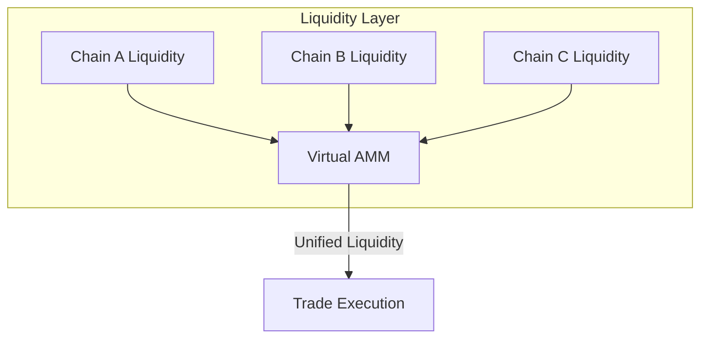

**Innovation:**
- Virtual liquidity pools across chains
- Atomic cross-chain swaps
- Unified order book
- Capital efficiency optimization

### 4. Zero-Knowledge Proof Integration

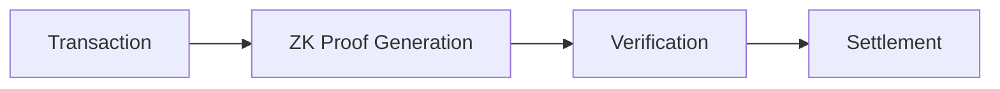

**Applications:**
- Private transactions
- Compliance proofs without revealing data
- Batch transaction proofs for gas optimization
- Front-running protection

### 5. Decentralized Solver Network

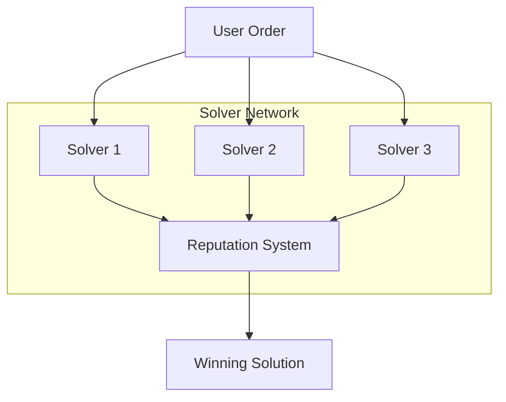

## Infrastructure Requirements

### Technical Stack

**Backend:**
- Language: Rust (core services), Go (API layer), Python (ML/Analytics)
- Framework: Actix-web (Rust), Gin (Go), FastAPI (Python)
- Message Queue: Apache Kafka
- Cache: Redis Cluster
- Database: PostgreSQL (primary), TimescaleDB (time-series), MongoDB (flexible data)

**Blockchain:**
- Web3 Libraries: ethers.rs, web3.py, anchor (Solana)
- Smart Contracts: Solidity, Move, Rust (Solana)
- Indexing: The Graph Protocol, Custom indexers

**Infrastructure:**
- Kubernetes for container orchestration
- AWS/GCP for cloud infrastructure
- CloudFlare for CDN and DDoS protection
- Prometheus + Grafana for monitoring

### Performance Targets

- **Latency**: < 100ms for quote generation
- **Throughput**: 10,000+ requests per second
- **Availability**: 99.99% uptime
- **Chain Support**: 40+ chains with < 1 week integration time
- **Order Execution**: < 2 seconds confirmation

## Security Architecture

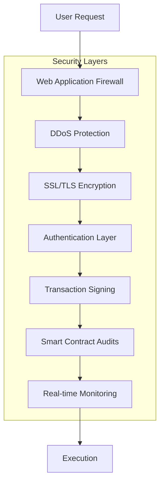

### Security Measures

1. **Smart Contract Security**
   - Multi-signature wallets
   - Time-locks for critical operations
   - Regular audits by top firms
   - Bug bounty program

2. **API Security**
   - Rate limiting per IP/wallet
   - API key authentication
   - Request signing
   - Encrypted communication

3. **Infrastructure Security**
   - Multi-region deployment
   - Automated failover
   - Regular security audits
   - Incident response team

## Scalability Strategy

### Horizontal Scaling

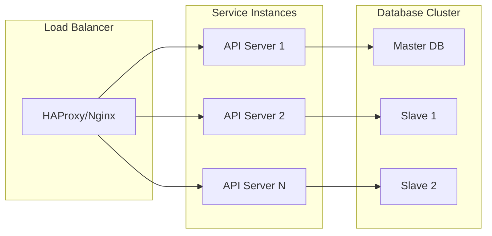

### Caching Strategy

- **L1 Cache**: In-memory cache for hot data (Redis)
- **L2 Cache**: Distributed cache for shared data (Redis Cluster)
- **L3 Cache**: CDN for static content (CloudFlare)
- **Smart Caching**: ML-based cache invalidation

## Monitoring and Observability

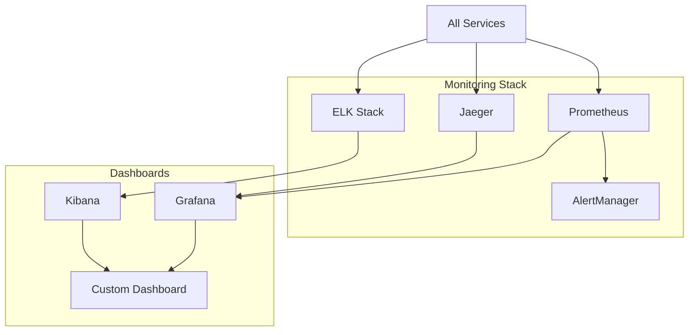

### Key Metrics

- **Business Metrics**: TVL, Volume, Active Users, Fee Revenue
- **Technical Metrics**: Latency, Error Rate, TPS, Gas Usage
- **Security Metrics**: Failed Auth Attempts, Anomaly Detection
- **Chain Metrics**: Block Confirmation Time, Gas Prices

## Roadmap

### Phase 1: Foundation (Months 1-3)
- Core swap functionality
- Support for 10 major EVM chains
- Basic routing algorithm
- Web interface

### Phase 2: Advanced Features (Months 4-6)
- Limit orders
- DCA implementation
- Cross-chain bridge
- Mobile apps

### Phase 3: Innovation (Months 7-9)
- AI-powered routing
- Intent-based trading
- Solver network beta
- ZK proof integration

### Phase 4: Scale (Months 10-12)
- 40+ chain support
- Institutional features
- Advanced analytics
- Governance launch

## Conclusion

This architecture provides a robust, scalable, and innovative foundation for a next-generation DEX platform. Key differentiators include:

1. **AI-Powered Optimization**: Superior execution through machine learning
2. **Multi-Chain Native**: Seamless cross-chain operations
3. **Intent-Based Trading**: User-friendly, MEV-protected trades
4. **Decentralized Innovation**: Solver network for continuous improvement
5. **Enterprise-Grade Infrastructure**: Built for institutional adoption

The modular design ensures easy maintenance, rapid feature development, and seamless scaling as the platform grows.