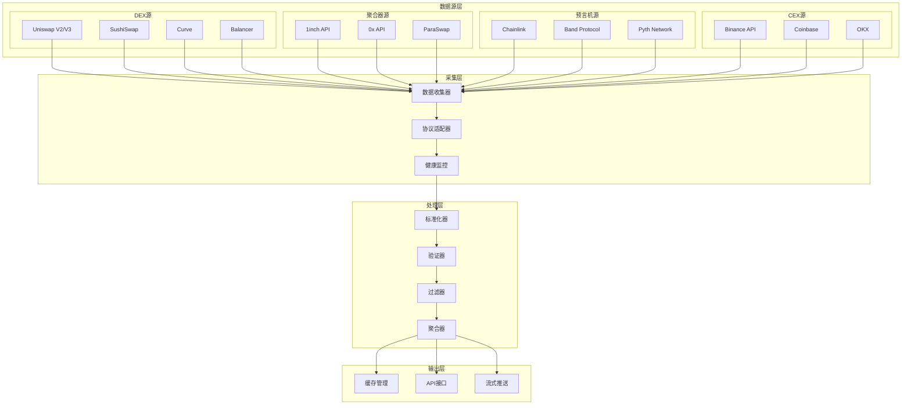
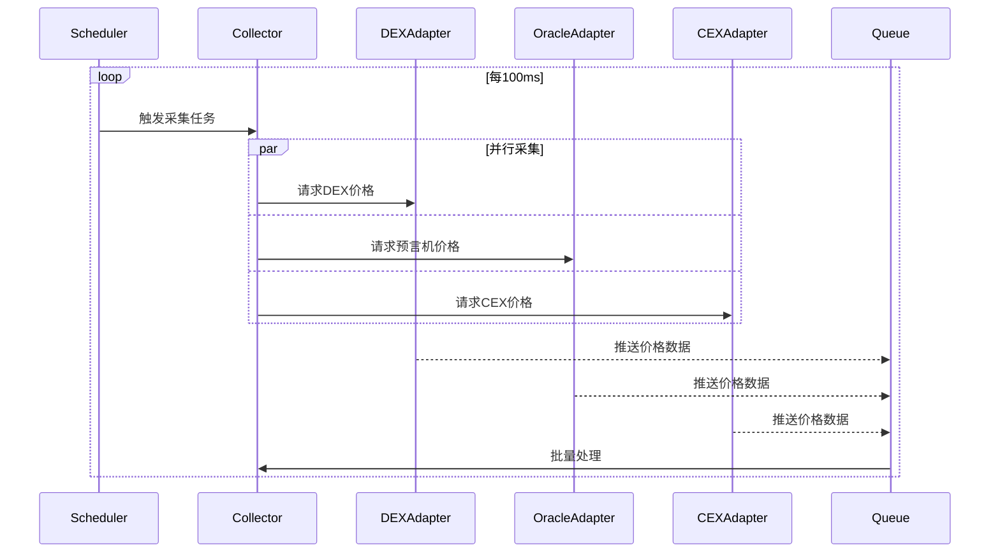
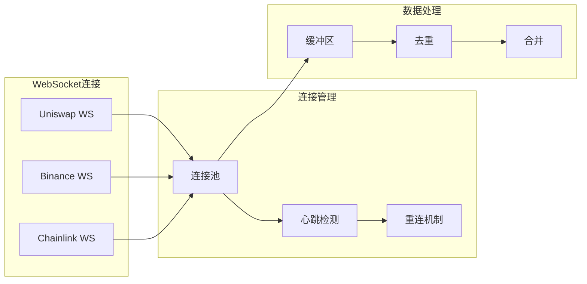
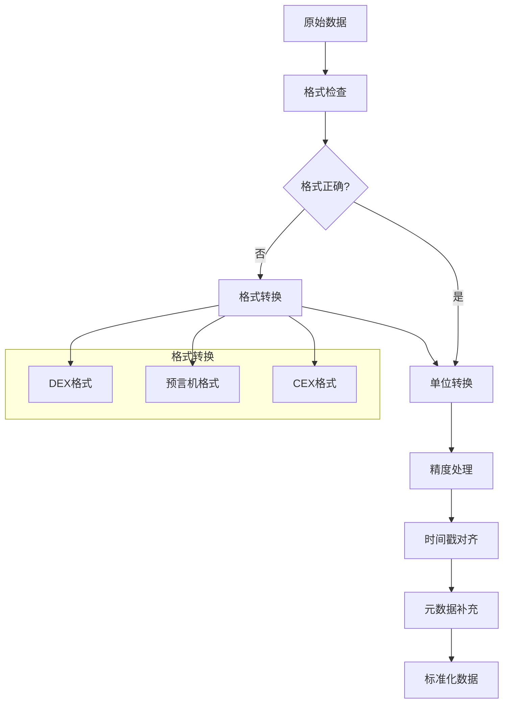
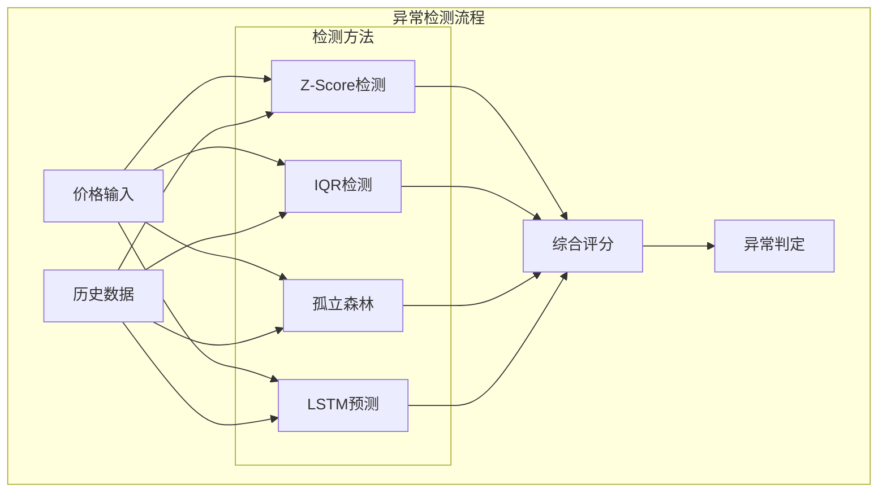
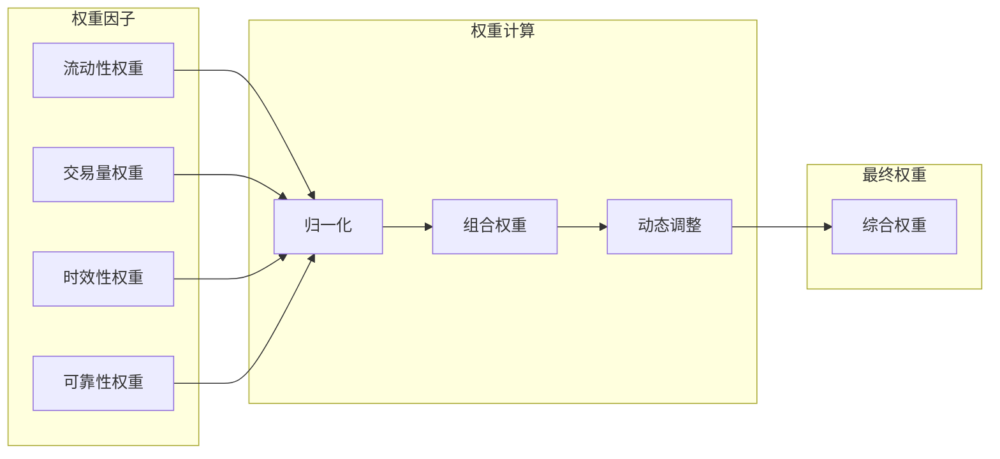
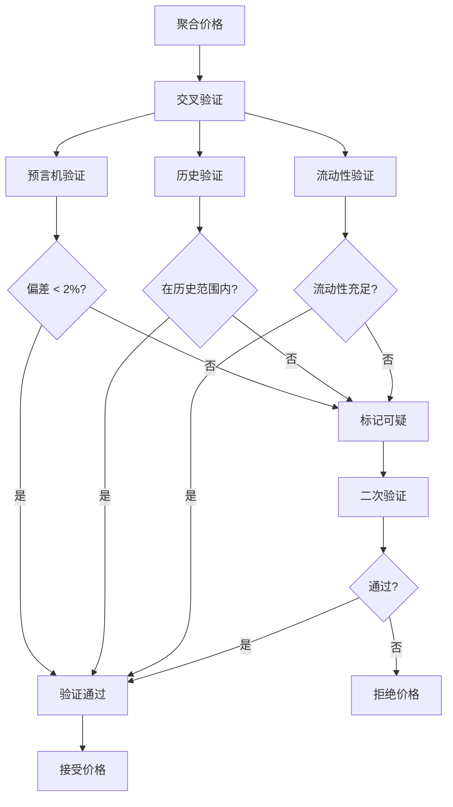
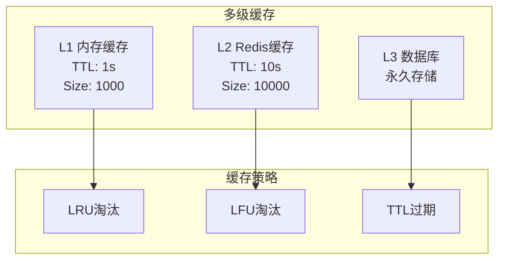

# 价格聚合器(Price Aggregator)详细设计

## 概述

价格聚合器是报价服务的核心组件，负责从多个流动性源实时收集、标准化、验证和聚合价格数据，为交易提供最准确的价格信息。

## 核心职责

1. **数据采集** - 从多个DEX、CEX、预言机收集价格
2. **数据标准化** - 统一不同源的数据格式
3. **异常检测** - 识别和处理异常价格
4. **加权聚合** - 基于流动性和可信度的加权计算
5. **价格验证** - 交叉验证确保价格准确性
6. **实时更新** - WebSocket推送和轮询结合
7. **历史追踪** - 价格历史数据存储和分析

## 详细架构设计

### 系统架构



### 核心类设计

```typescript
// 价格聚合器主类
class PriceAggregator {
    private sources: Map<string, PriceSource>;
    private adapters: Map<string, ProtocolAdapter>;
    private cache: PriceCache;
    private validator: PriceValidator;
    private aggregationEngine: AggregationEngine;

    // 价格数据结构
    interface PriceData {
        source: string;
        token: string;
        price: BigNumber;
        volume24h: BigNumber;
        liquidity: BigNumber;
        timestamp: number;
        confidence: number;
        metadata: PriceMetadata;
    }

    // 聚合结果
    interface AggregatedPrice {
        price: BigNumber;
        sources: PriceData[];
        confidence: number;
        deviation: number;
        timestamp: number;
        ttl: number;
    }
}

// 数据源管理
class SourceManager {
    private activeSources: Set<string>;
    private sourceHealth: Map<string, HealthStatus>;
    private priorityQueue: PriorityQueue<PriceSource>;

    // 健康状态
    interface HealthStatus {
        isHealthy: boolean;
        lastUpdate: number;
        errorCount: number;
        avgLatency: number;
        availability: number;
    }
}

// 协议适配器
abstract class ProtocolAdapter {
    abstract fetchPrice(token: string): Promise<PriceData>;
    abstract subscribeToUpdates(callback: PriceUpdateCallback): void;
    abstract getProtocolName(): string;
    abstract validateData(data: any): boolean;
}
```

## 数据采集机制

### 1. 多源数据采集架构



### 2. WebSocket实时订阅



### 3. 数据采集优化策略

```typescript
class OptimizedCollector {
    // 批量采集优化
    async batchFetch(tokens: string[]): Promise<Map<string, PriceData[]>> {
        // 分组优化
        const grouped = this.groupTokensBySource(tokens);

        // 并发控制
        const concurrencyLimit = 10;
        const results = await pLimit(concurrencyLimit, grouped, async (group) => {
            return this.fetchGroup(group);
        });

        return this.mergeResults(results);
    }

    // 智能缓存策略
    async fetchWithCache(token: string): Promise<PriceData> {
        // L1缓存 - 内存
        const l1 = this.l1Cache.get(token);
        if (l1 && !this.isStale(l1, 1000)) return l1;

        // L2缓存 - Redis
        const l2 = await this.l2Cache.get(token);
        if (l2 && !this.isStale(l2, 10000)) return l2;

        // 实时获取
        const fresh = await this.fetchFresh(token);

        // 更新缓存
        this.updateCaches(token, fresh);

        return fresh;
    }

    // 预取策略
    async prefetchPopular(): Promise<void> {
        const popularTokens = await this.getPopularTokens();

        // 预取热门交易对
        for (const token of popularTokens) {
            this.prefetchQueue.add(async () => {
                const price = await this.fetchWithCache(token);
                this.warmCache.set(token, price);
            });
        }
    }
}
```

## 数据标准化

### 标准化流程



### 标准化实现

```typescript
class DataNormalizer {
    // 统一价格格式
    normalizePriceData(raw: any, source: string): NormalizedPrice {
        const adapter = this.getAdapter(source);

        // 1. 提取基础数据
        const base = adapter.extractBaseData(raw);

        // 2. 转换为标准单位（18位精度）
        const price = this.convertToStandardUnit(base.price, base.decimals);

        // 3. 时间戳标准化（统一为毫秒）
        const timestamp = this.normalizeTimestamp(base.timestamp);

        // 4. 计算额外指标
        const metrics = this.calculateMetrics(base);

        return {
            token: base.token,
            price: price,
            volume24h: this.normalizeVolume(base.volume),
            liquidity: this.normalizeLiquidity(base.liquidity),
            timestamp: timestamp,
            source: source,
            confidence: this.calculateConfidence(base),
            ...metrics
        };
    }

    // 精度处理
    convertToStandardUnit(value: string, decimals: number): BigNumber {
        // 统一转换为18位精度
        const factor = BigNumber.from(10).pow(18 - decimals);
        return BigNumber.from(value).mul(factor);
    }

    // 处理不同的时间格式
    normalizeTimestamp(timestamp: any): number {
        if (typeof timestamp === 'number') {
            // Unix时间戳（秒）
            if (timestamp < 10000000000) {
                return timestamp * 1000;
            }
            // Unix时间戳（毫秒）
            return timestamp;
        } else if (typeof timestamp === 'string') {
            // ISO 8601格式
            return new Date(timestamp).getTime();
        }

        throw new Error('Unsupported timestamp format');
    }
}
```

## 异常检测算法

### 1. 统计异常检测



### 2. 异常检测实现

```typescript
class AnomalyDetector {
    // Z-Score异常检测
    detectWithZScore(price: BigNumber, history: BigNumber[]): boolean {
        const mean = this.calculateMean(history);
        const stdDev = this.calculateStdDev(history, mean);

        const zScore = price.sub(mean).abs().div(stdDev);

        // 通常Z-Score > 3被认为是异常
        return zScore.gt(BigNumber.from(3));
    }

    // IQR（四分位距）检测
    detectWithIQR(price: BigNumber, history: BigNumber[]): boolean {
        const sorted = [...history].sort((a, b) => a.compare(b));
        const q1 = sorted[Math.floor(sorted.length * 0.25)];
        const q3 = sorted[Math.floor(sorted.length * 0.75)];
        const iqr = q3.sub(q1);

        const lowerBound = q1.sub(iqr.mul(15).div(10)); // Q1 - 1.5*IQR
        const upperBound = q3.add(iqr.mul(15).div(10)); // Q3 + 1.5*IQR

        return price.lt(lowerBound) || price.gt(upperBound);
    }

    // 基于机器学习的异常检测
    async detectWithML(price: BigNumber, features: Features): Promise<boolean> {
        // 准备特征向量
        const vector = this.prepareFeatureVector(price, features);

        // 使用预训练的孤立森林模型
        const anomalyScore = await this.isolationForest.predict(vector);

        // 分数大于阈值则为异常
        return anomalyScore > this.threshold;
    }

    // 综合异常检测
    async comprehensiveDetection(price: PriceData): Promise<AnomalyResult> {
        const history = await this.getHistory(price.token);

        const results = await Promise.all([
            this.detectWithZScore(price.price, history),
            this.detectWithIQR(price.price, history),
            this.detectWithML(price.price, this.extractFeatures(price))
        ]);

        // 投票机制
        const anomalyCount = results.filter(r => r).length;
        const isAnomaly = anomalyCount >= 2;

        return {
            isAnomaly,
            confidence: anomalyCount / results.length,
            method: this.getDetectionMethod(results),
            suggestion: this.getSuggestion(price, isAnomaly)
        };
    }
}
```

## 加权聚合算法

### 1. 权重计算模型



### 2. 聚合算法实现

```typescript
class AggregationEngine {
    // 权重计算
    calculateWeight(source: PriceData): Weight {
        // 流动性权重（对数缩放）
        const liquidityWeight = Math.log10(
            source.liquidity.div(1e6).toNumber() + 1
        ) / 10;

        // 交易量权重（24小时交易量）
        const volumeWeight = Math.log10(
            source.volume24h.div(1e6).toNumber() + 1
        ) / 10;

        // 时效性权重（指数衰减）
        const age = Date.now() - source.timestamp;
        const recencyWeight = Math.exp(-age / (5 * 60 * 1000)); // 5分钟半衰期

        // 可靠性权重（基于历史准确度）
        const reliabilityWeight = this.getSourceReliability(source.source);

        // 组合权重
        const totalWeight =
            liquidityWeight * 0.35 +
            volumeWeight * 0.25 +
            recencyWeight * 0.2 +
            reliabilityWeight * 0.2;

        return {
            total: totalWeight,
            factors: {
                liquidity: liquidityWeight,
                volume: volumeWeight,
                recency: recencyWeight,
                reliability: reliabilityWeight
            }
        };
    }

    // 加权平均聚合
    aggregateWithWeightedAverage(prices: PriceData[]): AggregatedPrice {
        // 过滤异常值
        const filtered = this.filterOutliers(prices);

        // 计算权重
        const weights = filtered.map(p => this.calculateWeight(p));
        const totalWeight = weights.reduce((sum, w) => sum + w.total, 0);

        // 加权平均
        let weightedSum = BigNumber.from(0);
        for (let i = 0; i < filtered.length; i++) {
            const weightedPrice = filtered[i].price
                .mul(Math.floor(weights[i].total * 1000000))
                .div(Math.floor(totalWeight * 1000000));
            weightedSum = weightedSum.add(weightedPrice);
        }

        // 计算置信度
        const confidence = this.calculateConfidence(filtered, weights);

        // 计算偏差
        const deviation = this.calculateDeviation(filtered, weightedSum);

        return {
            price: weightedSum,
            sources: filtered,
            confidence,
            deviation,
            timestamp: Date.now(),
            ttl: this.calculateTTL(confidence)
        };
    }

    // 中位数聚合（抗异常值）
    aggregateWithMedian(prices: PriceData[]): AggregatedPrice {
        const sorted = [...prices].sort((a, b) =>
            a.price.compare(b.price)
        );

        const mid = Math.floor(sorted.length / 2);
        const median = sorted.length % 2 === 0
            ? sorted[mid - 1].price.add(sorted[mid].price).div(2)
            : sorted[mid].price;

        return {
            price: median,
            sources: prices,
            confidence: this.calculateMedianConfidence(sorted),
            deviation: this.calculateMAD(sorted, median), // 中位数绝对偏差
            timestamp: Date.now(),
            ttl: 5000
        };
    }

    // VWAP聚合（成交量加权）
    aggregateWithVWAP(prices: PriceData[]): AggregatedPrice {
        let volumeSum = BigNumber.from(0);
        let vwapSum = BigNumber.from(0);

        for (const price of prices) {
            volumeSum = volumeSum.add(price.volume24h);
            vwapSum = vwapSum.add(
                price.price.mul(price.volume24h)
            );
        }

        const vwap = vwapSum.div(volumeSum);

        return {
            price: vwap,
            sources: prices,
            confidence: this.calculateVWAPConfidence(prices),
            deviation: this.calculateVWAPDeviation(prices, vwap),
            timestamp: Date.now(),
            ttl: 10000
        };
    }

    // 智能聚合选择
    smartAggregate(prices: PriceData[]): AggregatedPrice {
        // 根据数据特征选择最合适的聚合方法
        const characteristics = this.analyzeData(prices);

        if (characteristics.hasOutliers) {
            // 有异常值时使用中位数
            return this.aggregateWithMedian(prices);
        } else if (characteristics.highVolumeVariance) {
            // 交易量差异大时使用VWAP
            return this.aggregateWithVWAP(prices);
        } else {
            // 默认使用加权平均
            return this.aggregateWithWeightedAverage(prices);
        }
    }
}
```

## 价格验证机制

### 验证流程



### 验证实现

```typescript
class PriceValidator {
    // 综合验证
    async validate(aggregated: AggregatedPrice): Promise<ValidationResult> {
        const validations = await Promise.all([
            this.validateWithOracle(aggregated),
            this.validateWithHistory(aggregated),
            this.validateLiquidity(aggregated),
            this.validateDeviation(aggregated)
        ]);

        const passed = validations.filter(v => v.passed).length;
        const confidence = passed / validations.length;

        return {
            isValid: confidence >= 0.75,
            confidence,
            validations,
            suggestion: this.getSuggestion(validations)
        };
    }

    // 预言机验证
    async validateWithOracle(price: AggregatedPrice): Promise<Validation> {
        const oraclePrice = await this.getOraclePrice(price.token);
        const deviation = this.calculateDeviation(price.price, oraclePrice);

        return {
            type: 'oracle',
            passed: deviation < 0.02, // 2%容差
            deviation,
            message: `Oracle deviation: ${(deviation * 100).toFixed(2)}%`
        };
    }

    // 历史数据验证
    async validateWithHistory(price: AggregatedPrice): Promise<Validation> {
        const history = await this.getHistoricalPrices(price.token);
        const ma = this.calculateMovingAverage(history, 20);
        const deviation = this.calculateDeviation(price.price, ma);

        return {
            type: 'history',
            passed: deviation < 0.1, // 10%容差
            deviation,
            message: `Historical MA deviation: ${(deviation * 100).toFixed(2)}%`
        };
    }
}
```

## 性能优化

### 1. 并发优化

```typescript
class ConcurrentFetcher {
    private readonly concurrencyLimit = 10;
    private readonly queue = new PQueue({ concurrency: this.concurrencyLimit });

    async fetchAllPrices(tokens: string[]): Promise<Map<string, PriceData[]>> {
        // 批量分组
        const batches = this.createBatches(tokens, 50);

        // 并发执行
        const results = await Promise.all(
            batches.map(batch =>
                this.queue.add(() => this.fetchBatch(batch))
            )
        );

        return this.mergeResults(results);
    }
}
```

### 2. 缓存策略



## 监控指标

```yaml
性能指标:
  - 聚合延迟: < 50ms (P99)
  - 数据源可用性: > 99%
  - 缓存命中率: > 85%
  - 并发处理能力: > 1000 tokens/s

准确性指标:
  - 价格偏差: < 0.1%
  - 异常检测准确率: > 95%
  - 验证通过率: > 98%

可靠性指标:
  - 数据源故障恢复: < 10s
  - 数据完整性: 100%
  - 服务可用性: 99.99%
```

## 错误处理

```typescript
class ErrorHandler {
    async handleSourceFailure(source: string, error: Error): Promise<void> {
        // 1. 记录错误
        this.logger.error(`Source ${source} failed: ${error.message}`);

        // 2. 更新健康状态
        this.healthMonitor.markUnhealthy(source);

        // 3. 触发备用源
        await this.activateBackupSource(source);

        // 4. 通知监控
        await this.alerting.notify({
            level: 'warning',
            source,
            error: error.message
        });

        // 5. 自动恢复尝试
        this.scheduleRecovery(source);
    }
}
```

## 总结

价格聚合器通过多源采集、智能聚合、异常检测和验证机制，确保为用户提供准确、实时的价格数据。关键创新点包括：

1. **多源聚合** - 降低单点依赖风险
2. **智能权重** - 基于多因子的动态权重计算
3. **异常检测** - 多种算法结合的异常识别
4. **实时验证** - 交叉验证确保价格准确性
5. **高性能架构** - 并发处理和多级缓存优化