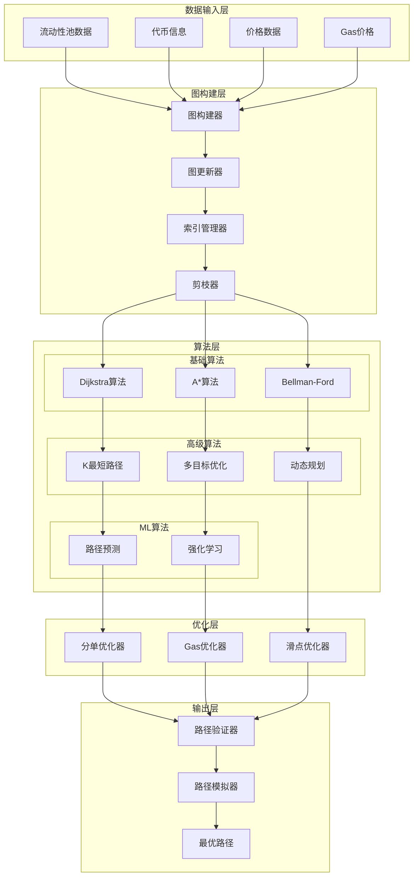
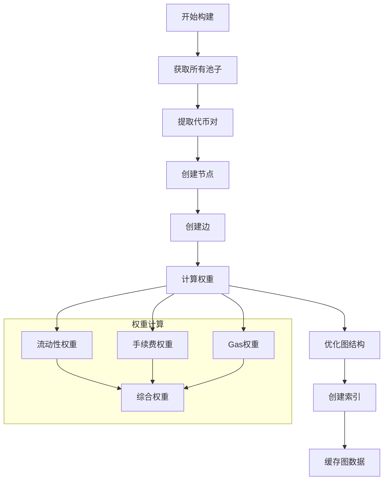
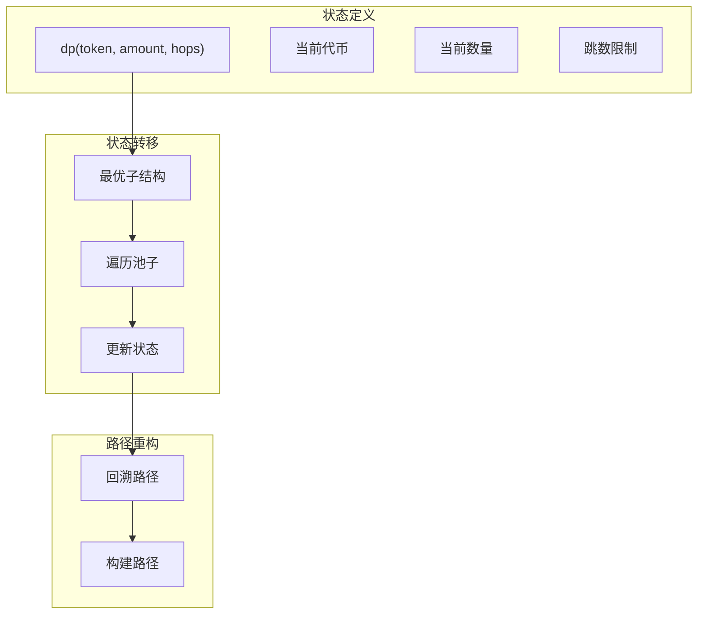
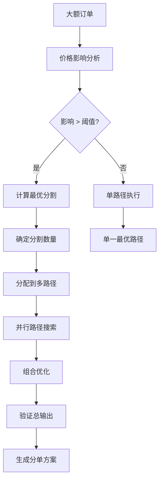
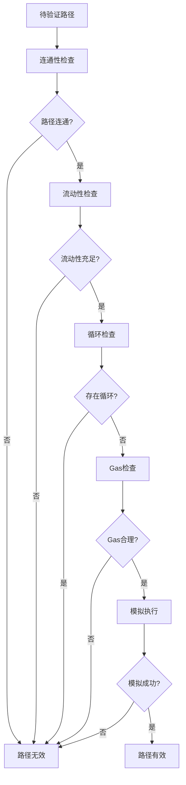
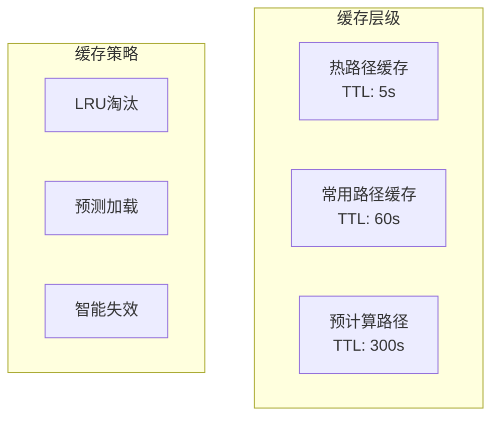

# 路径寻找器(Path Finder)详细设计

## 概述

路径寻找器是报价服务的核心算法组件，负责在复杂的流动性网络中寻找最优交易路径。它使用图算法、动态规划和机器学习技术，实现高效的多跳路径搜索和优化。

## 核心职责

1. **图构建** - 构建和维护流动性图
2. **路径搜索** - 多算法路径搜索
3. **路径优化** - 成本、滑点、Gas综合优化
4. **分单路由** - 大额订单最优分割
5. **动态更新** - 实时更新流动性图
6. **路径验证** - 确保路径可执行性
7. **回路检测** - 套利机会识别

## 详细架构设计

### 系统架构



### 核心数据结构

```typescript
// 流动性图
class LiquidityGraph {
    // 图的邻接表表示
    private adjacencyList: Map<string, Edge[]>;
    // 节点信息
    private nodes: Map<string, Node>;
    // 索引结构
    private indices: GraphIndices;

    interface Node {
        tokenAddress: string;
        symbol: string;
        decimals: number;
        price: BigNumber;
        totalLiquidity: BigNumber;
        metadata: TokenMetadata;
    }

    interface Edge {
        from: string;
        to: string;
        pool: PoolInfo;
        weight: Weight;
        reverse: boolean;
    }

    interface PoolInfo {
        address: string;
        protocol: Protocol;
        fee: number;
        reserves: [BigNumber, BigNumber];
        liquidity: BigNumber;
        type: PoolType; // UniV2, UniV3, Curve, Balancer等
    }

    interface Weight {
        cost: number;          // 交易成本
        liquidity: number;     // 流动性分数
        gas: number;          // Gas成本
        slippage: number;     // 预期滑点
        composite: number;    // 综合权重
    }
}

// 路径表示
class TradePath {
    nodes: string[];           // 代币序列
    edges: Edge[];            // 池子序列
    amounts: BigNumber[];     // 每步金额
    prices: BigNumber[];      // 每步价格
    totalCost: BigNumber;     // 总成本
    totalGas: BigNumber;      // 总Gas
    estimatedOutput: BigNumber; // 预期输出
    confidence: number;       // 置信度

    interface PathMetrics {
        priceImpact: number;
        executionPrice: BigNumber;
        minimumOutput: BigNumber;
        maximumSlippage: number;
    }
}
```

## 图构建算法

### 1. 动态图构建



### 2. 图构建实现

```typescript
class GraphBuilder {
    // 构建流动性图
    async buildGraph(): Promise<LiquidityGraph> {
        const graph = new LiquidityGraph();

        // 1. 获取所有池子
        const pools = await this.fetchAllPools();

        // 2. 构建节点
        for (const pool of pools) {
            await this.addPoolToGraph(graph, pool);
        }

        // 3. 优化图结构
        this.optimizeGraph(graph);

        // 4. 创建索引
        this.createIndices(graph);

        return graph;
    }

    // 添加池子到图
    private async addPoolToGraph(
        graph: LiquidityGraph,
        pool: Pool
    ): Promise<void> {
        const [token0, token1] = pool.tokens;

        // 添加节点
        if (!graph.hasNode(token0)) {
            graph.addNode(token0, await this.getTokenInfo(token0));
        }
        if (!graph.hasNode(token1)) {
            graph.addNode(token1, await this.getTokenInfo(token1));
        }

        // 计算边权重
        const weight = this.calculateEdgeWeight(pool);

        // 添加双向边
        graph.addEdge(token0, token1, {
            pool: pool,
            weight: weight,
            reverse: false
        });
        graph.addEdge(token1, token0, {
            pool: pool,
            weight: weight,
            reverse: true
        });
    }

    // 计算边权重
    private calculateEdgeWeight(pool: Pool): Weight {
        // 流动性分数 (对数缩放)
        const liquidityScore = Math.log10(
            pool.liquidity.div(1e18).toNumber() + 1
        );

        // 手续费成本
        const feeCost = pool.fee / 10000; // 转换为百分比

        // Gas成本估算
        const gasCost = this.estimatePoolGas(pool.type);

        // 滑点估算
        const slippageEstimate = this.estimateSlippage(pool);

        // 综合权重 (越小越好)
        const composite =
            feeCost * 0.3 +
            (1 / liquidityScore) * 0.3 +
            gasCost * 0.2 +
            slippageEstimate * 0.2;

        return {
            cost: feeCost,
            liquidity: liquidityScore,
            gas: gasCost,
            slippage: slippageEstimate,
            composite: composite
        };
    }

    // 图优化
    private optimizeGraph(graph: LiquidityGraph): void {
        // 1. 移除低流动性边
        this.pruneLowLiquidityEdges(graph);

        // 2. 合并平行边
        this.mergeParallelEdges(graph);

        // 3. 识别桥接代币
        this.identifyBridgeTokens(graph);

        // 4. 预计算常用路径
        this.precomputeCommonPaths(graph);
    }
}
```

## 路径搜索算法

### 1. Dijkstra算法实现

```typescript
class DijkstraPathFinder {
    findShortestPath(
        graph: LiquidityGraph,
        start: string,
        end: string
    ): TradePath | null {
        const distances = new Map<string, number>();
        const previous = new Map<string, string>();
        const visited = new Set<string>();
        const queue = new PriorityQueue<string>();

        // 初始化
        graph.getNodes().forEach(node => {
            distances.set(node, Infinity);
        });
        distances.set(start, 0);
        queue.enqueue(start, 0);

        while (!queue.isEmpty()) {
            const current = queue.dequeue();

            if (current === end) {
                return this.reconstructPath(previous, start, end, graph);
            }

            if (visited.has(current)) continue;
            visited.add(current);

            // 遍历邻居
            const edges = graph.getEdges(current);
            for (const edge of edges) {
                const neighbor = edge.to;
                const newDistance = distances.get(current)! + edge.weight.composite;

                if (newDistance < distances.get(neighbor)!) {
                    distances.set(neighbor, newDistance);
                    previous.set(neighbor, current);
                    queue.enqueue(neighbor, newDistance);
                }
            }
        }

        return null;
    }
}
```

### 2. A*算法优化

```typescript
class AStarPathFinder {
    findPath(
        graph: LiquidityGraph,
        start: string,
        end: string
    ): TradePath | null {
        const openSet = new PriorityQueue<string>();
        const cameFrom = new Map<string, string>();
        const gScore = new Map<string, number>();
        const fScore = new Map<string, number>();

        // 初始化
        gScore.set(start, 0);
        fScore.set(start, this.heuristic(start, end, graph));
        openSet.enqueue(start, fScore.get(start)!);

        while (!openSet.isEmpty()) {
            const current = openSet.dequeue();

            if (current === end) {
                return this.reconstructPath(cameFrom, start, end, graph);
            }

            const edges = graph.getEdges(current);
            for (const edge of edges) {
                const neighbor = edge.to;
                const tentativeGScore = gScore.get(current)! + edge.weight.composite;

                if (!gScore.has(neighbor) || tentativeGScore < gScore.get(neighbor)!) {
                    cameFrom.set(neighbor, current);
                    gScore.set(neighbor, tentativeGScore);
                    fScore.set(neighbor, tentativeGScore + this.heuristic(neighbor, end, graph));

                    if (!openSet.contains(neighbor)) {
                        openSet.enqueue(neighbor, fScore.get(neighbor)!);
                    }
                }
            }
        }

        return null;
    }

    // 启发式函数
    private heuristic(from: string, to: string, graph: LiquidityGraph): number {
        // 使用价格差异作为启发式
        const fromPrice = graph.getNode(from).price;
        const toPrice = graph.getNode(to).price;

        // 估算最小交换次数
        const estimatedHops = this.estimateMinHops(from, to, graph);

        return estimatedHops * 0.003; // 假设每跳0.3%费用
    }
}
```

### 3. K最短路径算法

```typescript
class KShortestPathsFinder {
    findKPaths(
        graph: LiquidityGraph,
        start: string,
        end: string,
        k: number
    ): TradePath[] {
        const paths: TradePath[] = [];
        const candidates = new PriorityQueue<PathCandidate>();

        // 找到最短路径
        const shortestPath = this.dijkstra.findShortestPath(graph, start, end);
        if (!shortestPath) return paths;

        paths.push(shortestPath);

        // Yen's K最短路径算法
        for (let i = 1; i < k; i++) {
            const lastPath = paths[paths.length - 1];

            for (let j = 0; j < lastPath.nodes.length - 1; j++) {
                const spurNode = lastPath.nodes[j];
                const rootPath = lastPath.nodes.slice(0, j + 1);

                // 临时移除已使用的边
                const removedEdges = this.removeUsedEdges(graph, paths, rootPath);

                // 计算spur路径
                const spurPath = this.dijkstra.findShortestPath(
                    graph,
                    spurNode,
                    end
                );

                if (spurPath) {
                    const totalPath = this.combinePaths(rootPath, spurPath);
                    candidates.enqueue(totalPath, totalPath.totalCost);
                }

                // 恢复边
                this.restoreEdges(graph, removedEdges);
            }

            if (candidates.isEmpty()) break;

            // 选择最佳候选
            const nextPath = candidates.dequeue();
            if (!this.isDuplicate(paths, nextPath)) {
                paths.push(nextPath);
            }
        }

        return paths;
    }
}
```

## 多跳路径优化

### 1. 动态规划优化



### 2. 动态规划实现

```typescript
class DynamicProgrammingOptimizer {
    optimize(
        graph: LiquidityGraph,
        start: string,
        end: string,
        amount: BigNumber,
        maxHops: number
    ): TradePath {
        // dp[token][hop] = { maxAmount, prevToken, pool }
        const dp = new Map<string, Map<number, DPState>>();

        // 初始化
        this.initializeDP(dp, start, amount);

        // 动态规划
        for (let hop = 1; hop <= maxHops; hop++) {
            for (const token of graph.getNodes()) {
                if (!dp.has(token)) continue;

                const edges = graph.getEdges(token);
                for (const edge of edges) {
                    const nextToken = edge.to;
                    const output = this.calculateOutput(
                        dp.get(token)!.get(hop - 1)!.amount,
                        edge
                    );

                    this.updateDP(dp, nextToken, hop, output, token, edge);
                }
            }
        }

        // 重构最优路径
        return this.reconstructOptimalPath(dp, start, end, maxHops);
    }

    // 计算输出
    private calculateOutput(input: BigNumber, edge: Edge): BigNumber {
        const pool = edge.pool;

        // 根据池子类型计算
        switch (pool.type) {
            case PoolType.UniswapV2:
                return this.calculateUniV2Output(input, pool);
            case PoolType.UniswapV3:
                return this.calculateUniV3Output(input, pool);
            case PoolType.Curve:
                return this.calculateCurveOutput(input, pool);
            default:
                return this.calculateDefaultOutput(input, pool);
        }
    }

    // UniswapV2输出计算
    private calculateUniV2Output(
        input: BigNumber,
        pool: Pool
    ): BigNumber {
        const inputWithFee = input.mul(997); // 0.3%手续费
        const numerator = inputWithFee.mul(pool.reserves[1]);
        const denominator = pool.reserves[0].mul(1000).add(inputWithFee);

        return numerator.div(denominator);
    }
}
```

## 智能分单路由

### 1. 分单策略



### 2. 分单算法实现

```typescript
class SmartSplitter {
    // 智能分单
    async splitOrder(
        amount: BigNumber,
        tokenIn: string,
        tokenOut: string,
        graph: LiquidityGraph
    ): Promise<SplitStrategy> {
        // 1. 分析价格影响
        const impact = await this.analyzePriceImpact(amount, tokenIn, tokenOut);

        if (impact < 0.01) { // 影响小于1%，不分单
            return this.singlePathStrategy(amount, tokenIn, tokenOut);
        }

        // 2. 确定最优分割数
        const splitCount = this.calculateOptimalSplits(amount, impact);

        // 3. 找K条最优路径
        const paths = this.kPathFinder.findKPaths(
            graph,
            tokenIn,
            tokenOut,
            splitCount
        );

        // 4. 优化分配
        return this.optimizeAllocation(amount, paths);
    }

    // 优化分配算法
    private optimizeAllocation(
        totalAmount: BigNumber,
        paths: TradePath[]
    ): SplitStrategy {
        // 使用凸优化求解最优分配
        const optimizer = new ConvexOptimizer();

        // 定义目标函数：最大化总输出
        const objective = (allocations: number[]) => {
            let totalOutput = BigNumber.from(0);

            for (let i = 0; i < paths.length; i++) {
                const output = this.calculatePathOutput(
                    BigNumber.from(allocations[i]),
                    paths[i]
                );
                totalOutput = totalOutput.add(output);
            }

            return totalOutput;
        };

        // 约束条件
        const constraints = [
            // 总和等于总金额
            (allocations: number[]) =>
                allocations.reduce((a, b) => a + b, 0) === totalAmount.toNumber(),
            // 每个分配非负
            ...paths.map((_, i) =>
                (allocations: number[]) => allocations[i] >= 0
            )
        ];

        // 求解
        const optimalAllocations = optimizer.solve(objective, constraints);

        return {
            splits: paths.map((path, i) => ({
                path: path,
                amount: BigNumber.from(optimalAllocations[i]),
                expectedOutput: this.calculatePathOutput(
                    BigNumber.from(optimalAllocations[i]),
                    path
                )
            })),
            totalExpectedOutput: this.calculateTotalOutput(optimalAllocations, paths),
            priceImpact: this.calculateTotalImpact(optimalAllocations, paths)
        };
    }

    // 计算路径输出（考虑滑点）
    private calculatePathOutput(
        amount: BigNumber,
        path: TradePath
    ): BigNumber {
        let currentAmount = amount;

        for (const edge of path.edges) {
            const pool = edge.pool;
            const slippage = this.calculateSlippage(currentAmount, pool);
            const output = this.calculateOutput(currentAmount, pool);

            // 应用滑点
            currentAmount = output.mul(10000 - slippage).div(10000);
        }

        return currentAmount;
    }
}
```

## 路径验证

### 验证流程



### 验证实现

```typescript
class PathValidator {
    // 综合验证
    async validatePath(path: TradePath): Promise<ValidationResult> {
        const checks = [
            this.checkConnectivity(path),
            this.checkLiquidity(path),
            this.checkCycles(path),
            this.checkGasCost(path),
            this.simulatePath(path)
        ];

        const results = await Promise.all(checks);
        const allPassed = results.every(r => r.passed);

        return {
            isValid: allPassed,
            checks: results,
            suggestions: this.generateSuggestions(results)
        };
    }

    // 流动性检查
    private async checkLiquidity(path: TradePath): Promise<CheckResult> {
        for (const edge of path.edges) {
            const pool = edge.pool;
            const requiredLiquidity = edge.amount.mul(2); // 2x安全边际

            if (pool.liquidity.lt(requiredLiquidity)) {
                return {
                    passed: false,
                    message: `Insufficient liquidity in pool ${pool.address}`
                };
            }
        }

        return { passed: true, message: 'Liquidity check passed' };
    }

    // 模拟执行
    private async simulatePath(path: TradePath): Promise<CheckResult> {
        try {
            const simulation = await this.simulator.simulate(path);

            if (simulation.reverted) {
                return {
                    passed: false,
                    message: `Simulation reverted: ${simulation.reason}`
                };
            }

            const slippage = this.calculateActualSlippage(
                path.estimatedOutput,
                simulation.output
            );

            if (slippage > 0.05) { // 5%容差
                return {
                    passed: false,
                    message: `Excessive slippage: ${(slippage * 100).toFixed(2)}%`
                };
            }

            return { passed: true, message: 'Simulation successful' };
        } catch (error) {
            return {
                passed: false,
                message: `Simulation failed: ${error.message}`
            };
        }
    }
}
```

## 性能优化

### 1. 图索引优化

```typescript
class GraphIndexer {
    // 多级索引
    private tokenIndex: Map<string, Set<Edge>>;
    private pairIndex: Map<string, Edge[]>;
    private protocolIndex: Map<Protocol, Edge[]>;
    private liquidityIndex: BTree<BigNumber, Edge>;

    // 创建索引
    buildIndices(graph: LiquidityGraph): void {
        // 代币索引
        this.buildTokenIndex(graph);

        // 交易对索引
        this.buildPairIndex(graph);

        // 协议索引
        this.buildProtocolIndex(graph);

        // 流动性B树索引
        this.buildLiquidityIndex(graph);
    }

    // 快速查询
    queryByLiquidity(minLiquidity: BigNumber): Edge[] {
        return this.liquidityIndex.rangeQuery(minLiquidity, Infinity);
    }
}
```

### 2. 并行搜索

```typescript
class ParallelPathFinder {
    async findPathsParallel(
        requests: PathRequest[]
    ): Promise<TradePath[]> {
        const workers = this.createWorkerPool(4);

        const chunks = this.chunkRequests(requests, workers.length);
        const promises = chunks.map((chunk, i) =>
            workers[i].processChunk(chunk)
        );

        const results = await Promise.all(promises);
        return results.flat();
    }
}
```

### 3. 缓存策略



## 监控指标

```yaml
性能指标:
  - 路径搜索延迟: < 10ms (P99)
  - K路径搜索: < 50ms (K=5)
  - 图更新延迟: < 100ms
  - 缓存命中率: > 80%

准确性指标:
  - 最优路径率: > 95%
  - 价格偏差: < 0.05%
  - 滑点预测准确度: > 90%

可靠性指标:
  - 路径可执行率: > 99%
  - 验证通过率: > 98%
  - 图数据完整性: 100%
```

## 总结

路径寻找器通过先进的图算法、动态规划和机器学习技术，实现了高效的多跳路径搜索。关键创新包括：

1. **多算法融合** - 不同场景使用最适合的算法
2. **智能分单** - 大额订单自动优化分割
3. **动态图维护** - 实时更新流动性信息
4. **并行优化** - 多路径并行搜索
5. **智能缓存** - 预测性缓存热门路径