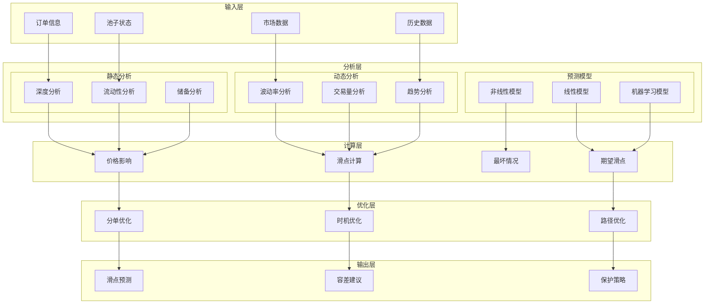
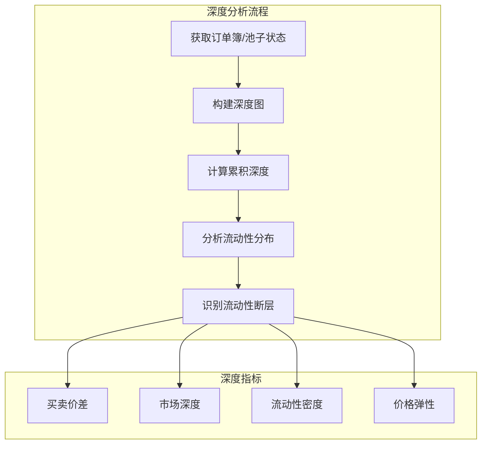
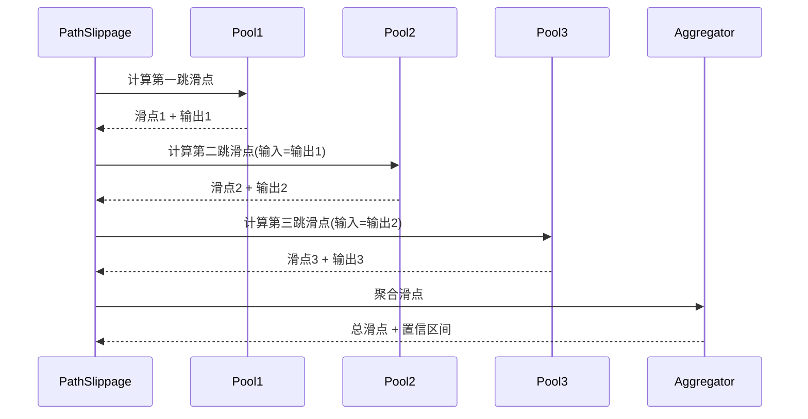

# 滑点计算器(Slippage Calculator)详细设计

## 概述

滑点计算器是报价服务的关键风控组件，负责准确预测和计算交易执行时的价格滑动。它通过分析流动性深度、订单大小、市场波动等因素，为用户提供精准的滑点预估和保护机制。

## 核心职责

1. **滑点预测** - 基于多因子模型预测滑点
2. **价格影响计算** - 计算订单对市场价格的影响
3. **深度分析** - 分析流动性池深度
4. **动态调整** - 根据市场条件动态调整滑点容差
5. **极端保护** - 识别和防范极端滑点情况
6. **历史分析** - 基于历史数据优化预测模型
7. **跨池聚合** - 多池路径的综合滑点计算

## 详细架构设计

### 系统架构



### 核心数据结构

```typescript
// 滑点计算器主类
class SlippageCalculator {
    private depthAnalyzer: DepthAnalyzer;
    private impactCalculator: PriceImpactCalculator;
    private volatilityAnalyzer: VolatilityAnalyzer;
    private mlPredictor: MLSlippagePredictor;

    // 滑点数据结构
    interface SlippageData {
        expectedSlippage: number;      // 期望滑点
        worstCaseSlippage: number;     // 最坏情况滑点
        priceImpact: number;           // 价格影响
        executionPrice: BigNumber;     // 执行价格
        confidence: number;            // 置信度
        breakdown: SlippageBreakdown;  // 详细分解
    }

    // 滑点分解
    interface SlippageBreakdown {
        depthSlippage: number;         // 深度导致的滑点
        volatilitySlippage: number;    // 波动导致的滑点
        liquiditySlippage: number;     // 流动性不足导致的滑点
        pathSlippage: number;          // 多跳路径累积滑点
    }

    // 池子深度数据
    interface PoolDepth {
        bids: PriceLevel[];           // 买单深度
        asks: PriceLevel[];           // 卖单深度
        midPrice: BigNumber;          // 中间价
        spread: BigNumber;            // 买卖价差
        liquidity: BigNumber;         // 总流动性
    }

    interface PriceLevel {
        price: BigNumber;
        amount: BigNumber;
        total: BigNumber;             // 累积数量
    }
}

// 价格影响模型
class PriceImpactModel {
    interface ImpactParams {
        tradeSize: BigNumber;         // 交易大小
        poolReserves: [BigNumber, BigNumber]; // 池子储备
        poolFee: number;              // 手续费率
        k: BigNumber;                 // 恒定乘积
    }

    interface ImpactResult {
        priceImpact: number;          // 价格影响百分比
        newPrice: BigNumber;          // 新价格
        effectivePrice: BigNumber;    // 有效执行价格
        impactCost: BigNumber;        // 影响成本
    }
}
```

## 滑点计算算法

### 1. AMM滑点计算

```mermaid
flowchart TD
    A[输入交易量] --> B[获取池子储备]
    B --> C[计算恒定乘积K]

    C --> D[计算输出数量]
    D --> E[计算执行价格]

    E --> F[计算价格影响]
    F --> G[应用手续费]

    G --> H[计算最终滑点]

    subgraph "公式"
        I[K = x * y]
        J[y_out = y - K/(x + x_in)]
        K[price_impact = (spot_price - exec_price) / spot_price]
    end
```

### 2. 核心计算实现

```typescript
class CoreSlippageCalculator {
    // UniswapV2类型池子滑点计算
    calculateUniV2Slippage(
        amountIn: BigNumber,
        reserveIn: BigNumber,
        reserveOut: BigNumber,
        fee: number = 30 // 0.3%
    ): SlippageResult {
        // 1. 计算现货价格
        const spotPrice = reserveOut.mul(PRECISION).div(reserveIn);

        // 2. 计算输出数量（含手续费）
        const amountInWithFee = amountIn.mul(10000 - fee);
        const numerator = amountInWithFee.mul(reserveOut);
        const denominator = reserveIn.mul(10000).add(amountInWithFee);
        const amountOut = numerator.div(denominator);

        // 3. 计算执行价格
        const executionPrice = amountOut.mul(PRECISION).div(amountIn);

        // 4. 计算价格影响
        const priceImpact = spotPrice.sub(executionPrice)
            .mul(10000)
            .div(spotPrice)
            .toNumber() / 10000;

        // 5. 计算滑点（价格影响 + 手续费）
        const slippage = priceImpact + (fee / 10000);

        return {
            slippage: slippage,
            priceImpact: priceImpact,
            executionPrice: executionPrice,
            amountOut: amountOut,
            spotPrice: spotPrice
        };
    }

    // UniswapV3类型池子滑点计算（考虑集中流动性）
    calculateUniV3Slippage(
        amountIn: BigNumber,
        currentTick: number,
        liquidity: BigNumber,
        fee: number
    ): SlippageResult {
        // 1. 获取当前价格
        const sqrtPriceX96 = this.getSqrtPriceFromTick(currentTick);
        const currentPrice = this.getPriceFromSqrtPrice(sqrtPriceX96);

        // 2. 模拟交易路径
        let remainingAmount = amountIn;
        let totalOutput = BigNumber.from(0);
        let currentTickLocal = currentTick;

        while (remainingAmount.gt(0)) {
            // 获取当前tick的流动性
            const tickLiquidity = this.getTickLiquidity(currentTickLocal);

            // 计算当前tick能处理的最大数量
            const maxAmount = this.calculateMaxAmountForTick(
                tickLiquidity,
                currentTickLocal
            );

            if (remainingAmount.lte(maxAmount)) {
                // 在当前tick内完成
                const output = this.calculateOutputInTick(
                    remainingAmount,
                    tickLiquidity,
                    currentTickLocal
                );
                totalOutput = totalOutput.add(output);
                remainingAmount = BigNumber.from(0);
            } else {
                // 需要跨tick
                const output = this.calculateOutputInTick(
                    maxAmount,
                    tickLiquidity,
                    currentTickLocal
                );
                totalOutput = totalOutput.add(output);
                remainingAmount = remainingAmount.sub(maxAmount);
                currentTickLocal = this.getNextTick(currentTickLocal);
            }
        }

        // 3. 计算执行价格和滑点
        const executionPrice = totalOutput.mul(PRECISION).div(amountIn);
        const priceImpact = currentPrice.sub(executionPrice)
            .mul(10000)
            .div(currentPrice)
            .toNumber() / 10000;

        const slippage = priceImpact + (fee / 1000000); // V3费率以百万分之一计

        return {
            slippage: slippage,
            priceImpact: priceImpact,
            executionPrice: executionPrice,
            amountOut: totalOutput,
            spotPrice: currentPrice
        };
    }

    // Curve稳定币池滑点计算
    calculateCurveSlippage(
        amountIn: BigNumber,
        reserves: BigNumber[],
        A: number, // 放大系数
        fee: number
    ): SlippageResult {
        const n = reserves.length;

        // 1. 计算D（不变量）
        const D = this.calculateCurveD(reserves, A);

        // 2. 计算输出
        const newReserves = [...reserves];
        newReserves[0] = newReserves[0].add(amountIn);

        // 使用牛顿法求解输出
        const outputIndex = 1; // 假设交换到第二个代币
        const amountOut = this.solveCurveOutput(
            newReserves,
            outputIndex,
            D,
            A
        );

        // 3. 计算滑点
        const idealOutput = amountIn.mul(reserves[outputIndex]).div(reserves[0]);
        const actualOutput = amountOut.mul(10000 - fee).div(10000);

        const slippage = idealOutput.sub(actualOutput)
            .mul(10000)
            .div(idealOutput)
            .toNumber() / 10000;

        return {
            slippage: slippage,
            priceImpact: slippage - (fee / 10000),
            executionPrice: actualOutput.mul(PRECISION).div(amountIn),
            amountOut: actualOutput,
            spotPrice: reserves[outputIndex].mul(PRECISION).div(reserves[0])
        };
    }
}
```

### 3. 深度分析算法



### 4. 深度分析实现

```typescript
class DepthAnalyzer {
    // 分析流动性深度
    analyzeDepth(pool: Pool, amount: BigNumber): DepthAnalysis {
        // 1. 构建深度图
        const depthMap = this.buildDepthMap(pool);

        // 2. 计算不同价格水平的流动性
        const liquidityLevels = this.calculateLiquidityLevels(depthMap);

        // 3. 识别流动性断层
        const gaps = this.identifyLiquidityGaps(liquidityLevels);

        // 4. 计算深度指标
        const metrics = {
            totalLiquidity: this.calculateTotalLiquidity(liquidityLevels),
            effectiveDepth: this.calculateEffectiveDepth(liquidityLevels, amount),
            liquidityDensity: this.calculateDensity(liquidityLevels),
            depthImbalance: this.calculateImbalance(depthMap)
        };

        // 5. 预测深度滑点
        const depthSlippage = this.predictDepthSlippage(
            amount,
            liquidityLevels,
            gaps
        );

        return {
            depthMap: depthMap,
            liquidityLevels: liquidityLevels,
            gaps: gaps,
            metrics: metrics,
            depthSlippage: depthSlippage
        };
    }

    // 构建深度图
    private buildDepthMap(pool: Pool): DepthMap {
        const priceRange = this.getPriceRange(pool);
        const depthMap = new Map<number, BigNumber>();

        // 对于AMM池，通过模拟计算深度
        for (let price = priceRange.min; price <= priceRange.max; price += priceRange.step) {
            const liquidity = this.getLiquidityAtPrice(pool, price);
            depthMap.set(price, liquidity);
        }

        return depthMap;
    }

    // 识别流动性断层
    private identifyLiquidityGaps(levels: LiquidityLevel[]): Gap[] {
        const gaps: Gap[] = [];
        const threshold = this.calculateAverageLiquidity(levels) * 0.3; // 30%阈值

        for (let i = 1; i < levels.length; i++) {
            if (levels[i].liquidity.lt(threshold)) {
                gaps.push({
                    startPrice: levels[i - 1].price,
                    endPrice: levels[i].price,
                    gapSize: levels[i - 1].liquidity.sub(levels[i].liquidity),
                    severity: this.calculateGapSeverity(levels[i - 1], levels[i])
                });
            }
        }

        return gaps;
    }
}
```

## 波动率影响分析

### 1. 波动率模型

```mermaid
graph LR
    subgraph "波动率计算"
        HIST[历史波动率]
        IMPLIED[隐含波动率]
        REALIZED[已实现波动率]
    end

    subgraph "GARCH模型"
        GARCH[GARCH(1,1)]
        EGARCH[EGARCH]
        TGARCH[T-GARCH]
    end

    subgraph "影响预测"
        SHORT[短期影响]
        MEDIUM[中期影响]
        STRESS[压力测试]
    end

    HIST --> GARCH
    IMPLIED --> EGARCH
    REALIZED --> TGARCH

    GARCH --> SHORT
    EGARCH --> MEDIUM
    TGARCH --> STRESS
```

### 2. 波动率计算实现

```typescript
class VolatilityAnalyzer {
    // 计算历史波动率
    calculateHistoricalVolatility(
        prices: BigNumber[],
        window: number = 20
    ): number {
        // 计算收益率
        const returns: number[] = [];
        for (let i = 1; i < prices.length; i++) {
            const return_ = prices[i].sub(prices[i - 1])
                .mul(10000)
                .div(prices[i - 1])
                .toNumber() / 10000;
            returns.push(return_);
        }

        // 计算标准差
        const mean = returns.reduce((a, b) => a + b, 0) / returns.length;
        const variance = returns.reduce((sum, r) => {
            return sum + Math.pow(r - mean, 2);
        }, 0) / returns.length;

        // 年化波动率
        const dailyVol = Math.sqrt(variance);
        const annualizedVol = dailyVol * Math.sqrt(365);

        return annualizedVol;
    }

    // GARCH(1,1)模型
    calculateGARCHVolatility(
        returns: number[],
        params: GARCHParams
    ): number[] {
        const { omega, alpha, beta } = params;
        const volatilities: number[] = [];

        // 初始化
        let prevVariance = this.calculateVariance(returns);

        for (const return_ of returns) {
            // GARCH(1,1): σ²ₜ = ω + α·ε²ₜ₋₁ + β·σ²ₜ₋₁
            const variance = omega +
                alpha * Math.pow(return_, 2) +
                beta * prevVariance;

            volatilities.push(Math.sqrt(variance));
            prevVariance = variance;
        }

        return volatilities;
    }

    // 波动率对滑点的影响
    calculateVolatilityImpact(
        volatility: number,
        timeToExecution: number,
        confidence: number = 0.95
    ): number {
        // 使用布朗运动模型
        // 价格变化 ~ N(0, σ²t)
        const zScore = this.getZScore(confidence); // 1.96 for 95%
        const expectedMove = volatility * Math.sqrt(timeToExecution / 365) * zScore;

        // 转换为滑点影响
        return expectedMove;
    }

    // 压力测试
    stressTestVolatility(
        currentVol: number,
        stressMultiplier: number = 3
    ): StressTestResult {
        const stressedVol = currentVol * stressMultiplier;

        return {
            normal: this.calculateVolatilityImpact(currentVol, 1/1440), // 1分钟
            stressed: this.calculateVolatilityImpact(stressedVol, 1/1440),
            extreme: this.calculateVolatilityImpact(stressedVol * 2, 1/1440),
            recommendation: this.getStressRecommendation(stressedVol)
        };
    }
}
```

## 多池路径滑点聚合

### 1. 路径滑点计算



### 2. 多池滑点聚合实现

```typescript
class MultiPoolSlippageAggregator {
    // 计算多池路径总滑点
    calculatePathSlippage(
        path: TradePath,
        amount: BigNumber
    ): AggregatedSlippage {
        let currentAmount = amount;
        const slippages: SlippageData[] = [];
        let cumulativeSlippage = 0;

        // 逐跳计算滑点
        for (const hop of path.hops) {
            const pool = hop.pool;
            const slippageData = this.calculatePoolSlippage(
                currentAmount,
                pool
            );

            slippages.push(slippageData);

            // 更新下一跳的输入
            currentAmount = slippageData.amountOut;

            // 累积滑点（复合效应）
            cumulativeSlippage = this.compoundSlippage(
                cumulativeSlippage,
                slippageData.slippage
            );
        }

        // 计算置信区间
        const confidenceInterval = this.calculateConfidenceInterval(slippages);

        // 最坏情况分析
        const worstCase = this.calculateWorstCase(slippages);

        return {
            totalSlippage: cumulativeSlippage,
            perHopSlippage: slippages,
            finalOutput: currentAmount,
            confidenceInterval: confidenceInterval,
            worstCaseSlippage: worstCase,
            recommendations: this.generateRecommendations(cumulativeSlippage)
        };
    }

    // 滑点复合计算
    private compoundSlippage(current: number, additional: number): number {
        // 考虑复合效应：(1 - s1) * (1 - s2) - 1
        return 1 - (1 - current) * (1 - additional);
    }

    // 计算置信区间
    private calculateConfidenceInterval(
        slippages: SlippageData[]
    ): ConfidenceInterval {
        const mean = this.calculateMean(slippages.map(s => s.slippage));
        const stdDev = this.calculateStdDev(slippages.map(s => s.slippage));

        return {
            lower: mean - 1.96 * stdDev, // 95%置信区间
            upper: mean + 1.96 * stdDev,
            confidence: 0.95
        };
    }

    // 最坏情况分析
    private calculateWorstCase(slippages: SlippageData[]): number {
        // 考虑所有池子同时达到最大滑点
        let worstCase = 0;

        for (const slippage of slippages) {
            const maxSlippage = slippage.worstCaseSlippage || slippage.slippage * 2;
            worstCase = this.compoundSlippage(worstCase, maxSlippage);
        }

        return worstCase;
    }
}
```

## 滑点优化策略

### 1. 动态滑点调整

```typescript
class DynamicSlippageOptimizer {
    // 基于市场条件动态调整滑点容差
    optimizeSlippageTolerance(
        baseSlippage: number,
        marketConditions: MarketConditions
    ): OptimizedSlippage {
        let adjustedSlippage = baseSlippage;

        // 1. 波动率调整
        if (marketConditions.volatility > 0.5) { // 高波动
            adjustedSlippage *= 1.5;
        } else if (marketConditions.volatility < 0.2) { // 低波动
            adjustedSlippage *= 0.8;
        }

        // 2. 流动性调整
        if (marketConditions.liquidity < 1000000) { // 低流动性
            adjustedSlippage *= 1.3;
        }

        // 3. 时间调整（高峰期）
        if (this.isPeakTime(marketConditions.timestamp)) {
            adjustedSlippage *= 1.2;
        }

        // 4. 网络拥堵调整
        if (marketConditions.gasPrice > 100) { // Gwei
            adjustedSlippage *= 1.1;
        }

        return {
            recommended: adjustedSlippage,
            minimum: baseSlippage * 0.5,
            maximum: baseSlippage * 3,
            factors: {
                volatility: marketConditions.volatility,
                liquidity: marketConditions.liquidity,
                time: marketConditions.timestamp,
                gas: marketConditions.gasPrice
            }
        };
    }

    // 分单优化减少滑点
    optimizeSplitOrder(
        totalAmount: BigNumber,
        expectedSlippage: number
    ): SplitStrategy {
        if (expectedSlippage < 0.01) { // 小于1%不分单
            return { splits: 1, amounts: [totalAmount] };
        }

        // 计算最优分割数
        const optimalSplits = Math.ceil(Math.sqrt(expectedSlippage * 100));

        // 分配金额
        const splitAmount = totalAmount.div(optimalSplits);
        const amounts = Array(optimalSplits).fill(splitAmount);

        // 处理余数
        const remainder = totalAmount.mod(optimalSplits);
        if (remainder.gt(0)) {
            amounts[0] = amounts[0].add(remainder);
        }

        return {
            splits: optimalSplits,
            amounts: amounts,
            expectedImprovement: this.calculateImprovementRatio(
                expectedSlippage,
                optimalSplits
            )
        };
    }
}
```

## 机器学习预测模型

### 1. 特征工程

```typescript
class SlippageFeatureExtractor {
    extractFeatures(
        order: Order,
        pool: Pool,
        market: MarketData
    ): FeatureVector {
        return {
            // 订单特征
            orderSize: order.amount.toNumber(),
            orderSizeRatio: order.amount.div(pool.liquidity).toNumber(),

            // 池子特征
            poolLiquidity: pool.liquidity.toNumber(),
            poolVolume24h: pool.volume24h.toNumber(),
            poolFee: pool.fee,
            poolType: this.encodePoolType(pool.type),

            // 市场特征
            volatility: market.volatility,
            volume: market.totalVolume,
            trendDirection: market.trend,
            timeOfDay: this.getTimeFeature(market.timestamp),

            // 历史特征
            avgSlippage24h: this.getHistoricalSlippage(pool, 24),
            maxSlippage24h: this.getMaxSlippage(pool, 24),

            // 技术指标
            rsi: market.rsi,
            macd: market.macd,
            bollingerBand: market.bollingerPosition
        };
    }
}
```

### 2. 预测模型

```typescript
class MLSlippagePredictor {
    private model: TensorFlowModel;
    private scaler: StandardScaler;

    // 预测滑点
    async predictSlippage(features: FeatureVector): Promise<SlippagePrediction> {
        // 特征标准化
        const scaledFeatures = this.scaler.transform(features);

        // 模型预测
        const prediction = await this.model.predict(scaledFeatures);

        // 后处理
        return {
            expectedSlippage: prediction.mean,
            confidence: prediction.confidence,
            range: {
                min: prediction.percentile5,
                max: prediction.percentile95
            }
        };
    }

    // 在线学习更新
    async updateModel(
        features: FeatureVector,
        actualSlippage: number
    ): Promise<void> {
        // 增量学习
        await this.model.partialFit([features], [actualSlippage]);

        // 更新性能指标
        this.updateMetrics(features, actualSlippage);
    }
}
```

## 监控和告警

### 监控指标

```yaml
计算精度:
  - 滑点预测准确度: > 90%
  - 价格影响误差: < 0.1%
  - 深度分析准确率: > 95%

性能指标:
  - 计算延迟: < 5ms (P99)
  - 批量计算: > 1000 orders/s
  - 模型推理: < 10ms

风控指标:
  - 极端滑点检测率: 100%
  - 误报率: < 1%
  - 提前预警时间: > 30s
```

### 告警规则

```typescript
class SlippageAlertManager {
    checkAlerts(slippage: SlippageData): Alert[] {
        const alerts: Alert[] = [];

        // 高滑点告警
        if (slippage.expectedSlippage > 0.05) {
            alerts.push({
                level: 'high',
                type: 'high_slippage',
                message: `High slippage detected: ${(slippage.expectedSlippage * 100).toFixed(2)}%`,
                action: 'Consider splitting order or waiting for better liquidity'
            });
        }

        // 流动性不足告警
        if (slippage.breakdown.liquiditySlippage > 0.02) {
            alerts.push({
                level: 'medium',
                type: 'low_liquidity',
                message: 'Insufficient liquidity for order size',
                action: 'Reduce order size or use multiple pools'
            });
        }

        // 异常波动告警
        if (slippage.breakdown.volatilitySlippage > 0.03) {
            alerts.push({
                level: 'medium',
                type: 'high_volatility',
                message: 'Market volatility may cause additional slippage',
                action: 'Increase slippage tolerance or wait for calmer market'
            });
        }

        return alerts;
    }
}
```

## 总结

滑点计算器通过精确的数学模型、深度分析和机器学习预测，为用户提供准确的滑点预估和优化建议。关键创新点：

1. **多模型融合** - AMM、订单簿等不同类型的精确计算
2. **深度分析** - 流动性分布和断层识别
3. **动态调整** - 基于市场条件的智能调整
4. **ML预测** - 机器学习提升预测准确度
5. **路径聚合** - 多跳路径的复合滑点计算