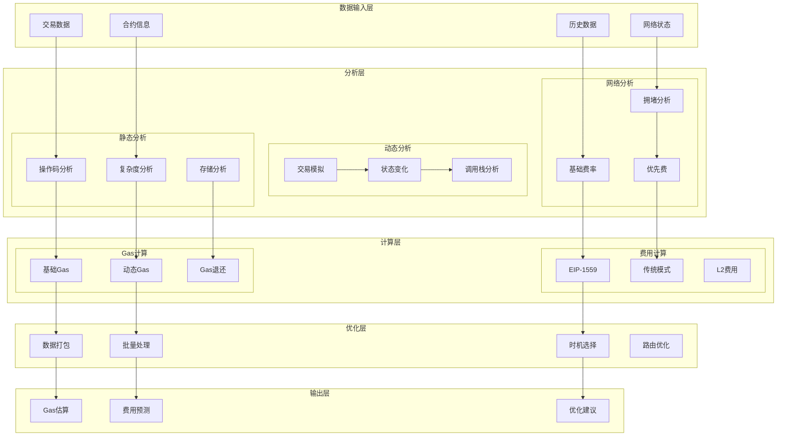
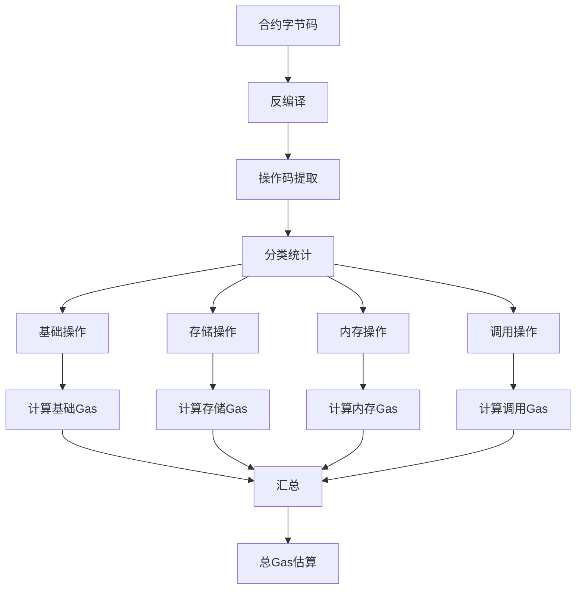
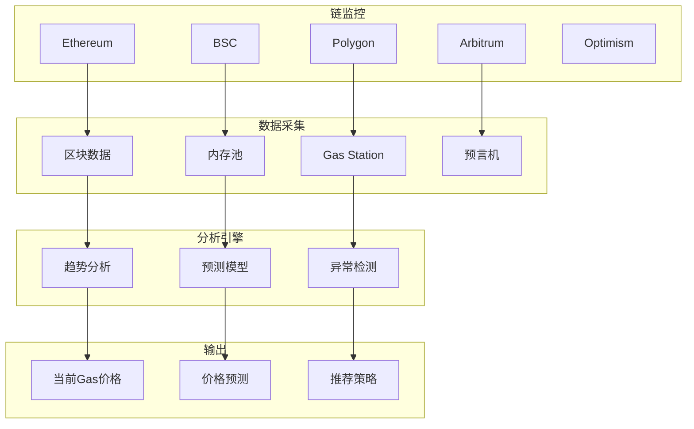
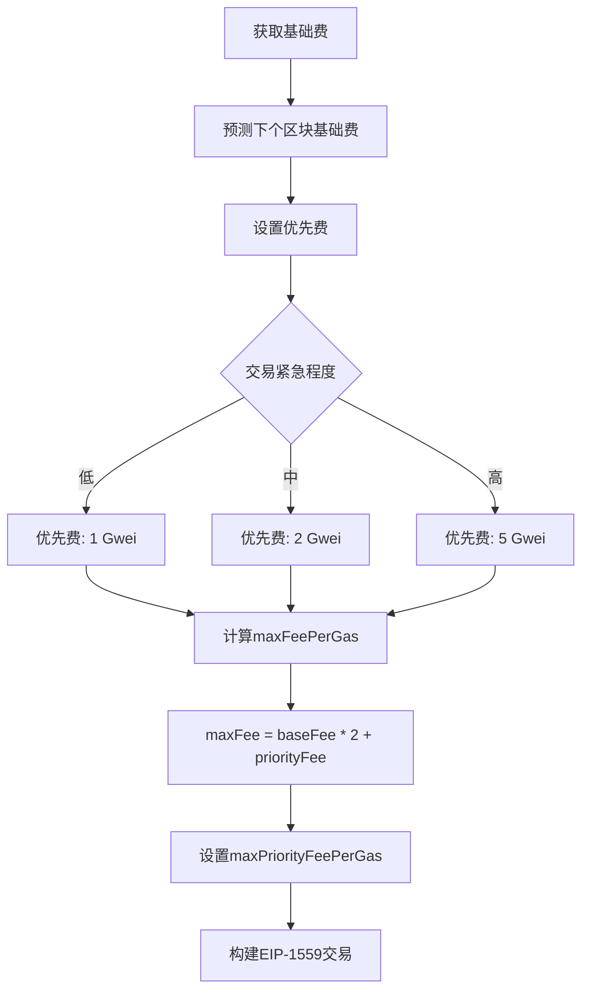
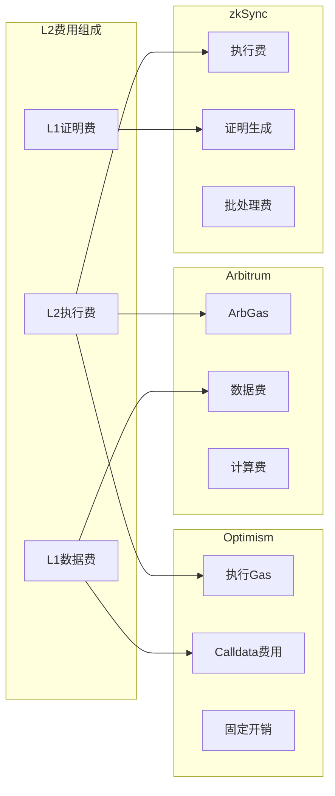
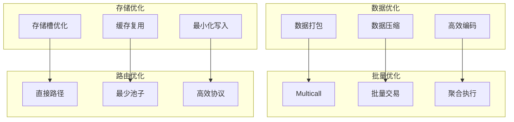

# Gas估算器(Gas Estimator)详细设计

## 概述

Gas估算器是报价服务的成本计算核心组件，负责准确预估交易的Gas消耗和费用。它通过分析合约复杂度、网络状态、历史数据等因素，为用户提供精准的交易成本预测，并提供Gas优化建议。

## 核心职责

1. **Gas预估** - 准确预估交易Gas消耗
2. **费用计算** - 多链Gas费用计算
3. **动态定价** - EIP-1559等动态费用模型
4. **优化建议** - Gas优化策略推荐
5. **网络监控** - 实时监控网络拥堵
6. **历史分析** - 基于历史数据优化预测
7. **批量优化** - 批量交易Gas优化
8. **跨链成本** - 跨链交易综合成本计算

## 详细架构设计

### 系统架构



### 核心数据结构

```typescript
// Gas估算器主类
class GasEstimator {
    private opcodeAnalyzer: OpcodeAnalyzer;
    private simulator: TransactionSimulator;
    private networkMonitor: NetworkMonitor;
    private optimizer: GasOptimizer;
    private priceOracle: GasPriceOracle;

    // Gas估算结果
    interface GasEstimate {
        gasLimit: BigNumber;           // Gas限制
        gasUsed: BigNumber;            // 预估使用量
        baseFee: BigNumber;            // 基础费用
        priorityFee: BigNumber;        // 优先费
        maxFee: BigNumber;             // 最大费用
        estimatedCost: BigNumber;      // 预估总成本
        confidence: number;            // 置信度
        breakdown: GasBreakdown;       // 详细分解
    }

    // Gas分解
    interface GasBreakdown {
        computation: BigNumber;        // 计算Gas
        storage: BigNumber;           // 存储Gas
        calldata: BigNumber;          // 调用数据Gas
        events: BigNumber;            // 事件Gas
        refund: BigNumber;            // 退还Gas
    }

    // 网络状态
    interface NetworkState {
        blockNumber: number;
        baseFee: BigNumber;
        gasPrice: BigNumber;
        pendingTxCount: number;
        avgBlockTime: number;
        congestionLevel: CongestionLevel;
    }

    // 多链配置
    interface ChainConfig {
        chainId: number;
        name: string;
        gasToken: string;
        blockGasLimit: BigNumber;
        eip1559: boolean;
        opcodeGasCost: Map<string, number>;
        customGasLogic?: CustomGasCalculator;
    }
}
```

## Gas计算算法

### 1. 操作码分析



### 2. 操作码Gas计算实现

```typescript
class OpcodeAnalyzer {
    // EVM操作码Gas成本映射
    private readonly OPCODE_GAS_COST = {
        // 基础操作
        ADD: 3,
        MUL: 5,
        SUB: 3,
        DIV: 5,
        MOD: 5,
        EXP: 10,

        // 比较和位操作
        LT: 3,
        GT: 3,
        EQ: 3,
        AND: 3,
        OR: 3,
        XOR: 3,
        NOT: 3,

        // 存储操作
        SLOAD: 2100,      // 冷存储
        SSTORE: 20000,    // 冷存储写入
        SSTORE_WARM: 2900, // 热存储写入

        // 内存操作
        MLOAD: 3,
        MSTORE: 3,
        MSTORE8: 3,

        // 调用操作
        CALL: 2600,
        DELEGATECALL: 2600,
        STATICCALL: 2600,
        CREATE: 32000,
        CREATE2: 32000,

        // 日志操作
        LOG0: 375,
        LOG1: 750,
        LOG2: 1125,
        LOG3: 1500,
        LOG4: 1875,
    };

    // 分析合约Gas消耗
    analyzeContract(bytecode: string): GasAnalysis {
        const opcodes = this.disassemble(bytecode);
        const gasBreakdown = this.calculateGasBreakdown(opcodes);

        return {
            totalGas: this.sumGas(gasBreakdown),
            breakdown: gasBreakdown,
            hotPath: this.identifyHotPath(opcodes),
            optimizationOpportunities: this.findOptimizations(opcodes)
        };
    }

    // 反编译字节码
    private disassemble(bytecode: string): Opcode[] {
        const opcodes: Opcode[] = [];
        let pc = 0;

        while (pc < bytecode.length) {
            const op = bytecode.substr(pc * 2, 2);
            const opcode = this.getOpcode(op);

            opcodes.push({
                pc: pc,
                opcode: opcode,
                gas: this.OPCODE_GAS_COST[opcode] || 3,
                args: this.getArgs(bytecode, pc, opcode)
            });

            pc += this.getOpcodeSize(opcode);
        }

        return opcodes;
    }

    // 计算Gas分解
    private calculateGasBreakdown(opcodes: Opcode[]): GasBreakdown {
        const breakdown: GasBreakdown = {
            computation: BigNumber.from(0),
            storage: BigNumber.from(0),
            calldata: BigNumber.from(0),
            events: BigNumber.from(0),
            memory: BigNumber.from(0)
        };

        for (const op of opcodes) {
            if (this.isStorageOp(op.opcode)) {
                breakdown.storage = breakdown.storage.add(op.gas);
            } else if (this.isCallOp(op.opcode)) {
                breakdown.calldata = breakdown.calldata.add(op.gas);
            } else if (this.isLogOp(op.opcode)) {
                breakdown.events = breakdown.events.add(op.gas);
            } else if (this.isMemoryOp(op.opcode)) {
                breakdown.memory = breakdown.memory.add(op.gas);
            } else {
                breakdown.computation = breakdown.computation.add(op.gas);
            }
        }

        return breakdown;
    }

    // 识别热路径
    private identifyHotPath(opcodes: Opcode[]): HotPath[] {
        const paths: HotPath[] = [];
        const jumps = this.findJumps(opcodes);

        // 使用控制流分析识别最常执行的路径
        for (const jump of jumps) {
            const path = this.tracePath(opcodes, jump.from, jump.to);
            const frequency = this.estimateFrequency(path);

            paths.push({
                start: jump.from,
                end: jump.to,
                gas: this.calculatePathGas(path),
                frequency: frequency,
                impact: this.calculateImpact(path, frequency)
            });
        }

        // 按影响排序
        return paths.sort((a, b) => b.impact - a.impact).slice(0, 5);
    }
}
```

### 3. 动态Gas计算

```typescript
class DynamicGasCalculator {
    // 计算动态内存Gas
    calculateMemoryGas(memorySize: number): BigNumber {
        // 内存Gas = 内存字数 * 3 + 内存字数^2 / 512
        const words = Math.ceil(memorySize / 32);
        const linearCost = words * 3;
        const quadraticCost = Math.floor((words * words) / 512);

        return BigNumber.from(linearCost + quadraticCost);
    }

    // 计算存储Gas（考虑EIP-2200）
    calculateStorageGas(
        original: BigNumber,
        current: BigNumber,
        new_: BigNumber
    ): BigNumber {
        // SSTORE Gas计算规则
        if (current.eq(new_)) {
            return BigNumber.from(200); // 无变化
        }

        if (original.eq(current)) {
            if (original.isZero()) {
                return BigNumber.from(20000); // 初始化存储
            }
            if (new_.isZero()) {
                return BigNumber.from(5000); // 清除存储（有退款）
            }
            return BigNumber.from(5000); // 更新存储
        }

        return BigNumber.from(200); // 热存储访问
    }

    // 计算调用数据Gas
    calculateCalldataGas(data: string): BigNumber {
        let gas = 0;

        // 每个非零字节16 Gas，零字节4 Gas
        for (let i = 0; i < data.length; i += 2) {
            const byte = data.substr(i, 2);
            gas += byte === '00' ? 4 : 16;
        }

        return BigNumber.from(gas);
    }

    // 计算创建合约Gas
    calculateCreateGas(initCode: string): BigNumber {
        const baseGas = 32000; // CREATE基础Gas
        const codeDepositGas = Math.ceil(initCode.length / 2) * 200;

        return BigNumber.from(baseGas + codeDepositGas);
    }
}
```

## 网络状态监控

### 1. 多链网络监控架构



### 2. 网络监控实现

```typescript
class NetworkMonitor {
    private providers: Map<ChainId, Provider>;
    private gasPriceHistory: Map<ChainId, GasPriceHistory>;
    private congestionDetector: CongestionDetector;

    // 获取实时网络状态
    async getNetworkState(chainId: ChainId): Promise<NetworkState> {
        const provider = this.providers.get(chainId);

        // 并行获取数据
        const [
            block,
            gasPrice,
            pendingTxs,
            baseFee
        ] = await Promise.all([
            provider.getBlock('latest'),
            provider.getGasPrice(),
            provider.getPendingTransactions(),
            this.getBaseFee(provider)
        ]);

        // 分析拥堵程度
        const congestion = this.analyzeCongestion({
            blockGasUsed: block.gasUsed,
            blockGasLimit: block.gasLimit,
            pendingCount: pendingTxs.length,
            gasPrice: gasPrice
        });

        return {
            blockNumber: block.number,
            timestamp: block.timestamp,
            gasPrice: gasPrice,
            baseFee: baseFee,
            pendingTxCount: pendingTxs.length,
            blockUtilization: block.gasUsed.mul(100).div(block.gasLimit),
            congestionLevel: congestion,
            recommendations: this.getRecommendations(congestion)
        };
    }

    // 分析网络拥堵
    private analyzeCongestion(data: CongestionData): CongestionLevel {
        const score =
            (data.blockGasUsed.mul(100).div(data.blockGasLimit).toNumber() * 0.4) +
            (Math.min(data.pendingCount / 1000, 1) * 100 * 0.3) +
            (this.normalizeGasPrice(data.gasPrice) * 0.3);

        if (score < 30) return CongestionLevel.LOW;
        if (score < 60) return CongestionLevel.MEDIUM;
        if (score < 80) return CongestionLevel.HIGH;
        return CongestionLevel.CRITICAL;
    }

    // Gas价格预测
    async predictGasPrice(
        chainId: ChainId,
        timeHorizon: number // 分钟
    ): Promise<GasPricePrediction> {
        const history = this.gasPriceHistory.get(chainId);
        const features = this.extractFeatures(history);

        // 使用ARIMA模型预测
        const prediction = this.arimaModel.predict(features, timeHorizon);

        // 计算置信区间
        const confidence = this.calculateConfidenceInterval(prediction, history);

        return {
            predicted: prediction.value,
            confidence: confidence,
            timeHorizon: timeHorizon,
            factors: this.identifyPriceFactors(history)
        };
    }
}
```

## EIP-1559费用模型

### 1. EIP-1559计算流程



### 2. EIP-1559实现

```typescript
class EIP1559Calculator {
    // 计算EIP-1559费用
    calculateEIP1559Fees(
        baseFee: BigNumber,
        urgency: Urgency
    ): EIP1559Fees {
        // 预测下个区块的基础费
        const nextBaseFee = this.predictNextBaseFee(baseFee);

        // 根据紧急程度设置优先费
        const priorityFee = this.getPriorityFee(urgency);

        // 计算最大费用（留出缓冲空间）
        const maxFeePerGas = nextBaseFee
            .mul(125) // 1.25倍缓冲
            .div(100)
            .add(priorityFee);

        return {
            baseFee: baseFee,
            maxFeePerGas: maxFeePerGas,
            maxPriorityFeePerGas: priorityFee,
            estimatedFee: nextBaseFee.add(priorityFee)
        };
    }

    // 预测下个区块基础费
    private predictNextBaseFee(currentBaseFee: BigNumber): BigNumber {
        // EIP-1559基础费调整算法
        const gasTarget = BigNumber.from(15000000); // 目标Gas
        const gasUsed = this.getLastBlockGasUsed();

        if (gasUsed.gt(gasTarget)) {
            // 区块满，基础费上涨（最多12.5%）
            const delta = gasUsed.sub(gasTarget);
            const increase = currentBaseFee
                .mul(delta)
                .div(gasTarget)
                .div(8);

            return currentBaseFee.add(increase);
        } else {
            // 区块未满，基础费下降
            const delta = gasTarget.sub(gasUsed);
            const decrease = currentBaseFee
                .mul(delta)
                .div(gasTarget)
                .div(8);

            return currentBaseFee.sub(decrease);
        }
    }

    // 动态优先费策略
    private getPriorityFee(urgency: Urgency): BigNumber {
        const mempoolStats = this.getMempoolStats();

        // 基础优先费
        let basePriority = BigNumber.from(0);
        switch (urgency) {
            case Urgency.LOW:
                basePriority = parseGwei("0.5");
                break;
            case Urgency.MEDIUM:
                basePriority = parseGwei("2");
                break;
            case Urgency.HIGH:
                basePriority = parseGwei("5");
                break;
            case Urgency.INSTANT:
                basePriority = parseGwei("10");
                break;
        }

        // 根据内存池状态调整
        if (mempoolStats.congestion > 0.8) {
            basePriority = basePriority.mul(150).div(100); // 1.5倍
        }

        return basePriority;
    }
}
```

## Layer2费用计算

### 1. L2费用模型



### 2. L2费用计算实现

```typescript
class L2FeeCalculator {
    // Optimism费用计算
    calculateOptimismFee(
        l2GasUsed: BigNumber,
        l2GasPrice: BigNumber,
        txData: string
    ): L2Fee {
        // L2执行费
        const l2ExecutionFee = l2GasUsed.mul(l2GasPrice);

        // L1数据费
        const l1GasUsed = this.calculateL1Gas(txData);
        const l1GasPrice = this.getL1GasPrice();
        const l1DataFee = l1GasUsed.mul(l1GasPrice);

        // 动态开销
        const dynamicOverhead = this.getDynamicOverhead();
        const overheadFee = dynamicOverhead.mul(l1GasPrice);

        return {
            l2Fee: l2ExecutionFee,
            l1Fee: l1DataFee.add(overheadFee),
            totalFee: l2ExecutionFee.add(l1DataFee).add(overheadFee),
            breakdown: {
                execution: l2ExecutionFee,
                data: l1DataFee,
                overhead: overheadFee
            }
        };
    }

    // Arbitrum费用计算
    calculateArbitrumFee(
        l2GasUsed: BigNumber,
        l2GasPrice: BigNumber,
        txData: string
    ): L2Fee {
        // 计算ArbGas
        const arbGasUsed = this.calculateArbGas(l2GasUsed, txData);
        const arbGasPrice = this.getArbGasPrice();

        // L1定价组件
        const l1PricingComponent = this.calculateL1Pricing(txData);

        return {
            l2Fee: arbGasUsed.mul(arbGasPrice),
            l1Fee: l1PricingComponent,
            totalFee: arbGasUsed.mul(arbGasPrice).add(l1PricingComponent),
            breakdown: {
                compute: arbGasUsed.mul(arbGasPrice),
                storage: BigNumber.from(0),
                l1Submission: l1PricingComponent
            }
        };
    }

    // zkSync费用计算
    calculateZkSyncFee(
        zkGasLimit: BigNumber,
        pubdataPrice: BigNumber,
        l1GasPrice: BigNumber
    ): L2Fee {
        // 基础费用
        const baseFee = zkGasLimit.mul(pubdataPrice);

        // 证明生成费用（批量分摊）
        const proofFee = this.estimateProofFee(zkGasLimit);

        // L1提交费用
        const l1SubmissionFee = this.estimateL1Submission(l1GasPrice);

        return {
            l2Fee: baseFee.add(proofFee),
            l1Fee: l1SubmissionFee,
            totalFee: baseFee.add(proofFee).add(l1SubmissionFee),
            breakdown: {
                execution: baseFee,
                proof: proofFee,
                l1Batch: l1SubmissionFee
            }
        };
    }
}
```

## Gas优化策略

### 1. 优化技术



### 2. 优化实现

```typescript
class GasOptimizer {
    // 数据打包优化
    optimizeCalldata(calls: Call[]): OptimizedCalldata {
        // 使用Multicall3合约
        const multicall = new Multicall3Contract();

        // 打包调用
        const packedCalls = calls.map(call => ({
            target: call.to,
            allowFailure: call.allowFailure || false,
            callData: this.encodeCalldata(call)
        }));

        // 压缩数据
        const compressed = this.compressCalldata(packedCalls);

        return {
            data: compressed,
            estimatedGas: this.estimateMulticallGas(packedCalls),
            savings: this.calculateSavings(calls, packedCalls)
        };
    }

    // 存储优化
    optimizeStorage(updates: StorageUpdate[]): OptimizedStorage {
        // 分组相邻的存储槽
        const grouped = this.groupBySlot(updates);

        // 使用SSTORE2模式存储大数据
        const optimized = grouped.map(group => {
            if (group.data.length > 24576) { // 24KB阈值
                return this.useSSTORE2Pattern(group);
            }
            return this.packStorageSlot(group);
        });

        return {
            updates: optimized,
            gasReduction: this.calculateStorageReduction(updates, optimized)
        };
    }

    // 批量交易优化
    optimizeBatchTransactions(txs: Transaction[]): BatchStrategy {
        // 分析交易依赖关系
        const dependencies = this.analyzeDependencies(txs);

        // 识别可并行的交易
        const parallel = this.findParallelizable(txs, dependencies);

        // 生成最优批次
        const batches = this.generateBatches(parallel, {
            maxBatchSize: 30,
            maxGasPerBatch: BigNumber.from(10000000),
            targetUtilization: 0.8
        });

        return {
            batches: batches,
            estimatedGas: this.estimateBatchGas(batches),
            executionPlan: this.createExecutionPlan(batches)
        };
    }

    // 时机优化
    async optimizeTiming(
        urgency: Urgency
    ): Promise<TimingRecommendation> {
        const predictions = await this.predictGasPrices(24); // 24小时预测

        // 找出低Gas时段
        const lowPeriods = this.findLowGasPeriods(predictions);

        if (urgency === Urgency.LOW) {
            return {
                recommendedTime: lowPeriods[0].start,
                estimatedSaving: this.calculateSaving(
                    this.getCurrentGasPrice(),
                    lowPeriods[0].expectedPrice
                ),
                confidence: lowPeriods[0].confidence
            };
        }

        return {
            recommendedTime: Date.now(),
            estimatedSaving: BigNumber.from(0),
            confidence: 1.0
        };
    }
}
```

## 历史数据分析

### 1. 模式识别

```typescript
class GasPatternAnalyzer {
    // 识别Gas价格模式
    identifyPatterns(history: GasPriceHistory): GasPattern[] {
        const patterns: GasPattern[] = [];

        // 日内模式
        const intraDayPattern = this.findIntraDayPattern(history);
        if (intraDayPattern) patterns.push(intraDayPattern);

        // 周模式
        const weeklyPattern = this.findWeeklyPattern(history);
        if (weeklyPattern) patterns.push(weeklyPattern);

        // 事件驱动模式
        const eventPatterns = this.findEventDrivenPatterns(history);
        patterns.push(...eventPatterns);

        return patterns;
    }

    // 日内模式分析
    private findIntraDayPattern(history: GasPriceHistory): GasPattern | null {
        const hourlyAverages = new Array(24).fill(0);
        const hourlyCounts = new Array(24).fill(0);

        // 计算每小时平均Gas价格
        for (const entry of history.entries) {
            const hour = new Date(entry.timestamp).getHours();
            hourlyAverages[hour] += entry.gasPrice.toNumber();
            hourlyCounts[hour]++;
        }

        // 归一化
        for (let i = 0; i < 24; i++) {
            if (hourlyCounts[i] > 0) {
                hourlyAverages[i] /= hourlyCounts[i];
            }
        }

        // 识别高低峰
        const peak = this.findPeakHours(hourlyAverages);
        const valley = this.findValleyHours(hourlyAverages);

        return {
            type: 'intraday',
            peakHours: peak,
            valleyHours: valley,
            averageDifference: this.calculateDifference(peak, valley, hourlyAverages)
        };
    }
}
```

## 监控指标

```yaml
准确性指标:
  - Gas估算准确率: > 95%
  - 费用预测误差: < 5%
  - 网络状态准确性: > 98%

性能指标:
  - 估算延迟: < 10ms (P99)
  - 批量估算: > 100 txs/s
  - 缓存命中率: > 90%

优化效果:
  - 平均Gas节省: > 20%
  - 批量优化节省: > 30%
  - 时机优化节省: > 15%

可靠性指标:
  - 服务可用性: 99.99%
  - 数据更新频率: < 1s
  - 故障恢复时间: < 30s
```

## 告警系统

```typescript
class GasAlertSystem {
    checkAlerts(estimate: GasEstimate): Alert[] {
        const alerts: Alert[] = [];

        // 高Gas警告
        if (estimate.estimatedCost.gt(parseEther("0.01"))) {
            alerts.push({
                level: 'warning',
                type: 'high_gas_cost',
                message: `High transaction cost: ${formatEther(estimate.estimatedCost)} ETH`,
                suggestion: 'Consider waiting for lower gas prices or optimizing transaction'
            });
        }

        // 网络拥堵警告
        if (this.networkMonitor.getCongestionLevel() === CongestionLevel.CRITICAL) {
            alerts.push({
                level: 'critical',
                type: 'network_congestion',
                message: 'Network is critically congested',
                suggestion: 'Delay transaction or increase gas price significantly'
            });
        }

        return alerts;
    }
}
```

## 总结

Gas估算器通过精确的操作码分析、动态网络监控和智能优化策略，为用户提供准确的Gas预估和成本优化。关键创新：

1. **多链支持** - 统一的多链Gas计算框架
2. **动态预测** - 基于历史和实时数据的预测
3. **智能优化** - 多维度Gas优化策略
4. **L2集成** - 完整的Layer2费用模型
5. **模式识别** - 历史模式分析和预测