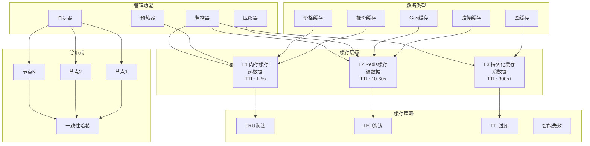
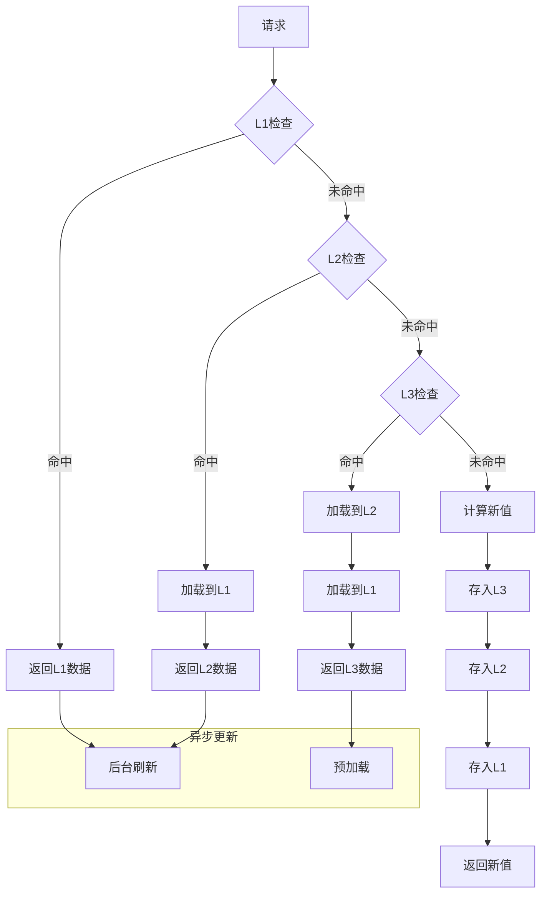
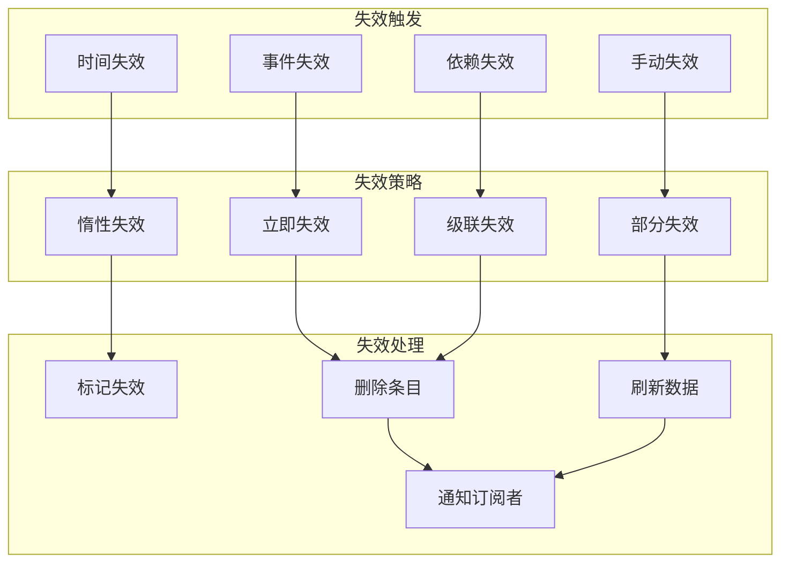
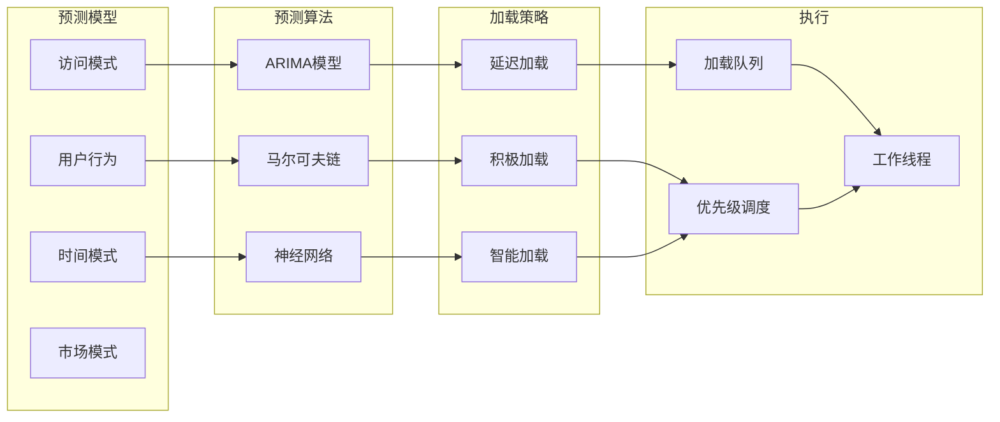
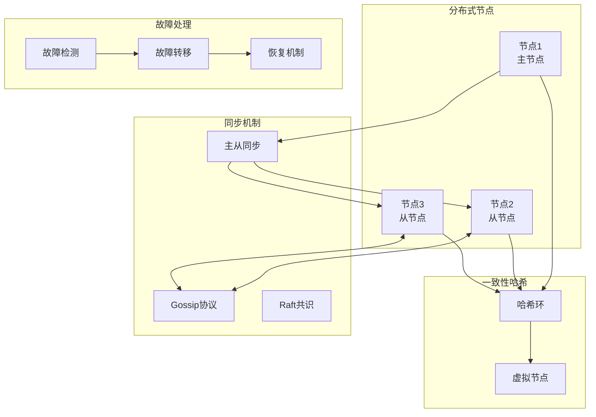

# 报价缓存(Quote Cache)详细设计

## 概述

报价缓存是报价服务的性能优化核心组件，通过多级缓存架构、智能失效策略和预测性加载，显著提升系统响应速度和吞吐量。它不仅缓存最终报价，还缓存中间计算结果，实现全方位的性能优化。

## 核心职责

1. **多级缓存** - L1/L2/L3分层缓存架构
2. **智能失效** - 基于多因子的缓存失效策略
3. **预测加载** - 基于用户行为的预加载
4. **分布式缓存** - 多节点缓存同步
5. **缓存分析** - 命中率和性能分析
6. **压缩存储** - 高效的数据压缩
7. **版本管理** - 缓存版本控制
8. **降级策略** - 缓存故障降级方案

## 详细架构设计

### 系统架构



### 核心数据结构

```typescript
// 缓存管理器
class QuoteCacheManager {
    private l1Cache: L1Cache;
    private l2Cache: L2Cache;
    private l3Cache: L3Cache;
    private predictor: CachePredictor;
    private invalidator: CacheInvalidator;
    private compressor: DataCompressor;

    // 缓存条目
    interface CacheEntry<T> {
        key: string;
        value: T;
        timestamp: number;
        ttl: number;
        hitCount: number;
        lastAccess: number;
        size: number;
        compressed: boolean;
        version: number;
        metadata: CacheMetadata;
    }

    // 缓存元数据
    interface CacheMetadata {
        source: string;
        dependencies: string[];
        tags: string[];
        priority: number;
        volatility: number;
    }

    // 缓存统计
    interface CacheStats {
        hitRate: number;
        missRate: number;
        evictionRate: number;
        avgLatency: number;
        memoryUsage: number;
        entryCount: number;
    }

    // 缓存配置
    interface CacheConfig {
        maxMemory: number;
        maxEntries: number;
        defaultTTL: number;
        compressionThreshold: number;
        evictionPolicy: EvictionPolicy;
        warmupStrategy: WarmupStrategy;
    }
}

// L1内存缓存
class L1Cache {
    private cache: Map<string, CacheEntry<any>>;
    private accessQueue: PriorityQueue<string>;
    private sizeTracker: SizeTracker;

    interface L1Config {
        maxSize: number;       // 最大内存
        maxEntries: number;    // 最大条目数
        ttl: number;          // 默认TTL
        checkInterval: number; // 清理间隔
    }
}
```

## 多级缓存架构

### 1. 缓存层级设计



### 2. 多级缓存实现

```typescript
class MultiLevelCache {
    // 多级缓存查询
    async get<T>(key: string): Promise<CacheResult<T>> {
        const startTime = Date.now();

        // L1查询（内存）
        const l1Result = this.l1Cache.get(key);
        if (l1Result && !this.isStale(l1Result)) {
            this.recordHit('L1', Date.now() - startTime);
            this.updateAccessPattern(key, 'L1');
            return { value: l1Result.value, source: 'L1' };
        }

        // L2查询（Redis）
        const l2Result = await this.l2Cache.get(key);
        if (l2Result && !this.isStale(l2Result)) {
            this.recordHit('L2', Date.now() - startTime);

            // 提升到L1
            await this.promoteToL1(key, l2Result);

            this.updateAccessPattern(key, 'L2');
            return { value: l2Result.value, source: 'L2' };
        }

        // L3查询（持久化存储）
        const l3Result = await this.l3Cache.get(key);
        if (l3Result && !this.isStale(l3Result)) {
            this.recordHit('L3', Date.now() - startTime);

            // 逐级提升
            await this.promoteToL2(key, l3Result);
            await this.promoteToL1(key, l3Result);

            this.updateAccessPattern(key, 'L3');
            return { value: l3Result.value, source: 'L3' };
        }

        // 缓存未命中
        this.recordMiss(Date.now() - startTime);
        return { value: null, source: 'MISS' };
    }

    // 多级缓存写入
    async set<T>(
        key: string,
        value: T,
        options?: CacheOptions
    ): Promise<void> {
        const entry = this.createCacheEntry(key, value, options);

        // 根据数据特性决定缓存级别
        const levels = this.determineCacheLevels(entry);

        // 并行写入多级缓存
        const writePromises = [];

        if (levels.includes('L1')) {
            writePromises.push(this.l1Cache.set(key, entry));
        }
        if (levels.includes('L2')) {
            writePromises.push(this.l2Cache.set(key, entry));
        }
        if (levels.includes('L3')) {
            writePromises.push(this.l3Cache.set(key, entry));
        }

        await Promise.all(writePromises);

        // 触发缓存同步
        this.triggerSync(key, entry);
    }

    // 智能缓存级别决策
    private determineCacheLevels(entry: CacheEntry<any>): string[] {
        const levels: string[] = [];

        // 基于访问频率
        if (entry.metadata.priority > 8) {
            levels.push('L1'); // 高优先级进L1
        }

        // 基于数据大小
        if (entry.size < 1024) { // 小于1KB
            levels.push('L1');
        }
        if (entry.size < 100 * 1024) { // 小于100KB
            levels.push('L2');
        }

        // 所有数据都进L3
        levels.push('L3');

        return levels;
    }

    // 缓存提升策略
    private async promoteToL1<T>(key: string, entry: CacheEntry<T>): Promise<void> {
        // 检查L1容量
        if (this.l1Cache.isFull()) {
            await this.l1Cache.evictLRU();
        }

        // 解压缩数据
        if (entry.compressed) {
            entry.value = await this.decompressValue(entry.value);
            entry.compressed = false;
        }

        // 写入L1
        await this.l1Cache.set(key, entry);

        // 更新统计
        this.stats.promotions.L1++;
    }
}
```

## 智能失效策略

### 1. 失效机制



### 2. 智能失效实现

```typescript
class CacheInvalidator {
    private dependencyGraph: Map<string, Set<string>>;
    private eventListeners: Map<string, InvalidationHandler[]>;
    private ttlManager: TTLManager;

    // 注册失效规则
    registerInvalidation(rule: InvalidationRule): void {
        switch (rule.type) {
            case 'time':
                this.ttlManager.register(rule);
                break;
            case 'event':
                this.registerEventInvalidation(rule);
                break;
            case 'dependency':
                this.registerDependencyInvalidation(rule);
                break;
            case 'conditional':
                this.registerConditionalInvalidation(rule);
                break;
        }
    }

    // 事件驱动失效
    private registerEventInvalidation(rule: EventInvalidationRule): void {
        // 监听价格变化事件
        this.eventBus.on('price_change', (event) => {
            const threshold = rule.threshold || 0.01; // 1%变化

            if (this.isPriceChangeSignificant(event, threshold)) {
                this.invalidatePattern(rule.pattern);
            }
        });

        // 监听流动性变化
        this.eventBus.on('liquidity_change', (event) => {
            if (event.poolId === rule.poolId) {
                this.invalidateByTag(`pool:${event.poolId}`);
            }
        });
    }

    // 依赖失效（级联）
    private invalidateDependencies(key: string): void {
        const dependencies = this.dependencyGraph.get(key);

        if (dependencies) {
            for (const depKey of dependencies) {
                // 递归失效
                this.invalidate(depKey);
                this.invalidateDependencies(depKey);
            }
        }
    }

    // 智能TTL计算
    calculateDynamicTTL(entry: CacheEntry<any>): number {
        let baseTTL = this.config.defaultTTL;

        // 基于数据波动性
        if (entry.metadata.volatility > 0.8) {
            baseTTL *= 0.3; // 高波动短TTL
        } else if (entry.metadata.volatility < 0.2) {
            baseTTL *= 2; // 低波动长TTL
        }

        // 基于访问频率
        const accessRate = entry.hitCount / (Date.now() - entry.timestamp);
        if (accessRate > 0.01) { // 高频访问
            baseTTL *= 1.5;
        }

        // 基于时间段
        const hour = new Date().getHours();
        if (hour >= 0 && hour < 6) { // 深夜低活跃期
            baseTTL *= 3;
        }

        return Math.min(Math.max(baseTTL, 1000), 300000); // 1s-5min
    }

    // 条件失效
    private registerConditionalInvalidation(rule: ConditionalRule): void {
        setInterval(() => {
            const entries = this.cache.getByPattern(rule.pattern);

            for (const entry of entries) {
                if (this.evaluateCondition(rule.condition, entry)) {
                    this.invalidate(entry.key);
                }
            }
        }, rule.checkInterval);
    }
}
```

## 预测性加载

### 1. 预加载策略



### 2. 预测加载实现

```typescript
class PredictiveLoader {
    private predictor: AccessPredictor;
    private loadQueue: PriorityQueue<LoadTask>;
    private loadingPool: WorkerPool;

    // 预测下一步访问
    async predictNextAccess(
        currentKey: string,
        userContext: UserContext
    ): Promise<PredictedAccess[]> {
        // 基于马尔可夫链的预测
        const markovPredictions = this.markovChain.predict(currentKey);

        // 基于用户历史的预测
        const userPredictions = this.userPredictor.predict(userContext);

        // 基于时间模式的预测
        const timePredictions = this.timePredictor.predict(new Date());

        // 综合预测结果
        return this.combinePredictions([
            ...markovPredictions,
            ...userPredictions,
            ...timePredictions
        ]);
    }

    // 智能预加载
    async smartPreload(context: PreloadContext): Promise<void> {
        const predictions = await this.predictNextAccess(
            context.currentKey,
            context.user
        );

        // 过滤已缓存的
        const toLoad = predictions.filter(p =>
            !this.cache.has(p.key) && p.probability > 0.3
        );

        // 按概率排序
        toLoad.sort((a, b) => b.probability - a.probability);

        // 创建加载任务
        for (const prediction of toLoad.slice(0, 10)) { // 最多预加载10个
            const task: LoadTask = {
                key: prediction.key,
                priority: prediction.probability * 10,
                loader: () => this.computeValue(prediction.key),
                callback: (value) => this.cache.set(prediction.key, value, {
                    ttl: this.calculatePreloadTTL(prediction)
                })
            };

            this.loadQueue.enqueue(task);
        }

        // 异步执行预加载
        this.processLoadQueue();
    }

    // 访问模式学习
    learnAccessPattern(access: AccessRecord): void {
        // 更新马尔可夫链
        if (access.previousKey) {
            this.markovChain.addTransition(
                access.previousKey,
                access.currentKey,
                1
            );
        }

        // 更新时间模式
        this.timePredictor.addSample(
            access.timestamp,
            access.currentKey
        );

        // 更新用户模式
        this.userPredictor.addSample(
            access.userId,
            access.currentKey,
            access.context
        );
    }

    // 热门数据预热
    async warmupCache(): Promise<void> {
        // 获取热门交易对
        const popularPairs = await this.getPopularTradingPairs();

        // 获取常用路径
        const commonPaths = await this.getCommonPaths();

        // 并行预热
        const warmupTasks = [
            ...popularPairs.map(pair => this.warmupPair(pair)),
            ...commonPaths.map(path => this.warmupPath(path))
        ];

        await Promise.allSettled(warmupTasks);

        this.logger.info(`Cache warmed up: ${warmupTasks.length} entries`);
    }
}
```

## 分布式缓存

### 1. 分布式架构



### 2. 分布式实现

```typescript
class DistributedCache {
    private nodes: Map<string, CacheNode>;
    private hashRing: ConsistentHash;
    private syncManager: SyncManager;
    private failureDetector: FailureDetector;

    // 分布式写入
    async set(key: string, value: any, options?: DistributedOptions): Promise<void> {
        // 计算目标节点
        const primaryNode = this.hashRing.getNode(key);
        const replicas = this.hashRing.getReplicas(key, options?.replicationFactor || 2);

        // 写入主节点
        await primaryNode.set(key, value, options);

        // 异步复制到副本
        const replicationPromises = replicas.map(node =>
            this.replicateToNode(node, key, value, options)
        );

        if (options?.consistency === 'strong') {
            // 强一致性：等待所有副本确认
            await Promise.all(replicationPromises);
        } else {
            // 最终一致性：异步复制
            Promise.allSettled(replicationPromises);
        }

        // 广播失效消息
        this.broadcastInvalidation(key);
    }

    // 分布式读取
    async get(key: string, options?: DistributedOptions): Promise<any> {
        const primaryNode = this.hashRing.getNode(key);

        try {
            // 尝试从主节点读取
            const result = await primaryNode.get(key);
            if (result) return result;
        } catch (error) {
            // 主节点故障，从副本读取
            const replicas = this.hashRing.getReplicas(key);

            for (const replica of replicas) {
                try {
                    const result = await replica.get(key);
                    if (result) {
                        // 修复主节点
                        this.repairPrimary(key, result);
                        return result;
                    }
                } catch (e) {
                    continue;
                }
            }
        }

        return null;
    }

    // Gossip协议同步
    private initGossipProtocol(): void {
        setInterval(() => {
            // 随机选择节点
            const randomNode = this.selectRandomNode();

            // 交换元数据
            this.exchangeMetadata(randomNode);

            // 检测并同步差异
            this.syncDifferences(randomNode);
        }, this.config.gossipInterval);
    }

    // 故障检测与恢复
    private initFailureDetection(): void {
        this.failureDetector.on('node_down', (nodeId) => {
            // 从哈希环移除故障节点
            this.hashRing.removeNode(nodeId);

            // 重新分配该节点的数据
            this.redistributeData(nodeId);

            // 启动恢复流程
            this.startRecovery(nodeId);
        });

        this.failureDetector.on('node_up', (nodeId) => {
            // 节点恢复，重新加入
            this.hashRing.addNode(nodeId);

            // 重新平衡数据
            this.rebalanceData();
        });
    }
}
```

## 数据压缩

### 1. 压缩策略

```typescript
class DataCompressor {
    // 智能压缩决策
    shouldCompress(entry: CacheEntry<any>): boolean {
        // 基于大小
        if (entry.size < 1024) return false; // 小于1KB不压缩

        // 基于类型
        if (this.isBinaryData(entry.value)) return false; // 已压缩数据

        // 基于访问频率
        if (entry.hitCount > 100) return false; // 高频访问不压缩

        return true;
    }

    // 压缩算法选择
    selectCompressionAlgorithm(data: any): CompressionAlgorithm {
        const dataType = this.detectDataType(data);

        switch (dataType) {
            case 'json':
                return 'lz4'; // 快速压缩
            case 'text':
                return 'zstd'; // 高压缩率
            case 'numeric':
                return 'snappy'; // 超快压缩
            default:
                return 'gzip'; // 通用压缩
        }
    }

    // 压缩实现
    async compress(data: any): Promise<CompressedData> {
        const serialized = this.serialize(data);
        const algorithm = this.selectCompressionAlgorithm(data);

        let compressed: Buffer;
        switch (algorithm) {
            case 'lz4':
                compressed = await lz4.compress(serialized);
                break;
            case 'zstd':
                compressed = await zstd.compress(serialized);
                break;
            case 'snappy':
                compressed = await snappy.compress(serialized);
                break;
            default:
                compressed = await gzip.compress(serialized);
        }

        return {
            data: compressed,
            algorithm: algorithm,
            originalSize: serialized.length,
            compressedSize: compressed.length,
            ratio: compressed.length / serialized.length
        };
    }
}
```

## 性能优化

### 1. 内存优化

```typescript
class MemoryOptimizer {
    // 内存池管理
    private memoryPool: MemoryPool;
    private gcScheduler: GCScheduler;

    // 优化内存使用
    optimizeMemoryUsage(): void {
        // 1. 压缩大对象
        this.compressLargeObjects();

        // 2. 清理过期数据
        this.cleanupExpiredEntries();

        // 3. 整理内存碎片
        this.defragmentMemory();

        // 4. 调整缓存大小
        this.adjustCacheSize();
    }

    // 对象池复用
    private initObjectPool(): void {
        this.memoryPool = new MemoryPool({
            maxSize: 100 * 1024 * 1024, // 100MB
            blockSize: 4096,
            reuseThreshold: 0.8
        });
    }

    // 智能GC调度
    private scheduleGC(): void {
        // 基于内存压力
        if (this.getMemoryPressure() > 0.8) {
            this.forceGC();
        }

        // 定期GC
        setInterval(() => {
            if (this.isLowActivity()) {
                this.incrementalGC();
            }
        }, 60000); // 每分钟检查
    }
}
```

### 2. 并发优化

```typescript
class ConcurrencyOptimizer {
    // 读写锁
    private rwLock: ReadWriteLock;
    // 分段锁
    private segmentLocks: Map<number, Lock>;

    // 并发读取优化
    async concurrentGet(keys: string[]): Promise<Map<string, any>> {
        const results = new Map<string, any>();

        // 批量并发读取
        await Promise.all(
            keys.map(async (key) => {
                const segment = this.getSegment(key);
                await this.segmentLocks.get(segment).acquireRead();

                try {
                    const value = await this.cache.get(key);
                    if (value) results.set(key, value);
                } finally {
                    this.segmentLocks.get(segment).releaseRead();
                }
            })
        );

        return results;
    }

    // 无锁数据结构
    private initLockFreeStructures(): void {
        // 使用CAS操作的无锁队列
        this.updateQueue = new LockFreeQueue();

        // 使用COW的无锁Map
        this.dataMap = new CopyOnWriteMap();
    }
}
```

## 监控和分析

### 监控指标

```yaml
性能指标:
  - 缓存命中率: > 85%
  - L1命中率: > 60%
  - L2命中率: > 25%
  - 平均延迟: < 1ms (L1), < 5ms (L2), < 10ms (L3)

容量指标:
  - 内存使用率: < 80%
  - 条目数量: 监控趋势
  - 压缩率: > 60%
  - 驱逐率: < 5%

可靠性指标:
  - 数据一致性: 100%
  - 节点可用性: > 99.9%
  - 同步延迟: < 100ms
```

### 分析工具

```typescript
class CacheAnalyzer {
    // 热点分析
    analyzeHotspots(): HotspotAnalysis {
        const accessLog = this.getAccessLog();
        const frequency = new Map<string, number>();

        // 统计访问频率
        for (const access of accessLog) {
            frequency.set(access.key, (frequency.get(access.key) || 0) + 1);
        }

        // 识别热点
        const hotspots = Array.from(frequency.entries())
            .sort((a, b) => b[1] - a[1])
            .slice(0, 100);

        return {
            hotspots: hotspots,
            distribution: this.calculateDistribution(frequency),
            recommendations: this.generateOptimizations(hotspots)
        };
    }

    // 性能分析
    analyzePerformance(): PerformanceReport {
        return {
            hitRate: this.calculateHitRate(),
            latency: this.calculateLatencyPercentiles(),
            throughput: this.calculateThroughput(),
            efficiency: this.calculateCacheEfficiency(),
            bottlenecks: this.identifyBottlenecks()
        };
    }
}
```

## 总结

报价缓存通过多级架构、智能失效、预测加载和分布式支持，提供高性能的缓存服务。关键创新：

1. **多级缓存** - L1/L2/L3分层架构优化性能
2. **智能失效** - 基于事件和依赖的动态失效
3. **预测加载** - 机器学习驱动的预加载策略
4. **分布式支持** - 高可用的分布式缓存架构
5. **自适应优化** - 动态调整缓存策略