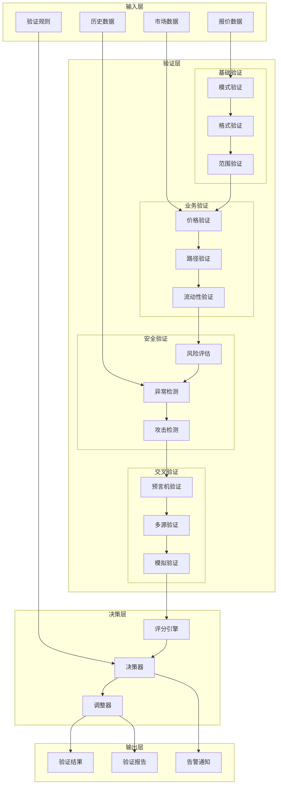
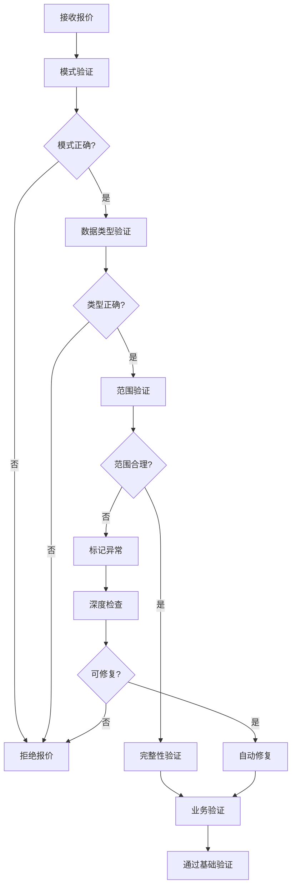
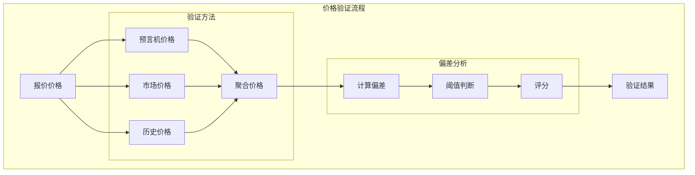
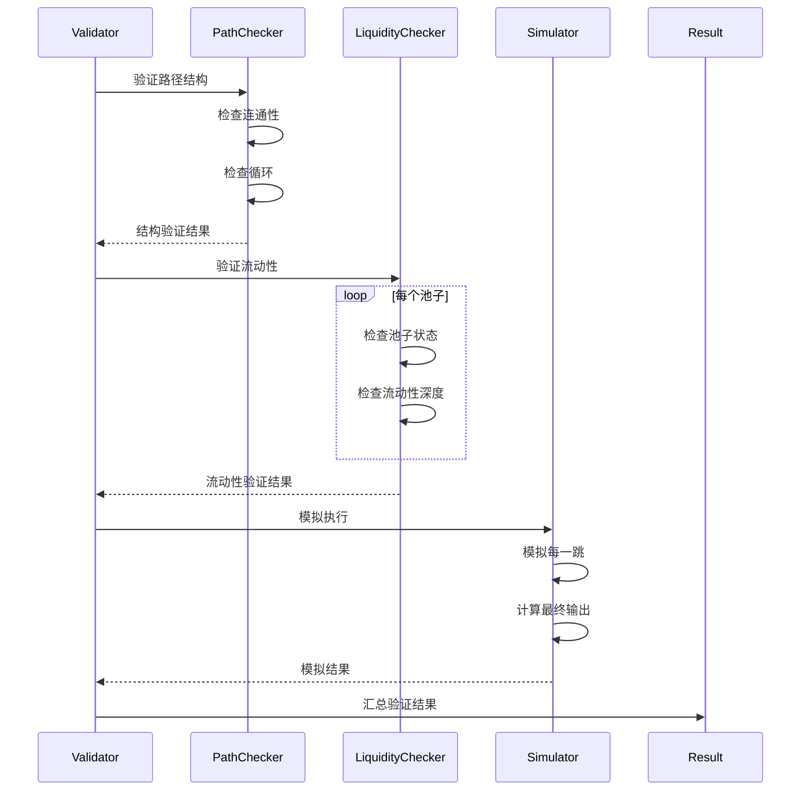
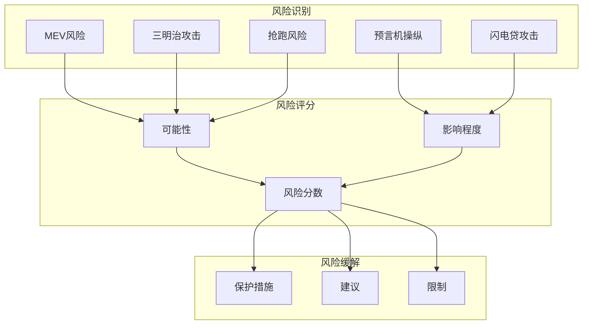

# 报价验证器(Quote Validator)详细设计

## 概述

报价验证器是报价服务的质量保障核心组件，负责对生成的报价进行全方位验证，确保报价的准确性、可执行性和安全性。它通过多维度检查、交叉验证和风险评估，为用户提供可信赖的交易报价。

## 核心职责

1. **完整性验证** - 验证报价数据完整性
2. **准确性验证** - 交叉验证价格准确性
3. **可执行性验证** - 确保路径可执行
4. **安全性验证** - 识别潜在风险
5. **合规性验证** - 符合业务规则
6. **异常检测** - 识别异常报价
7. **仿真验证** - 模拟执行验证
8. **审计追踪** - 记录验证过程

## 详细架构设计

### 系统架构



### 核心数据结构

```typescript
// 报价验证器主类
class QuoteValidator {
    private schemaValidator: SchemaValidator;
    private priceValidator: PriceValidator;
    private pathValidator: PathValidator;
    private riskAssessor: RiskAssessor;
    private anomalyDetector: AnomalyDetector;
    private simulator: ExecutionSimulator;

    // 验证结果
    interface ValidationResult {
        isValid: boolean;
        confidence: number;
        score: number;
        checks: ValidationCheck[];
        warnings: Warning[];
        errors: ValidationError[];
        suggestions: Suggestion[];
        metadata: ValidationMetadata;
    }

    // 验证检查项
    interface ValidationCheck {
        name: string;
        category: ValidationCategory;
        passed: boolean;
        score: number;
        details: any;
        timestamp: number;
    }

    // 验证规则
    interface ValidationRule {
        id: string;
        name: string;
        category: ValidationCategory;
        severity: Severity;
        condition: (quote: Quote) => boolean;
        action: ValidationAction;
        threshold?: number;
    }

    // 风险评估结果
    interface RiskAssessment {
        riskLevel: RiskLevel;
        riskScore: number;
        factors: RiskFactor[];
        mitigations: Mitigation[];
    }

    enum ValidationCategory {
        INTEGRITY = "integrity",
        ACCURACY = "accuracy",
        EXECUTABILITY = "executability",
        SECURITY = "security",
        COMPLIANCE = "compliance"
    }

    enum Severity {
        CRITICAL = "critical",
        HIGH = "high",
        MEDIUM = "medium",
        LOW = "low",
        INFO = "info"
    }
}
```

## 多层验证架构

### 1. 基础验证流程



### 2. 基础验证实现

```typescript
class BasicValidator {
    // 模式验证
    validateSchema(quote: any): SchemaValidation {
        const schema = this.getQuoteSchema();
        const validator = new AJV();
        const valid = validator.validate(schema, quote);

        if (!valid) {
            return {
                valid: false,
                errors: validator.errors.map(err => ({
                    path: err.instancePath,
                    message: err.message,
                    keyword: err.keyword,
                    params: err.params
                }))
            };
        }

        return { valid: true, errors: [] };
    }

    // 数据范围验证
    validateRanges(quote: Quote): RangeValidation {
        const violations: RangeViolation[] = [];

        // 价格范围检查
        if (quote.price.lte(0)) {
            violations.push({
                field: 'price',
                value: quote.price.toString(),
                reason: 'Price must be positive'
            });
        }

        // 滑点范围检查
        if (quote.slippage < 0 || quote.slippage > 1) {
            violations.push({
                field: 'slippage',
                value: quote.slippage,
                reason: 'Slippage must be between 0 and 1'
            });
        }

        // Gas范围检查
        const maxGas = BigNumber.from(30000000); // 30M gas limit
        if (quote.estimatedGas.gt(maxGas)) {
            violations.push({
                field: 'estimatedGas',
                value: quote.estimatedGas.toString(),
                reason: 'Gas exceeds maximum limit'
            });
        }

        // 时间戳检查
        const now = Date.now();
        const fiveMinutes = 5 * 60 * 1000;
        if (Math.abs(quote.timestamp - now) > fiveMinutes) {
            violations.push({
                field: 'timestamp',
                value: quote.timestamp,
                reason: 'Timestamp is too far from current time'
            });
        }

        return {
            valid: violations.length === 0,
            violations: violations
        };
    }

    // 完整性验证
    validateIntegrity(quote: Quote): IntegrityValidation {
        const checks: IntegrityCheck[] = [];

        // 检查必需字段
        checks.push(this.checkRequiredFields(quote));

        // 检查数据一致性
        checks.push(this.checkDataConsistency(quote));

        // 检查引用完整性
        checks.push(this.checkReferentialIntegrity(quote));

        // 检查计算正确性
        checks.push(this.checkCalculations(quote));

        const passed = checks.every(c => c.passed);

        return {
            valid: passed,
            checks: checks,
            integrity: this.calculateIntegrityScore(checks)
        };
    }

    // 数据一致性检查
    private checkDataConsistency(quote: Quote): IntegrityCheck {
        const issues: string[] = [];

        // 输入输出一致性
        const calculatedOutput = this.calculateExpectedOutput(
            quote.amountIn,
            quote.path
        );
        const deviation = calculatedOutput.sub(quote.amountOut).abs()
            .mul(10000)
            .div(quote.amountOut);

        if (deviation.gt(10)) { // > 0.1% 偏差
            issues.push(`Output deviation: ${deviation.toString()}bps`);
        }

        // 路径一致性
        if (quote.path.length === 0) {
            issues.push('Path is empty');
        }

        if (quote.path[0].tokenIn !== quote.tokenIn) {
            issues.push('Path start token mismatch');
        }

        if (quote.path[quote.path.length - 1].tokenOut !== quote.tokenOut) {
            issues.push('Path end token mismatch');
        }

        return {
            name: 'DataConsistency',
            passed: issues.length === 0,
            issues: issues
        };
    }
}
```

## 业务验证

### 1. 价格验证



### 2. 价格验证实现

```typescript
class PriceValidator {
    // 综合价格验证
    async validatePrice(quote: Quote): Promise<PriceValidation> {
        const validations = await Promise.all([
            this.validateAgainstOracle(quote),
            this.validateAgainstMarket(quote),
            this.validateAgainstHistory(quote),
            this.validatePriceImpact(quote)
        ]);

        const score = this.calculatePriceScore(validations);
        const isValid = score > this.config.priceValidityThreshold;

        return {
            valid: isValid,
            score: score,
            validations: validations,
            recommendation: this.getPriceRecommendation(score, validations)
        };
    }

    // 预言机价格验证
    private async validateAgainstOracle(quote: Quote): Promise<Validation> {
        const oraclePrice = await this.priceOracle.getPrice(
            quote.tokenIn,
            quote.tokenOut
        );

        const quotePrice = quote.amountOut.mul(PRECISION).div(quote.amountIn);
        const deviation = this.calculateDeviation(quotePrice, oraclePrice);

        return {
            type: 'oracle',
            passed: deviation < 0.02, // 2% 容差
            deviation: deviation,
            confidence: 0.9,
            details: {
                oraclePrice: oraclePrice.toString(),
                quotePrice: quotePrice.toString()
            }
        };
    }

    // 市场价格验证
    private async validateAgainstMarket(quote: Quote): Promise<Validation> {
        // 获取多个DEX的价格
        const marketPrices = await this.getMarketPrices(
            quote.tokenIn,
            quote.tokenOut,
            quote.amountIn
        );

        const avgMarketPrice = this.calculateWeightedAverage(marketPrices);
        const quotePrice = quote.amountOut.mul(PRECISION).div(quote.amountIn);
        const deviation = this.calculateDeviation(quotePrice, avgMarketPrice);

        return {
            type: 'market',
            passed: deviation < 0.015, // 1.5% 容差
            deviation: deviation,
            confidence: 0.85,
            details: {
                marketPrices: marketPrices,
                avgPrice: avgMarketPrice.toString(),
                sources: marketPrices.length
            }
        };
    }

    // 历史价格验证
    private async validateAgainstHistory(quote: Quote): Promise<Validation> {
        const history = await this.getHistoricalPrices(
            quote.tokenIn,
            quote.tokenOut,
            24 // 24小时
        );

        const ma = this.calculateMovingAverage(history);
        const stdDev = this.calculateStandardDeviation(history);
        const quotePrice = quote.amountOut.mul(PRECISION).div(quote.amountIn);

        // Z-score检验
        const zScore = quotePrice.sub(ma).abs().div(stdDev);

        return {
            type: 'history',
            passed: zScore.lt(3), // 3-sigma规则
            deviation: zScore.toNumber(),
            confidence: 0.7,
            details: {
                movingAverage: ma.toString(),
                standardDeviation: stdDev.toString(),
                zScore: zScore.toString()
            }
        };
    }

    // 价格影响验证
    private async validatePriceImpact(quote: Quote): Promise<Validation> {
        const impact = quote.priceImpact;
        let passed = true;
        let severity = 'low';

        if (impact > 0.1) { // > 10%
            passed = false;
            severity = 'critical';
        } else if (impact > 0.05) { // > 5%
            severity = 'high';
        } else if (impact > 0.03) { // > 3%
            severity = 'medium';
        }

        return {
            type: 'priceImpact',
            passed: passed,
            deviation: impact,
            confidence: 1.0,
            details: {
                impact: impact,
                severity: severity,
                threshold: 0.1
            }
        };
    }
}
```

## 路径验证

### 1. 路径验证流程



### 2. 路径验证实现

```typescript
class PathValidator {
    // 综合路径验证
    async validatePath(quote: Quote): Promise<PathValidation> {
        const checks = [
            this.validatePathStructure(quote.path),
            this.validatePathConnectivity(quote.path),
            this.validatePoolLiquidity(quote.path, quote.amountIn),
            await this.simulatePath(quote.path, quote.amountIn)
        ];

        const allPassed = checks.every(c => c.passed);
        const score = this.calculatePathScore(checks);

        return {
            valid: allPassed,
            score: score,
            checks: checks,
            alternativePaths: allPassed ? [] : await this.findAlternatives(quote)
        };
    }

    // 路径结构验证
    private validatePathStructure(path: Path[]): ValidationCheck {
        const issues: string[] = [];

        // 检查路径长度
        if (path.length === 0) {
            issues.push('Path is empty');
        }
        if (path.length > 5) {
            issues.push('Path too long (>5 hops)');
        }

        // 检查每一跳
        for (let i = 0; i < path.length; i++) {
            const hop = path[i];

            // 检查必需字段
            if (!hop.pool || !hop.tokenIn || !hop.tokenOut) {
                issues.push(`Hop ${i}: Missing required fields`);
            }

            // 检查连续性
            if (i > 0) {
                if (path[i - 1].tokenOut !== hop.tokenIn) {
                    issues.push(`Hop ${i}: Token mismatch`);
                }
            }
        }

        // 检查循环
        const tokens = new Set<string>();
        for (const hop of path) {
            if (tokens.has(hop.tokenIn)) {
                issues.push('Path contains cycle');
                break;
            }
            tokens.add(hop.tokenIn);
        }

        return {
            name: 'PathStructure',
            category: ValidationCategory.INTEGRITY,
            passed: issues.length === 0,
            score: issues.length === 0 ? 100 : 50 - (issues.length * 10),
            details: { issues }
        };
    }

    // 流动性验证
    private async validatePoolLiquidity(
        path: Path[],
        amountIn: BigNumber
    ): Promise<ValidationCheck> {
        let currentAmount = amountIn;
        const liquidityChecks: any[] = [];

        for (const hop of path) {
            const pool = await this.getPoolInfo(hop.pool);

            // 检查流动性是否充足
            const requiredLiquidity = currentAmount.mul(2); // 2x安全边际
            const sufficient = pool.liquidity.gte(requiredLiquidity);

            liquidityChecks.push({
                pool: hop.pool,
                required: requiredLiquidity.toString(),
                available: pool.liquidity.toString(),
                sufficient: sufficient
            });

            if (!sufficient) {
                return {
                    name: 'PoolLiquidity',
                    category: ValidationCategory.EXECUTABILITY,
                    passed: false,
                    score: 0,
                    details: {
                        failedPool: hop.pool,
                        checks: liquidityChecks
                    }
                };
            }

            // 计算下一跳的输入
            currentAmount = this.calculateOutput(currentAmount, pool);
        }

        return {
            name: 'PoolLiquidity',
            category: ValidationCategory.EXECUTABILITY,
            passed: true,
            score: 100,
            details: { checks: liquidityChecks }
        };
    }

    // 路径模拟
    private async simulatePath(
        path: Path[],
        amountIn: BigNumber
    ): Promise<ValidationCheck> {
        try {
            const simulation = await this.simulator.simulatePath(path, amountIn);

            const success = !simulation.reverted;
            const outputDeviation = this.calculateDeviation(
                simulation.output,
                path[path.length - 1].expectedOutput
            );

            return {
                name: 'PathSimulation',
                category: ValidationCategory.EXECUTABILITY,
                passed: success && outputDeviation < 0.01,
                score: success ? 100 - (outputDeviation * 1000) : 0,
                details: {
                    reverted: simulation.reverted,
                    output: simulation.output.toString(),
                    gasUsed: simulation.gasUsed.toString(),
                    deviation: outputDeviation
                }
            };
        } catch (error) {
            return {
                name: 'PathSimulation',
                category: ValidationCategory.EXECUTABILITY,
                passed: false,
                score: 0,
                details: { error: error.message }
            };
        }
    }
}
```

## 安全验证

### 1. 风险评估



### 2. 安全验证实现

```typescript
class SecurityValidator {
    // 综合安全验证
    async validateSecurity(quote: Quote): Promise<SecurityValidation> {
        const assessments = await Promise.all([
            this.assessMEVRisk(quote),
            this.detectSandwichAttack(quote),
            this.checkOracleManipulation(quote),
            this.detectAnomalies(quote),
            this.validateSafetyLimits(quote)
        ]);

        const overallRisk = this.calculateOverallRisk(assessments);

        return {
            valid: overallRisk.level !== 'critical',
            riskLevel: overallRisk.level,
            riskScore: overallRisk.score,
            assessments: assessments,
            mitigations: this.getMitigations(assessments)
        };
    }

    // MEV风险评估
    private async assessMEVRisk(quote: Quote): Promise<RiskAssessment> {
        const factors: RiskFactor[] = [];

        // 交易大小因子
        const sizeFactor = this.assessSizeFactor(quote.amountIn);
        factors.push(sizeFactor);

        // 价格影响因子
        const impactFactor = this.assessImpactFactor(quote.priceImpact);
        factors.push(impactFactor);

        // 路径复杂度因子
        const complexityFactor = this.assessComplexityFactor(quote.path);
        factors.push(complexityFactor);

        // 时间敏感度因子
        const timeFactor = this.assessTimeFactor(quote.deadline);
        factors.push(timeFactor);

        const score = this.calculateRiskScore(factors);

        return {
            type: 'MEV',
            score: score,
            level: this.getRiskLevel(score),
            factors: factors,
            mitigation: score > 50 ? 'Use private mempool or Flashbots' : null
        };
    }

    // 三明治攻击检测
    private async detectSandwichAttack(quote: Quote): Promise<RiskAssessment> {
        // 分析是否容易被三明治攻击
        const vulnerabilityScore = this.calculateSandwichVulnerability(quote);

        // 检查内存池
        const mempoolRisk = await this.analyzeMempoolRisk(quote);

        // 计算总体风险
        const score = (vulnerabilityScore * 0.6 + mempoolRisk * 0.4) * 100;

        return {
            type: 'Sandwich',
            score: score,
            level: this.getRiskLevel(score),
            factors: [
                { name: 'vulnerability', score: vulnerabilityScore },
                { name: 'mempool', score: mempoolRisk }
            ],
            mitigation: score > 60 ? 'Increase slippage or use MEV protection' : null
        };
    }

    // 预言机操纵检测
    private async checkOracleManipulation(quote: Quote): Promise<RiskAssessment> {
        const priceDeviations: number[] = [];

        // 检查每个池子的价格偏差
        for (const hop of quote.path) {
            const poolPrice = await this.getPoolPrice(hop.pool);
            const oraclePrice = await this.getOraclePrice(hop.tokenIn, hop.tokenOut);
            const deviation = this.calculateDeviation(poolPrice, oraclePrice);

            priceDeviations.push(deviation);
        }

        const maxDeviation = Math.max(...priceDeviations);
        const score = maxDeviation * 100;

        return {
            type: 'OracleManipulation',
            score: score,
            level: this.getRiskLevel(score),
            factors: [
                { name: 'maxDeviation', score: maxDeviation },
                { name: 'affectedPools', score: priceDeviations.filter(d => d > 0.05).length }
            ],
            mitigation: score > 70 ? 'Wait for price stabilization' : null
        };
    }

    // 异常检测
    private async detectAnomalies(quote: Quote): Promise<AnomalyDetection> {
        const anomalies: Anomaly[] = [];

        // 异常大额交易
        if (quote.amountIn.gt(this.getLargeTradeThreshold(quote.tokenIn))) {
            anomalies.push({
                type: 'LargeTrade',
                severity: 'high',
                details: 'Trade size exceeds normal threshold'
            });
        }

        // 异常滑点
        if (quote.slippage > 0.1) {
            anomalies.push({
                type: 'HighSlippage',
                severity: 'medium',
                details: `Slippage ${(quote.slippage * 100).toFixed(2)}% is unusually high`
            });
        }

        // 异常Gas
        if (quote.estimatedGas.gt(BigNumber.from(5000000))) {
            anomalies.push({
                type: 'HighGas',
                severity: 'low',
                details: 'Gas consumption is unusually high'
            });
        }

        // 异常路径
        if (quote.path.length > 4) {
            anomalies.push({
                type: 'ComplexPath',
                severity: 'medium',
                details: 'Path has too many hops'
            });
        }

        return {
            hasAnomalies: anomalies.length > 0,
            anomalies: anomalies,
            recommendation: this.getAnomalyRecommendation(anomalies)
        };
    }
}
```

## 仿真验证

### 1. 执行仿真

```typescript
class ExecutionSimulator {
    // 完整交易仿真
    async simulateExecution(quote: Quote): Promise<SimulationResult> {
        // 创建fork环境
        const fork = await this.createFork();

        try {
            // 设置初始状态
            await this.setupInitialState(fork, quote);

            // 逐跳模拟
            const hopResults: HopSimulation[] = [];
            let currentInput = quote.amountIn;

            for (const hop of quote.path) {
                const result = await this.simulateHop(fork, hop, currentInput);
                hopResults.push(result);

                if (result.reverted) {
                    return {
                        success: false,
                        reverted: true,
                        revertReason: result.revertReason,
                        hopResults: hopResults
                    };
                }

                currentInput = result.output;
            }

            // 验证最终输出
            const finalOutput = currentInput;
            const expectedOutput = quote.amountOut;
            const deviation = this.calculateDeviation(finalOutput, expectedOutput);

            return {
                success: true,
                reverted: false,
                output: finalOutput,
                expectedOutput: expectedOutput,
                deviation: deviation,
                gasUsed: this.sumGasUsed(hopResults),
                hopResults: hopResults
            };
        } finally {
            // 清理fork
            await this.cleanupFork(fork);
        }
    }

    // 模拟单跳
    private async simulateHop(
        fork: any,
        hop: Path,
        amountIn: BigNumber
    ): Promise<HopSimulation> {
        try {
            const pool = await fork.getContract(hop.pool);

            // 执行swap
            const tx = await pool.swap(
                hop.tokenIn,
                hop.tokenOut,
                amountIn,
                0, // minAmountOut
                fork.signer.address
            );

            const receipt = await tx.wait();

            // 解析事件获取实际输出
            const swapEvent = receipt.events.find(e => e.event === 'Swap');
            const actualOutput = swapEvent.args.amountOut;

            return {
                success: true,
                reverted: false,
                input: amountIn,
                output: actualOutput,
                gasUsed: receipt.gasUsed,
                events: receipt.events
            };
        } catch (error) {
            return {
                success: false,
                reverted: true,
                revertReason: error.message,
                input: amountIn,
                output: BigNumber.from(0),
                gasUsed: BigNumber.from(0)
            };
        }
    }
}
```

## 决策引擎

### 1. 综合评分

```typescript
class ValidationScorer {
    // 计算综合评分
    calculateOverallScore(validations: ValidationResult[]): Score {
        // 权重配置
        const weights = {
            integrity: 0.2,
            accuracy: 0.25,
            executability: 0.25,
            security: 0.2,
            compliance: 0.1
        };

        let weightedSum = 0;
        let totalWeight = 0;

        for (const validation of validations) {
            const weight = weights[validation.category] || 0.1;
            weightedSum += validation.score * weight;
            totalWeight += weight;
        }

        const overallScore = weightedSum / totalWeight;

        return {
            value: overallScore,
            grade: this.getGrade(overallScore),
            confidence: this.calculateConfidence(validations),
            breakdown: this.getScoreBreakdown(validations, weights)
        };
    }

    // 评级
    private getGrade(score: number): Grade {
        if (score >= 95) return 'A+';
        if (score >= 90) return 'A';
        if (score >= 85) return 'B+';
        if (score >= 80) return 'B';
        if (score >= 75) return 'C+';
        if (score >= 70) return 'C';
        if (score >= 60) return 'D';
        return 'F';
    }

    // 置信度计算
    private calculateConfidence(validations: ValidationResult[]): number {
        // 基于验证的一致性计算置信度
        const scores = validations.map(v => v.score);
        const mean = scores.reduce((a, b) => a + b, 0) / scores.length;
        const variance = scores.reduce((sum, s) => sum + Math.pow(s - mean, 2), 0) / scores.length;
        const stdDev = Math.sqrt(variance);

        // 标准差越小，置信度越高
        const confidence = Math.max(0, 1 - (stdDev / 50));

        return confidence;
    }
}
```

### 2. 决策制定

```typescript
class ValidationDecisionMaker {
    // 制定验证决策
    makeDecision(result: ValidationResult): Decision {
        const score = result.score;
        const riskLevel = result.riskAssessment.level;

        // 决策矩阵
        if (score >= 90 && riskLevel === 'low') {
            return {
                action: 'APPROVE',
                confidence: 'high',
                conditions: []
            };
        }

        if (score >= 80 && riskLevel !== 'critical') {
            return {
                action: 'APPROVE_WITH_WARNING',
                confidence: 'medium',
                conditions: this.getWarningConditions(result)
            };
        }

        if (score >= 70 && riskLevel === 'medium') {
            return {
                action: 'REQUIRE_CONFIRMATION',
                confidence: 'low',
                conditions: this.getConfirmationRequirements(result)
            };
        }

        return {
            action: 'REJECT',
            confidence: 'high',
            conditions: [],
            reasons: this.getRejectionReasons(result)
        };
    }

    // 自动调整建议
    generateAdjustments(result: ValidationResult): Adjustment[] {
        const adjustments: Adjustment[] = [];

        // 滑点调整
        if (result.warnings.some(w => w.type === 'high_slippage')) {
            adjustments.push({
                type: 'slippage',
                current: result.quote.slippage,
                suggested: Math.min(result.quote.slippage * 1.5, 0.1),
                reason: 'High price impact detected'
            });
        }

        // 路径调整
        if (result.warnings.some(w => w.type === 'complex_path')) {
            adjustments.push({
                type: 'path',
                current: result.quote.path,
                suggested: result.alternativePaths[0],
                reason: 'Simpler path available'
            });
        }

        return adjustments;
    }
}
```

## 审计追踪

```typescript
class ValidationAuditor {
    // 记录验证过程
    async auditValidation(
        quote: Quote,
        result: ValidationResult
    ): Promise<AuditRecord> {
        const record: AuditRecord = {
            id: this.generateAuditId(),
            timestamp: Date.now(),
            quoteId: quote.id,
            validationResult: result,

            // 输入快照
            input: {
                quote: this.snapshotQuote(quote),
                marketConditions: await this.snapshotMarket(),
                rules: this.snapshotRules()
            },

            // 验证详情
            validations: result.checks.map(check => ({
                name: check.name,
                result: check.passed,
                score: check.score,
                duration: check.duration,
                details: check.details
            })),

            // 决策记录
            decision: {
                action: result.decision.action,
                score: result.score,
                riskLevel: result.riskAssessment.level,
                adjustments: result.adjustments
            },

            // 元数据
            metadata: {
                validatorVersion: this.version,
                rulesVersion: this.rulesVersion,
                environment: this.environment
            }
        };

        // 持久化审计记录
        await this.persistAuditRecord(record);

        // 发送到审计系统
        await this.sendToAuditSystem(record);

        return record;
    }
}
```

## 监控指标

```yaml
验证质量:
  - 验证准确率: > 99%
  - 误报率: < 1%
  - 漏报率: < 0.1%
  - 平均验证分数: > 85

性能指标:
  - 验证延迟: < 50ms (P99)
  - 并发验证: > 100 quotes/s
  - 仿真延迟: < 200ms

安全指标:
  - 风险检测率: > 99%
  - MEV保护率: > 95%
  - 异常识别率: > 98%

可靠性:
  - 服务可用性: 99.99%
  - 规则更新频率: 实时
  - 审计完整性: 100%
```

## 总结

报价验证器通过多层验证、交叉检查和智能决策，确保报价的质量和安全性。关键创新：

1. **多维验证** - 完整性、准确性、可执行性、安全性全方位检查
2. **交叉验证** - 多源数据交叉验证提高准确性
3. **风险评估** - 全面的风险识别和缓解策略
4. **仿真验证** - Fork环境下的真实执行验证
5. **智能决策** - 基于评分的自动决策和调整建议