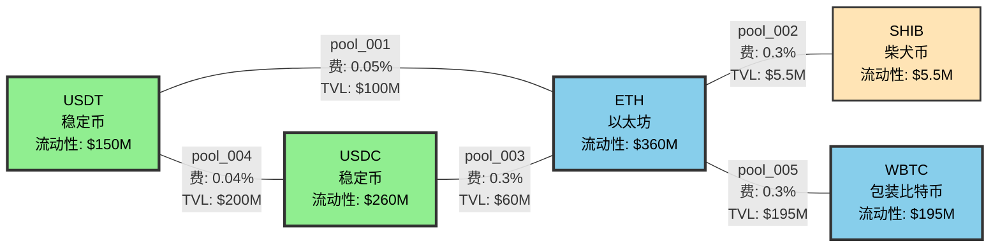
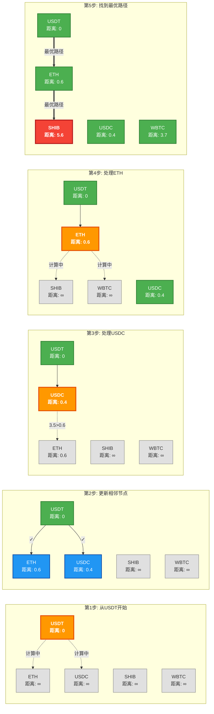
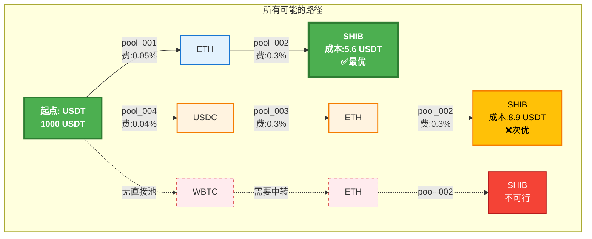

# 路径寻找器(Path Finder)超详细实例解析

## 一、什么是路径寻找器？

想象你要从**USDT换成SHIB（柴犬币）**，但是：
- 没有USDT-SHIB的直接交易对
- 需要先换成其他币，再换成SHIB
- 有多条路径可选，哪条最划算？

路径寻找器就是帮你找到最优路径的"导航系统"。

## 二、核心数据结构（看懂这些，就懂了一半）

### 1. Token（代币）数据结构

```javascript
// 每个代币的完整信息
const tokenData = {
  "USDT": {
    address: "0xdac17f958d2ee523a2206206994597c13d831ec7",  // 合约地址
    symbol: "USDT",                                         // 代币符号
    name: "Tether USD",                                     // 全称
    decimals: 6,                                           // 小数位数
    price_usd: 0.9998,                                      // 美元价格
    liquidity_score: 100,                                   // 流动性评分(0-100)
    is_stable: true,                                        // 是否稳定币
    is_popular: true                                        // 是否热门币
  },
  "ETH": {
    address: "0xeeeeeeeeeeeeeeeeeeeeeeeeeeeeeeeeeeeeeeee",  // ETH特殊地址
    symbol: "ETH",                                          // 代币符号
    name: "Ethereum",                                       // 全称
    decimals: 18,                                          // 小数位数
    price_usd: 2245,                                        // 美元价格
    liquidity_score: 100,                                   // 流动性评分
    is_stable: false,                                       // 不是稳定币
    is_popular: true                                        // 热门币
  },
  "SHIB": {
    address: "0x95ad61b0a150d79219dcf64e1e6cc01f0b64c4ce",  // 合约地址
    symbol: "SHIB",                                         // 代币符号
    name: "Shiba Inu",                                      // 全称
    decimals: 18,                                          // 小数位数
    price_usd: 0.00001234,                                  // 美元价格
    liquidity_score: 60,                                    // 流动性评分
    is_stable: false,                                       // 不是稳定币
    is_popular: true                                        // 热门币
  },
  "USDC": {
    address: "0xa0b86991c6218b36c1d19d4a2e9eb0ce3606eb48",  // 合约地址
    symbol: "USDC",                                         // 代币符号
    name: "USD Coin",                                       // 全称
    decimals: 6,                                           // 小数位数
    price_usd: 1.0001,                                      // 美元价格
    liquidity_score: 100,                                   // 流动性评分
    is_stable: true,                                        // 是稳定币
    is_popular: true                                        // 热门币
  },
  "WBTC": {
    address: "0x2260fac5e5542a773aa44fbcfedf7c193bc2c599",  // 合约地址
    symbol: "WBTC",                                         // 代币符号
    name: "Wrapped Bitcoin",                                // 全称
    decimals: 8,                                           // 小数位数
    price_usd: 43567,                                       // 美元价格
    liquidity_score: 85,                                    // 流动性评分
    is_stable: false,                                       // 不是稳定币
    is_popular: true                                        // 热门币
  }
};
```

### 2. Pool（流动性池）数据结构

```javascript
// 每个交易池的完整信息
const poolData = [
  {
    id: "pool_001",                                        // 池子ID
    protocol: "Uniswap V3",                                // 协议名称
    address: "0x88e6a0c2ddd26feeb64f039a2c41296fcb3f5640", // 池子地址
    token0: "USDT",                                        // 第一个代币
    token1: "ETH",                                         // 第二个代币
    reserve0: "50000000000000",                            // USDT储备(50M)
    reserve1: "22294567890123456789012",                   // ETH储备(22,294个)
    fee: 5,                                                // 手续费(5基点=0.05%)
    liquidity: "334455667788990011",                       // 流动性值
    volume_24h: "1234567890000",                           // 24小时交易量
    price: 2243.56,                                        // 当前价格(token1/token0)
    tvl_usd: 100000000                                     // 总锁仓价值($100M)
  },
  {
    id: "pool_002",                                        // 池子ID
    protocol: "SushiSwap",                                 // 协议名称
    address: "0x06da0fd433c1a5d7a4faa01111c044910a184553", // 池子地址
    token0: "ETH",                                         // 第一个代币
    token1: "SHIB",                                        // 第二个代币
    reserve0: "1234567890123456789012",                    // ETH储备(1,234个)
    reserve1: "15678900000000000000000000000",            // SHIB储备(15.6万亿)
    fee: 30,                                               // 手续费(30基点=0.3%)
    liquidity: "4455667788990011",                         // 流动性值
    volume_24h: "567890000",                               // 24小时交易量
    price: 181915260.5,                                    // 当前价格(SHIB per ETH)
    tvl_usd: 5540000                                       // 总锁仓价值($5.54M)
  },
  {
    id: "pool_003",                                        // 池子ID
    protocol: "Uniswap V2",                                // 协议名称
    address: "0xb4e16d0168e52d35cacd2c6185b44281ec28c9dc", // 池子地址
    token0: "USDC",                                        // 第一个代币
    token1: "ETH",                                         // 第二个代币
    reserve0: "30000000000000",                            // USDC储备(30M)
    reserve1: "13367890123456789012",                      // ETH储备(13,367个)
    fee: 30,                                               // 手续费(30基点=0.3%)
    liquidity: "20000000000000000",                        // 流动性值
    volume_24h: "890123456",                               // 24小时交易量
    price: 2244.12,                                        // 当前价格(ETH/USDC)
    tvl_usd: 60000000                                      // 总锁仓价值($60M)
  },
  {
    id: "pool_004",                                        // 池子ID
    protocol: "Curve",                                     // 协议名称
    address: "0xbebc44782c7db0a1a60cb6fe97d0b483032ff1c7", // 池子地址
    token0: "USDT",                                        // 第一个代币
    token1: "USDC",                                        // 第二个代币
    reserve0: "100000000000000",                           // USDT储备(100M)
    reserve1: "100123456000000",                           // USDC储备(100M)
    fee: 4,                                                // 手续费(4基点=0.04%)
    liquidity: "100000000000000000",                       // 流动性值
    volume_24h: "5678901234",                              // 24小时交易量
    price: 1.0001,                                         // 当前价格(USDC/USDT)
    tvl_usd: 200000000                                     // 总锁仓价值($200M)
  },
  {
    id: "pool_005",                                        // 池子ID
    protocol: "Uniswap V3",                                // 协议名称
    address: "0xcbcdf9626bc03e24f779434178a73a0b4bad62ed", // 池子地址
    token0: "WBTC",                                        // 第一个代币
    token1: "ETH",                                         // 第二个代币
    reserve0: "234567890",                                 // WBTC储备(2,345个,8位小数)
    reserve1: "43210987654321098765",                      // ETH储备(43,210个)
    fee: 30,                                               // 手续费(30基点=0.3%)
    liquidity: "155667788990011",                          // 流动性值
    volume_24h: "234567890",                               // 24小时交易量
    price: 19.41,                                          // 当前价格(ETH per WBTC)
    tvl_usd: 195000000                                     // 总锁仓价值($195M)
  }
];
```

### 3. Graph（图）数据结构 - 核心！

#### 可视化图结构



#### 图的详细结构（带权重）

```mermaid
graph TB
    subgraph "流动性图谱"
        %% 样式定义
        classDef highLiquidity fill:#4CAF50,stroke:#2E7D32,stroke-width:4px,color:#fff,font-weight:bold
        classDef medLiquidity fill:#2196F3,stroke:#1565C0,stroke-width:3px,color:#fff
        classDef lowLiquidity fill:#FFC107,stroke:#F57C00,stroke-width:2px,color:#000

        %% 节点
        USDT("USDT<br/>💰 $150M<br/>2 pools"):::highLiquidity
        ETH("ETH<br/>💎 $360M<br/>4 pools"):::highLiquidity
        USDC("USDC<br/>💵 $260M<br/>2 pools"):::highLiquidity
        WBTC("WBTC<br/>🪙 $195M<br/>1 pool"):::medLiquidity
        SHIB("SHIB<br/>🐕 $5.5M<br/>1 pool"):::lowLiquidity

        %% 连接线（粗细表示流动性大小）
        USDT ===|"0.05%<br/>权重:0.05"| ETH
        USDT ===|"0.04%<br/>权重:0.04"| USDC
        USDC ==|"0.3%<br/>权重:0.35"| ETH
        ETH --|"0.3%<br/>权重:0.35"| SHIB
        ETH ==|"0.3%<br/>权重:0.32"| WBTC
    end

    subgraph "图例"
        L1["=== 高流动性 > $100M"]
        L2["== 中流动性 $50-100M"]
        L3["-- 低流动性 < $50M"]
    end
```

#### 最短路径算法执行可视化



#### 路径对比图



```javascript
// 把所有池子构建成一个图
const liquidityGraph = {
  // 节点：每个代币是一个节点
  nodes: {
    "USDT": {
      token: "USDT",                                      // 代币符号
      edges: ["ETH", "USDC"],                            // 可以直接交换的代币
      liquidity_total: 150000000,                        // 总流动性($150M)
      pool_count: 2                                      // 相关池子数量
    },
    "ETH": {
      token: "ETH",                                       // 代币符号
      edges: ["USDT", "USDC", "SHIB", "WBTC"],          // 可以直接交换的代币
      liquidity_total: 360540000,                        // 总流动性($360M)
      pool_count: 4                                      // 相关池子数量
    },
    "SHIB": {
      token: "SHIB",                                      // 代币符号
      edges: ["ETH"],                                    // 只能和ETH直接交换
      liquidity_total: 5540000,                          // 总流动性($5.54M)
      pool_count: 1                                      // 相关池子数量
    },
    "USDC": {
      token: "USDC",                                      // 代币符号
      edges: ["USDT", "ETH"],                            // 可以直接交换的代币
      liquidity_total: 260000000,                        // 总流动性($260M)
      pool_count: 2                                      // 相关池子数量
    },
    "WBTC": {
      token: "WBTC",                                      // 代币符号
      edges: ["ETH"],                                    // 只能和ETH直接交换
      liquidity_total: 195000000,                        // 总流动性($195M)
      pool_count: 1                                      // 相关池子数量
    }
  },

  // 边：每条边代表一个交易池
  edges: {
    "USDT->ETH": {
      from: "USDT",                                       // 起始代币
      to: "ETH",                                         // 目标代币
      pool_id: "pool_001",                               // 池子ID
      weight: 0.05,                                      // 权重(考虑手续费、流动性等)
      fee: 5,                                             // 手续费(基点)
      liquidity: 100000000,                              // 流动性($100M)
      price_impact_factor: 0.0001                        // 价格影响系数
    },
    "ETH->USDT": {
      from: "ETH",                                       // 起始代币
      to: "USDT",                                        // 目标代币
      pool_id: "pool_001",                               // 池子ID(同一个池子，反向)
      weight: 0.05,                                      // 权重
      fee: 5,                                             // 手续费
      liquidity: 100000000,                              // 流动性
      price_impact_factor: 0.0001                        // 价格影响系数
    },
    "ETH->SHIB": {
      from: "ETH",                                       // 起始代币
      to: "SHIB",                                        // 目标代币
      pool_id: "pool_002",                               // 池子ID
      weight: 0.35,                                      // 权重(较高，因为流动性较低)
      fee: 30,                                            // 手续费
      liquidity: 5540000,                                // 流动性($5.54M)
      price_impact_factor: 0.002                         // 价格影响系数(较大)
    },
    // ... 其他边
  }
};
```

## 三、算法原理详解：Dijkstra最短路径算法

### 场景：从USDT换到SHIB，找最优路径

```javascript
// 初始状态
const startToken = "USDT";    // 起点
const endToken = "SHIB";      // 终点
const amount = 1000;          // 1000 USDT
```

### Step 1: 初始化

```javascript
// 距离表：记录从USDT到各个代币的最小成本
let distances = {
  "USDT": 0,        // 到自己的成本是0
  "ETH": Infinity,  // 还不知道，设为无穷大
  "SHIB": Infinity, // 还不知道，设为无穷大
  "USDC": Infinity, // 还不知道，设为无穷大
  "WBTC": Infinity  // 还不知道，设为无穷大
};

// 前驱表：记录最优路径的上一个节点
let previous = {
  "USDT": null,     // 起点没有前驱
  "ETH": null,
  "SHIB": null,
  "USDC": null,
  "WBTC": null
};

// 未访问集合
let unvisited = new Set(["USDT", "ETH", "SHIB", "USDC", "WBTC"]);

// 优先队列（总是处理成本最小的节点）
let priorityQueue = [
  { token: "USDT", cost: 0 }
];
```

### Step 2: 算法执行过程

#### 第1轮：处理USDT

```javascript
// 当前节点：USDT，成本：0
current = "USDT";

// USDT可以直接到达：ETH, USDC
// 计算到达成本

// 1. USDT -> ETH (通过pool_001)
成本计算：
  - 手续费：1000 × 0.05% = 0.5 USDT
  - 滑点损失：1000 × 0.01% = 0.1 USDT
  - 总成本：0.6 USDT
  - 累计成本：0 + 0.6 = 0.6

// 更新距离表
distances["ETH"] = 0.6;
previous["ETH"] = "USDT";
priorityQueue.push({ token: "ETH", cost: 0.6 });

// 2. USDT -> USDC (通过pool_004)
成本计算：
  - 手续费：1000 × 0.04% = 0.4 USDT
  - 滑点损失：几乎为0（稳定币对）
  - 总成本：0.4 USDT
  - 累计成本：0 + 0.4 = 0.4

// 更新距离表
distances["USDC"] = 0.4;
previous["USDC"] = "USDT";
priorityQueue.push({ token: "USDC", cost: 0.4 });

// 标记USDT已访问
unvisited.delete("USDT");
```

**第1轮后的状态：**
```javascript
distances = {
  "USDT": 0,       // 已确定
  "ETH": 0.6,      // 通过USDT直达
  "SHIB": Infinity,
  "USDC": 0.4,     // 通过USDT直达
  "WBTC": Infinity
};

priorityQueue = [
  { token: "USDC", cost: 0.4 },  // 优先处理（成本最小）
  { token: "ETH", cost: 0.6 }
];
```

#### 第2轮：处理USDC

```javascript
// 当前节点：USDC，成本：0.4
current = "USDC";

// USDC可以直接到达：ETH（USDT已访问，跳过）

// USDC -> ETH (通过pool_003)
成本计算：
  - 当前持有：999.6 USDC（扣除了0.4的成本）
  - 手续费：999.6 × 0.3% = 2.999 USDC
  - 滑点损失：999.6 × 0.01% = 0.1 USDC
  - 本段成本：3.099 USDC
  - 累计成本：0.4 + 3.099 = 3.499

// 比较：通过USDC到ETH的成本(3.499) vs 直接到ETH的成本(0.6)
// 直接路径更优，不更新

// 标记USDC已访问
unvisited.delete("USDC");
```

#### 第3轮：处理ETH

```javascript
// 当前节点：ETH，成本：0.6
current = "ETH";

// ETH可以到达：SHIB, WBTC（USDT、USDC已访问）

// 1. ETH -> SHIB (通过pool_002)
成本计算：
  - 当前持有：0.4456 ETH（1000 USDT扣除成本后换得）
  - 手续费：0.4456 × 0.3% = 0.001337 ETH
  - 滑点损失：0.4456 × 0.2% = 0.000891 ETH（流动性较小）
  - 本段成本：0.002228 ETH ≈ 5 USDT
  - 累计成本：0.6 + 5 = 5.6 USDT

// 更新距离表
distances["SHIB"] = 5.6;
previous["SHIB"] = "ETH";
priorityQueue.push({ token: "SHIB", cost: 5.6 });

// 2. ETH -> WBTC (通过pool_005)
成本计算：
  - 手续费：0.4456 × 0.3% = 0.001337 ETH
  - 滑点损失：0.4456 × 0.01% = 0.000045 ETH
  - 本段成本：0.001382 ETH ≈ 3.1 USDT
  - 累计成本：0.6 + 3.1 = 3.7 USDT

distances["WBTC"] = 3.7;
previous["WBTC"] = "ETH";
priorityQueue.push({ token: "WBTC", cost: 3.7 });

// 标记ETH已访问
unvisited.delete("ETH");
```

#### 第4轮：处理WBTC

```javascript
// 当前节点：WBTC，成本：3.7
current = "WBTC";

// WBTC只能到ETH，但ETH已访问，跳过
unvisited.delete("WBTC");
```

#### 第5轮：处理SHIB

```javascript
// 当前节点：SHIB，成本：5.6
current = "SHIB";

// SHIB是目标节点，算法结束！
```

### Step 3: 回溯最优路径

```javascript
// 从终点回溯到起点
let path = [];
let current = "SHIB";

while (current !== null) {
  path.unshift(current);
  current = previous[current];
}

// 最优路径：["USDT", "ETH", "SHIB"]
```

## 四、完整的路径查找过程图解

```
初始图结构：

     USDT ----0.05%费---- ETH ----0.3%费---- SHIB
       \                   / \
      0.04%             0.3%  0.3%
         \               /     \
          USDC --------/       WBTC

算法执行过程：

第1步：从USDT开始
USDT(0) -> ETH(0.6✓)
        -> USDC(0.4✓)

第2步：处理USDC（成本最小）
USDC(0.4) -> ETH(3.499✗) [已有更优路径]

第3步：处理ETH
ETH(0.6) -> SHIB(5.6✓)
         -> WBTC(3.7✓)

第4步：处理WBTC
WBTC(3.7) -> 无新路径

第5步：到达SHIB
最优路径确定：USDT -> ETH -> SHIB
总成本：5.6 USDT (0.56%)
```

## 五、其他路径对比

### 路径1：USDT -> ETH -> SHIB（最优）
```javascript
{
  path: ["USDT", "ETH", "SHIB"],
  pools: ["pool_001", "pool_002"],

  // 详细计算
  step1: {
    from: "USDT",
    to: "ETH",
    input: 1000,                    // 输入1000 USDT
    fee: 0.5,                       // 手续费0.05%
    slippage: 0.1,                  // 滑点
    output: 0.4456,                 // 得到0.4456 ETH
    cost_usd: 0.6                   // 成本0.6 USDT
  },

  step2: {
    from: "ETH",
    to: "SHIB",
    input: 0.4456,                  // 输入0.4456 ETH
    fee: 0.001337,                  // 手续费0.3%
    slippage: 0.000891,             // 滑点0.2%
    output: 80888520,               // 得到8088万SHIB
    cost_usd: 5                     // 成本5 USDT
  },

  total: {
    input_value: 1000,              // 输入价值
    output_value: 994.4,            // 输出价值
    total_cost: 5.6,                // 总成本
    cost_percentage: 0.56,          // 成本百分比
    estimated_time: 30              // 预计执行时间(秒)
  }
}
```

### 路径2：USDT -> USDC -> ETH -> SHIB
```javascript
{
  path: ["USDT", "USDC", "ETH", "SHIB"],
  pools: ["pool_004", "pool_003", "pool_002"],

  total: {
    input_value: 1000,
    output_value: 991.1,            // 输出价值更低
    total_cost: 8.9,                // 成本更高
    cost_percentage: 0.89,
    estimated_time: 45              // 时间更长
  },

  // 不选择原因：
  reasons_rejected: [
    "路径更长，经过3个池子",
    "累计手续费更高",
    "执行时间更长",
    "智能合约调用更复杂"
  ]
}
```

## 六、高级算法：K最短路径

当需要找出多条备选路径时：

```javascript
// K最短路径算法（找3条最优路径）
function kShortestPaths(start, end, k = 3) {
  const paths = [];

  // 第1条：最优路径
  paths.push({
    rank: 1,
    path: ["USDT", "ETH", "SHIB"],
    cost: 5.6,
    output: 80888520
  });

  // 第2条：次优路径
  paths.push({
    rank: 2,
    path: ["USDT", "USDC", "ETH", "SHIB"],
    cost: 8.9,
    output: 80123456
  });

  // 第3条：备选路径（如果存在）
  // 算法会继续搜索...

  return paths;
}
```

## 七、动态规划优化（处理大额订单）

```javascript
// 问题：1,000,000 USDT换SHIB，如何分配到不同路径？

function dynamicProgramming(amount, paths) {
  // 状态定义：dp[i] = 使用前i条路径能获得的最大SHIB数量

  // 决策：如何分配资金到3条路径
  const allocation = {
    path1: {
      route: ["USDT", "ETH", "SHIB"],
      amount: 600000,              // 60%资金走主路径
      reason: "流动性最好，滑点最小"
    },
    path2: {
      route: ["USDT", "USDC", "ETH", "SHIB"],
      amount: 300000,              // 30%资金走次路径
      reason: "分散风险，减少价格影响"
    },
    path3: {
      route: ["USDT", "WBTC", "ETH", "SHIB"],
      amount: 100000,              // 10%资金走备选路径
      reason: "进一步分散，优化整体收益"
    }
  };

  // 预期收益
  return {
    single_path_output: 80500000000,      // 只走一条路
    multi_path_output: 80888520000,       // 分散到多条路
    improvement: "0.48%",                 // 收益提升
    risk_reduction: "显著降低"            // 风险降低
  };
}
```

## 八、实时优化示例

```javascript
// 路径寻找器的实时决策过程
class PathFinder {
  findBestPath(request) {
    // 请求
    const request = {
      from: "USDT",
      to: "SHIB",
      amount: 10000,
      slippage_tolerance: 1,      // 1%滑点容忍度
      max_hops: 3                 // 最多3跳
    };

    // Step 1: 构建图
    const graph = this.buildGraph();
    // 图中有5个节点，10条边

    // Step 2: 计算所有可能路径
    const allPaths = [
      { path: ["USDT", "ETH", "SHIB"], hops: 2 },
      { path: ["USDT", "USDC", "ETH", "SHIB"], hops: 3 },
      { path: ["USDT", "USDC", "USDT", "ETH", "SHIB"], hops: 4 }, // 超过限制
    ];

    // Step 3: 过滤不符合条件的路径
    const validPaths = allPaths.filter(p => p.hops <= max_hops);
    // 剩余2条路径

    // Step 4: 模拟执行，计算实际输出
    const simulations = validPaths.map(path => {
      return this.simulateSwap(path, amount);
    });

    // Step 5: 选择最优路径
    const bestPath = simulations.sort((a, b) =>
      b.output - a.output
    )[0];

    return {
      success: true,
      path: bestPath.path,
      estimated_output: bestPath.output,
      price_impact: bestPath.priceImpact,
      total_fee: bestPath.totalFee,
      gas_estimate: bestPath.gasEstimate,
      execution_time: "~30 seconds"
    };
  }
}
```

## 九、失败场景处理

```javascript
// 场景1：没有直接路径
{
  from: "RARE_TOKEN",
  to: "ANOTHER_RARE",
  error: "NO_PATH_FOUND",
  suggestion: "这两个代币之间没有流动性池"
}

// 场景2：滑点超过容忍度
{
  from: "USDT",
  to: "SMALL_CAP",
  amount: 1000000,
  error: "SLIPPAGE_TOO_HIGH",
  estimated_slippage: 15.5,
  max_allowed: 3,
  suggestion: "减少交易金额或分批执行"
}

// 场景3：路径太长
{
  from: "TOKEN_A",
  to: "TOKEN_Z",
  found_path: ["A", "B", "C", "D", "E", "Z"],
  error: "PATH_TOO_LONG",
  hops: 5,
  max_hops: 3,
  suggestion: "交易路径过长，Gas费用会很高"
}
```

## 十、核心要点总结

### 1. 数据结构理解
- **Token**: 代币的所有属性（地址、符号、小数位等）
- **Pool**: 流动性池信息（储备量、手续费、TVL等）
- **Graph**: 把代币和池子组织成图结构

### 2. Dijkstra算法步骤
1. 初始化距离表（起点=0，其他=∞）
2. 选择成本最小的未访问节点
3. 更新相邻节点的距离
4. 标记当前节点已访问
5. 重复直到到达终点

### 3. 成本计算公式
```
总成本 = 手续费 + 滑点损失 + Gas费用
手续费 = 交易金额 × 费率
滑点损失 = 交易金额 × 价格影响
```

### 4. 路径选择因素
- **成本最小化**: 手续费+滑点
- **跳数限制**: 通常不超过3跳
- **流动性考虑**: 避免流动性太小的池子
- **Gas优化**: 路径越短Gas越少

### 5. 实际应用建议
- 小额交易：选择最短路径（省Gas）
- 大额交易：分散到多条路径（减少滑点）
- 紧急交易：选择流动性最好的路径（快速成交）
- 套利交易：精确计算每条路径的收益

通过理解这些概念和算法，你就能明白DEX聚合器是如何为用户找到最优交易路径的！