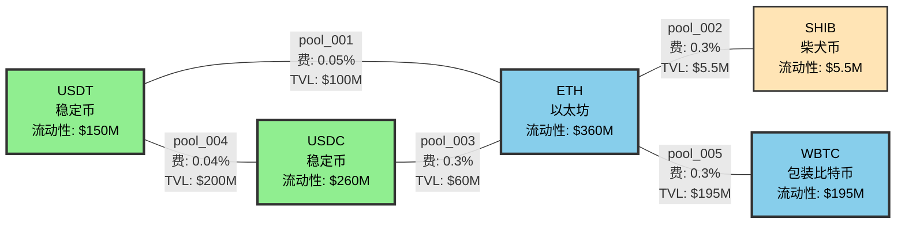
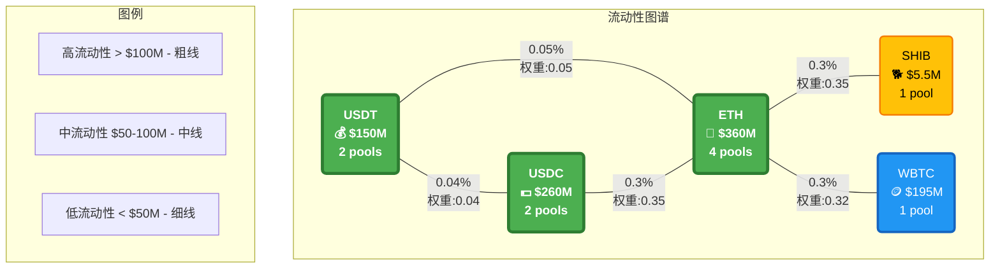
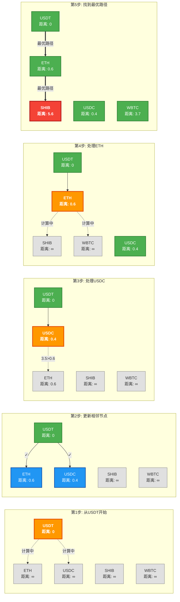
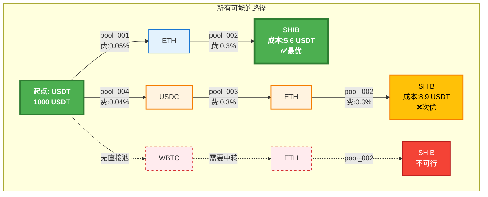

# 路径寻找器(Path Finder)超详细实例解析

## 一、什么是路径寻找器？

想象你要从**USDT换成SHIB（柴犬币）**，但是：
- 没有USDT-SHIB的直接交易对
- 需要先换成其他币，再换成SHIB
- 有多条路径可选，哪条最划算？

路径寻找器就是帮你找到最优路径的"导航系统"。

## 二、核心数据结构（看懂这些，就懂了一半）

### 1. Token（代币）数据结构

```javascript
// 每个代币的完整信息
const tokenData = {
  "USDT": {
    address: "0xdac17f958d2ee523a2206206994597c13d831ec7",  // 合约地址
    symbol: "USDT",                                         // 代币符号
    name: "Tether USD",                                     // 全称
    decimals: 6,                                           // 小数位数
    price_usd: 0.9998,                                      // 美元价格
    liquidity_score: 100,                                   // 流动性评分(0-100)
    is_stable: true,                                        // 是否稳定币
    is_popular: true                                        // 是否热门币
  },
  "ETH": {
    address: "0xeeeeeeeeeeeeeeeeeeeeeeeeeeeeeeeeeeeeeeee",  // ETH特殊地址
    symbol: "ETH",                                          // 代币符号
    name: "Ethereum",                                       // 全称
    decimals: 18,                                          // 小数位数
    price_usd: 2245,                                        // 美元价格
    liquidity_score: 100,                                   // 流动性评分
    is_stable: false,                                       // 不是稳定币
    is_popular: true                                        // 热门币
  },
  "SHIB": {
    address: "0x95ad61b0a150d79219dcf64e1e6cc01f0b64c4ce",  // 合约地址
    symbol: "SHIB",                                         // 代币符号
    name: "Shiba Inu",                                      // 全称
    decimals: 18,                                          // 小数位数
    price_usd: 0.00001234,                                  // 美元价格
    liquidity_score: 60,                                    // 流动性评分
    is_stable: false,                                       // 不是稳定币
    is_popular: true                                        // 热门币
  },
  "USDC": {
    address: "0xa0b86991c6218b36c1d19d4a2e9eb0ce3606eb48",  // 合约地址
    symbol: "USDC",                                         // 代币符号
    name: "USD Coin",                                       // 全称
    decimals: 6,                                           // 小数位数
    price_usd: 1.0001,                                      // 美元价格
    liquidity_score: 100,                                   // 流动性评分
    is_stable: true,                                        // 是稳定币
    is_popular: true                                        // 热门币
  },
  "WBTC": {
    address: "0x2260fac5e5542a773aa44fbcfedf7c193bc2c599",  // 合约地址
    symbol: "WBTC",                                         // 代币符号
    name: "Wrapped Bitcoin",                                // 全称
    decimals: 8,                                           // 小数位数
    price_usd: 43567,                                       // 美元价格
    liquidity_score: 85,                                    // 流动性评分
    is_stable: false,                                       // 不是稳定币
    is_popular: true                                        // 热门币
  }
};
```

### 2. Pool（流动性池）数据结构

```javascript
// 每个交易池的完整信息
const poolData = [
  {
    id: "pool_001",                                        // 池子ID
    protocol: "Uniswap V3",                                // 协议名称
    address: "0x88e6a0c2ddd26feeb64f039a2c41296fcb3f5640", // 池子地址
    token0: "USDT",                                        // 第一个代币
    token1: "ETH",                                         // 第二个代币
    reserve0: "50000000000000",                            // USDT储备(50M)
    reserve1: "22294567890123456789012",                   // ETH储备(22,294个)
    fee: 5,                                                // 手续费(5基点=0.05%)
    liquidity: "334455667788990011",                       // 流动性值
    volume_24h: "1234567890000",                           // 24小时交易量
    price: 2243.56,                                        // 当前价格(token1/token0)
    tvl_usd: 100000000                                     // 总锁仓价值($100M)
  },
  {
    id: "pool_002",                                        // 池子ID
    protocol: "SushiSwap",                                 // 协议名称
    address: "0x06da0fd433c1a5d7a4faa01111c044910a184553", // 池子地址
    token0: "ETH",                                         // 第一个代币
    token1: "SHIB",                                        // 第二个代币
    reserve0: "1234567890123456789012",                    // ETH储备(1,234个)
    reserve1: "15678900000000000000000000000",            // SHIB储备(15.6万亿)
    fee: 30,                                               // 手续费(30基点=0.3%)
    liquidity: "4455667788990011",                         // 流动性值
    volume_24h: "567890000",                               // 24小时交易量
    price: 181915260.5,                                    // 当前价格(SHIB per ETH)
    tvl_usd: 5540000                                       // 总锁仓价值($5.54M)
  },
  {
    id: "pool_003",                                        // 池子ID
    protocol: "Uniswap V2",                                // 协议名称
    address: "0xb4e16d0168e52d35cacd2c6185b44281ec28c9dc", // 池子地址
    token0: "USDC",                                        // 第一个代币
    token1: "ETH",                                         // 第二个代币
    reserve0: "30000000000000",                            // USDC储备(30M)
    reserve1: "13367890123456789012",                      // ETH储备(13,367个)
    fee: 30,                                               // 手续费(30基点=0.3%)
    liquidity: "20000000000000000",                        // 流动性值
    volume_24h: "890123456",                               // 24小时交易量
    price: 2244.12,                                        // 当前价格(ETH/USDC)
    tvl_usd: 60000000                                      // 总锁仓价值($60M)
  },
  {
    id: "pool_004",                                        // 池子ID
    protocol: "Curve",                                     // 协议名称
    address: "0xbebc44782c7db0a1a60cb6fe97d0b483032ff1c7", // 池子地址
    token0: "USDT",                                        // 第一个代币
    token1: "USDC",                                        // 第二个代币
    reserve0: "100000000000000",                           // USDT储备(100M)
    reserve1: "100123456000000",                           // USDC储备(100M)
    fee: 4,                                                // 手续费(4基点=0.04%)
    liquidity: "100000000000000000",                       // 流动性值
    volume_24h: "5678901234",                              // 24小时交易量
    price: 1.0001,                                         // 当前价格(USDC/USDT)
    tvl_usd: 200000000                                     // 总锁仓价值($200M)
  },
  {
    id: "pool_005",                                        // 池子ID
    protocol: "Uniswap V3",                                // 协议名称
    address: "0xcbcdf9626bc03e24f779434178a73a0b4bad62ed", // 池子地址
    token0: "WBTC",                                        // 第一个代币
    token1: "ETH",                                         // 第二个代币
    reserve0: "234567890",                                 // WBTC储备(2,345个,8位小数)
    reserve1: "43210987654321098765",                      // ETH储备(43,210个)
    fee: 30,                                               // 手续费(30基点=0.3%)
    liquidity: "155667788990011",                          // 流动性值
    volume_24h: "234567890",                               // 24小时交易量
    price: 19.41,                                          // 当前价格(ETH per WBTC)
    tvl_usd: 195000000                                     // 总锁仓价值($195M)
  }
];
```

### 3. Graph（图）数据结构 - 核心！

#### 可视化图结构



#### 图的详细结构（带权重）



#### 最短路径算法执行可视化



#### 路径对比图



```javascript
// 把所有池子构建成一个图
const liquidityGraph = {
  // 节点：每个代币是一个节点
  nodes: {
    "USDT": {
      token: "USDT",                                      // 代币符号
      edges: ["ETH", "USDC"],                            // 可以直接交换的代币
      liquidity_total: 150000000,                        // 总流动性($150M)
      pool_count: 2                                      // 相关池子数量
    },
    "ETH": {
      token: "ETH",                                       // 代币符号
      edges: ["USDT", "USDC", "SHIB", "WBTC"],          // 可以直接交换的代币
      liquidity_total: 360540000,                        // 总流动性($360M)
      pool_count: 4                                      // 相关池子数量
    },
    "SHIB": {
      token: "SHIB",                                      // 代币符号
      edges: ["ETH"],                                    // 只能和ETH直接交换
      liquidity_total: 5540000,                          // 总流动性($5.54M)
      pool_count: 1                                      // 相关池子数量
    },
    "USDC": {
      token: "USDC",                                      // 代币符号
      edges: ["USDT", "ETH"],                            // 可以直接交换的代币
      liquidity_total: 260000000,                        // 总流动性($260M)
      pool_count: 2                                      // 相关池子数量
    },
    "WBTC": {
      token: "WBTC",                                      // 代币符号
      edges: ["ETH"],                                    // 只能和ETH直接交换
      liquidity_total: 195000000,                        // 总流动性($195M)
      pool_count: 1                                      // 相关池子数量
    }
  },

  // 边：每条边代表一个交易池
  edges: {
    "USDT->ETH": {
      from: "USDT",                                       // 起始代币
      to: "ETH",                                         // 目标代币
      pool_id: "pool_001",                               // 池子ID
      weight: 0.05,                                      // 权重(考虑手续费、流动性等)
      fee: 5,                                             // 手续费(基点)
      liquidity: 100000000,                              // 流动性($100M)
      price_impact_factor: 0.0001                        // 价格影响系数
    },
    "ETH->USDT": {
      from: "ETH",                                       // 起始代币
      to: "USDT",                                        // 目标代币
      pool_id: "pool_001",                               // 池子ID(同一个池子，反向)
      weight: 0.05,                                      // 权重
      fee: 5,                                             // 手续费
      liquidity: 100000000,                              // 流动性
      price_impact_factor: 0.0001                        // 价格影响系数
    },
    "ETH->SHIB": {
      from: "ETH",                                       // 起始代币
      to: "SHIB",                                        // 目标代币
      pool_id: "pool_002",                               // 池子ID
      weight: 0.35,                                      // 权重(较高，因为流动性较低)
      fee: 30,                                            // 手续费
      liquidity: 5540000,                                // 流动性($5.54M)
      price_impact_factor: 0.002                         // 价格影响系数(较大)
    },
    // ... 其他边
  }
};
```

## 三、算法原理详解：Dijkstra最短路径算法

### 场景：从USDT换到SHIB，找最优路径

```javascript
// 初始状态
const startToken = "USDT";    // 起点
const endToken = "SHIB";      // 终点
const amount = 1000;          // 1000 USDT
```

### Step 1: 初始化

```javascript
// 距离表：记录从USDT到各个代币的最小成本
let distances = {
  "USDT": 0,        // 到自己的成本是0
  "ETH": Infinity,  // 还不知道，设为无穷大
  "SHIB": Infinity, // 还不知道，设为无穷大
  "USDC": Infinity, // 还不知道，设为无穷大
  "WBTC": Infinity  // 还不知道，设为无穷大
};

// 前驱表：记录最优路径的上一个节点
let previous = {
  "USDT": null,     // 起点没有前驱
  "ETH": null,
  "SHIB": null,
  "USDC": null,
  "WBTC": null
};

// 未访问集合
let unvisited = new Set(["USDT", "ETH", "SHIB", "USDC", "WBTC"]);

// 优先队列（总是处理成本最小的节点）
let priorityQueue = [
  { token: "USDT", cost: 0 }
];
```

### Step 2: 算法执行过程

#### 第1轮：处理USDT

```javascript
// 当前节点：USDT，成本：0
current = "USDT";

// USDT可以直接到达：ETH, USDC
// 计算到达成本

// 1. USDT -> ETH (通过pool_001)
成本计算：
  - 手续费：1000 × 0.05% = 0.5 USDT
  - 滑点损失：1000 × 0.01% = 0.1 USDT
  - 总成本：0.6 USDT
  - 累计成本：0 + 0.6 = 0.6

// 更新距离表
distances["ETH"] = 0.6;
previous["ETH"] = "USDT";
priorityQueue.push({ token: "ETH", cost: 0.6 });

// 2. USDT -> USDC (通过pool_004)
成本计算：
  - 手续费：1000 × 0.04% = 0.4 USDT
  - 滑点损失：几乎为0（稳定币对）
  - 总成本：0.4 USDT
  - 累计成本：0 + 0.4 = 0.4

// 更新距离表
distances["USDC"] = 0.4;
previous["USDC"] = "USDT";
priorityQueue.push({ token: "USDC", cost: 0.4 });

// 标记USDT已访问
unvisited.delete("USDT");
```

**第1轮后的状态：**
```javascript
distances = {
  "USDT": 0,       // 已确定
  "ETH": 0.6,      // 通过USDT直达
  "SHIB": Infinity,
  "USDC": 0.4,     // 通过USDT直达
  "WBTC": Infinity
};

priorityQueue = [
  { token: "USDC", cost: 0.4 },  // 优先处理（成本最小）
  { token: "ETH", cost: 0.6 }
];
```

#### 第2轮：处理USDC

```javascript
// 当前节点：USDC，成本：0.4
current = "USDC";

// USDC可以直接到达：ETH（USDT已访问，跳过）

// USDC -> ETH (通过pool_003)
成本计算：
  - 当前持有：999.6 USDC（扣除了0.4的成本）
  - 手续费：999.6 × 0.3% = 2.999 USDC
  - 滑点损失：999.6 × 0.01% = 0.1 USDC
  - 本段成本：3.099 USDC
  - 累计成本：0.4 + 3.099 = 3.499

// 比较：通过USDC到ETH的成本(3.499) vs 直接到ETH的成本(0.6)
// 直接路径更优，不更新

// 标记USDC已访问
unvisited.delete("USDC");
```

#### 第3轮：处理ETH

```javascript
// 当前节点：ETH，成本：0.6
current = "ETH";

// ETH可以到达：SHIB, WBTC（USDT、USDC已访问）

// 1. ETH -> SHIB (通过pool_002)
成本计算：
  - 当前持有：0.4456 ETH（1000 USDT扣除成本后换得）
  - 手续费：0.4456 × 0.3% = 0.001337 ETH
  - 滑点损失：0.4456 × 0.2% = 0.000891 ETH（流动性较小）
  - 本段成本：0.002228 ETH ≈ 5 USDT
  - 累计成本：0.6 + 5 = 5.6 USDT

// 更新距离表
distances["SHIB"] = 5.6;
previous["SHIB"] = "ETH";
priorityQueue.push({ token: "SHIB", cost: 5.6 });

// 2. ETH -> WBTC (通过pool_005)
成本计算：
  - 手续费：0.4456 × 0.3% = 0.001337 ETH
  - 滑点损失：0.4456 × 0.01% = 0.000045 ETH
  - 本段成本：0.001382 ETH ≈ 3.1 USDT
  - 累计成本：0.6 + 3.1 = 3.7 USDT

distances["WBTC"] = 3.7;
previous["WBTC"] = "ETH";
priorityQueue.push({ token: "WBTC", cost: 3.7 });

// 标记ETH已访问
unvisited.delete("ETH");
```

#### 第4轮：处理WBTC

```javascript
// 当前节点：WBTC，成本：3.7
current = "WBTC";

// WBTC只能到ETH，但ETH已访问，跳过
unvisited.delete("WBTC");
```

#### 第5轮：处理SHIB

```javascript
// 当前节点：SHIB，成本：5.6
current = "SHIB";

// SHIB是目标节点，算法结束！
```

### Step 3: 回溯最优路径

```javascript
// 从终点回溯到起点
let path = [];
let current = "SHIB";

while (current !== null) {
  path.unshift(current);
  current = previous[current];
}

// 最优路径：["USDT", "ETH", "SHIB"]
```

## 四、完整的路径查找过程图解

```
初始图结构：

     USDT ----0.05%费---- ETH ----0.3%费---- SHIB
       \                   / \
      0.04%             0.3%  0.3%
         \               /     \
          USDC --------/       WBTC

算法执行过程：

第1步：从USDT开始
USDT(0) -> ETH(0.6✓)
        -> USDC(0.4✓)

第2步：处理USDC（成本最小）
USDC(0.4) -> ETH(3.499✗) [已有更优路径]

第3步：处理ETH
ETH(0.6) -> SHIB(5.6✓)
         -> WBTC(3.7✓)

第4步：处理WBTC
WBTC(3.7) -> 无新路径

第5步：到达SHIB
最优路径确定：USDT -> ETH -> SHIB
总成本：5.6 USDT (0.56%)
```

## 五、其他路径对比

### 路径1：USDT -> ETH -> SHIB（最优）
```javascript
{
  path: ["USDT", "ETH", "SHIB"],
  pools: ["pool_001", "pool_002"],

  // 详细计算
  step1: {
    from: "USDT",
    to: "ETH",
    input: 1000,                    // 输入1000 USDT
    fee: 0.5,                       // 手续费0.05%
    slippage: 0.1,                  // 滑点
    output: 0.4456,                 // 得到0.4456 ETH
    cost_usd: 0.6                   // 成本0.6 USDT
  },

  step2: {
    from: "ETH",
    to: "SHIB",
    input: 0.4456,                  // 输入0.4456 ETH
    fee: 0.001337,                  // 手续费0.3%
    slippage: 0.000891,             // 滑点0.2%
    output: 80888520,               // 得到8088万SHIB
    cost_usd: 5                     // 成本5 USDT
  },

  total: {
    input_value: 1000,              // 输入价值
    output_value: 994.4,            // 输出价值
    total_cost: 5.6,                // 总成本
    cost_percentage: 0.56,          // 成本百分比
    estimated_time: 30              // 预计执行时间(秒)
  }
}
```

### 路径2：USDT -> USDC -> ETH -> SHIB
```javascript
{
  path: ["USDT", "USDC", "ETH", "SHIB"],
  pools: ["pool_004", "pool_003", "pool_002"],

  total: {
    input_value: 1000,
    output_value: 991.1,            // 输出价值更低
    total_cost: 8.9,                // 成本更高
    cost_percentage: 0.89,
    estimated_time: 45              // 时间更长
  },

  // 不选择原因：
  reasons_rejected: [
    "路径更长，经过3个池子",
    "累计手续费更高",
    "执行时间更长",
    "智能合约调用更复杂"
  ]
}
```

## 六、高级算法：K最短路径

当需要找出多条备选路径时：

```javascript
// K最短路径算法（找3条最优路径）
function kShortestPaths(start, end, k = 3) {
  const paths = [];

  // 第1条：最优路径
  paths.push({
    rank: 1,
    path: ["USDT", "ETH", "SHIB"],
    cost: 5.6,
    output: 80888520
  });

  // 第2条：次优路径
  paths.push({
    rank: 2,
    path: ["USDT", "USDC", "ETH", "SHIB"],
    cost: 8.9,
    output: 80123456
  });

  // 第3条：备选路径（如果存在）
  // 算法会继续搜索...

  return paths;
}
```

## 七、动态规划优化（处理大额订单）

```javascript
// 问题：1,000,000 USDT换SHIB，如何分配到不同路径？

function dynamicProgramming(amount, paths) {
  // 状态定义：dp[i] = 使用前i条路径能获得的最大SHIB数量

  // 决策：如何分配资金到3条路径
  const allocation = {
    path1: {
      route: ["USDT", "ETH", "SHIB"],
      amount: 600000,              // 60%资金走主路径
      reason: "流动性最好，滑点最小"
    },
    path2: {
      route: ["USDT", "USDC", "ETH", "SHIB"],
      amount: 300000,              // 30%资金走次路径
      reason: "分散风险，减少价格影响"
    },
    path3: {
      route: ["USDT", "WBTC", "ETH", "SHIB"],
      amount: 100000,              // 10%资金走备选路径
      reason: "进一步分散，优化整体收益"
    }
  };

  // 预期收益
  return {
    single_path_output: 80500000000,      // 只走一条路
    multi_path_output: 80888520000,       // 分散到多条路
    improvement: "0.48%",                 // 收益提升
    risk_reduction: "显著降低"            // 风险降低
  };
}
```

## 八、实时优化示例

```javascript
// 路径寻找器的实时决策过程
class PathFinder {
  findBestPath(request) {
    // 请求
    const request = {
      from: "USDT",
      to: "SHIB",
      amount: 10000,
      slippage_tolerance: 1,      // 1%滑点容忍度
      max_hops: 3                 // 最多3跳
    };

    // Step 1: 构建图
    const graph = this.buildGraph();
    // 图中有5个节点，10条边

    // Step 2: 计算所有可能路径
    const allPaths = [
      { path: ["USDT", "ETH", "SHIB"], hops: 2 },
      { path: ["USDT", "USDC", "ETH", "SHIB"], hops: 3 },
      { path: ["USDT", "USDC", "USDT", "ETH", "SHIB"], hops: 4 }, // 超过限制
    ];

    // Step 3: 过滤不符合条件的路径
    const validPaths = allPaths.filter(p => p.hops <= max_hops);
    // 剩余2条路径

    // Step 4: 模拟执行，计算实际输出
    const simulations = validPaths.map(path => {
      return this.simulateSwap(path, amount);
    });

    // Step 5: 选择最优路径
    const bestPath = simulations.sort((a, b) =>
      b.output - a.output
    )[0];

    return {
      success: true,
      path: bestPath.path,
      estimated_output: bestPath.output,
      price_impact: bestPath.priceImpact,
      total_fee: bestPath.totalFee,
      gas_estimate: bestPath.gasEstimate,
      execution_time: "~30 seconds"
    };
  }
}
```

## 九、失败场景处理

```javascript
// 场景1：没有直接路径
{
  from: "RARE_TOKEN",
  to: "ANOTHER_RARE",
  error: "NO_PATH_FOUND",
  suggestion: "这两个代币之间没有流动性池"
}

// 场景2：滑点超过容忍度
{
  from: "USDT",
  to: "SMALL_CAP",
  amount: 1000000,
  error: "SLIPPAGE_TOO_HIGH",
  estimated_slippage: 15.5,
  max_allowed: 3,
  suggestion: "减少交易金额或分批执行"
}

// 场景3：路径太长
{
  from: "TOKEN_A",
  to: "TOKEN_Z",
  found_path: ["A", "B", "C", "D", "E", "Z"],
  error: "PATH_TOO_LONG",
  hops: 5,
  max_hops: 3,
  suggestion: "交易路径过长，Gas费用会很高"
}
```

## 十、核心要点总结

### 1. 数据结构理解
- **Token**: 代币的所有属性（地址、符号、小数位等）
- **Pool**: 流动性池信息（储备量、手续费、TVL等）
- **Graph**: 把代币和池子组织成图结构

### 2. Dijkstra算法步骤
1. 初始化距离表（起点=0，其他=∞）
2. 选择成本最小的未访问节点
3. 更新相邻节点的距离
4. 标记当前节点已访问
5. 重复直到到达终点

### 3. 成本计算公式
```
总成本 = 手续费 + 滑点损失 + Gas费用
手续费 = 交易金额 × 费率
滑点损失 = 交易金额 × 价格影响
```

### 4. 路径选择因素
- **成本最小化**: 手续费+滑点
- **跳数限制**: 通常不超过3跳
- **流动性考虑**: 避免流动性太小的池子
- **Gas优化**: 路径越短Gas越少

### 5. 实际应用建议
- 小额交易：选择最短路径（省Gas）
- 大额交易：分散到多条路径（减少滑点）
- 紧急交易：选择流动性最好的路径（快速成交）
- 套利交易：精确计算每条路径的收益

通过理解这些概念和算法，你就能明白DEX聚合器是如何为用户找到最优交易路径的！

## 十一、TVL和流动性的关系与区别详解

### 什么是TVL（Total Value Locked）？

TVL，即**总锁仓价值**，是DeFi领域最重要的指标之一。让我用通俗的例子解释：

#### 银行类比
```javascript
传统银行：
- 存款总额 = TVL（所有存在银行里的钱）
- 可贷金额 = 流动性（银行能拿出来放贷的钱）

DeFi池子：
- TVL = 锁在池子里的所有代币的总价值
- 流动性 = 可用于交易的有效资金
```

### TVL的具体含义

```javascript
// 一个池子的TVL计算
const pool = {
  token0: "USDT",
  token1: "ETH",
  reserve0: 50000000,    // 5000万 USDT
  reserve1: 22294,        // 22,294 ETH

  // TVL计算
  tvl_calculation: {
    usdt_value: 50000000 * 1,        // = $50,000,000
    eth_value: 22294 * 2245,          // = $50,050,530
    total_tvl: 50000000 + 50050530   // = $100,050,530
  }
};

// TVL就是：池子里所有资产的美元价值总和
TVL = $100,050,530
```

### 流动性（Liquidity）的具体含义

```javascript
// 同一个池子的流动性
const liquidity = {
  // V2的流动性（简单版）
  v2_liquidity: Math.sqrt(50000000 * 22294),  // = 33,382,395

  // V3的流动性（复杂版）
  v3_liquidity: {
    // 分布在不同价格区间
    range_1: {
      price: [2200, 2300],
      liquidity: 10000000,  // 这个区间有1000万流动性
      percentage: 30         // 占总流动性30%
    },
    range_2: {
      price: [2100, 2400],
      liquidity: 15000000,  // 这个区间有1500万流动性
      percentage: 45         // 占总流动性45%
    },
    range_3: {
      price: [2000, 2500],
      liquidity: 8382395,   // 这个区间有838万流动性
      percentage: 25         // 占总流动性25%
    }
  }
};
```

### TVL vs 流动性：核心区别

```javascript
// 用具体例子说明区别

// 场景1：高TVL，低流动性
const inefficient_pool = {
  name: "效率低的池子",
  tvl: 100000000,              // 1亿美元TVL

  problem: "资金分散在很宽的价格区间",
  price_range: [0, 999999],     // 价格范围极宽
  current_price: 2245,          // 当前价格

  // 在当前价格附近的有效流动性很少
  effective_liquidity: 1000000, // 只有100万可用

  impact: {
    trade_100k: "2%滑点",      // 10万美元交易造成2%滑点
    trade_1m: "15%滑点"        // 100万美元交易造成15%滑点
  }
};

// 场景2：中等TVL，高流动性
const efficient_pool = {
  name: "效率高的池子（V3）",
  tvl: 10000000,               // 只有1000万美元TVL

  advantage: "资金集中在窄区间",
  price_range: [2200, 2300],   // 价格范围很窄
  current_price: 2245,          // 当前价格

  // 所有资金都在当前价格附近
  effective_liquidity: 10000000, // 1000万全部可用

  impact: {
    trade_100k: "0.1%滑点",    // 10万美元交易只有0.1%滑点
    trade_1m: "1%滑点"         // 100万美元交易只有1%滑点
  }
};
```

### 实际数据对比

让我们对比文档中的几个池子：

```javascript
const pools_comparison = [
  {
    pool: "pool_001 (Uniswap V3 USDT-ETH)",
    tvl: 100000000,                    // 1亿美元
    liquidity: "334455667788990011",   // 流动性值
    fee: 0.05,                         // 0.05%手续费

    analysis: {
      tvl_rank: 2,                     // TVL排名第2
      efficiency: "极高",               // V3集中流动性
      best_for: "大额USDT-ETH交易",
      slippage_10k: "0.01%",
      slippage_1m: "0.5%"
    }
  },

  {
    pool: "pool_002 (SushiSwap ETH-SHIB)",
    tvl: 5540000,                      // 554万美元
    liquidity: "4455667788990011",     // 流动性值
    fee: 0.3,                          // 0.3%手续费

    analysis: {
      tvl_rank: 5,                     // TVL排名第5（最低）
      efficiency: "低",                 // V2分散流动性
      best_for: "小额SHIB交易",
      slippage_10k: "0.2%",
      slippage_1m: "18%"              // 滑点巨大！
    }
  },

  {
    pool: "pool_004 (Curve USDT-USDC)",
    tvl: 200000000,                    // 2亿美元（最高）
    liquidity: "100000000000000000",   // 流动性值
    fee: 0.04,                         // 0.04%手续费

    analysis: {
      tvl_rank: 1,                     // TVL排名第1
      efficiency: "特殊优化",           // Curve专门优化稳定币
      best_for: "超大额稳定币互换",
      slippage_10k: "0.001%",          // 几乎无滑点
      slippage_1m: "0.01%"             // 100万也几乎无滑点
    }
  }
];
```

### 为什么TVL高但交易体验可能差？

```javascript
// 问题案例分析
const tvl_paradox = {
  case1: {
    name: "Uniswap V2老池子",
    tvl: 50000000,
    problem: "流动性分散",

    // 价格分布
    distribution: {
      "0-1000": "10%的资金",
      "1000-2000": "10%的资金",
      "2000-2500": "20%的资金",  // 当前价格区间
      "2500-3000": "10%的资金",
      "3000-10000": "25%的资金",
      "10000+": "25%的资金"
    },

    result: "虽然TVL高，但80%的资金在无用的价格区间"
  },

  case2: {
    name: "Uniswap V3新池子",
    tvl: 10000000,  // TVL只有V2的1/5
    advantage: "流动性集中",

    // 价格分布
    distribution: {
      "2200-2300": "90%的资金",  // 当前价格区间
      "其他": "10%的资金"
    },

    result: "TVL虽低，但90%的资金都在有效区间，交易体验更好"
  }
};
```

### 流动性的实际影响

```javascript
// 交易影响模拟
function simulateTrade(amount, pool) {
  // 简化的价格影响计算
  const priceImpact = amount / pool.effective_liquidity;

  return {
    pool: pool.name,
    trade_amount: amount,
    tvl: pool.tvl,
    effective_liquidity: pool.effective_liquidity,
    price_impact: priceImpact * 100 + "%",

    // 实际获得的代币会因价格影响而减少
    actual_received: amount * (1 - priceImpact),
    loss_due_to_slippage: amount * priceImpact
  };
}

// 100万美元交易对比
const trade_results = [
  simulateTrade(1000000, {
    name: "高TVL低效池",
    tvl: 100000000,
    effective_liquidity: 5000000
  }),
  // 结果：20%价格影响，损失20万美元

  simulateTrade(1000000, {
    name: "低TVL高效池",
    tvl: 20000000,
    effective_liquidity: 18000000
  })
  // 结果：5.5%价格影响，损失5.5万美元
];
```

### 如何选择池子？

```javascript
const pool_selection_guide = {
  // 看什么指标？
  small_trades: {  // 小额交易（<$10,000）
    priority: [
      "1. 手续费最低",
      "2. Gas费用",
      "3. TVL（保证基本流动性即可）"
    ],
    recommendation: "选手续费最低的池子"
  },

  medium_trades: {  // 中等交易（$10,000 - $100,000）
    priority: [
      "1. 有效流动性",
      "2. 价格影响",
      "3. TVL和手续费平衡"
    ],
    recommendation: "选流动性集中的V3池子"
  },

  large_trades: {  // 大额交易（>$100,000）
    priority: [
      "1. 有效流动性（最重要）",
      "2. 价格影响必须<1%",
      "3. 可能需要拆分到多个池子"
    ],
    recommendation: "选TVL最高且流动性集中的池子，或分散到多个池子"
  }
};
```

### 总结：TVL vs 流动性

```javascript
const summary = {
  TVL: {
    definition: "池子里锁定的总资产价值",
    importance: "衡量池子规模和信任度",
    limitation: "不代表交易效率",
    formula: "所有代币的美元价值总和"
  },

  Liquidity: {
    definition: "可用于交易的有效资金",
    importance: "决定交易滑点和体验",
    advantage: "直接影响交易质量",
    formula: "√(token0 × token1) 或更复杂的V3计算"
  },

  relationship: {
    "V2池子": "流动性 ≈ √TVL（简化理解）",
    "V3池子": "流动性可以远大于TVL（通过集中）",
    "Curve池子": "专门优化，流动性效率最高"
  },

  key_insight: [
    "TVL高 ≠ 交易体验好",
    "流动性集中度 > 绝对TVL值",
    "V3的1000万TVL可能比V2的1亿TVL更好用",
    "选池子要看有效流动性，不只看TVL"
  ]
};
```

简单记忆：
- **TVL = 池子有多少钱**（总财富）
- **流动性 = 池子的钱有多好用**（可用资金的效率）
- **高TVL + 低效率 = 大而无用**
- **低TVL + 高效率 = 小而美**

## 十二、V3集中流动性的革命性设计 - 通俗详解

### 先从一个生活例子开始

想象你开了一个水果店：

```javascript
// 传统水果店（像Uniswap V2）
const traditional_store = {
  name: "老王水果店",
  strategy: "全品类覆盖",

  inventory: {
    "0-10元水果": "苹果100斤",      // 很少有人买这么便宜的
    "10-20元水果": "香蕉100斤",     // 偶尔有人买
    "20-30元水果": "橙子100斤",     // 主力销售区间！
    "30-50元水果": "葡萄100斤",     // 偶尔有人买
    "50-100元水果": "榴莲100斤",    // 很少有人买
    "100元以上": "进口水果100斤"     // 极少有人买
  },

  problem: "600斤水果，但80%在卖不动的价格区间",
  daily_sales: "主要卖20-30元的橙子，其他都在仓库积压"
};

// 新型水果店（像Uniswap V3）
const smart_store = {
  name: "小李精品水果店",
  strategy: "集中在热销区间",

  inventory: {
    "15-25元水果": "橙子300斤",     // 最热销，集中供货
    "25-35元水果": "葡萄200斤",     // 次热销
    "其他": "100斤"                 // 少量其他品种
  },

  advantage: "同样600斤水果，但500斤都在热销区间",
  daily_sales: "热销区间货源充足，顾客体验好，几乎不缺货"
};
```

### V2 vs V3 的根本区别

#### Uniswap V2：资金均匀分布（低效）

```javascript
// V2的流动性分布 - 像在整个数轴上均匀撒钱
const v2_liquidity = {
  pool: "ETH-USDT",
  current_price: 2245,  // 当前ETH价格

  // 问题：流动性分散在0到无穷大的所有价格！
  distribution: {
    价格区间: "[0 -----------------------------------------> ∞]",
    流动性分布: "████████████████████████████████████████",  // 均匀分布

    // 具体分布
    "0-500": "10%资金",      // ETH不可能跌到500以下
    "500-1000": "10%资金",   // ETH很难跌到1000
    "1000-1500": "10%资金",  // 可能性很小
    "1500-2000": "10%资金",  // 有可能
    "2000-2500": "20%资金",  // ⭐当前价格区间（只有20%！）
    "2500-3000": "10%资金",  // 有可能
    "3000-4000": "10%资金",  // 可能性较小
    "4000-10000": "10%资金", // ETH很难涨到10000
    "10000+": "10%资金"      // ETH不太可能超过10000
  },

  问题分析: {
    总资金: 1000万美元,
    有效资金: 200万美元,  // 只有20%在当前价格区间
    资金利用率: "20%",     // 80%的钱在睡觉！

    交易影响: {
      "交易10万美元": "滑点0.5%",   // 因为有效流动性只有200万
      "交易100万美元": "滑点5%"      // 滑点巨大！
    }
  }
};
```

#### Uniswap V3：集中流动性（高效）

```javascript
// V3的流动性分布 - 像狙击手，精准部署资金
const v3_liquidity = {
  pool: "ETH-USDT",
  current_price: 2245,

  // 革命性改变：LP可以选择提供流动性的价格范围！
  distribution: {
    // LP小明的策略：集中在±5%范围
    LP_1: {
      name: "保守小明",
      capital: 100万美元,
      range: [2130, 2360],  // 2245 ± 5%
      concentration: "100%资金都在这个区间",

      效果: {
        虚拟流动性: 2000万美元,  // 放大20倍！
        原理: "因为资金集中，相当于V2中2000万的效果"
      }
    },

    // LP小红的策略：极度集中
    LP_2: {
      name: "激进小红",
      capital: 100万美元,
      range: [2220, 2270],  // 2245 ± 1%
      concentration: "100%资金都在这个窄区间",

      效果: {
        虚拟流动性: 1亿美元,   // 放大100倍！！
        原理: "区间越窄，资金效率越高",
        风险: "如果价格跳出区间，就赚不到手续费了"
      }
    },

    // LP老王的策略：分层布局
    LP_3: {
      name: "均衡老王",
      capital: 100万美元,
      positions: [
        { range: [2200, 2290], amount: "50万", 效率: "50倍" },
        { range: [2100, 2400], amount: "30万", 效率: "10倍" },
        { range: [2000, 2500], amount: "20万", 效率: "5倍" }
      ],

      效果: {
        综合虚拟流动性: 4300万美元,
        优势: "既有高效率，又有风险对冲"
      }
    }
  }
};
```

### 集中流动性的数学原理（简化版）

```javascript
// 为什么集中流动性能放大资金效率？

// 场景：你有1000 USDT + 0.445 ETH想做LP

// ========== V2模式 ==========
const v2_provision = {
  your_capital: {
    usdt: 1000,
    eth: 0.445
  },

  // V2强制你的资金分布在[0, ∞]
  virtual_distribution: {
    "价格0-1000": "分配100 USDT + 0.0445 ETH",
    "价格1000-2000": "分配200 USDT + 0.089 ETH",
    "价格2000-2500": "分配300 USDT + 0.134 ETH",  // 当前区间
    "价格2500-3000": "分配200 USDT + 0.089 ETH",
    "价格3000+": "分配200 USDT + 0.089 ETH"
  },

  result: "只有30%的资金在工作区间"
};

// ========== V3模式 ==========
const v3_provision = {
  your_capital: {
    usdt: 1000,
    eth: 0.445  // 同样的本金
  },

  // V3让你选择集中范围
  your_choice: {
    range: [2200, 2300],  // 只在这个区间提供流动性
    concentration: "100%资金都在这里"
  },

  // 神奇的效果
  virtual_effect: {
    原理: `
      如果V2用户要达到同样的流动性深度，
      他需要在[0,∞]投入：
      100,000 USDT + 44.5 ETH

      但你只用了：
      1,000 USDT + 0.445 ETH

      效率提升：100倍！
    `,

    在你的区间内: {
      你的1000美元: "相当于V2的10万美元",
      流动性深度: "极深",
      赚取手续费: "是V2的100倍"
    }
  }
};
```

### 真实案例对比

```javascript
// 真实交易场景：某人要用10,000 USDT买ETH

// ========== 在V2池子中交易 ==========
const v2_trade = {
  池子状态: {
    total_tvl: 1000万美元,
    usdt_reserve: 5000000,
    eth_reserve: 2227,
    current_price: 2244.92
  },

  交易执行: {
    input: 10000,  // USDT

    // 因为流动性分散，实际可用的很少
    effective_liquidity: "附近只有100万美元流动性",

    price_impact: "1%",  // 价格滑点
    output: 4.42,  // ETH
    execution_price: 2262.44,  // 实际成交价

    slippage_cost: 17.52  // 美元损失
  }
};

// ========== 在V3池子中交易 ==========
const v3_trade = {
  池子状态: {
    total_tvl: 100万美元,  // TVL只有V2的1/10！

    // 但是有多个LP在不同区间
    positions: [
      { range: [2240, 2250], liquidity: 50万 },
      { range: [2230, 2260], liquidity: 30万 },
      { range: [2200, 2300], liquidity: 20万 }
    ],

    // 当前价格附近的有效流动性反而更高！
    effective_liquidity_at_2245: "500万美元等效流动性"
  },

  交易执行: {
    input: 10000,  // USDT

    // 集中流动性带来极佳深度
    effective_liquidity: "附近有500万美元等效流动性",

    price_impact: "0.2%",  // 价格滑点小5倍！
    output: 4.454,  // ETH，得到更多！
    execution_price: 2246.86,  // 更接近市场价

    slippage_cost: 3.51  // 损失减少80%！
  },

  对比优势: {
    TVL对比: "V3只需要V2的1/10资金",
    滑点对比: "V3滑点是V2的1/5",
    LP收益: "V3的LP赚取手续费是V2的50倍",
    用户体验: "交易者得到更好的价格"
  }
};
```

### V3集中流动性的风险与收益

```javascript
// LP视角：风险收益分析

const lp_strategies = {
  // 策略1：极窄区间（高风险高收益）
  narrow_range: {
    range: [2240, 2250],  // 仅10美元区间

    优势: {
      资金效率: "500倍放大",
      手续费收益: "极高",
      APR: "可达300%+"
    },

    风险: {
      价格偏离: "价格一旦离开区间，完全无收益",
      无常损失: "在区间边界会很大",
      需要频繁调整: "像炒股一样需要盯盘"
    },

    适合人群: "专业做市商，有程序化交易能力"
  },

  // 策略2：中等区间（平衡型）
  medium_range: {
    range: [2100, 2400],  // 300美元区间

    优势: {
      资金效率: "30-50倍",
      手续费收益: "中等",
      APR: "50-100%"
    },

    风险: {
      价格偏离风险: "较低",
      无常损失: "可接受",
      调整频率: "每周看一次即可"
    },

    适合人群: "普通DeFi用户"
  },

  // 策略3：宽区间（保守型）
  wide_range: {
    range: [1800, 3000],  // 1200美元区间

    优势: {
      资金效率: "5-10倍",
      稳定性: "高",
      APR: "20-40%"
    },

    风险: {
      几乎无价格偏离风险: "极低",
      无常损失: "与V2相近",
      无需频繁调整: "可以放着不管"
    },

    适合人群: "保守投资者，怕麻烦的人"
  }
};
```

### 为什么V3是革命性的？

```javascript
const v3_revolution = {
  核心创新: "让资金有了'注意力'",

  类比: {
    V2: "像散弹枪，子弹撒向所有方向",
    V3: "像狙击枪，子弹集中在目标上"
  },

  实际影响: {
    对LP: {
      之前: "提供100万美元流动性，赚1万美元/年",
      现在: "提供10万美元流动性，赚5万美元/年",
      提升: "资金效率提升50倍"
    },

    对交易者: {
      之前: "100万美元交易，滑点2%，损失2万",
      现在: "100万美元交易，滑点0.2%，损失2千",
      改善: "交易成本降低90%"
    },

    对协议: {
      之前: "需要10亿TVL才能有好的流动性",
      现在: "1亿TVL就能超越之前的体验",
      效果: "资本效率提升10倍"
    }
  },

  一句话总结: "V3让同样的钱，干了10倍的活"
};
```

### 简单类比总结

```javascript
const simple_analogy = {
  V2像什么: {
    比喻: "在整个城市均匀派送外卖员",
    问题: "大部分外卖员在没人点餐的区域闲着",
    效率: "很低"
  },

  V3像什么: {
    比喻: "根据订单热力图部署外卖员",
    优势: "午餐时间在CBD，晚餐时间在住宅区",
    效率: "极高"
  },

  对用户的意义: {
    LP: "用更少的钱，赚更多手续费",
    交易者: "得到更好的价格，更少的滑点",
    协议: "用更少的TVL，提供更好的服务"
  }
};
```

现在明白了吗？V3的集中流动性就是：
1. **让钱不再"躺平"**，而是集中火力在最需要的地方
2. **1块钱能干出100块钱的效果**
3. **风险和收益都被放大**，需要更专业的管理
4. **革命性地提升了整个DeFi的资金效率**