# 报价服务(Quote Service)架构设计

## 服务概述

报价服务是DEX系统的核心组件，负责为用户提供实时、准确的交易报价。它通过聚合多个流动性来源、计算最优路径，并考虑Gas费用、滑点等因素，为用户提供最佳交易方案。

## 核心功能

1. **实时价格聚合** - 从多个DEX和流动性池获取价格
2. **路径优化** - 计算最优交易路径
3. **滑点计算** - 预估交易滑点
4. **Gas费估算** - 计算交易成本
5. **价格缓存** - 高性能价格缓存机制
6. **报价验证** - 确保报价准确性和有效性

## 系统架构

### 整体架构图

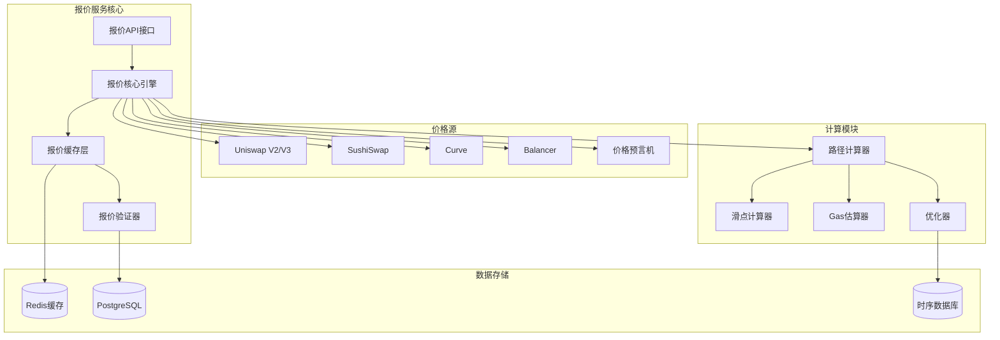

### 详细组件设计

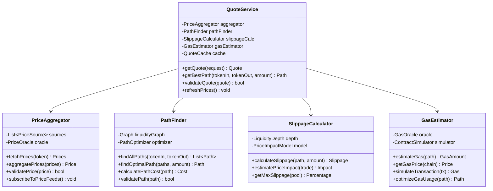

## 核心算法

### 1. 路径寻找算法

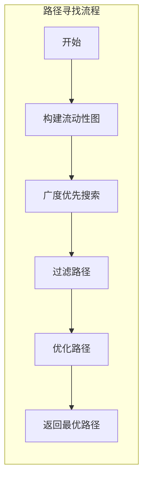

### 2. 价格聚合算法

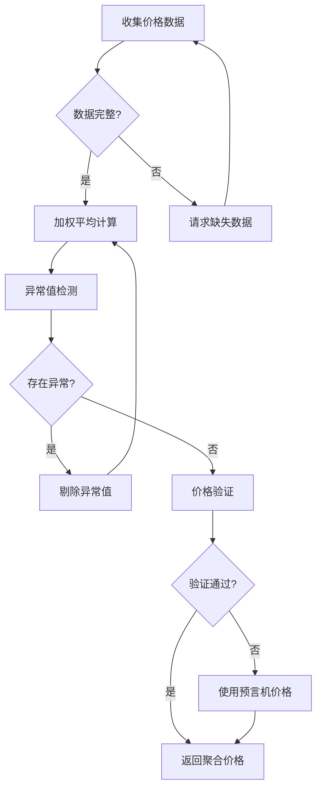

## 数据流设计

### 报价请求处理流程

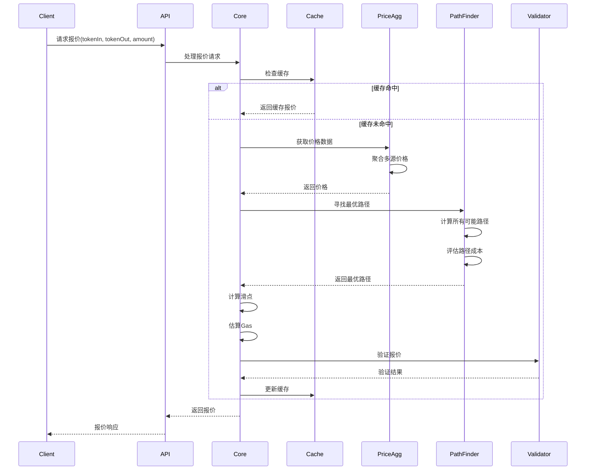

### 实时价格更新机制

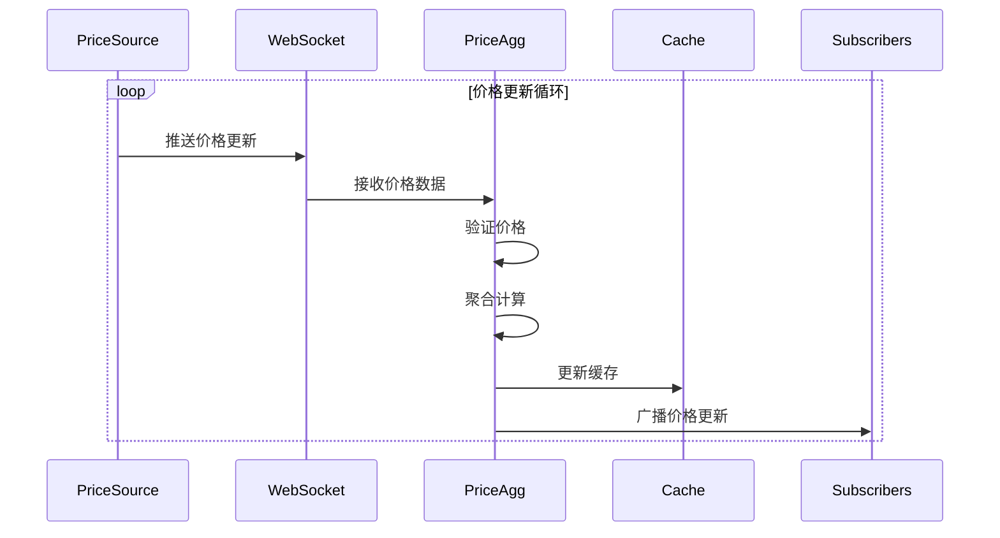

## 性能优化策略

### 1. 多级缓存架构

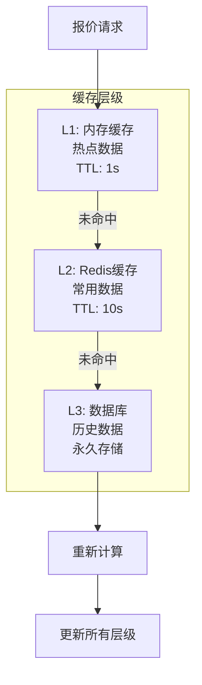

### 2. 并发处理模型

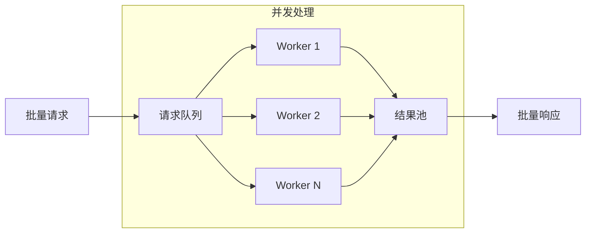

## 高可用设计

### 服务部署架构

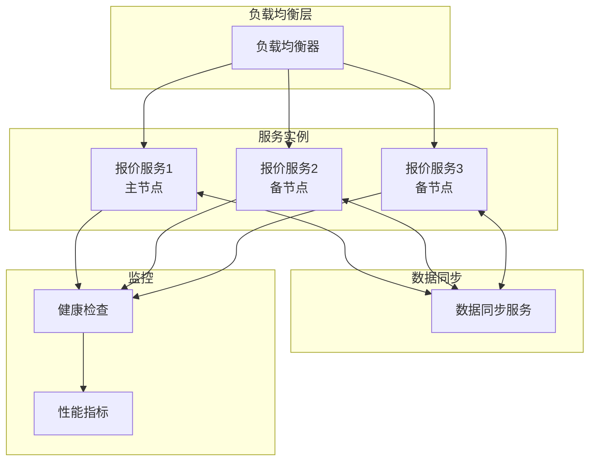

## 错误处理机制

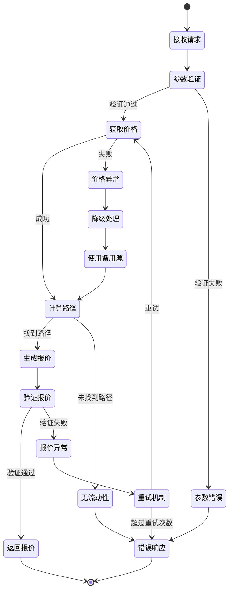

## 监控指标

### 关键性能指标(KPI)

```yaml
性能指标:
  - 报价延迟: < 100ms (P99)
  - 吞吐量: > 10000 QPS
  - 缓存命中率: > 90%
  - 错误率: < 0.1%

业务指标:
  - 报价准确率: > 99.9%
  - 价格偏差: < 0.1%
  - 路径优化率: > 95%
  - Gas估算准确率: > 95%

可用性指标:
  - 服务可用性: 99.99%
  - 价格源可用性: > 99%
  - 故障恢复时间: < 30s
```

### 监控仪表板

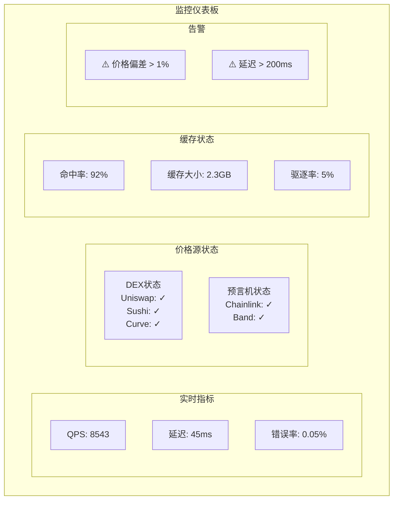

## API接口定义

### 获取报价

```typescript
// 请求
interface QuoteRequest {
  chainId: number;          // 链ID
  tokenIn: string;          // 输入代币地址
  tokenOut: string;         // 输出代币地址
  amountIn?: string;        // 输入数量
  amountOut?: string;       // 输出数量(与amountIn二选一)
  slippageTolerance: number; // 滑点容差(基点)
  recipient?: string;       // 接收地址
  deadline?: number;        // 交易截止时间
}

// 响应
interface QuoteResponse {
  quoteId: string;          // 报价ID
  tokenIn: TokenInfo;       // 输入代币信息
  tokenOut: TokenInfo;      // 输出代币信息
  amountIn: string;         // 输入数量
  amountOut: string;        // 输出数量
  amountOutMin: string;     // 最小输出数量
  path: TradePath[];        // 交易路径
  priceImpact: number;      // 价格影响
  executionPrice: string;   // 执行价格
  fee: FeeInfo;             // 费用信息
  gasEstimate: string;      // Gas估算
  validUntil: number;       // 报价有效期
}

interface TradePath {
  pool: string;             // 流动性池地址
  tokenIn: string;          // 输入代币
  tokenOut: string;         // 输出代币
  fee: number;              // 手续费率
  protocol: string;         // 协议名称
}
```

## 技术实现要点

1. **高性能要求**
   - 使用Rust/Go实现核心计算逻辑
   - 采用零拷贝技术减少内存开销
   - 实现无锁并发数据结构

2. **准确性保证**
   - 多源价格交叉验证
   - 实时监控价格偏差
   - 自动降级和熔断机制

3. **可扩展性**
   - 插件化的DEX适配器
   - 动态路由算法配置
   - 水平扩展支持

4. **安全考虑**
   - 防止价格操纵攻击
   - 限制单次查询复杂度
   - 实施访问频率控制