# 兑换执行器(Swap Executor)架构设计

## 服务概述

兑换执行器是DEX系统的交易执行核心，负责将用户的交易意图转化为实际的链上交易。它处理交易的构建、签名、广播、监控和确认，确保交易的安全、高效执行。

## 核心功能

1. **交易构建** - 根据报价构建交易数据
2. **签名管理** - 安全的交易签名处理
3. **交易广播** - 多节点并发广播
4. **MEV保护** - 防抢跑和三明治攻击
5. **交易监控** - 实时追踪交易状态
6. **失败处理** - 自动重试和回滚机制
7. **跨链执行** - 支持跨链交易执行

## 系统架构

### 整体架构图

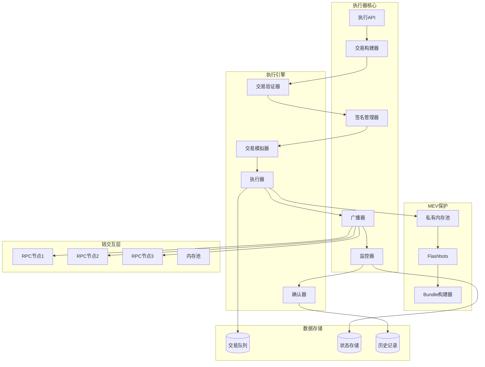

### 详细组件设计

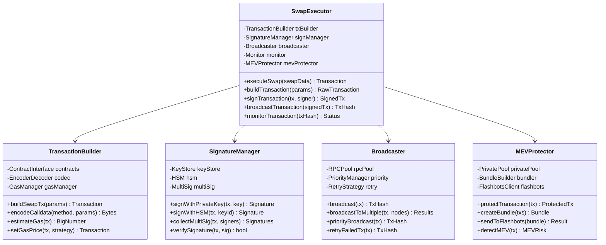

## 交易执行流程

### 完整执行时序图

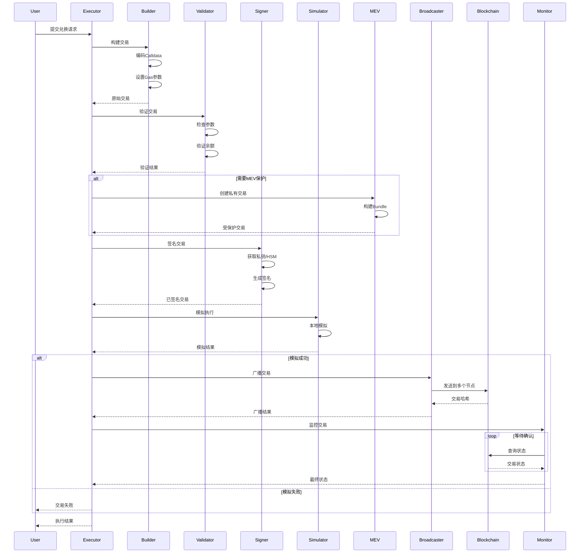

### MEV保护机制

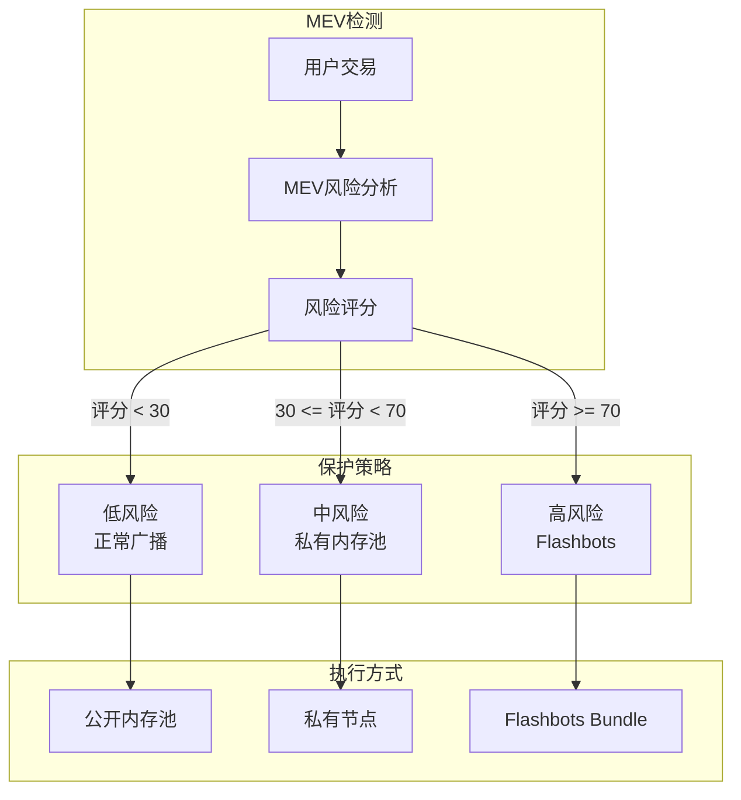

## 交易状态机

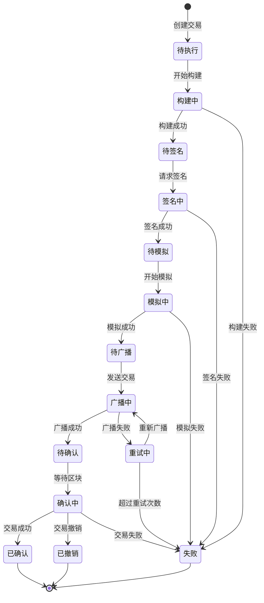

## 高级功能设计

### 1. 批量交易执行

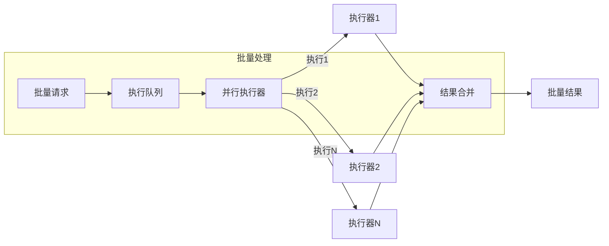

### 2. 智能Gas管理

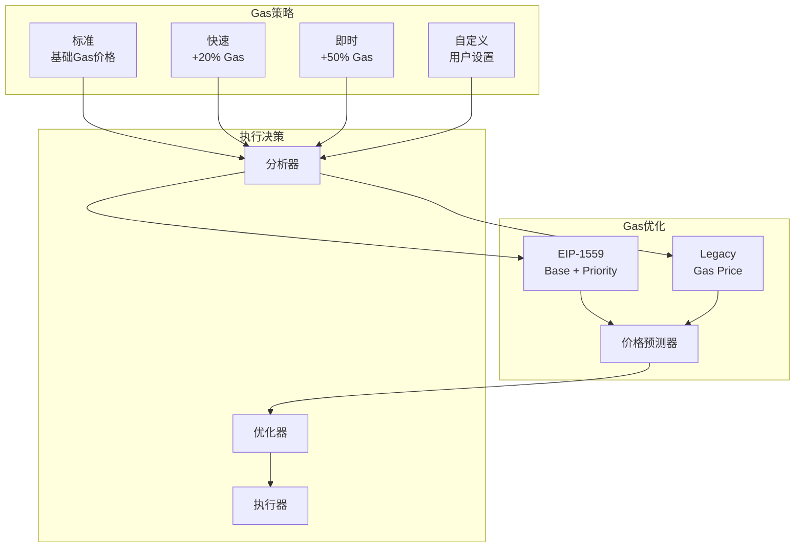

### 3. 交易回滚机制

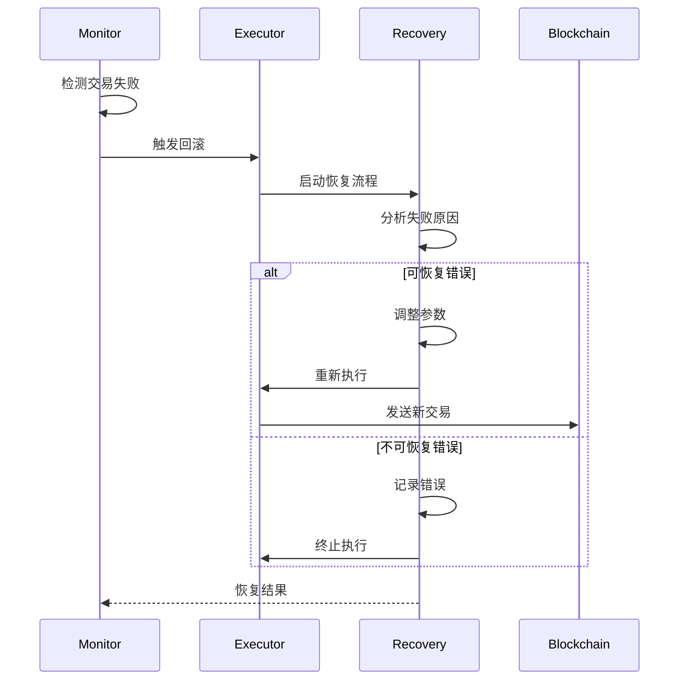

## 性能优化

### 1. 连接池管理

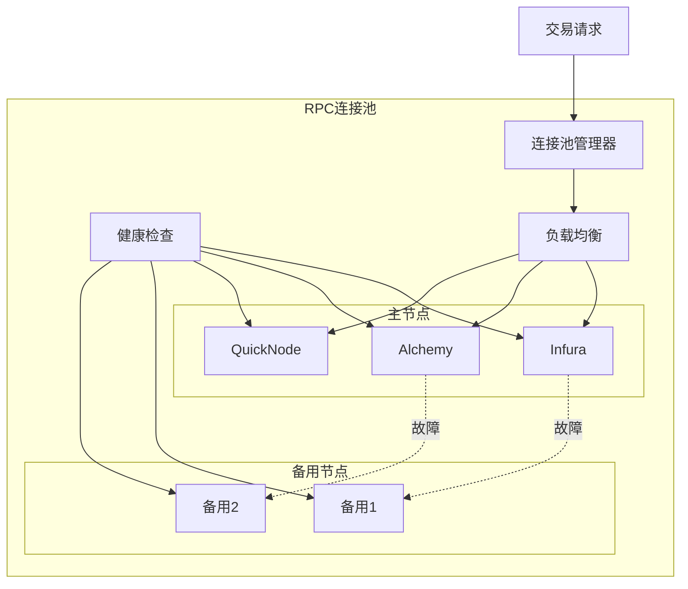

### 2. 并发控制

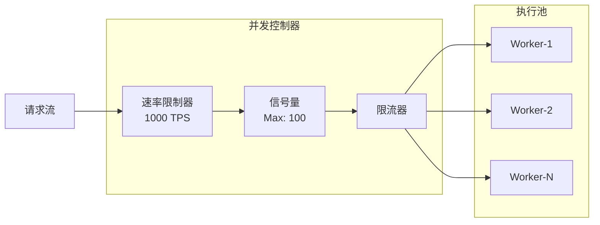

## 安全机制

### 1. 交易验证流程

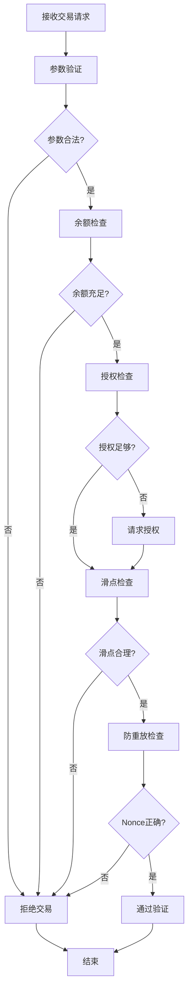

### 2. 签名安全

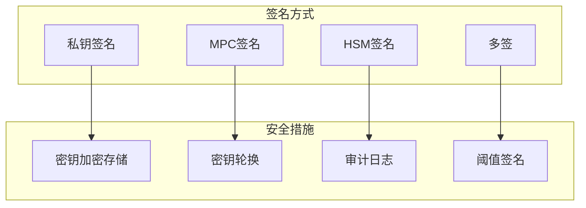

## 监控指标

### 关键指标

```yaml
执行指标:
  - 交易成功率: > 99%
  - 平均执行时间: < 3s
  - Gas使用效率: > 95%
  - MEV保护率: > 98%

性能指标:
  - 并发处理能力: > 1000 TPS
  - 队列延迟: < 100ms
  - 重试成功率: > 90%
  - 节点可用性: > 99.9%

安全指标:
  - 签名验证通过率: 100%
  - 交易回滚成功率: > 95%
  - MEV攻击防御率: > 99%
  - 异常交易检测率: > 98%
```

## API接口定义

### 执行交易接口

```typescript
// 执行请求
interface ExecuteSwapRequest {
  quoteId: string;           // 报价ID
  signer: string;            // 签名地址
  signature?: string;        // 预签名(可选)
  gasStrategy: GasStrategy;  // Gas策略
  mevProtection: boolean;    // MEV保护
  deadline: number;          // 截止时间
  permitData?: PermitData;   // Permit数据(可选)
}

// 执行响应
interface ExecuteSwapResponse {
  transactionId: string;     // 交易ID
  transactionHash: string;   // 交易哈希
  status: TransactionStatus; // 交易状态
  blockNumber?: number;      // 区块号
  gasUsed?: string;         // 实际Gas消耗
  effectivePrice?: string;   // 实际执行价格
  timestamp: number;         // 时间戳
}

// 交易状态
enum TransactionStatus {
  PENDING = "pending",
  BROADCASTING = "broadcasting",
  CONFIRMING = "confirming",
  CONFIRMED = "confirmed",
  FAILED = "failed",
  REVERTED = "reverted"
}

// Gas策略
enum GasStrategy {
  STANDARD = "standard",
  FAST = "fast",
  INSTANT = "instant",
  CUSTOM = "custom"
}
```

## 实现要点

1. **高可靠性**
   - 多节点冗余广播
   - 自动故障转移
   - 交易状态持久化

2. **安全性**
   - 硬件安全模块(HSM)集成
   - 多重签名支持
   - 交易防重放保护

3. **性能优化**
   - 异步非阻塞架构
   - 智能节点选择
   - 批量交易优化

4. **用户体验**
   - 实时状态推送
   - 详细错误信息
   - 交易加速选项