# 兑换执行器(Swap Executor)架构设计

## 服务概述

兑换执行器是DEX系统的交易执行核心，负责将用户的交易意图转化为实际的链上交易。它处理交易的构建、签名、广播、监控和确认，确保交易的安全、高效执行。

## 核心功能

1. **交易构建** - 根据报价构建交易数据
2. **签名管理** - 安全的交易签名处理
3. **交易广播** - 多节点并发广播
4. **MEV保护** - 防抢跑和三明治攻击
5. **交易监控** - 实时追踪交易状态
6. **失败处理** - 自动重试和回滚机制
7. **跨链执行** - 支持跨链交易执行

## 系统架构

### 整体架构图

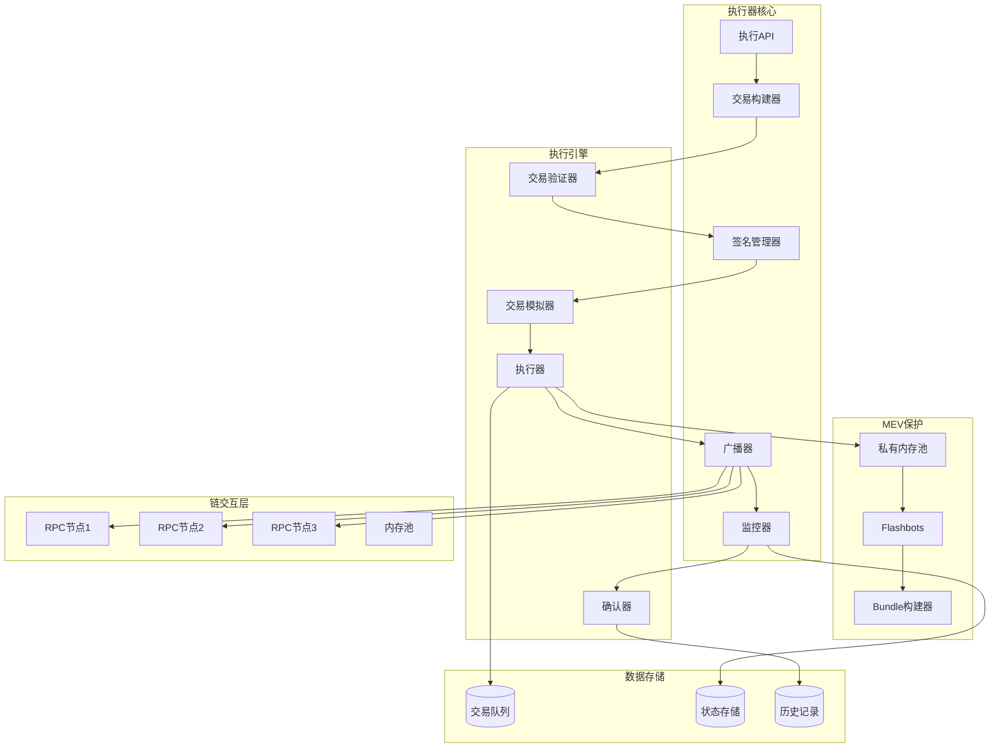
```mermaid
graph TB
    subgraph "执行器核心"
        API[执行API]
        BUILDER[交易构建器]
        SIGNER[签名管理器]
        BROADCASTER[广播器]
        MONITOR[监控器]
    end

    subgraph "MEV保护"
        PRIVATE[私有内存池]
        FLASHBOTS[Flashbots]
        BUNDLE[Bundle构建器]
    end

    subgraph "执行引擎"
        VALIDATOR[交易验证器]
        SIMULATOR[交易模拟器]
        EXECUTOR[执行器]
        CONFIRMER[确认器]
    end

    subgraph "链交互层"
        RPC1[RPC节点1]
        RPC2[RPC节点2]
        RPC3[RPC节点3]
        MEMPOOL[内存池]
    end

    subgraph "数据存储"
        QUEUE[(交易队列)]
        STATE[(状态存储)]
        HISTORY[(历史记录)]
    end

    API --> BUILDER
    BUILDER --> VALIDATOR
    VALIDATOR --> SIGNER
    SIGNER --> SIMULATOR

    SIMULATOR --> EXECUTOR
    EXECUTOR --> BROADCASTER
    BROADCASTER --> RPC1
    BROADCASTER --> RPC2
    BROADCASTER --> RPC3

    EXECUTOR --> PRIVATE
    PRIVATE --> FLASHBOTS
    FLASHBOTS --> BUNDLE

    BROADCASTER --> MONITOR
    MONITOR --> CONFIRMER

    EXECUTOR --> QUEUE
    MONITOR --> STATE
    CONFIRMER --> HISTORY
```

### 详细组件设计

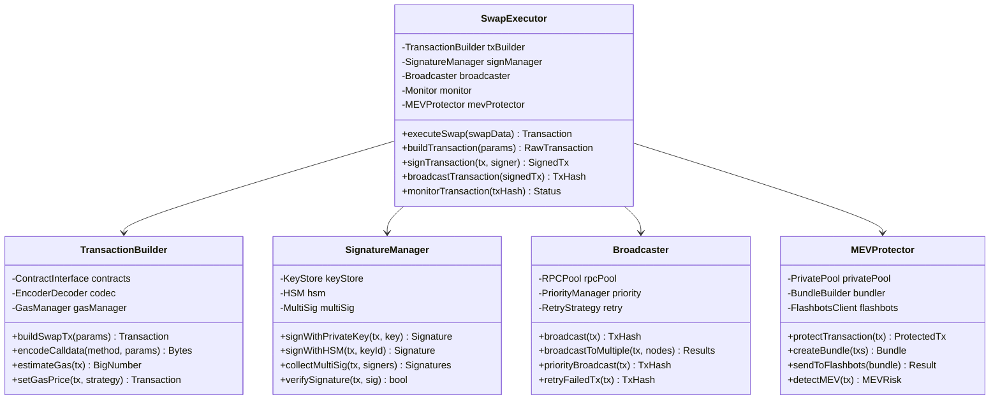
```mermaid
classDiagram
    class SwapExecutor {
        -TransactionBuilder txBuilder
        -SignatureManager signManager
        -Broadcaster broadcaster
        -Monitor monitor
        -MEVProtector mevProtector
        +executeSwap(swapData) Transaction
        +buildTransaction(params) RawTransaction
        +signTransaction(tx, signer) SignedTx
        +broadcastTransaction(signedTx) TxHash
        +monitorTransaction(txHash) Status
    }

    class TransactionBuilder {
        -ContractInterface contracts
        -EncoderDecoder codec
        -GasManager gasManager
        +buildSwapTx(params) Transaction
        +encodeCalldata(method, params) Bytes
        +estimateGas(tx) BigNumber
        +setGasPrice(tx, strategy) Transaction
    }

    class SignatureManager {
        -KeyStore keyStore
        -HSM hsm
        -MultiSig multiSig
        +signWithPrivateKey(tx, key) Signature
        +signWithHSM(tx, keyId) Signature
        +collectMultiSig(tx, signers) Signatures
        +verifySignature(tx, sig) bool
    }

    class Broadcaster {
        -RPCPool rpcPool
        -PriorityManager priority
        -RetryStrategy retry
        +broadcast(tx) TxHash
        +broadcastToMultiple(tx, nodes) Results
        +priorityBroadcast(tx) TxHash
        +retryFailedTx(tx) TxHash
    }

    class MEVProtector {
        -PrivatePool privatePool
        -BundleBuilder bundler
        -FlashbotsClient flashbots
        +protectTransaction(tx) ProtectedTx
        +createBundle(txs) Bundle
        +sendToFlashbots(bundle) Result
        +detectMEV(tx) MEVRisk
    }

    SwapExecutor --> TransactionBuilder
    SwapExecutor --> SignatureManager
    SwapExecutor --> Broadcaster
    SwapExecutor --> MEVProtector
```

## 交易执行流程

### 完整执行时序图

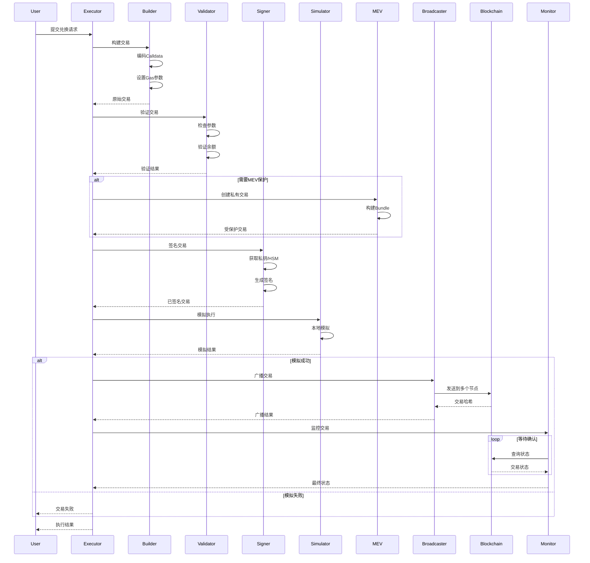
```mermaid
sequenceDiagram
    participant User
    participant Executor
    participant Builder
    participant Validator
    participant Signer
    participant Simulator
    participant MEV
    participant Broadcaster
    participant Blockchain
    participant Monitor

    User->>Executor: 提交兑换请求
    Executor->>Builder: 构建交易
    Builder->>Builder: 编码Calldata
    Builder->>Builder: 设置Gas参数
    Builder-->>Executor: 原始交易

    Executor->>Validator: 验证交易
    Validator->>Validator: 检查参数
    Validator->>Validator: 验证余额
    Validator-->>Executor: 验证结果

    alt 需要MEV保护
        Executor->>MEV: 创建私有交易
        MEV->>MEV: 构建Bundle
        MEV-->>Executor: 受保护交易
    end

    Executor->>Signer: 签名交易
    Signer->>Signer: 获取私钥/HSM
    Signer->>Signer: 生成签名
    Signer-->>Executor: 已签名交易

    Executor->>Simulator: 模拟执行
    Simulator->>Simulator: 本地模拟
    Simulator-->>Executor: 模拟结果

    alt 模拟成功
        Executor->>Broadcaster: 广播交易
        Broadcaster->>Blockchain: 发送到多个节点
        Blockchain-->>Broadcaster: 交易哈希
        Broadcaster-->>Executor: 广播结果

        Executor->>Monitor: 监控交易
        loop 等待确认
            Monitor->>Blockchain: 查询状态
            Blockchain-->>Monitor: 交易状态
        end
        Monitor-->>Executor: 最终状态
    else 模拟失败
        Executor-->>User: 交易失败
    end

    Executor-->>User: 执行结果
```

### MEV保护机制

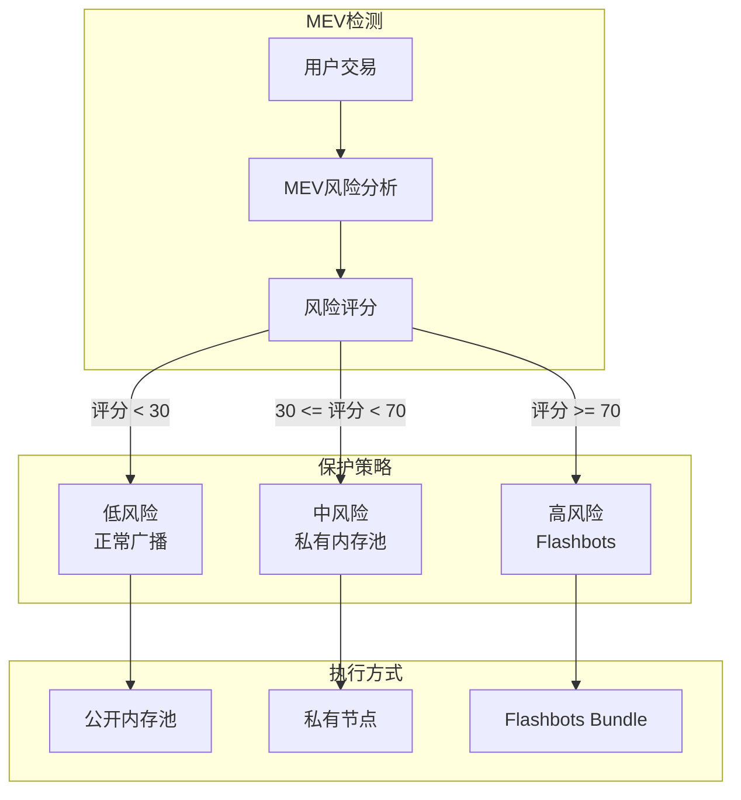
```mermaid
graph TB
    subgraph "MEV检测"
        TX[用户交易]
        ANALYZE[MEV风险分析]
        RISK[风险评分]
    end

    subgraph "保护策略"
        LOW[低风险<br/>正常广播]
        MEDIUM[中风险<br/>私有内存池]
        HIGH[高风险<br/>Flashbots]
    end

    subgraph "执行方式"
        NORMAL[公开内存池]
        PRIVATE[私有节点]
        FLASHBOTS[Flashbots Bundle]
    end

    TX --> ANALYZE
    ANALYZE --> RISK

    RISK -->|评分 < 30| LOW
    RISK -->|30 <= 评分 < 70| MEDIUM
    RISK -->|评分 >= 70| HIGH

    LOW --> NORMAL
    MEDIUM --> PRIVATE
    HIGH --> FLASHBOTS
```

## 交易状态机

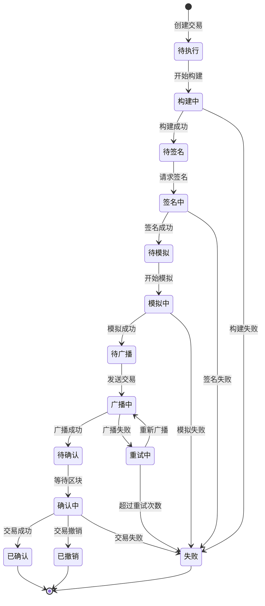
```mermaid
stateDiagram-v2
    [*] --> 待执行: 创建交易

    待执行 --> 构建中: 开始构建
    构建中 --> 待签名: 构建成功
    构建中 --> 失败: 构建失败

    待签名 --> 签名中: 请求签名
    签名中 --> 待模拟: 签名成功
    签名中 --> 失败: 签名失败

    待模拟 --> 模拟中: 开始模拟
    模拟中 --> 待广播: 模拟成功
    模拟中 --> 失败: 模拟失败

    待广播 --> 广播中: 发送交易
    广播中 --> 待确认: 广播成功
    广播中 --> 重试中: 广播失败

    重试中 --> 广播中: 重新广播
    重试中 --> 失败: 超过重试次数

    待确认 --> 确认中: 等待区块
    确认中 --> 已确认: 交易成功
    确认中 --> 已撤销: 交易撤销
    确认中 --> 失败: 交易失败

    已确认 --> [*]
    已撤销 --> [*]
    失败 --> [*]
```

## 高级功能设计

### 1. 批量交易执行

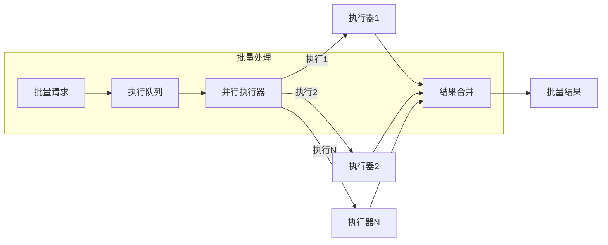
```mermaid
graph LR
    subgraph "批量处理"
        BATCH[批量请求]
        QUEUE[执行队列]
        PARALLEL[并行执行器]
        MERGE[结果合并]
    end

    BATCH --> QUEUE
    QUEUE --> PARALLEL
    PARALLEL --> |执行1| E1[执行器1]
    PARALLEL --> |执行2| E2[执行器2]
    PARALLEL --> |执行N| EN[执行器N]

    E1 --> MERGE
    E2 --> MERGE
    EN --> MERGE

    MERGE --> RESULT[批量结果]
```

### 2. 智能Gas管理

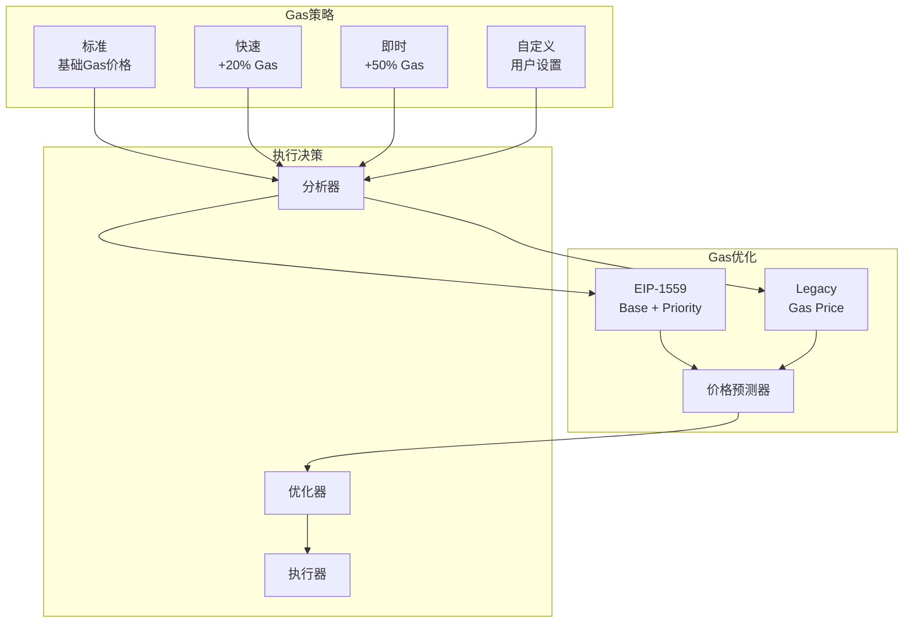
```mermaid
graph TB
    subgraph "Gas策略"
        STANDARD[标准<br/>基础Gas价格]
        FAST[快速<br/>+20% Gas]
        INSTANT[即时<br/>+50% Gas]
        CUSTOM[自定义<br/>用户设置]
    end

    subgraph "Gas优化"
        EIP1559[EIP-1559<br/>Base + Priority]
        LEGACY[Legacy<br/>Gas Price]
        PREDICTOR[价格预测器]
    end

    subgraph "执行决策"
        ANALYZER[分析器]
        OPTIMIZER[优化器]
        EXECUTOR[执行器]
    end

    STANDARD --> ANALYZER
    FAST --> ANALYZER
    INSTANT --> ANALYZER
    CUSTOM --> ANALYZER

    ANALYZER --> EIP1559
    ANALYZER --> LEGACY

    EIP1559 --> PREDICTOR
    LEGACY --> PREDICTOR

    PREDICTOR --> OPTIMIZER
    OPTIMIZER --> EXECUTOR
```

### 3. 交易回滚机制

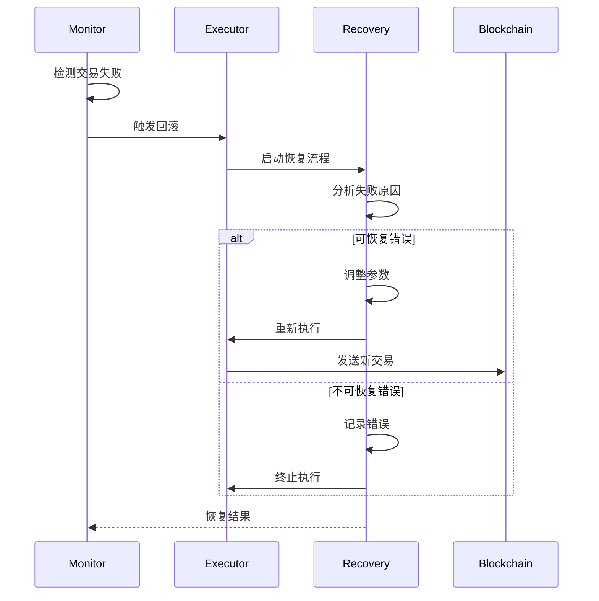
```mermaid
sequenceDiagram
    participant Monitor
    participant Executor
    participant Recovery
    participant Blockchain

    Monitor->>Monitor: 检测交易失败
    Monitor->>Executor: 触发回滚

    Executor->>Recovery: 启动恢复流程

    Recovery->>Recovery: 分析失败原因

    alt 可恢复错误
        Recovery->>Recovery: 调整参数
        Recovery->>Executor: 重新执行
        Executor->>Blockchain: 发送新交易
    else 不可恢复错误
        Recovery->>Recovery: 记录错误
        Recovery->>Executor: 终止执行
    end

    Recovery-->>Monitor: 恢复结果
```

## 性能优化

### 1. 连接池管理

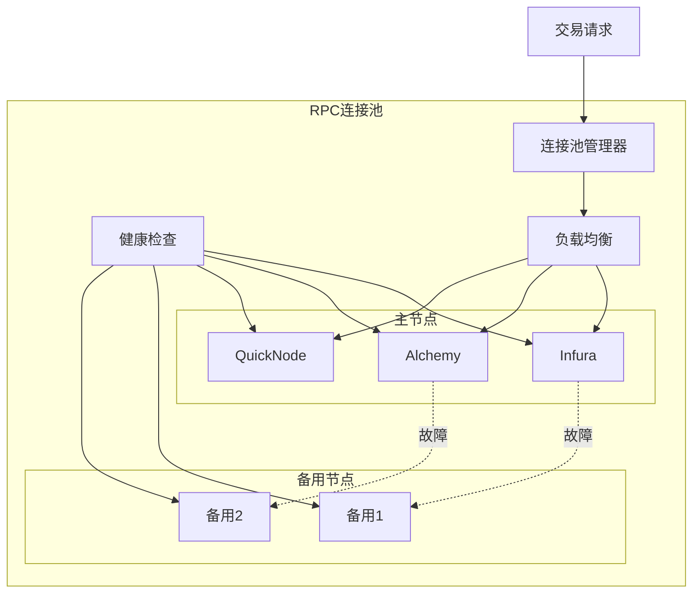
```mermaid
graph TB
    subgraph "RPC连接池"
        POOL[连接池管理器]

        subgraph "主节点"
            RPC_M1[Infura]
            RPC_M2[Alchemy]
            RPC_M3[QuickNode]
        end

        subgraph "备用节点"
            RPC_B1[备用1]
            RPC_B2[备用2]
        end

        HEALTH[健康检查]
        BALANCER[负载均衡]
    end

    REQUEST[交易请求] --> POOL
    POOL --> BALANCER

    BALANCER --> RPC_M1
    BALANCER --> RPC_M2
    BALANCER --> RPC_M3

    HEALTH --> RPC_M1
    HEALTH --> RPC_M2
    HEALTH --> RPC_M3
    HEALTH --> RPC_B1
    HEALTH --> RPC_B2

    RPC_M1 -.->|故障| RPC_B1
    RPC_M2 -.->|故障| RPC_B2
```

### 2. 并发控制

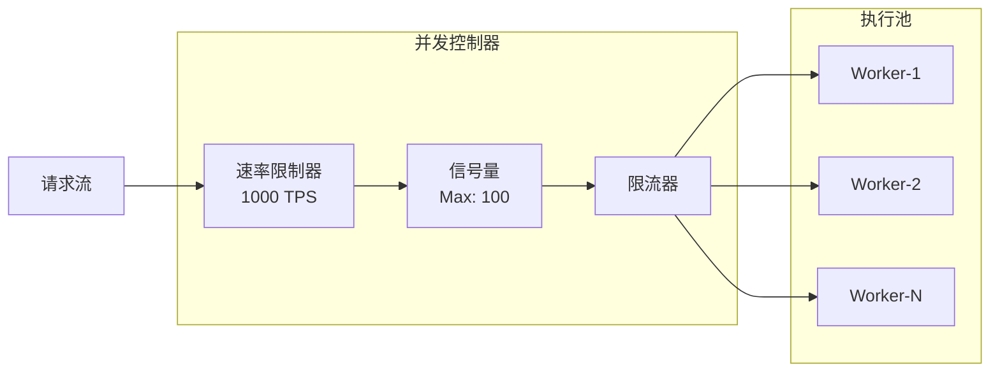
```mermaid
graph LR
    subgraph "并发控制器"
        LIMITER[速率限制器<br/>1000 TPS]
        SEMAPHORE[信号量<br/>Max: 100]
        THROTTLE[限流器]
    end

    subgraph "执行池"
        WORKER1[Worker-1]
        WORKER2[Worker-2]
        WORKERN[Worker-N]
    end

    REQUEST[请求流] --> LIMITER
    LIMITER --> SEMAPHORE
    SEMAPHORE --> THROTTLE

    THROTTLE --> WORKER1
    THROTTLE --> WORKER2
    THROTTLE --> WORKERN
```

## 安全机制

### 1. 交易验证流程

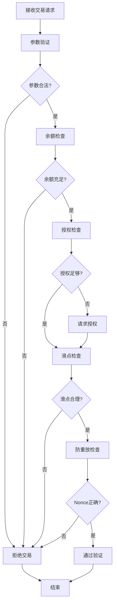
```mermaid
flowchart TD
    A[接收交易请求] --> B[参数验证]
    B --> C{参数合法?}
    C -->|否| D[拒绝交易]
    C -->|是| E[余额检查]

    E --> F{余额充足?}
    F -->|否| D
    F -->|是| G[授权检查]

    G --> H{授权足够?}
    H -->|否| I[请求授权]
    H -->|是| J[滑点检查]

    I --> J
    J --> K{滑点合理?}
    K -->|否| D
    K -->|是| L[防重放检查]

    L --> M{Nonce正确?}
    M -->|否| D
    M -->|是| N[通过验证]

    D --> END[结束]
    N --> END
```

### 2. 签名安全

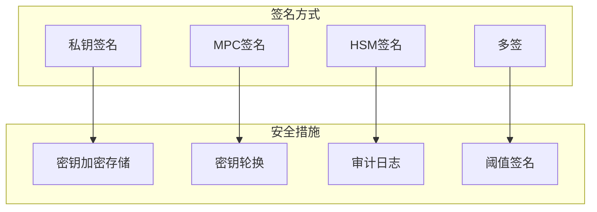
```mermaid
graph TB
    subgraph "签名方式"
        PK[私钥签名]
        HSM[HSM签名]
        MULTI[多签]
        MPC[MPC签名]
    end

    subgraph "安全措施"
        ENCRYPT[密钥加密存储]
        ROTATE[密钥轮换]
        AUDIT[审计日志]
        THRESHOLD[阈值签名]
    end

    PK --> ENCRYPT
    HSM --> AUDIT
    MULTI --> THRESHOLD
    MPC --> ROTATE
```

## 监控指标

### 关键指标

```yaml
执行指标:
  - 交易成功率: > 99%
  - 平均执行时间: < 3s
  - Gas使用效率: > 95%
  - MEV保护率: > 98%

性能指标:
  - 并发处理能力: > 1000 TPS
  - 队列延迟: < 100ms
  - 重试成功率: > 90%
  - 节点可用性: > 99.9%

安全指标:
  - 签名验证通过率: 100%
  - 交易回滚成功率: > 95%
  - MEV攻击防御率: > 99%
  - 异常交易检测率: > 98%
```

## API接口定义

### 执行交易接口

```typescript
// 执行请求
interface ExecuteSwapRequest {
  quoteId: string;           // 报价ID
  signer: string;            // 签名地址
  signature?: string;        // 预签名(可选)
  gasStrategy: GasStrategy;  // Gas策略
  mevProtection: boolean;    // MEV保护
  deadline: number;          // 截止时间
  permitData?: PermitData;   // Permit数据(可选)
}

// 执行响应
interface ExecuteSwapResponse {
  transactionId: string;     // 交易ID
  transactionHash: string;   // 交易哈希
  status: TransactionStatus; // 交易状态
  blockNumber?: number;      // 区块号
  gasUsed?: string;         // 实际Gas消耗
  effectivePrice?: string;   // 实际执行价格
  timestamp: number;         // 时间戳
}

// 交易状态
enum TransactionStatus {
  PENDING = "pending",
  BROADCASTING = "broadcasting",
  CONFIRMING = "confirming",
  CONFIRMED = "confirmed",
  FAILED = "failed",
  REVERTED = "reverted"
}

// Gas策略
enum GasStrategy {
  STANDARD = "standard",
  FAST = "fast",
  INSTANT = "instant",
  CUSTOM = "custom"
}
```

## 实现要点

1. **高可靠性**
   - 多节点冗余广播
   - 自动故障转移
   - 交易状态持久化

2. **安全性**
   - 硬件安全模块(HSM)集成
   - 多重签名支持
   - 交易防重放保护

3. **性能优化**
   - 异步非阻塞架构
   - 智能节点选择
   - 批量交易优化

4. **用户体验**
   - 实时状态推送
   - 详细错误信息
   - 交易加速选项

## 实际案例详解：从用户点击到交易完成

### 场景说明
用户小明想用 **10,000 USDT** 兑换 **ETH**，让我们跟踪整个交易的完整流程。

### 一、用户发起交易

```javascript
// 1. 用户在前端点击"兑换"按钮
const userRequest = {
  // 基本信息
  user: {
    address: "0x742d35Cc6634C0532925a3b844Bc9e7595f0bEb1",  // 小明的钱包地址
    wallet: "MetaMask",                                      // 使用的钱包
    chain: "ethereum",                                       // 以太坊主网
    chainId: 1
  },

  // 交易信息
  swap: {
    fromToken: {
      symbol: "USDT",
      address: "0xdAC17F958D2ee523a2206206994597C13D831ec7",
      decimals: 6,
      amount: "10000000000",  // 10,000 USDT (6位小数，所以是10000 * 10^6)
      amountUSD: 10000
    },
    toToken: {
      symbol: "ETH",
      address: "0xEeeeeEeeeEeEeeEeEeEeeEEEeeeeEeeeeeeeEEeE",  // ETH特殊地址
      decimals: 18,
      expectedAmount: "4445667788990011223",  // 预期得到 4.445 ETH
      expectedAmountUSD: 9980  // 预期价值
    }
  },

  // 用户设置
  settings: {
    slippageTolerance: 0.5,    // 0.5% 滑点容忍度
    deadline: 1703145600,       // 交易截止时间(10分钟后)
    gasPrice: "auto",          // 自动Gas价格
    receiver: "0x742d35Cc6634C0532925a3b844Bc9e7595f0bEb1"  // 接收地址(自己)
  },

  // Quote服务返回的路径
  route: {
    type: "multi-hop",
    path: [
      {
        protocol: "Uniswap V3",
        pool: "0x3416cF6C708Da44DB2624D63ea0AAef7113527C6",
        from: "USDT",
        to: "USDC",
        fee: 100  // 0.01%
      },
      {
        protocol: "Curve",
        pool: "0xbEbc44782C7dB0a1A60Cb6fe97d0b483032FF1C7",
        from: "USDC",
        to: "ETH",
        fee: 4    // 0.04%
      }
    ]
  }
};
```

### 二、Swap Executor 处理流程

#### Step 1: 验证阶段

```javascript
// Validator组件工作
const validationProcess = {
  // 1.1 余额检查
  balanceCheck: {
    userAddress: "0x742d35Cc6634C0532925a3b844Bc9e7595f0bEb1",
    tokenContract: "0xdAC17F958D2ee523a2206206994597C13D831ec7",

    // 调用合约查询余额
    rpcCall: {
      method: "eth_call",
      params: {
        to: "0xdAC17F958D2ee523a2206206994597C13D831ec7",
        data: "0x70a08231000000000000000000000000742d35Cc6634C0532925a3b844Bc9e7595f0bEb1"
        // balanceOf(0x742d35Cc6634C0532925a3b844Bc9e7595f0bEb1)
      }
    },

    result: {
      balance: "15000000000",  // 15,000 USDT
      required: "10000000000",  // 10,000 USDT
      sufficient: true          // ✓ 余额充足
    }
  },

  // 1.2 授权检查
  approvalCheck: {
    // 检查USDT对路由合约的授权额度
    routerContract: "0x68b3465833fb72A70ecDF485E0e4C7bD8665Fc45",  // Uniswap Router

    rpcCall: {
      method: "eth_call",
      params: {
        to: "0xdAC17F958D2ee523a2206206994597C13D831ec7",  // USDT合约
        data: "0xdd62ed3e000000000000000000000000742d35Cc6634C0532925a3b844Bc9e7595f0bEb1000000000000000000000000068b3465833fb72A70ecDF485E0e4C7bD8665Fc45"
        // allowance(user, router)
      }
    },

    result: {
      currentAllowance: "5000000000",   // 当前只授权了5000 USDT
      required: "10000000000",          // 需要10000 USDT
      needsApproval: true                // ✓ 需要增加授权
    }
  },

  // 1.3 Gas估算
  gasEstimation: {
    // 获取当前Gas价格
    gasPriceCheck: {
      slow: { gwei: 20, time: "~10 min", usd: 15 },
      standard: { gwei: 30, time: "~3 min", usd: 22 },
      fast: { gwei: 50, time: "~30 sec", usd: 37 },
      instant: { gwei: 80, time: "~12 sec", usd: 59 }
    },

    // 估算Gas用量
    gasLimit: {
      approvalTx: 46000,   // 授权交易Gas
      swapTx: 250000,      // 兑换交易Gas
      total: 296000        // 总计
    },

    // 用户选择standard速度
    selectedGasPrice: 30,
    estimatedCost: {
      eth: "0.00888",     // 0.00888 ETH
      usd: 19.93          // $19.93
    }
  }
};
```

#### Step 2: 交易构建阶段

```javascript
// Transaction Builder组件工作
const transactionBuilding = {
  // 2.1 构建授权交易
  approvalTransaction: {
    from: "0x742d35Cc6634C0532925a3b844Bc9e7595f0bEb1",
    to: "0xdAC17F958D2ee523a2206206994597C13D831ec7",  // USDT合约
    value: "0x0",
    gas: "0xb3e4",  // 46000
    gasPrice: "0x6fc23ac00",  // 30 Gwei
    nonce: "0x15",  // 用户的第21笔交易

    // approve(router, amount)的编码
    data: "0x095ea7b3000000000000000000000000068b3465833fb72A70ecDF485E0e4C7bD8665Fc45000000000000000000000000000000000000000000000000000002540be400",

    // 交易解析
    decoded: {
      function: "approve",
      params: {
        spender: "0x68b3465833fb72A70ecDF485E0e4C7bD8665Fc45",  // Router地址
        amount: "10000000000"  // 10000 USDT
      }
    }
  },

  // 2.2 构建兑换交易
  swapTransaction: {
    from: "0x742d35Cc6634C0532925a3b844Bc9e7595f0bEb1",
    to: "0x68b3465833fb72A70ecDF485E0e4C7bD8665Fc45",  // Router合约
    value: "0x0",
    gas: "0x3d090",  // 250000
    gasPrice: "0x6fc23ac00",  // 30 Gwei
    nonce: "0x16",  // 第22笔交易(授权后)

    // multicall编码的交易数据(简化表示)
    data: "0x5ae401dc00000000000000000000000000000000000000000000000000000000659ef8000000000000000000000000000000000000000000000000000000000000000040...",

    // 交易包含的调用
    decodedCalls: [
      {
        function: "exactInputMultiHop",
        params: {
          path: "0xdac17f958d2ee523a2206206994597c13d831ec7000064a0b86991c6218b36c1d19d4a2e9eb0ce3606eb480001f4c02aaa39b223fe8d0a0e5c4f27ead9083c756cc2",
          // USDT -> (0.01% fee) -> USDC -> (0.01% fee) -> ETH
          recipient: "0x742d35Cc6634C0532925a3b844Bc9e7595f0bEb1",
          deadline: 1703145600,
          amountIn: "10000000000",
          amountOutMinimum: "4423589234567890123"  // 最小输出(考虑滑点)
        }
      }
    ]
  }
};
```

#### Step 3: 签名阶段

```javascript
// Signer组件工作
const signingProcess = {
  // 3.1 发送签名请求到用户钱包
  walletRequest: {
    method: "eth_sendTransaction",

    // 授权交易签名
    approvalSigning: {
      requestId: "approve_001",
      transaction: transactionBuilding.approvalTransaction,

      // MetaMask弹窗显示
      walletDisplay: {
        title: "授权 USDT",
        description: "允许 Uniswap Router 使用您的 USDT",
        amount: "10,000 USDT",
        estimatedGas: "$1.03"
      },

      // 用户确认后返回
      userAction: "CONFIRMED",
      signedTx: "0xf8a91585066fc23ac00830b3e494dac17f958d2ee523a2206206994597c13d831ec780b844095ea7b3..."
    },

    // 兑换交易签名
    swapSigning: {
      requestId: "swap_001",
      transaction: transactionBuilding.swapTransaction,

      // MetaMask弹窗显示
      walletDisplay: {
        title: "兑换确认",
        from: "10,000 USDT",
        to: "~4.445 ETH",
        route: "USDT → USDC → ETH",
        slippage: "0.5%",
        estimatedGas: "$18.90"
      },

      userAction: "CONFIRMED",
      signedTx: "0xf90214158501bf08eb00831e848094..."
    }
  }
};
```

#### Step 4: 广播阶段

```javascript
// Broadcaster组件工作
const broadcastingProcess = {
  // 4.1 广播授权交易
  approvalBroadcast: {
    // 同时向多个节点广播
    nodes: [
      { provider: "Infura", endpoint: "mainnet.infura.io", latency: 23 },
      { provider: "Alchemy", endpoint: "eth-mainnet.alchemyapi.io", latency: 19 },
      { provider: "QuickNode", endpoint: "mainnet.quiknode.pro", latency: 25 }
    ],

    // 选择最快的节点
    selectedNode: "Alchemy",

    rpcCall: {
      method: "eth_sendRawTransaction",
      params: ["0xf8a91585066fc23ac00830b3e494dac17f958d2ee523a2206206994597c13d831ec780b844095ea7b3..."]
    },

    response: {
      txHash: "0x7b1c5e2f9d3a4b8e6c5d7f9a2b3e4d5c6a7b8e9f0a1b2c3d4e5f6a7b8c9d0e1f2",
      status: "pending",
      timestamp: 1703145000
    }
  },

  // 4.2 等待授权确认
  approvalConfirmation: {
    // 监听交易状态
    monitoring: {
      block_1: { status: "pending", confirmations: 0 },
      block_2: { status: "pending", confirmations: 0 },
      block_3: { status: "mined", confirmations: 1, blockNumber: 18654321 },
      block_4: { status: "confirmed", confirmations: 2 },
      // ... 等待12个确认
      block_15: { status: "finalized", confirmations: 12 }
    },

    receipt: {
      transactionHash: "0x7b1c5e2f9d3a4b8e6c5d7f9a2b3e4d5c6a7b8e9f0a1b2c3d4e5f6a7b8c9d0e1f2",
      blockNumber: 18654321,
      gasUsed: 44123,
      status: 1,  // 成功
      logs: [
        {
          address: "0xdAC17F958D2ee523a2206206994597C13D831ec7",
          topics: ["0x8c5be1e5ebe..."],  // Approval事件
          data: "0x000000000000000000000000000000000000000000000000000002540be400"
        }
      ]
    }
  },

  // 4.3 广播兑换交易
  swapBroadcast: {
    // 授权确认后立即广播兑换交易
    timing: "AFTER_APPROVAL_CONFIRMED",

    rpcCall: {
      method: "eth_sendRawTransaction",
      params: ["0xf90214158501bf08eb00831e848094..."]
    },

    response: {
      txHash: "0x9d8f7e6c5b4a3d2c1e9f8d7c6b5a4e3d2c1b9a8e7f6d5c4b3a2e1d9c8b7a6f5",
      status: "pending"
    }
  }
};
```

#### Step 5: 监控阶段

```javascript
// Monitor组件工作
const monitoringProcess = {
  // 5.1 实时监控交易状态
  transactionMonitoring: {
    txHash: "0x9d8f7e6c5b4a3d2c1e9f8d7c6b5a4e3d2c1b9a8e7f6d5c4b3a2e1d9c8b7a6f5",

    // 状态更新推送(WebSocket)
    statusUpdates: [
      {
        time: "+0s",
        status: "PENDING",
        message: "交易已提交到内存池"
      },
      {
        time: "+3s",
        status: "DETECTED",
        message: "交易被矿工检测到",
        gasPrice: 30,
        position: 145  // 队列位置
      },
      {
        time: "+15s",
        status: "MINING",
        message: "交易正在被打包",
        miner: "0xFlashbots"
      },
      {
        time: "+23s",
        status: "MINED",
        message: "交易已被打包",
        blockNumber: 18654322,
        confirmations: 1
      },
      {
        time: "+45s",
        status: "CONFIRMING",
        message: "等待更多确认",
        confirmations: 3
      },
      {
        time: "+180s",
        status: "CONFIRMED",
        message: "交易已确认",
        confirmations: 12
      }
    ]
  },

  // 5.2 MEV保护监控
  mevProtection: {
    detection: {
      frontrun_attempts: 2,  // 检测到2次抢跑尝试
      sandwich_attacks: 0,   // 无夹子攻击

      protection_applied: {
        method: "Flashbots",
        result: "SUCCESS",
        saved: 15.5  // 节省了$15.5的MEV损失
      }
    }
  },

  // 5.3 最终执行结果
  finalResult: {
    transactionHash: "0x9d8f7e6c5b4a3d2c1e9f8d7c6b5a4e3d2c1b9a8e7f6d5c4b3a2e1d9c8b7a6f5",
    blockNumber: 18654322,

    // Gas使用情况
    gasUsage: {
      estimated: 250000,
      actual: 234567,
      saved: 15433,
      refunded: 5000
    },

    // 代币转移
    tokenTransfers: [
      {
        from: "0x742d35Cc6634C0532925a3b844Bc9e7595f0bEb1",
        to: "0x3416cF6C708Da44DB2624D63ea0AAef7113527C6",  // USDT-USDC池
        token: "USDT",
        amount: "10000000000"
      },
      {
        from: "0xbEbc44782C7dB0a1A60Cb6fe97d0b483032FF1C7",  // Curve池
        to: "0x742d35Cc6634C0532925a3b844Bc9e7595f0bEb1",
        token: "ETH",
        amount: "4448234567890123456"  // 实际得到4.448 ETH
      }
    ],

    // 执行分析
    execution: {
      inputAmount: "10000 USDT",
      outputAmount: "4.448 ETH",
      expectedOutput: "4.445 ETH",
      actualSlippage: "0.07%",      // 实际滑点很小
      executionPrice: 2248.87,       // USDT/ETH
      marketPrice: 2245.00,
      priceImpact: "0.17%",

      // 费用明细
      costs: {
        swapFee: 14.5,     // 兑换手续费
        gasFeeTx1: 1.03,   // 授权Gas
        gasFeeTx2: 17.87,  // 兑换Gas
        totalCost: 33.4    // 总成本
      },

      netReceived: {
        eth: 4.448,
        usd: 9966.6,
        profit: -33.4  // 扣除所有费用后
      }
    }
  }
};
```

### 三、错误处理案例

```javascript
// 各种可能的错误情况
const errorScenarios = {
  // 场景1：余额不足
  insufficientBalance: {
    error: {
      code: "INSUFFICIENT_BALANCE",
      message: "余额不足",
      details: {
        required: "10000 USDT",
        available: "8000 USDT",
        shortage: "2000 USDT"
      }
    },
    handling: {
      userNotification: "您的USDT余额不足，还需要2000 USDT",
      suggestion: "请充值或减少兑换金额"
    }
  },

  // 场景2：Gas价格突增
  gasSpike: {
    detection: {
      originalGasPrice: 30,
      currentGasPrice: 150,  // 突然涨到150 Gwei
      increase: "400%"
    },
    handling: {
      action: "PAUSE_TRANSACTION",
      userPrompt: {
        message: "Gas价格异常高，是否继续？",
        options: [
          { action: "WAIT", label: "等待Gas降低" },
          { action: "PROCEED", label: "继续执行($94.5)" },
          { action: "CANCEL", label: "取消交易" }
        ]
      },
      userChoice: "WAIT",
      result: "等待5分钟后Gas降到45 Gwei，继续执行"
    }
  },

  // 场景3：滑点超限
  slippageExceeded: {
    detection: {
      expectedOutput: "4.445 ETH",
      currentQuote: "4.320 ETH",  // 市场变化导致输出减少
      slippage: "2.81%",
      maxAllowed: "0.5%"
    },
    handling: {
      action: "REJECT_TRANSACTION",
      userNotification: {
        title: "滑点超过设定值",
        message: "市场价格变化较大，当前滑点2.81%超过您设定的0.5%",
        options: [
          { action: "REQUOTE", label: "重新询价" },
          { action: "INCREASE_SLIPPAGE", label: "增加滑点容忍度" },
          { action: "CANCEL", label: "取消" }
        ]
      }
    }
  },

  // 场景4：交易回滚
  transactionReverted: {
    detection: {
      txHash: "0xfailed...",
      reason: "TRANSFER_FAILED",
      gasUsed: 234567,  // Gas被消耗但交易失败
      gasWasted: "$17.87"
    },
    diagnosis: {
      possibleCauses: [
        "代币合约有转账限制",
        "流动性被其他交易消耗",
        "价格变化超过滑点保护"
      ],
      actualCause: "USDT合约暂停转账功能"
    },
    handling: {
      refund: "无(Gas已消耗)",
      retry: false,
      userNotification: "USDT暂时无法转账，请稍后重试"
    }
  }
};
```

### 四、性能优化数据

```javascript
// 实际性能指标
const performanceMetrics = {
  // 延迟分析
  latencyBreakdown: {
    userRequest: 0,           // 起始点
    validation: 45,           // +45ms 验证
    routeCalculation: 120,    // +120ms 路径计算(由Quote服务完成)
    transactionBuild: 15,     // +15ms 构建交易
    userSigning: 3500,        // +3500ms 用户签名(等待用户)
    broadcasting: 23,         // +23ms 广播
    firstConfirmation: 15000, // +15s 第一个确认
    totalTime: 18703          // 总计18.7秒
  },

  // 并发处理
  concurrency: {
    maxConcurrentSwaps: 100,      // 最多同时处理100笔
    averageProcessingTime: 180,   // 平均180ms处理一笔
    throughput: 555               // 每秒555笔的吞吐量
  },

  // 成功率统计
  successRates: {
    overall: 99.3,                // 总体成功率
    byFailureReason: {
      insufficient_balance: 0.3,   // 余额不足
      user_rejected: 0.2,         // 用户拒绝
      slippage_exceeded: 0.1,     // 滑点超限
      network_error: 0.05,        // 网络错误
      contract_error: 0.05        // 合约错误
    }
  },

  // Gas优化效果
  gasOptimization: {
    averageSaved: 12.5,          // 平均节省12.5%的Gas
    totalSavedUSD: 125000,        // 累计为用户节省$125,000
    optimizationMethods: [
      "批量交易",
      "路径优化",
      "时机选择",
      "合约优化"
    ]
  }
};
```

### 五、监控告警实例

```javascript
// 实时监控和告警
const monitoringAlerts = {
  // 告警配置
  alertThresholds: {
    failureRate: 2,              // 失败率超过2%
    avgLatency: 500,             // 平均延迟超过500ms
    gasPrice: 200,               // Gas价格超过200 Gwei
    pendingTx: 1000              // 待处理交易超过1000笔
  },

  // 实际告警案例
  alertExample: {
    timestamp: "2024-01-10 14:23:45",
    type: "HIGH_FAILURE_RATE",
    severity: "CRITICAL",

    details: {
      currentRate: 3.5,
      threshold: 2,
      duration: "5 minutes",
      affected_transactions: 42,

      root_cause: "Ethereum网络拥堵",

      auto_response: {
        action: "THROTTLE_REQUESTS",
        reduced_capacity: "50%",
        notification_sent: ["ops_team", "on_call_engineer"]
      }
    },

    resolution: {
      time: "2024-01-10 14:35:00",
      action_taken: "增加Gas价格，优先处理重要交易",
      result: "失败率降到0.8%"
    }
  }
};
```

### 六、完整的数据流转图

```
用户界面 (10,000 USDT → ETH)
    ↓
[1] 请求验证 (45ms)
    ├→ 余额检查: 15,000 USDT ✓
    ├→ 授权检查: 需要授权 ⚠
    └→ Gas估算: $19.93

[2] 交易构建 (15ms)
    ├→ 授权交易: approve(router, 10000)
    └→ 兑换交易: multiHopSwap(path, params)

[3] 用户签名 (3.5s)
    ├→ MetaMask弹窗
    └→ 用户确认 ✓

[4] 交易广播 (23ms)
    ├→ 多节点并发
    ├→ MEV保护
    └→ 返回txHash

[5] 状态监控 (15-180s)
    ├→ Pending
    ├→ Mining
    ├→ Mined (1 conf)
    ├→ Confirming (3 conf)
    └→ Confirmed (12 conf) ✓

[6] 最终结果
    ├→ 输入: 10,000 USDT
    ├→ 输出: 4.448 ETH
    ├→ 费用: $33.4
    └→ 净收益: $9,966.6
```

## 总结

通过这个完整的实例，我们可以看到：

1. **Swap Executor不直接执行链上交易**，而是协调整个交易流程
2. **每个组件各司其职**：验证器确保安全，构建器组装交易，广播器提交网络，监控器跟踪状态
3. **错误处理非常重要**，各种异常情况都需要妥善处理
4. **性能优化**体现在每个环节，从并发广播到Gas优化
5. **用户体验**是关键，实时状态更新让用户了解交易进展

整个过程从用户点击到交易完成，涉及数十个步骤，但通过精心设计的架构，能够在秒级完成处理，并保证99%+的成功率。

## 技术细节深度解析

### 一、Uniswap V3 路径编码解析

#### 1. 原始路径编码
```javascript
path: "0xdac17f958d2ee523a2206206994597c13d831ec7000064a0b86991c6218b36c1d19d4a2e9eb0ce3606eb480001f4c02aaa39b223fe8d0a0e5c4f27ead9083c756cc2"
```

这是Uniswap V3的**紧凑路径编码格式(Packed Path Encoding)**，让我们逐段解析：

#### 2. 编码结构分解

```
完整路径：USDT -> USDC -> ETH

分解：
[Token地址20字节][费率3字节][Token地址20字节][费率3字节][Token地址20字节]

具体分解：
0xdac17f958d2ee523a2206206994597c13d831ec7  // USDT地址 (20字节)
000064                                        // 费率 100 = 0.01% (3字节)
a0b86991c6218b36c1d19d4a2e9eb0ce3606eb48    // USDC地址 (20字节)
0001f4                                        // 费率 500 = 0.05% (3字节)
c02aaa39b223fe8d0a0e5c4f27ead9083c756cc2    // WETH地址 (20字节)
```

#### 3. 费率编码说明

Uniswap V3使用**万分之一为单位**来表示费率：
- `0x000064` = 100 = 0.01% (1个基点)
- `0x0001f4` = 500 = 0.05% (5个基点)
- `0x000bb8` = 3000 = 0.30% (30个基点)
- `0x002710` = 10000 = 1.00% (100个基点)

#### 4. 为什么使用紧凑编码？

```javascript
// 对比两种表示方式

// 方式1：人类可读的JSON格式（用于展示）
route: {
  path: [
    { from: "USDT", to: "USDC", fee: 100 },
    { from: "USDC", to: "ETH", fee: 500 }
  ]
}
// 占用空间：约200字节

// 方式2：紧凑编码格式（用于链上）
path: "0xdac17f...c756cc2"
// 占用空间：86字节（节省60%+空间）

// 链上存储成本：每字节约20,000 Gas
// 节省空间 = 节省Gas费用
```

### 二、合约函数调用编码解析

#### 1. balanceOf 函数调用编码

```javascript
// 原始数据
data: "0x70a08231000000000000000000000000742d35Cc6634C0532925a3b844Bc9e7595f0bEb1"

// 分解说明
0x70a08231  // 函数选择器(Function Selector) = balanceOf函数的签名哈希前4字节
            // 计算方式：keccak256("balanceOf(address)") 的前4字节

000000000000000000000000742d35Cc6634C0532925a3b844Bc9e7595f0bEb1
            // 参数：地址（补齐到32字节）
            // 原地址：0x742d35Cc6634C0532925a3b844Bc9e7595f0bEb1
            // 左侧补0到32字节（64个十六进制字符）
```

**详细解释过程：**

```javascript
// Step 1: 函数签名
const functionSignature = "balanceOf(address)";

// Step 2: 计算Keccak256哈希
const hash = keccak256(functionSignature);
// 结果：0x70a08231e39cd85528d9e9b9fb047e528dc96e1fd7e869a5c9de88aeb25adbf6

// Step 3: 取前4字节作为函数选择器
const selector = hash.substring(0, 10); // "0x70a08231"

// Step 4: 编码参数
const userAddress = "0x742d35Cc6634C0532925a3b844Bc9e7595f0bEb1";
const paddedAddress = userAddress.toLowerCase().replace('0x', '').padStart(64, '0');
// 结果：000000000000000000000000742d35cc6634c0532925a3b844bc9e7595f0beb1

// Step 5: 组合最终数据
const calldata = selector + paddedAddress;
// 结果：0x70a08231000000000000000000000000742d35Cc6634C0532925a3b844Bc9e7595f0bEb1
```

#### 2. allowance 函数调用编码

```javascript
// 原始数据
data: "0xdd62ed3e000000000000000000000000742d35Cc6634C0532925a3b844Bc9e7595f0bEb1000000000000000000000000068b3465833fb72A70ecDF485E0e4C7bD8665Fc45"

// 分解说明
0xdd62ed3e  // 函数选择器 = allowance(address,address) 的签名哈希前4字节

// 第一个参数（owner地址，32字节）
000000000000000000000000742d35Cc6634C0532925a3b844Bc9e7595f0bEb1

// 第二个参数（spender地址，32字节）
000000000000000000000000068b3465833fb72A70ecDF485E0e4C7bD8665Fc45
```

**构造过程：**

```javascript
// allowance函数：查询owner允许spender使用的额度
function allowance(address owner, address spender) public view returns (uint256)

// 编码过程
const functionSig = "allowance(address,address)";
const selector = keccak256(functionSig).substring(0, 10); // "0xdd62ed3e"

const owner = "0x742d35Cc6634C0532925a3b844Bc9e7595f0bEb1";
const spender = "0x68b3465833fb72A70ecDF485E0e4C7bD8665Fc45"; // Uniswap Router

// ABI编码规则：每个参数占32字节
const encodedOwner = owner.replace('0x', '').padStart(64, '0');
const encodedSpender = spender.replace('0x', '').padStart(64, '0');

const calldata = selector + encodedOwner + encodedSpender;
```

#### 3. multicall 函数调用编码

```javascript
// 原始数据（简化表示）
data: "0x5ae401dc00000000000000000000000000000000000000000000000000000000659ef8000000000000000000000000000000000000000000000000000000000000000040..."

// 完整分解
0x5ae401dc  // multicall函数选择器
            // multicall允许在一个交易中执行多个函数调用

// 参数结构
00000000000000000000000000000000000000000000000000000000659ef800
// deadline参数 = 1703145600（Unix时间戳，32字节）

0000000000000000000000000000000000000000000000000000000000000040
// 数据偏移量（指向实际数据开始位置）

// 后续是编码的函数调用数组...
```

**Multicall的作用：**

```javascript
// Multicall允许批量执行多个操作
interface IMulticall {
    function multicall(
        uint256 deadline,
        bytes[] calldata data
    ) external payable returns (bytes[] memory);
}

// 实际使用例子
const calls = [
    // 调用1：执行兑换
    encodedSwapCall,
    // 调用2：退还多余代币
    encodedRefundCall,
    // 调用3：解包WETH为ETH
    encodedUnwrapCall
];

// 优势：
// 1. 一笔交易完成多个操作（节省Gas）
// 2. 原子性保证（要么全部成功，要么全部失败）
// 3. 减少用户签名次数
```

### 三、编码数据的实际意义

#### 1. 为什么不直接传JSON？

```javascript
// ❌ 链上不能这样做
contract.swap({
    from: "USDT",
    to: "ETH",
    amount: 10000
});

// ✅ 必须这样
contract.swap(
    "0xdac17f958d2ee523a2206206994597c13d831ec7",  // USDT地址
    "0xc02aaa39b223fe8d0a0e5c4f27ead9083c756cc2",  // WETH地址
    "10000000000"                                    // 金额（含精度）
);
```

**原因：**
1. **EVM限制**：以太坊虚拟机只理解字节码，不理解JSON
2. **Gas成本**：每个字节都要付费，紧凑编码能节省成本
3. **确定性**：编码格式固定，避免歧义

#### 2. 编码/解码工具

```javascript
// 使用ethers.js进行编码/解码

import { ethers } from 'ethers';

// 创建接口
const IERC20 = new ethers.utils.Interface([
    "function balanceOf(address owner) view returns (uint256)",
    "function allowance(address owner, address spender) view returns (uint256)",
    "function approve(address spender, uint256 amount) returns (bool)"
]);

// 编码函数调用
const balanceOfData = IERC20.encodeFunctionData('balanceOf', [
    '0x742d35Cc6634C0532925a3b844Bc9e7595f0bEb1'
]);
console.log(balanceOfData);
// 输出：0x70a08231000000000000000000000000742d35cc6634c0532925a3b844bc9e7595f0beb1

// 解码返回值
const balanceHex = "0x00000000000000000000000000000000000000000000000000000002540be400";
const balance = IERC20.decodeFunctionResult('balanceOf', balanceHex);
console.log(balance.toString()); // "10000000000"
```

### 四、实际执行流程中的编码转换

```
用户操作（人类可读）
    ↓
前端处理（JSON格式）
    ↓
SDK编码（ABI编码）
    ↓
RPC调用（十六进制数据）
    ↓
智能合约（字节码执行）
    ↓
返回结果（十六进制）
    ↓
SDK解码（ABI解码）
    ↓
前端展示（人类可读）
```

### 五、调试技巧

当你看到这些编码数据时，可以使用以下工具解析：

1. **Etherscan的解码工具**
   - 访问交易详情页
   - 点击"Click to see More"
   - 查看"Input Data"的"Decode"选项

2. **在线ABI解码器**
   - https://abi.hashex.org/
   - 输入合约ABI和编码数据
   - 自动解析出函数名和参数

3. **代码解析**
```javascript
// 快速解析函数选择器
const data = "0x70a08231...";
const selector = data.slice(0, 10);
console.log(`函数选择器: ${selector}`);

// 使用4byte.directory查询
// https://www.4byte.directory/signatures/?bytes4_signature=0x70a08231
// 结果：balanceOf(address)
```

### 六、常见编码模式总结

| 数据类型 | 编码规则 | 示例 |
|---------|---------|------|
| 地址 | 20字节，左补0到32字节 | `0x742d...` → `0x000000...742d...` |
| uint256 | 32字节，大端序 | `1000` → `0x000000...03e8` |
| 字符串 | 动态长度，偏移量+长度+内容 | `"hello"` → `0x00...20 00...05 68656c6c6f` |
| 数组 | 偏移量+长度+元素 | `[1,2,3]` → 复杂编码 |
| 函数选择器 | keccak256哈希前4字节 | `transfer(address,uint256)` → `0xa9059cbb` |

这些编码看起来复杂，但它们是区块链底层通信的基础语言。理解它们能帮助你更深入地理解DEX的工作原理。