# 限价订单引擎(Limit Order Engine)架构设计

## 服务概述

限价订单引擎是DEX系统中实现订单簿功能的核心组件，支持用户以指定价格挂单交易。该引擎实现了无Gas费挂单、自动撮合、部分成交等高级功能，为用户提供类似中心化交易所的交易体验。

## 核心功能

1. **订单管理** - 创建、修改、取消订单
2. **订单撮合** - 高性能撮合引擎
3. **无Gas挂单** - EIP-712签名订单
4. **部分成交** - 支持订单部分执行
5. **订单簿维护** - 实时订单簿更新
6. **价格发现** - 基于订单簿的价格形成
7. **止损止盈** - 条件单支持
8. **订单聚合** - 跨协议订单聚合

## 系统架构

### 整体架构图

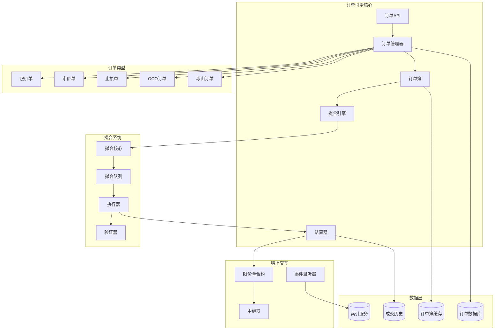

### 核心组件设计

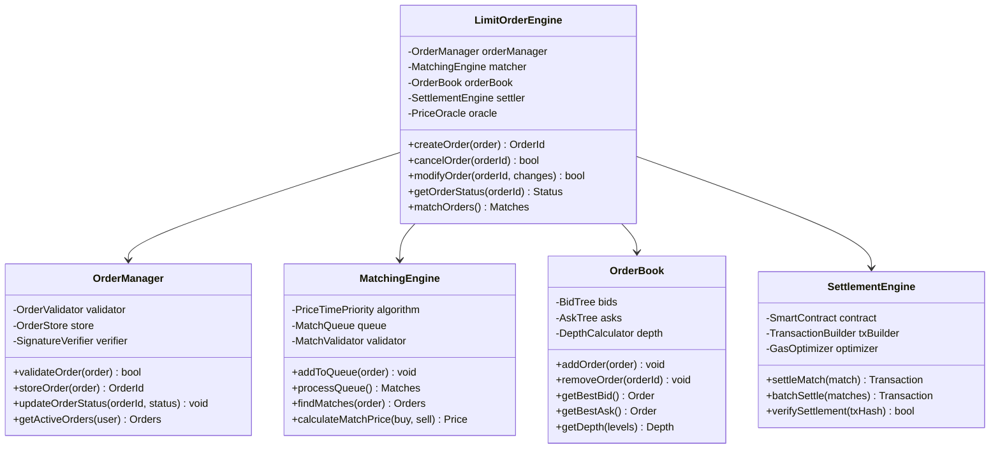

## 订单生命周期

### 订单状态机

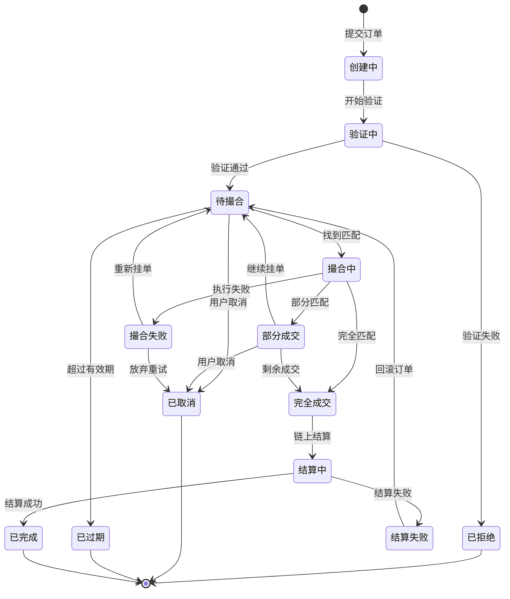

### 订单处理流程

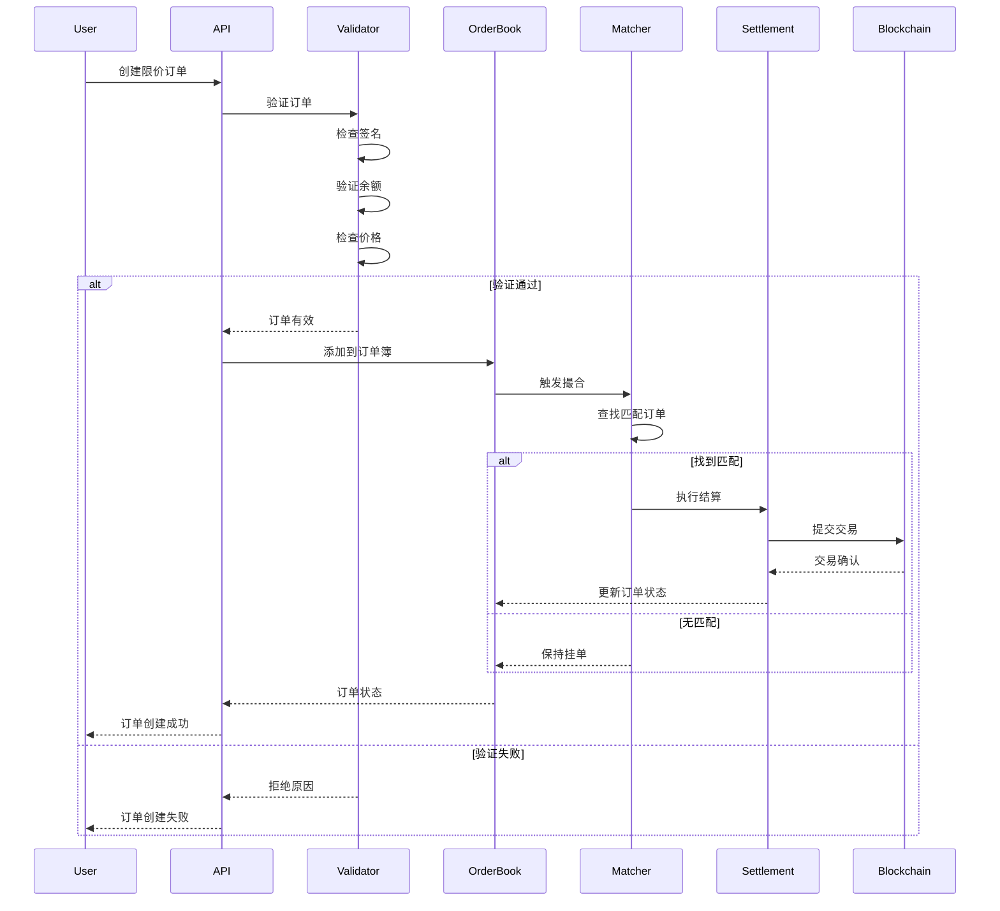

## 撮合引擎设计

### 价格-时间优先算法

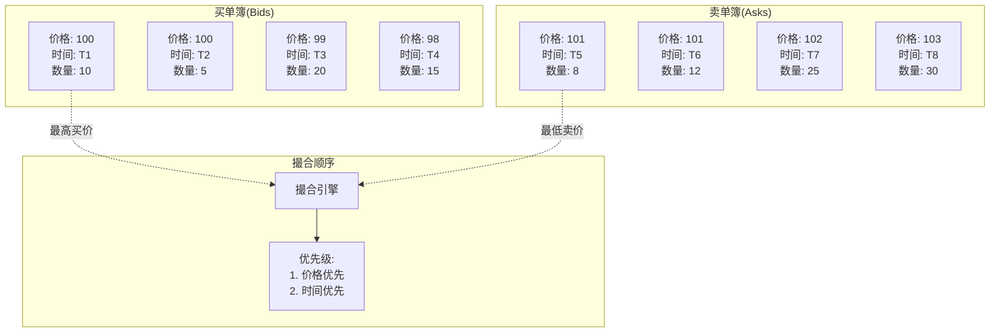

### 撮合流程

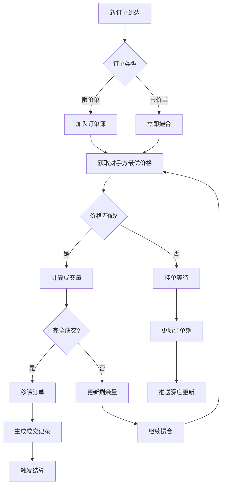

## 高级功能

### 1. 无Gas订单(Gasless Orders)

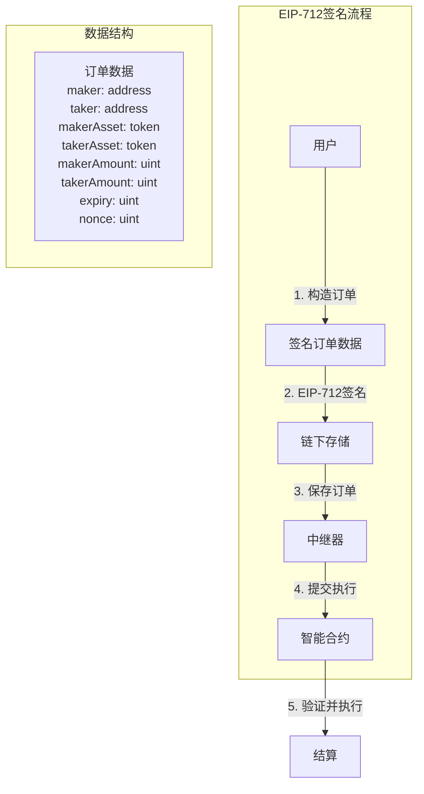

### 2. 条件单(Stop Orders)

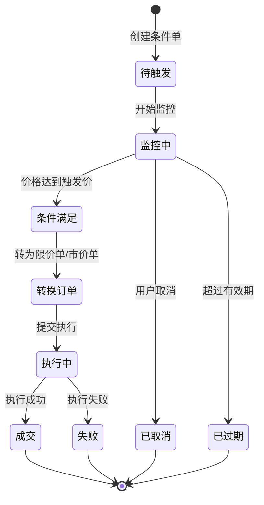

### 3. 冰山订单(Iceberg Orders)

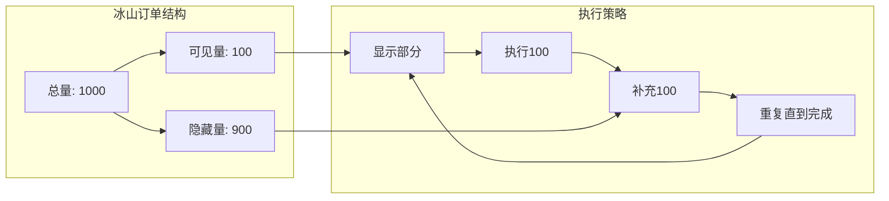

## 订单簿数据结构

### 红黑树实现

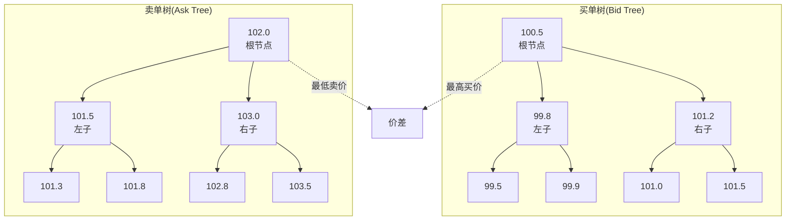

## 性能优化

### 1. 批量结算

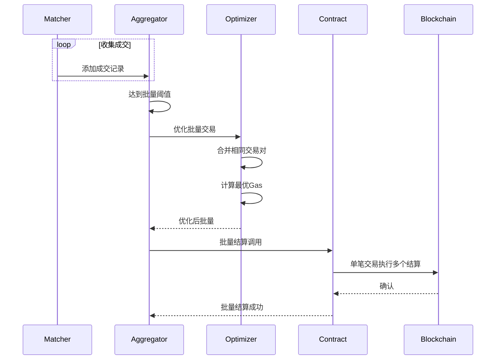

### 2. 内存池优化

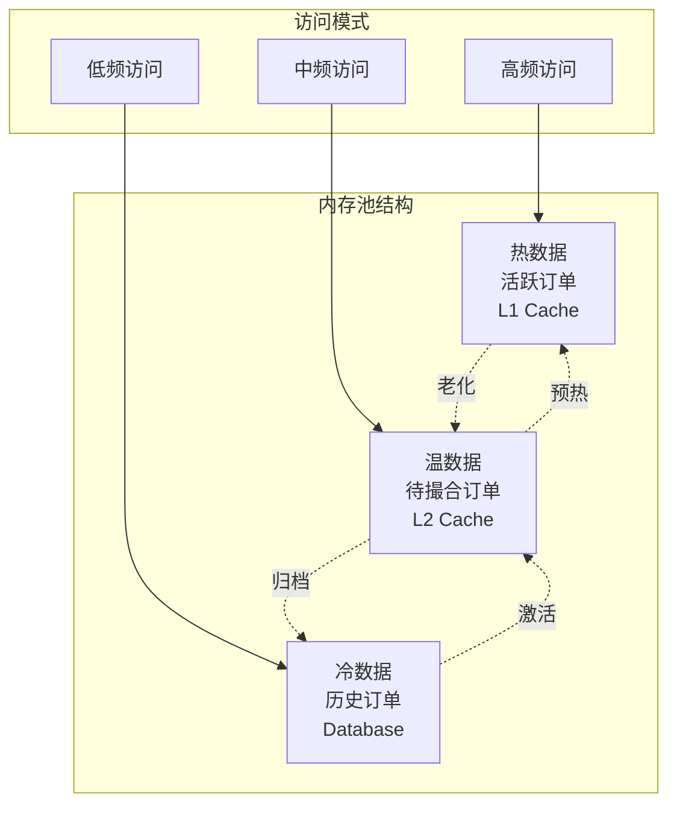

## 安全机制

### 订单验证流程

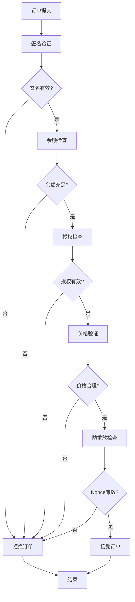

## 监控指标

```yaml
性能指标:
  - 撮合延迟: < 10ms
  - 订单处理量: > 10000 orders/s
  - 订单簿深度: > 1000 levels
  - 内存使用: < 8GB

业务指标:
  - 订单成交率: > 60%
  - 平均成交时间: < 30s
  - 部分成交比例: < 20%
  - 取消率: < 30%

系统指标:
  - API响应时间: < 50ms (P99)
  - 数据库查询: < 5ms
  - WebSocket延迟: < 100ms
  - 系统可用性: 99.99%
```

## API接口定义

### 创建限价订单

```typescript
interface CreateLimitOrderRequest {
  maker: string;              // Maker地址
  makerAsset: string;        // Maker代币
  takerAsset: string;        // Taker代币
  makerAmount: string;       // Maker数量
  takerAmount: string;       // Taker数量
  orderType: OrderType;      // 订单类型
  expiry: number;            // 过期时间
  signature: string;         // EIP-712签名
  permitData?: PermitData;   // Permit数据
}

interface LimitOrderResponse {
  orderId: string;           // 订单ID
  status: OrderStatus;       // 订单状态
  createdAt: number;         // 创建时间
  orderHash: string;         // 订单哈希
}

enum OrderType {
  LIMIT = "limit",
  STOP_LOSS = "stop_loss",
  TAKE_PROFIT = "take_profit",
  ICEBERG = "iceberg",
  OCO = "oco"
}

enum OrderStatus {
  PENDING = "pending",
  OPEN = "open",
  PARTIALLY_FILLED = "partially_filled",
  FILLED = "filled",
  CANCELLED = "cancelled",
  EXPIRED = "expired"
}
```

### WebSocket订阅

```typescript
// 订阅订单簿
interface OrderBookSubscription {
  action: "subscribe";
  channel: "orderbook";
  pair: string;              // 交易对
  depth: number;             // 深度层级
}

// 订单簿更新
interface OrderBookUpdate {
  type: "snapshot" | "update";
  pair: string;
  bids: PriceLevel[];
  asks: PriceLevel[];
  timestamp: number;
}

interface PriceLevel {
  price: string;
  amount: string;
  count: number;             // 该价位订单数
}
```

## 实现要点

1. **高性能撮合**
   - 内存撮合引擎
   - 多线程并发处理
   - 零拷贝优化

2. **数据一致性**
   - 事务性操作
   - 乐观锁机制
   - 最终一致性保证

3. **可扩展性**
   - 水平分片
   - 读写分离
   - 订单簿分区

4. **用户体验**
   - 实时推送
   - 订单历史查询
   - 丰富的订单类型