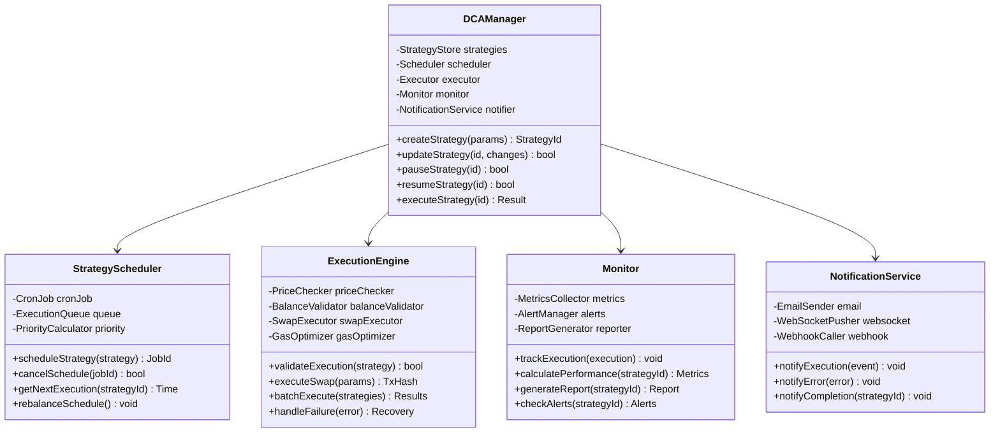

# DCA管理器(Dollar-Cost Averaging Manager)架构设计

## 服务概述

DCA（定投）管理器是实现自动化定期投资策略的核心服务。它允许用户设定周期性的买入/卖出计划，自动执行交易，实现成本平均化投资策略，降低市场波动风险。

## 核心功能

1. **策略管理** - 创建、修改、暂停DCA计划
2. **自动执行** - 定时触发交易执行
3. **智能调度** - 优化执行时机
4. **资金管理** - 自动资金划转和管理
5. **风控管理** - 价格保护和执行条件
6. **通知服务** - 执行状态实时通知
7. **报告分析** - DCA执行效果分析
8. **Gas优化** - 批量执行降低成本

## 系统架构

### 整体架构图


### 核心组件设计



## DCA策略生命周期

### 策略状态机


### 执行流程


## 策略类型设计

### 1. 固定金额DCA


### 2. 百分比DCA


### 3. 网格DCA


### 4. 智能DCA


## 调度系统设计

### 分布式调度架构


### 执行时机优化


## 风险控制

### 价格保护机制


### 资金安全


## 性能优化

### 批量执行优化


## 监控和分析

### 性能指标仪表板


### 策略效果分析


## API接口定义

### 创建DCA策略

```typescript
interface CreateDCAStrategyRequest {
  name: string;                  // 策略名称
  tokenIn: string;              // 买入使用的代币
  tokenOut: string;             // 买入目标代币
  strategyType: DCAType;        // 策略类型

  // 金额配置
  amountPerExecution?: string;  // 固定金额
  percentagePerExecution?: number; // 百分比
  minAmount?: string;           // 最小金额
  maxAmount?: string;           // 最大金额

  // 时间配置
  frequency: Frequency;         // 执行频率
  startTime: number;           // 开始时间
  endTime?: number;            // 结束时间
  totalExecutions?: number;     // 总执行次数

  // 条件配置
  priceCondition?: PriceCondition; // 价格条件
  slippageTolerance: number;   // 滑点容差
  gasStrategy: GasStrategy;    // Gas策略
}

interface DCAStrategyResponse {
  strategyId: string;          // 策略ID
  status: StrategyStatus;      // 策略状态
  nextExecution: number;       // 下次执行时间
  executedCount: number;       // 已执行次数
  remainingCount: number;      // 剩余次数
  totalInvested: string;       // 总投资金额
  averagePrice: string;        // 平均成本
  currentValue: string;        // 当前价值
  pnl: string;                // 盈亏
  pnlPercentage: number;      // 盈亏百分比
}

enum DCAType {
  FIXED_AMOUNT = "fixed_amount",
  PERCENTAGE = "percentage",
  DYNAMIC = "dynamic",
  GRID = "grid"
}

enum Frequency {
  HOURLY = "hourly",
  DAILY = "daily",
  WEEKLY = "weekly",
  MONTHLY = "monthly",
  CUSTOM = "custom"
}

enum StrategyStatus {
  DRAFT = "draft",
  ACTIVE = "active",
  PAUSED = "paused",
  COMPLETED = "completed",
  CANCELLED = "cancelled",
  EXPIRED = "expired"
}
```

### 执行记录查询

```typescript
interface DCAExecutionRecord {
  executionId: string;         // 执行ID
  strategyId: string;         // 策略ID
  executionTime: number;      // 执行时间
  status: ExecutionStatus;    // 执行状态

  // 交易详情
  amountIn: string;           // 投入金额
  amountOut: string;          // 获得金额
  executionPrice: string;     // 执行价格
  marketPrice: string;        // 市场价格
  slippage: number;          // 实际滑点

  // Gas信息
  gasUsed: string;           // Gas消耗
  gasPrice: string;          // Gas价格
  transactionHash?: string;  // 交易哈希

  // 错误信息
  error?: string;            // 错误信息
  retryCount?: number;       // 重试次数
}
```

## 实现要点

1. **可靠执行**
   - 分布式锁防重复
   - 事务性保证
   - 自动重试机制

2. **成本优化**
   - 批量执行节省Gas
   - 智能时机选择
   - 路径优化

3. **用户体验**
   - 灵活的策略配置
   - 实时状态通知
   - 详细的分析报告

4. **安全保障**
   - 资金隔离
   - 价格保护
   - 审计日志