# 跨链桥服务(Cross-Chain Bridge Service)架构设计

## 服务概述

跨链桥服务是实现不同区块链网络间资产无缝转移的核心基础设施。它通过锁定-铸造机制、流动性池或原子交换等技术，实现跨链资产的安全、快速转移，为用户提供一站式跨链交易体验。

## 核心功能

1. **资产跨链** - 支持代币在不同链间转移
2. **流动性管理** - 多链流动性池管理
3. **路径优化** - 最优跨链路径计算
4. **安全验证** - 多重签名和验证节点
5. **状态同步** - 跨链状态实时同步
6. **费用优化** - 最小化跨链成本
7. **紧急暂停** - 异常情况下的安全机制
8. **跨链消息** - 通用消息传递协议

## 系统架构

### 整体架构图

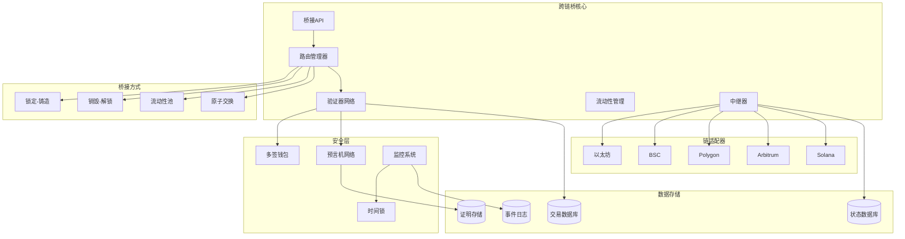

### 核心组件设计

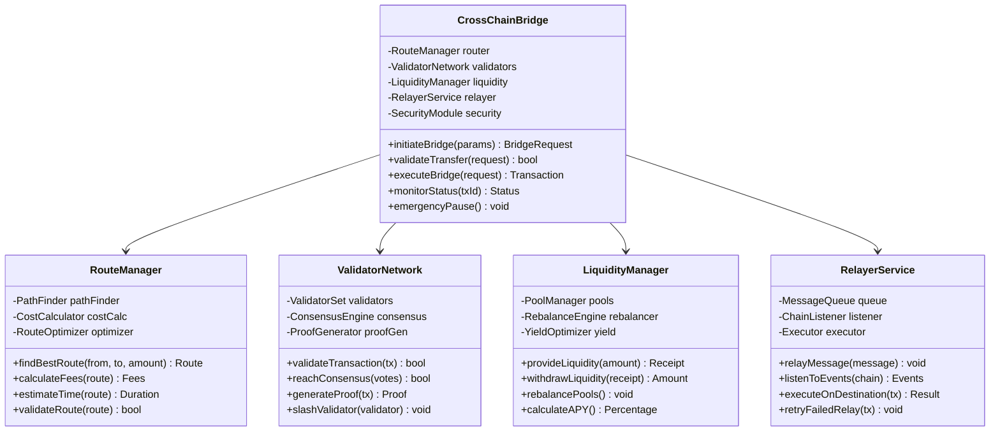

## 跨链流程

### 完整跨链时序图

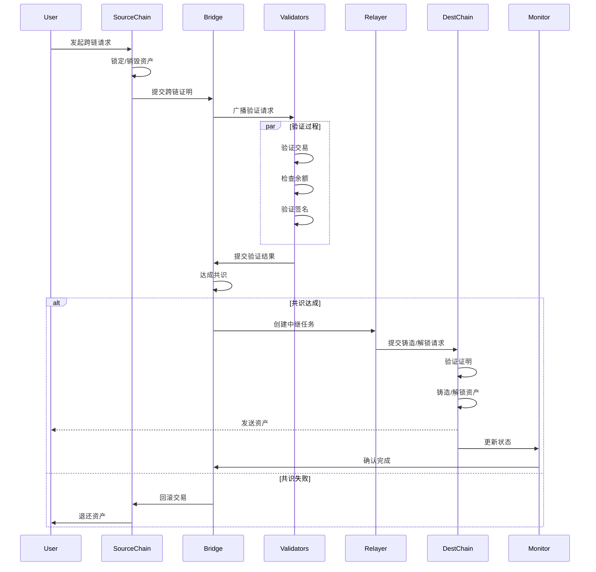

### 锁定-铸造机制

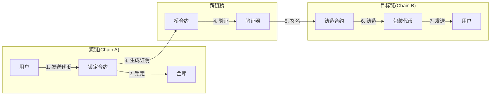

## 安全机制

### 多重验证架构

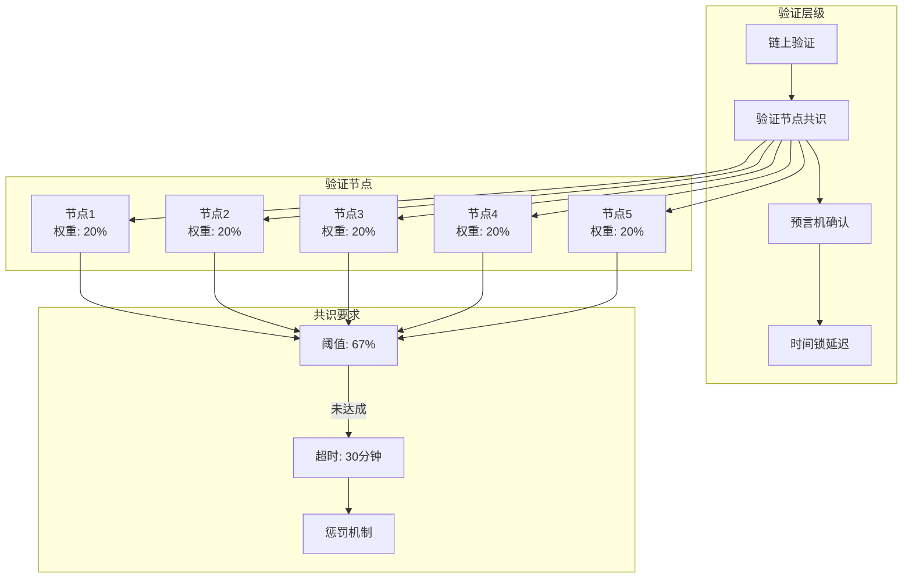

### 紧急响应机制

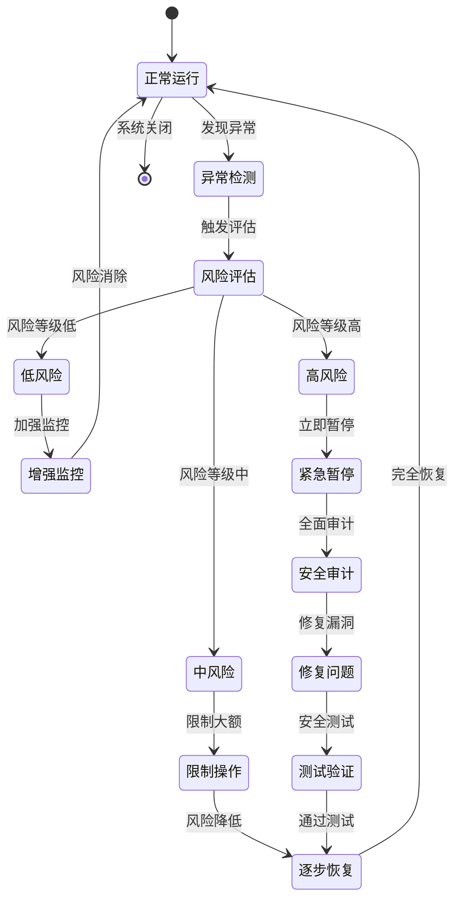

## 流动性管理

### 多链流动性池

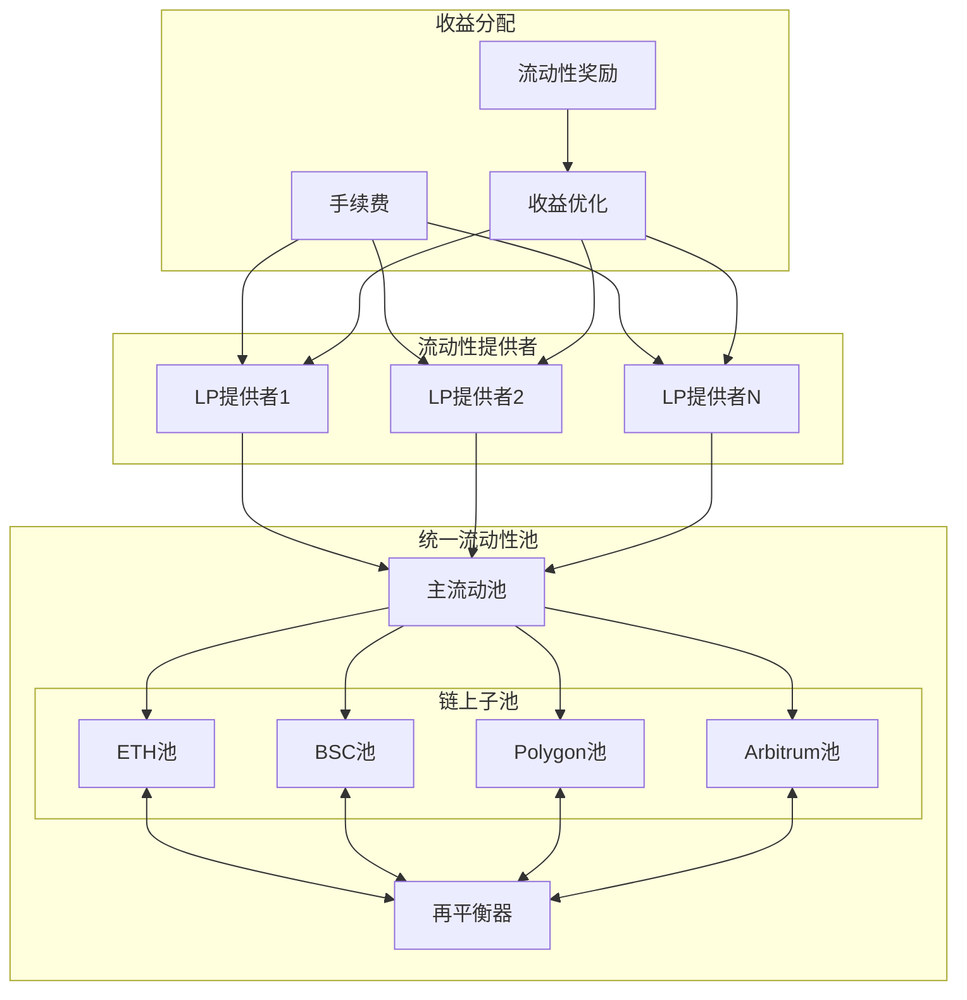

### 动态费率模型

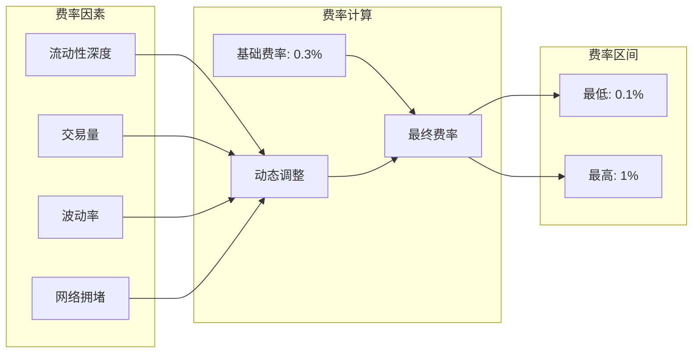

## 路径优化

### 多跳路由

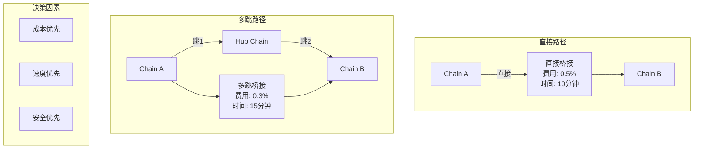

### 智能路由算法

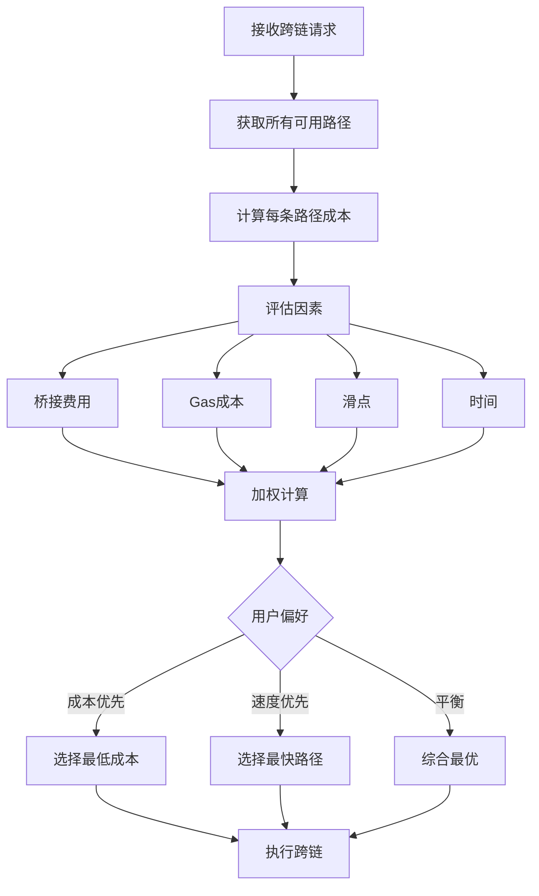

## 状态同步

### 跨链状态机

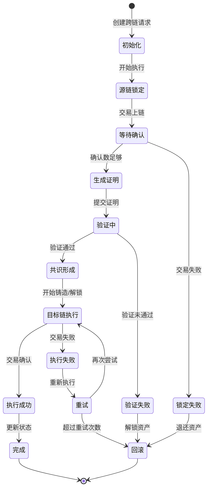

## 监控和告警

### 实时监控面板

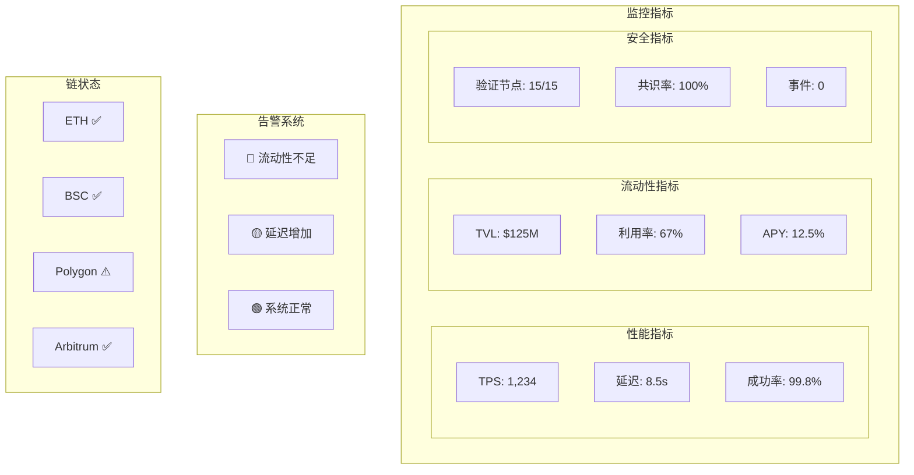

## API接口定义

### 发起跨链

```typescript
interface BridgeRequest {
  // 基础参数
  fromChain: ChainId;         // 源链
  toChain: ChainId;           // 目标链
  token: string;              // 代币地址
  amount: string;             // 数量
  recipient: string;          // 接收地址

  // 高级选项
  slippageTolerance?: number; // 滑点容差
  preferredRoute?: Route;     // 首选路径
  maxFee?: string;           // 最大费用
  deadline?: number;         // 截止时间

  // 回调
  callbackUrl?: string;      // 状态回调URL
  metadata?: any;            // 自定义元数据
}

interface BridgeResponse {
  bridgeId: string;          // 桥接ID
  status: BridgeStatus;      // 当前状态

  // 交易信息
  sourceTxHash?: string;     // 源链交易
  destTxHash?: string;       // 目标链交易

  // 费用明细
  bridgeFee: string;         // 桥接费
  gasFee: string;           // Gas费用
  totalFee: string;         // 总费用

  // 时间预估
  estimatedTime: number;     // 预计时间
  startTime: number;        // 开始时间
  completionTime?: number;  // 完成时间

  // 路径信息
  route: Route[];           // 实际路径
  proofs?: Proof[];         // 验证证明
}

enum BridgeStatus {
  PENDING = "pending",
  LOCKING = "locking",
  LOCKED = "locked",
  VALIDATING = "validating",
  VALIDATED = "validated",
  MINTING = "minting",
  COMPLETED = "completed",
  FAILED = "failed",
  REFUNDED = "refunded"
}
```

### 流动性管理

```typescript
interface LiquidityProvision {
  poolId: string;            // 流动性池ID
  chains: ChainId[];        // 支持的链
  token: string;            // 代币地址
  amount: string;           // 提供数量
  lockPeriod?: number;      // 锁定期
}

interface LiquidityPosition {
  positionId: string;       // 仓位ID
  provider: string;         // 提供者地址
  poolId: string;          // 池ID

  // 仓位信息
  totalProvided: string;    // 总提供量
  currentValue: string;     // 当前价值

  // 收益信息
  earnedFees: string;      // 赚取费用
  earnedRewards: string;   // 赚取奖励
  apy: number;            // 年化收益率

  // 提取信息
  availableWithdraw: string; // 可提取数量
  lockedUntil?: number;    // 锁定截止
}
```

## 实现要点

1. **安全性保证**
   - 多重签名验证
   - 时间锁保护
   - 紧急暂停机制
   - 审计和监控

2. **性能优化**
   - 批量处理跨链请求
   - 流动性预分配
   - 路径缓存

3. **用户体验**
   - 一键跨链
   - 实时状态追踪
   - 透明费用

4. **可扩展性**
   - 模块化链适配器
   - 通用消息协议
   - 动态验证节点