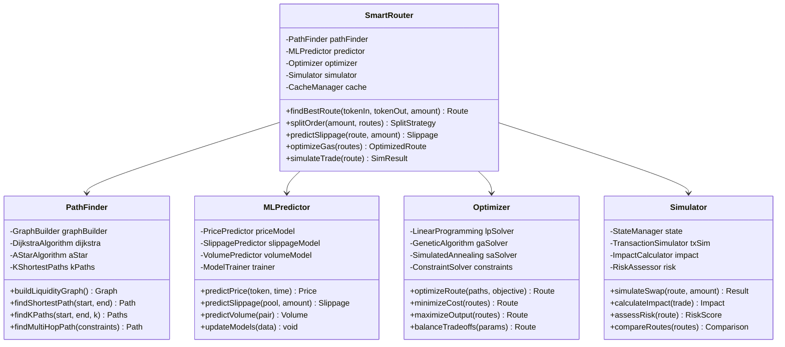

# 智能路由器(Smart Router)架构设计

## 服务概述

智能路由器是DEX系统的核心决策引擎，负责为每笔交易找到最优执行路径。它通过机器学习、图算法和实时数据分析，在复杂的流动性网络中计算出成本最低、滑点最小的交易路径。

## 核心功能

1. **路径发现** - 多跳路径搜索和优化
2. **流动性聚合** - 聚合多个DEX和流动性源
3. **智能分单** - 大单拆分优化执行
4. **ML预测** - 机器学习价格和滑点预测
5. **动态优化** - 实时调整路由策略
6. **Gas优化** - 最小化交易成本
7. **MEV保护** - 抗三明治攻击路由
8. **回测分析** - 路由效果分析和优化

## 系统架构

### 整体架构图


### 核心组件设计



## 路径搜索算法

### 多跳路径发现


### K最短路径算法


## 智能分单策略

### 大单拆分算法


### 分单执行时序


## 机器学习模型

### ML预测架构


### 实时学习流程


## 流动性聚合

### 多源聚合架构


### 流动性深度分析


## Gas优化策略

### 多链Gas优化


## MEV保护路由

### 抗MEV策略


## 性能优化

### 缓存策略


## 监控和分析

### 路由效果分析


## API接口定义

### 路由请求接口

```typescript
interface RouteRequest {
  tokenIn: string;           // 输入代币
  tokenOut: string;          // 输出代币
  amountIn?: string;         // 输入数量
  amountOut?: string;        // 输出数量(二选一)

  // 路由参数
  maxHops?: number;          // 最大跳数(默认3)
  maxSplits?: number;        // 最大拆分数(默认3)
  protocols?: Protocol[];    // 指定协议

  // 优化目标
  objective?: Objective;     // 优化目标
  slippageTolerance: number; // 滑点容差
  deadline?: number;         // 截止时间

  // 高级选项
  mevProtection?: boolean;   // MEV保护
  simulateFirst?: boolean;   // 预先模拟
  excludePools?: string[];   // 排除池子
}

interface RouteResponse {
  // 最优路由
  route: Route;              // 路由详情
  alternativeRoutes?: Route[]; // 备选路由

  // 预期结果
  expectedOutput: string;    // 预期输出
  priceImpact: number;      // 价格影响
  minimumOutput: string;    // 最小输出

  // 成本分析
  estimatedGas: string;     // 预估Gas
  totalFee: string;        // 总费用
  savings: string;         // 节省金额

  // 路径详情
  swaps: SwapStep[];       // 交换步骤
  splits?: SplitDetail[];  // 拆分详情

  // 风险评估
  confidenceScore: number; // 置信度
  riskLevel: RiskLevel;   // 风险等级
}

interface SwapStep {
  protocol: string;        // 协议名称
  pool: string;           // 池子地址
  tokenIn: string;        // 输入代币
  tokenOut: string;       // 输出代币
  amountIn: string;       // 输入数量
  expectedOut: string;    // 预期输出
  fee: number;           // 手续费率
  poolLiquidity: string; // 池子流动性
}

enum Objective {
  BEST_PRICE = "best_price",
  LOWEST_GAS = "lowest_gas",
  FASTEST = "fastest",
  BALANCED = "balanced"
}

enum RiskLevel {
  LOW = "low",
  MEDIUM = "medium",
  HIGH = "high"
}
```

### 路由模拟接口

```typescript
interface SimulateRequest {
  route: Route;            // 待模拟路由
  amountIn: string;       // 输入数量
  sender: string;         // 发送者地址
  blockNumber?: number;   // 指定区块

  // 模拟选项
  includeRevert?: boolean; // 包含失败情况
  checkMEV?: boolean;     // 检查MEV风险
  compareAlternatives?: boolean; // 对比其他路由
}

interface SimulateResponse {
  success: boolean;       // 是否成功
  outputAmount: string;   // 输出数量
  gasUsed: string;       // Gas使用

  // 详细信息
  traces: TransactionTrace[]; // 交易追踪
  stateChanges: StateChange[]; // 状态变化
  events: Event[];       // 事件日志

  // 风险分析
  mevRisk?: MEVRisk;    // MEV风险
  slippageRisk?: number; // 滑点风险

  // 对比结果
  alternatives?: SimulateResult[]; // 其他路由结果
}
```

## 实现要点

1. **高性能计算**
   - 并行路径搜索
   - GPU加速ML推理
   - 内存图数据库

2. **实时性保证**
   - 流式数据处理
   - 增量图更新
   - 预测性缓存

3. **准确性提升**
   - 持续模型训练
   - A/B测试验证
   - 回测分析

4. **可扩展性**
   - 插件式协议适配
   - 动态算法选择
   - 水平扩展支持